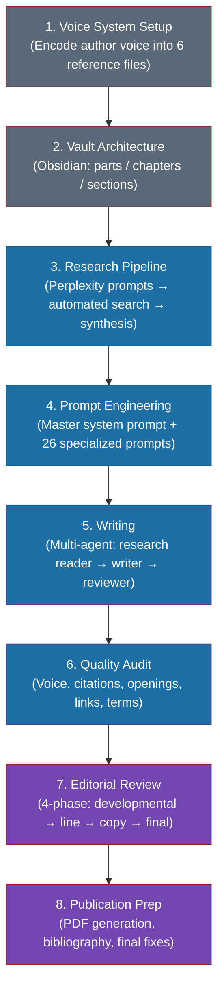
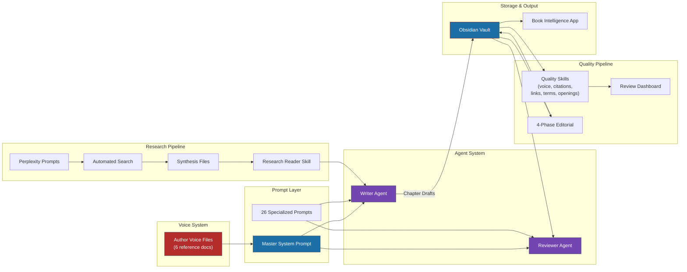

# End-to-End Flow: From Idea to Publication-Ready Manuscript

> **Context:** *Blueprint for An AI-First Company* -- 81,000+ words, 12 chapters, 775 citations. Written using Claude Code (Opus 4.5) with multi-agent orchestration, automated Perplexity research, and Obsidian as the writing environment.

---

Here's the thing about writing a book with AI: the writing is the easy part. The *system* that makes the writing good -- that's where the real work lives.

This document maps the complete pipeline. Eight phases, from encoding your voice into reference files to generating a publication-ready PDF. Each phase links to a deep dive. Start here, go deep where you need to.

---

## The Pipeline

### Phase 1: Voice System Setup

You encode your writing voice into 6 reference files -- a gold standard sample, a voice guide, audience empathy profiles, authenticity markers, learnings from past mistakes, and a quick-reference checklist. These files become the DNA of every prompt. Without them, you get generic AI prose. With them, the output sounds like you wrote it on a good day. One-time investment, but the highest-leverage work in the entire system. See [Building a Voice System](../02-author-voice/building-a-voice-system.md).

### Phase 2: Vault Architecture

Obsidian provides the structural backbone. 4 parts, 12 chapter folders, each containing numbered section files with YAML frontmatter for metadata tracking. The folder structure *is* the book outline. Concept notes, MOCs, and bidirectional links connect ideas across chapters. This architecture lets you write sections in any order while maintaining coherence. See [Research Architecture](../05-research-pipeline/research-architecture.md) for how research maps to this structure.

### Phase 3: Research Pipeline

For each chapter, you generate targeted Perplexity prompts (5-8 per section), run them through an automated search script, and synthesize the results into citation-ready files with extracted statistics, quotes, and company examples. The output is structured so the writer agent can pull exactly what it needs -- no manual copy-pasting from browser tabs. This produced 775 citations across 12 chapters. See [Research Architecture](../05-research-pipeline/research-architecture.md).

### Phase 4: Prompt Engineering

A master system prompt (loaded into every Claude Code session) encodes voice rules, citation workflow, structural patterns, and the density test. 26 specialized prompts handle specific content types: chapter openings, body sections, frameworks, case studies, chapter closings, and more. The prompts are the control surface -- they're how you steer AI output without micromanaging every sentence. See [Prompt Architecture](../03-prompt-engineering/prompt-architecture.md).

### Phase 5: Writing

Multi-agent chapter writing using Claude Code skills. The research reader skill extracts relevant stats, quotes, and examples from synthesis files. The writer agent produces section drafts. The reviewer agent checks voice consistency, citation coverage, and structural quality. One chapter per session with parallel agent dispatching for independent sections. See [Agent Architecture](../04-agent-system/agent-architecture.md).

### Phase 6: Quality Audit

Automated skills audit every chapter across 5 dimensions: voice consistency (does it sound like the author?), citation completeness (are stats sourced?), opening quality (do hooks land?), link integrity (do cross-references resolve?), and term consistency (is "AI-first" always hyphenated?). Results feed a unified review dashboard with a chapter health score. This phase takes minutes, not hours.

### Phase 7: Editorial Review

Four-phase editing: developmental (structure and argument flow), line editing (sentence-level craft), copy editing (grammar, consistency, factual accuracy), and final proof (formatting, citations, cross-references). This is the longest phase and the one where human judgment matters most. AI proposes edits; the author accepts, rejects, or rewrites. See [Review Philosophy](../09-review-process/review-philosophy.md).

### Phase 8: Publication Prep

PDF generation via Python script with two modes: internal (shows research source blocks for review) and reader (hides internal tracking). Citation standardization catches duplicate URLs with different footnote tags. Bibliography generation. Final formatting fixes. The boring but necessary finish line.

---

## How Long Each Phase Takes

| Phase | Time Investment | Notes |
|-------|----------------|-------|
| Voice System | 8-12 hours (one-time) | Pays dividends on every chapter. Front-load this. |
| Vault Architecture | 2-3 hours (one-time) | Set up once, refine as you go. |
| Research | 2-3 hours per chapter | ~80% automated. Human time is prompt design and synthesis review. |
| Prompt Engineering | 20+ hours total | Iterative. You refine prompts across drafts, not all at once. |
| Writing | 3-5 hours per chapter | One chapter per Claude Code session with multi-agent batching. |
| Quality Audit | 10-15 minutes per chapter | Fully automated. You review the dashboard, not the raw output. |
| Editorial Review | 4-8 hours per chapter | The longest phase. Multiple passes. Worth every minute. |
| Publication Prep | 2-3 hours total | Mostly automated scripts with manual spot-checks. |

The total for a 12-chapter, 81,000-word book: roughly 200-250 hours of human time. That's not "AI wrote the book." That's "AI handled the volume while you handled the judgment."

---

## What Makes This Different

Here's what most people get wrong about AI-assisted writing: they think it's about speed. Use AI, write faster, ship sooner.

That framing misses the point entirely.

This system shifts the author's role from **writer** to **architect + editor**. You design the voice system, the prompt architecture, the research pipeline, the quality gates. Then AI generates volume with consistency -- same voice across 81,000 words, same citation standards across 775 footnotes, same structural patterns across 12 chapters. A human can't maintain that consistency over months of writing. The system can.

The author's irreplaceable contribution becomes the things AI can't do well: choosing *which* arguments to make, deciding *what* to cut, knowing when an example is cliche versus clarifying, and applying editorial taste that no prompt can encode. You're the architect who designs the building and the editor who decides which rooms to keep. AI is the construction crew that works 24/7 without getting tired or sloppy.

---

## Iteration Reality

The book went through 3 complete drafts. Each draft improved the *system*, not just the prose.

**Draft 1** was rough. No voice encoding, no research pipeline, minimal prompting. The output read like a capable but generic AI wrote a business book. Which is exactly what happened.

**Draft 2** added the voice system and research integration. Chapters started sounding like a specific author with specific opinions. Citations grounded claims in evidence instead of vibes. The difference was dramatic -- but the quality audit pipeline didn't exist yet, so inconsistencies crept in across chapters.

**Draft 3** added the full quality pipeline, editorial review process, and publication prep automation. This is where the system became self-correcting: audit skills caught voice drift, citation gaps, and terminology inconsistencies before they compounded.

The lesson: you don't build this system upfront and then write. You build it *while* writing, and each draft teaches you what the system is missing. Draft 1 is the tuition you pay to learn what Draft 3 needs.

---

## Next Steps

- [Building a Voice System](../02-author-voice/building-a-voice-system.md) -- Start here if you're building your own pipeline
- [Prompt Architecture](../03-prompt-engineering/prompt-architecture.md) -- The control surface for AI output
- [Agent Architecture](../04-agent-system/agent-architecture.md) -- Multi-agent writing orchestration
- [Research Architecture](../05-research-pipeline/research-architecture.md) -- Automated research at scale
- [Review Philosophy](../09-review-process/review-philosophy.md) -- Why editorial review is the longest phase
