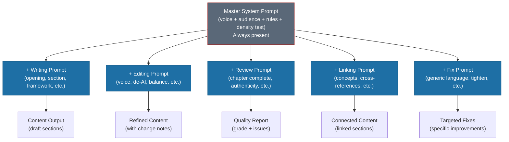

# Prompt Architecture

One giant "write me a chapter about AI infrastructure" prompt produces garbage. Not sometimes -- reliably. The output sounds confident, covers the topic, and reads like every other AI-generated business book you've never finished. No voice. No edge. No consistency between sections.

The fix: modular prompts that compose at runtime.

---

## Why Modular

Think of it like CSS inheritance. You have base styles (the master system prompt) that apply everywhere. Then you layer on component-specific styles (the task prompt) that handle the particular job. The master system prompt carries voice, audience, constraints, and density rules. The task prompt carries structure, word targets, and content-specific instructions.

This gives you three things monolithic prompts can't:

1. **Testability.** When chapter openings sound formulaic, you fix one prompt. You don't debug 2,000 words of tangled instructions to figure out which sentence caused the drift.
2. **Composability.** The same master prompt works with a case study prompt, a framework prompt, or an editing prompt. Mix and match without rewriting.
3. **Independent improvement.** The De-AI editing prompt went through 4 iterations. None of those changes touched the writing prompts. No cascading side effects.

---

## The 27 Prompts in 5 Categories

| Category | Count | Purpose |
|----------|-------|---------|
| Writing | 8 + master | Create new content (openings, sections, frameworks, case studies, analogies, summaries, closings, technical deep dives) |
| Editing | 5 | Refine existing content (voice, audience, de-AI, balance, simplify) |
| Review | 4 | Quality gates (chapter complete, authenticity, audience fit, final quality) |
| Linking | 3 | Connect content (concepts, cross-references, broken link fixes) |
| Fix | 5 | Targeted improvements (generic language, examples, action items, two-audience, tighten prose) |

---

## How Prompts Compose



The master system prompt gets prepended as system context to every AI interaction. The orchestration skill (the chapter-writer) handles this automatically. Individual prompts assume it's already present -- they don't repeat voice rules or audience profiles.

---

## 3 Workflow Patterns

### 1. New Chapter (Writing Flow)

Prompts fire in sequence because each builds on the previous output:

```
master + chapter-opening   --> Hook + context + preview
master + section           --> Core content (repeat per section)
master + framework         --> Numbered frameworks woven in
master + case-study        --> Company narratives where needed
master + chapter-closing   --> Synthesis + takeaways + bridge
master + tighten-prose     --> Density pass (cut 20%)
```

The section prompt is the workhorse -- it runs 4-6 times per chapter. The framework and case-study prompts get inserted where the content calls for them, not mechanically in every section.

### 2. Edit Pass (Refinement Flow)

After a draft exists, editing prompts refine it:

```
master + voice-consistency     --> Align to authenticity markers
master + de-ai-patterns        --> Remove AI cliches and tells
master + audience-calibration  --> Balance Sarah and Marcus
master + simplify              --> Clarity pass
master + tighten-prose         --> Density pass (final cut)
```

The de-AI prompt is the single most valuable editing prompt in the system. It catches patterns that are invisible to the writer -- the "leverage" and "important to note" phrases that slip through even with voice rules in place.

### 3. Final Review (Quality Flow)

Review prompts produce reports, not rewrites:

```
master + chapter-complete  --> Full structural checklist (A-D grade)
master + authenticity      --> Voice fingerprint verification
master + audience-fit      --> Both audiences served?
master + final-quality     --> Go/no-go with remaining issues
```

These are quality gates. They don't change the content -- they tell you what to change. The output is a graded report with specific line numbers and recommendations.

---

## Building Your Own

Start with three prompts: a master system prompt, a section writing prompt, and a de-AI editing prompt. That's enough to produce consistent, voice-accurate sections. Add prompts as you discover specific quality problems -- each new prompt should solve a real failure mode, not a theoretical one.

The full 27-prompt system wasn't designed upfront. It grew across three drafts as specific problems surfaced. The framework prompt exists because early frameworks had inconsistent point lengths. The tighten-prose prompt exists because first drafts were reliably 20-30% too long. Every prompt earned its place by fixing something that broke.

---

**Deep dives:** [Master System Prompt](master-system-prompt.md) | [Writing Prompts](writing-prompts.md) | [Editing and Review Prompts](editing-and-review-prompts.md) | [Prompt Evolution](prompt-evolution.md)
