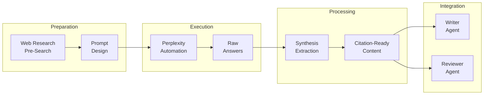

# Research Architecture

Here's what most people get wrong about research for AI-assisted writing: they treat it as something you do *during* writing. You're mid-paragraph, you need a stat, you open a browser tab, you hunt for 10 minutes, you find something okay, you paste it in, you lose your thread. Multiply that by 81 sections and you've spent more time researching than writing.

The fix: research becomes a pipeline that runs *before* writing starts. By the time the writer agent opens a section, citation-ready stats, quotes, and company examples are already waiting. The writing session becomes about argument and voice, not evidence hunting.

---

## The Pipeline

Four phases, each feeding the next:



**Preparation** maps the landscape before you write a single prompt. **Execution** runs 180+ Perplexity searches automatically. **Processing** extracts the pieces writers actually need -- stats with credibility scores, quotes with confidence levels, company examples with context. **Integration** feeds it all into the writer and reviewer agents through 9 purpose-built extraction scripts.

---

## Research Folder Structure

Every chapter gets the same layout. The structure *is* the workflow:

```
research/Chapter_XX/
├── _index.md              # Chapter research map and status dashboard
├── 00_overview.md         # Synthesized overview of the topic landscape
├── web_research/          # Pre-research web searches (Phase 1)
│   ├── 00_landscape.md
│   ├── s_X.X_topic.md
│   ├── company_name.md
│   └── counter_arguments.md
├── prompts/               # Perplexity prompts (Phase 2)
│   ├── s_X.X_topic/
│   │   ├── 01_subtopic.md
│   │   └── 02_subtopic.md
│   └── case_studies/
├── answers/               # Perplexity responses (mirrors prompts/)
│   ├── s_X.X_topic/
│   │   ├── 01_subtopic.md
│   │   └── 02_subtopic.md
│   └── case_studies/
└── synthesis/             # Extracted stats, quotes, frameworks
    ├── s_X.X_topic.md
    └── s_X.Y_topic.md
```

The `answers/` folder mirrors `prompts/` exactly. Same subfolder names, same file names. When you run a prompt, the answer lands in the matching location. No hunting.

The `_index.md` acts as a status dashboard -- which sections have prompts, which have answers, which have synthesis. At a glance, you know where research gaps live.

---

## Two-Phase Prompt Design

This is the highest-leverage decision in the entire research pipeline.

**Phase 1: Pre-Research.** Before writing any Perplexity prompts, you run web searches to map the current landscape. What companies are relevant *right now*? What data exists? What terms are practitioners using? Results save to `web_research/`. This takes 20-30 minutes per chapter and prevents a specific failure mode: writing prompts based on what you *assume* exists rather than what actually does. Without pre-research, you get prompts that return thin results because you're asking about outdated companies or non-existent datasets.

**Phase 2: Prompt Writing.** Now you write prompts *informed by what you found*. You know which companies have recent data. You know which stats are out there. You know what the counter-arguments look like. The prompts are sharper -- 30-45 lines each, focused on specific gaps rather than broad surveys. Focused prompts beat broad ones every time. A prompt asking "What are the economics of AI infrastructure?" returns generic analysis. A prompt asking "What does Vercel's serverless AI gateway cost at 100M+ queries/month, and how does that compare to self-hosted alternatives?" returns something you can cite.

---

## Scale

The book used 180+ prompts across 12 chapters:

- ~15 prompts per chapter on average
- Every section gets at least 1 dedicated prompt
- Anchor examples (key companies, case studies) get their own dedicated prompts
- Counter-argument prompts for every chapter to ensure balanced coverage

---

## Prompt Types

Different research questions need different prompt structures:

| Type | Purpose | Length |
|------|---------|--------|
| Data/Statistics | Find exact numbers with methodology and source | Shortest |
| Company Deep-Dive | Timeline, tech approach, competitive advantage, recent developments | Medium |
| Comparison | Two approaches side-by-side with specific tradeoffs | Medium |
| Counter-Argument | Strongest arguments against the chapter's thesis | Medium |
| Practitioner Quote | What founders and CTOs say (not analysts or journalists) | Short |
| Gap-Filling | Target specific research holes identified during writing | Variable |

The practitioner quote prompts are worth calling out. Early research returned quotes from analysts and journalists -- useful for context, less useful for a book targeting builders. Dedicated prompts that explicitly ask for founder and CTO perspectives produce quotes that land differently with the target audience.

---

## What This Changes

The research-first approach flipped the economics of evidence. When stats arrive pre-formatted with footnote keys, you use them. When you have to manually hunt down sources mid-sentence, you don't. The book hit 775 citations -- one per 105 words -- not because citations were a goal, but because the pipeline made citing *cheap*.

The alternative -- writing first, researching later -- produces opinion-heavy, citation-light drafts. The enterprise audience notices.

---

**Deep dives:** [Perplexity Automation](perplexity-automation.md) | [Synthesis and Extraction](synthesis-and-extraction.md) | [Citation Management](citation-management.md)
