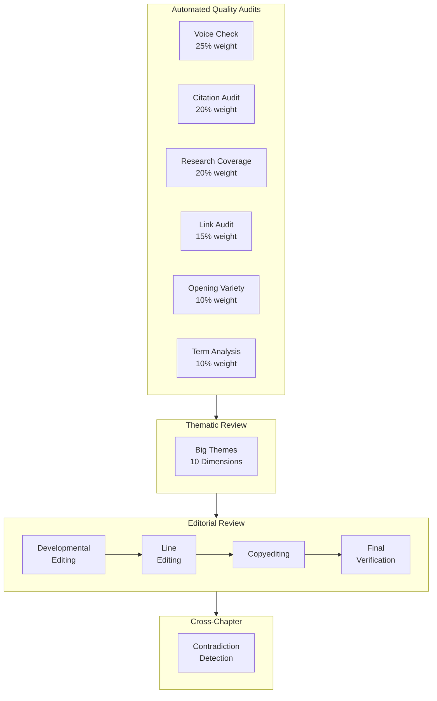

# Review Philosophy

> **Context:** The review system for *Blueprint for An AI-First Company* used four layers -- automated quality audits, a 10-dimension strategic assessment, a 4-phase editorial workflow, and cross-chapter contradiction detection. Combined: 240 line edit issues, 188 copyedit issues, 15 critical issues caught. Zero critical issues remaining.

---

"Review the chapter" is the most dangerous instruction you can give an AI. It sounds productive. It feels like quality control. But it's so vague that it catches almost nothing reliably.

Here's the thing: different types of problems hide at different levels of abstraction. A voice consistency check won't catch that Chapter 6 contradicts Chapter 3's statistics. A citation audit won't catch that your narrative arc stalls in Part III. A grammar pass won't catch that you've been writing for enterprise leaders and accidentally abandoned your startup audience. Each problem type needs its own lens, its own tools, and its own moment in the pipeline.

That's why the review system has four layers, not one.

## The Review Layer Stack

## Four Layers, Four Problem Types

| Layer | What It Catches | Automated? | Time Per Chapter |
|-------|----------------|-----------|-----------------|
| Quality Audits | Voice drift, missing citations, broken links, term overuse, repetitive openings | Yes (6 skills) | 10-15 minutes |
| Big Themes Review | Strategic gaps, audience imbalance, missing frameworks, weak narrative arc | Semi-automated | 1-2 hours |
| Editorial Review | Structural issues, prose quality, grammar, formatting consistency | AI-assisted | 4-8 hours |
| Contradiction Detection | Cross-chapter stat conflicts, terminology drift, advice contradictions | Semi-automated | 2-3 hours (full manuscript) |

## Why This Order

The sequencing isn't arbitrary.

**Automated first** -- they're fast and catch mechanical issues. No point sending a chapter through editorial review if it has 12 uncited statistics and 8 kill-list violations.

**Thematic second** -- strategic quality questions only make sense once the chapter is mechanically sound. Running a 10-dimension assessment on a draft full of citation gaps wastes the assessment on problems the automated layer should have caught.

**Editorial third** -- sentence-level craft is the longest phase. You want the chapter as clean as possible before investing 4-8 hours of prose-level review. This is where 240 line edit issues and 188 copyedit issues were caught.

**Contradiction last** -- it needs the full manuscript. You can't detect cross-chapter inconsistencies until all chapters exist. This whole-book pass caught 26 contradictions in a single scan.

## What AI Does vs. What Humans Do

Here's what most people get wrong about AI-assisted review: they think the goal is to replace human editors. It's not. The goal is to change what human editors spend their time on.

**AI handles volume and pattern detection.** Scanning 81 sections for kill-list violations. Checking citation density across 81,000 words. Detecting that the same opening pattern appears in 5 of 7 sections in Chapter 3. Flagging that "AI gateway" appears in Chapter 4 but the same concept is called "AI router" in Chapter 5. These are pattern-matching tasks across a corpus too large for a human to hold in working memory. AI does them in minutes.

**Humans handle judgment.** Is this example compelling or cliche? Does this argument actually land, or does it just look like it does? Is this the right level of technical depth for the audience? Should this section be cut entirely? When the voice check flags a sentence as "hedging," is it actually hedging, or is the nuance intentional? AI surfaces the question. The human answers it.

The review system amplifies human judgment. Instead of spending 3 hours hunting for inconsistencies, the reviewer spends 30 minutes reviewing what the system found and 2.5 hours making the calls that actually matter.

Both layers are required. Neither is optional.

## The Practical Payoff

For a 12-chapter, 81,000-word book, the review pipeline produced:

- **Quality audits:** Health scores for every chapter, priority issues ranked by impact
- **Big themes review:** 0 critical fixes, 3 important, 2 minor -- publication ready
- **Editorial review:** 443 issues caught and resolved across four phases
- **Contradiction detection:** 26 cross-chapter contradictions found and standardized

Without this system, those 469 issues would have shipped. The system didn't write the book. It made the book publishable.

---

**Deep dives:** [Big Themes Review](big-themes-review.md) | [Editorial Workflow](editorial-workflow.md) | [Contradiction Detection](contradiction-detection.md) | [Quality Skills](../04-agent-system/quality-skills.md)
