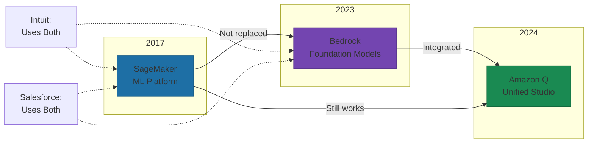
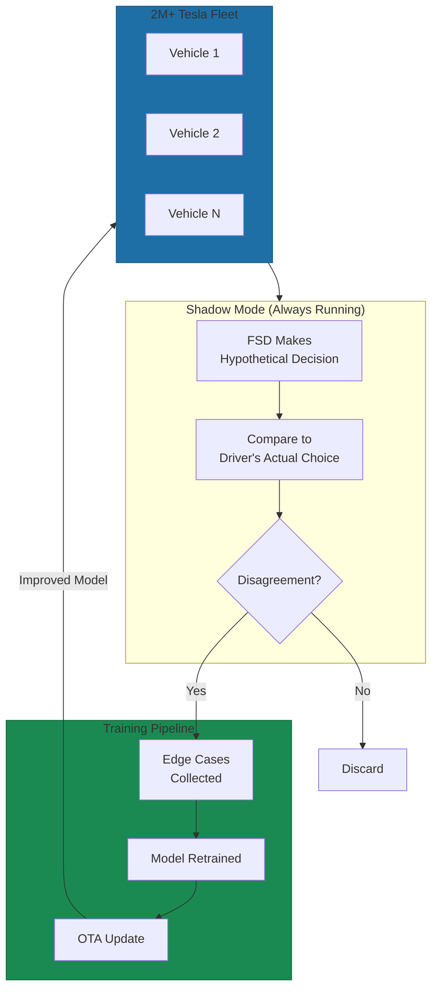

# Amazon and Tesla: Modular Evolution in Action

> **Note:** This is the extended case study. See Chapter 12, Section 5 for the summary.

"But we're not Amazon or Tesla."

Half right. You don't have their scale. But the architectural patterns that enable their evolution aren't exclusive to trillion-dollar companies. They're design decisions anyone can make.

## Amazon: Addition Without Replacement

Amazon's AI services didn't evolve through rewrites. They evolved through addition.

**2017:** SageMaker launched with three modular components: notebooks, built-in algorithms, one-click deployment. Customers could use only build and train capabilities while hosting elsewhere[^sagemaker]. Modularity baked in before generative AI existed.

**2023:** Bedrock arrived as a parallel service, not a replacement. SageMaker for deep customization. Bedrock for serverless foundation model access[^leanware]. AWS added in parallel, didn't deprecate.

**2024:** Amazon Q and SageMaker Unified Studio created integration points, not forced migrations. JumpStart models register with Bedrock while maintaining existing infrastructure[^jumpstart].

The pattern: independent services solving distinct problems. Customers adopt what they need. Nobody forced onto migration treadmills.

## The Integration That Didn't Break

Intuit's CTO at re:Invent 2023: they moved to AWS, built AI/ML with SageMaker, then added Bedrock in the generative AI era. Extended, not replaced[^intuit]. Salesforce achieved 30% faster deployments and 40% cost savings while preserving backward compatibility[^salesforce].

When you design services with well-defined interfaces, customers evolve on their own timeline.

## Tesla: Every Vehicle Becomes a Training Machine

Tesla proves modular evolution works for physical products.

Their firmware separates battery management, autopilot, infotainment, thermal systems into independent modules—each updated independently. Traditional automakers use single-block firmware where one issue requires reflashing everything[^firmware].

The FSD stack operates as a separate layer with its own versioning. Hardware abstraction distinguishes HW3 from HW4 vehicles, with automatic binary selection[^fsd-versions]. Customers with 2019 vehicles receive updates alongside 2024 vehicles.

## Shadow Mode: The Data Flywheel

FSD runs silently in background on every Tesla even when not enabled. The system makes hypothetical decisions and compares them to driver choices. Disagreements become training data[^shadow].

Two million vehicles become a distributed data collection network. The entire fleet feeds the training pipeline.

FSD v11 to v12 shows what this enables. V11: neural networks for perception, 300,000 lines of C++ for decision-making. V12: end-to-end neural networks, those 300,000 lines reduced to 2,000-3,000[^fsd12].

Musk in 2023: "There's no line of code that says there is a roundabout... There are over 300,000 lines of C++ in version 11, and there's basically none of that in version 12"[^musk]. A fundamental transformation delivered via OTA update.

## What Went Wrong (And How They Recovered)

Modular architecture doesn't prevent failures. It enables recovery.

FSD Beta v10.3 pushed Saturday night October 2021. By Sunday, vehicles swerved into adjacent lanes while FSD wasn't even enabled. Tesla's rollback accidentally removed beta access entirely[^rollback]. Modular architecture allowed rapid (if botched) recovery.

Version 13: 489 miles between disengagement versus 183 for v12.5—a 2.7x improvement[^v13]. Each iteration compounds because the architecture permits rapid iteration.

## The Cost Structure Reality

Tesla's approach: $10 billion in AI training infrastructure 2023-2025. Over $1 billion on custom Dojo supercomputers. $2 billion on H100 clusters[^cost].

You don't need $10 billion. But evolutionary architecture requires upfront modularity investment. Payoff: capability improvements deploy in weeks, not quarters.

Andrej Karpathy: "Progressing from prototypes that work 90% of the time to 99.999% requires exponentially more effort"[^karpathy]. Shadow mode and modular updates close that gap incrementally.

## Patterns That Transfer

**Design services that solve distinct problems.** SageMaker for customization. Bedrock for simplicity. Each usable independently.

**Create integration points, not forced migrations.** Salesforce uses both because AWS built the connection. Your services should work the same way.

**Separate platform from capability.** Tesla's vehicle platform stays stable while FSD evolves. Your business logic should stay stable while AI evolves.

**Turn usage into improvement.** Shadow mode makes every driver a training source. Your usage should feed your improvement cycle.

**Enable rollback and dual code paths.** Recovery options when things break. Version management when hardware varies.

The question isn't whether you have their resources. It's whether you're making the same architectural choices they made before they had those advantages.

## References

[^sagemaker]: AWS. [Introducing Amazon SageMaker](https://aws.amazon.com/about-aws/whats-new/2017/11/introducing-amazon-sagemaker/)

[^leanware]: Leanware. [Amazon SageMaker vs Amazon Bedrock: What's the Difference](https://www.leanware.co/insights/amazon-sagemaker-vs-amazon-bedrock-what-s-the-difference)

[^jumpstart]: AWS Documentation. [JumpStart Foundation Models Registration with Bedrock](https://docs.aws.amazon.com/sagemaker/latest/dg/jumpstart-foundation-models-use-studio-updated-register-bedrock.html)

[^intuit]: YouTube. [Intuit at re:Invent 2023](https://www.youtube.com/watch?v=8clH7cbnIQw)

[^salesforce]: AWS Machine Learning Blog. [How Amazon Bedrock Custom Model Import Streamlined LLM Deployment for Salesforce](https://aws.amazon.com/blogs/machine-learning/how-amazon-bedrock-custom-model-import-streamlined-llm-deployment-for-salesforce/)

[^firmware]: LinkedIn. [Tesla Software Architecture](https://www.linkedin.com/posts/vinayakkalra-kaifoundry_tesla-softwarearchitecture-firmwareengineering-activity-7386635781525835777-smzb)

[^fsd-versions]: Shop4Tesla. [Tesla FSD v12.6 Update 2025](https://www.shop4tesla.com/en/blogs/news/tesla-fsd-v12-6-update-2025)

[^shadow]: Not a Tesla App. [Tesla's FSD Shadow Mode](https://www.notateslaapp.com/news/3108/teslas-fsd-shadow-mode-what-it-is-and-how-it-improves-fsd)

[^fsd12]: Fred Pope. [Tesla FSD 12: Machine Learning](https://www.fredpope.com/blog/machine-learning/tesla-fsd-12)

[^musk]: Fred Pope. [Tesla FSD 12: Machine Learning](https://www.fredpope.com/blog/machine-learning/tesla-fsd-12)

[^rollback]: Dev.to. [Tesla Pushes Out Dangerous Software Update](https://dev.to/ben/tesla-pushes-out-dangerous-software-update-bungles-rollback-attempt-5hl4)

[^v13]: Creative Strategies. [Tesla AI Autonomy FSD v13 Update](https://creativestrategies.com/research/tesla-ai-autonomy-fsd-v13-update/)

[^cost]: Tom's Hardware. [Elon Musk Spent Roughly $10 Billion on AI Training Hardware in 2024](https://www.tomshardware.com/tech-industry/artificial-intelligence/elon-musk-spent-roughly-usd10-billion-on-ai-training-hardware-in-2024)

[^karpathy]: Global Advisors. [Quote: Andrej Karpathy](https://globaladvisors.biz/2025/10/30/quote-andrej-karpathy-ex-openai-ex-tesla-ai-4/)

---

[Chapter Overview](./README.md) | [Next: HubSpot and Gong: Platform and Flywheel Examples →](./02-hubspot-gong-gtm.md)
