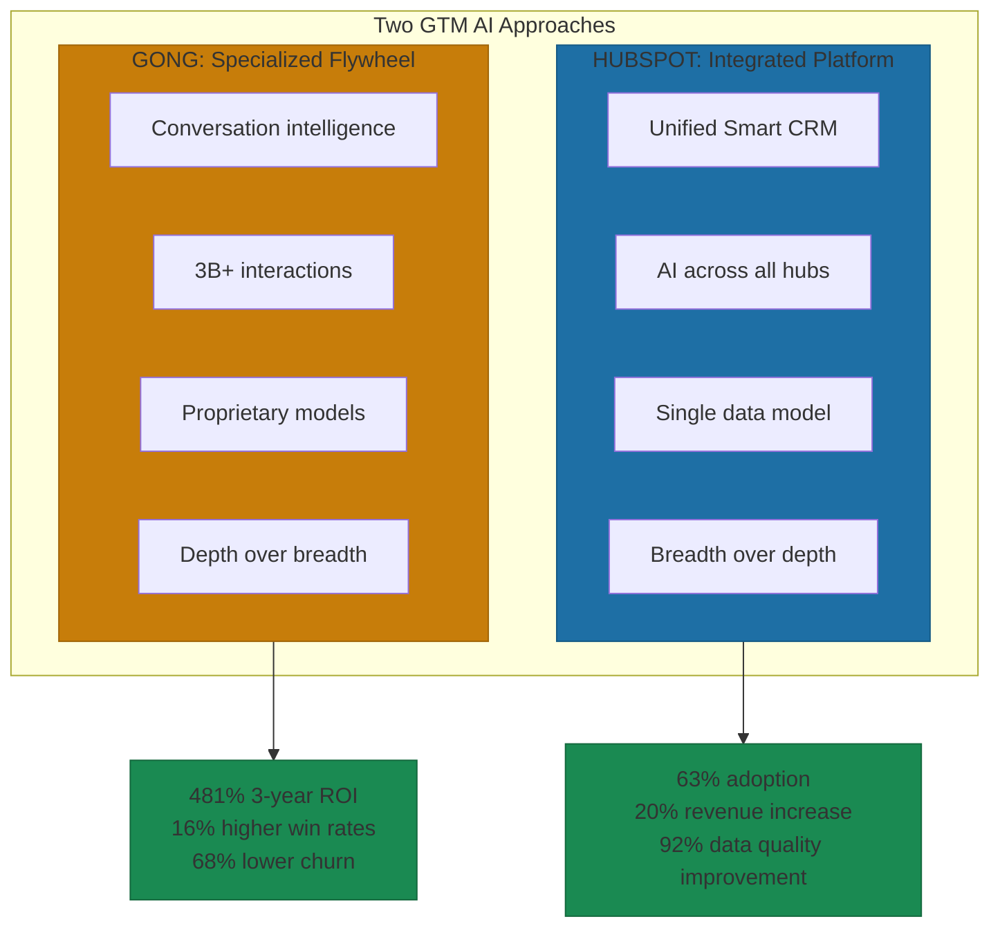
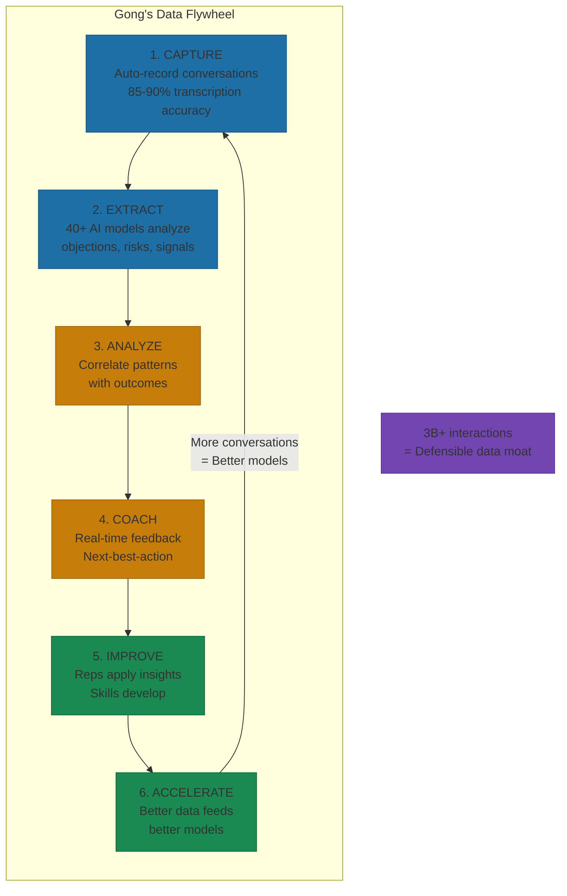

# HubSpot and Gong: Platform and Flywheel Examples

> **Note:** This is the extended case study. See Chapter 10, Section 8 for the summary.

Gong delivers 481% three-year ROI. Companies implementing the platform experience $12.1 million in benefits over three years versus $2 million in costs, resulting in a net present value of $10 million[^gong-roi]. In a study of over 1 million opportunities across 2,519 companies, higher usage of Gong increased win rates by 16%[^gong-win-rates].

HubSpot's AI agents drove 63% adoption among users with access, a 20% increase in subscription revenue in Q4, and 10,000 new customers to reach 238,000 globally. Revenue increased by $430 million from 2023 to 2024[^hubspot-growth].

Two different approaches to AI-augmented GTM. HubSpot represents the integrated platform play: marketing, sales, and service under a shared data model. Gong represents the specialized flywheel: deep conversation intelligence that improves as usage scales. Both work. The question is which fits your context.

## HubSpot: The Integrated Platform Approach

HubSpot implements AI across its entire platform through a unified "Smart CRM" architecture. The Data Agent uses shared data to access all relevant customer information securely, combining structured CRM records with generative AI models trained to understand HubSpot's schema and user intent. AI features can fetch and interpret data directly from contacts, companies, deals, and tickets while adhering to user permissions[^hubspot-architecture].

The custom data model stores any type of data in the CRM with custom objects, events, scoring, and calculations. AI-powered data enrichment automatically populates records with data from emails, calls, the web, and HubSpot's dataset of over 200 million buyer and company profiles. This self-generating CRM data eliminates manual data entry by pulling information from HubSpot's proprietary dataset, AI properties, and team conversations[^hubspot-data].

**Breeze AI** represents HubSpot's comprehensive AI product line, evolving through three phases to now include over 20 specialized AI agents. These agents don't just generate responses; they take action inside the CRM, qualifying leads, enriching records, and booking meetings automatically[^breeze-agents].

The architecture delivers three advantages point solutions cannot match: unified customer intelligence from a single source of truth, drastically reduced admin work as AI handles data entry, and faster decisions through visual tools that surface insights without manual investigation.

## HubSpot Results: What the Numbers Show

Businesses using Breeze Intelligence report 92% improvement in data quality, leading to 25% increase in prospect engagement[^breeze-results]. The unified AI approach eliminates the need for upwards of 10 disconnected point solutions, reducing integration complexity and cost.

Internal testing with HubSpot's sales team showed 30% reduction in prospecting time per user. Companies using AI-powered dialers within HubSpot saw 31% increase in deals closed, attributed to automation of routine tasks like data entry and follow-up calls[^hubspot-productivity]. Sales teams experienced 25% increase in productivity, enabling more calls and closed deals. Companies see an average 15% increase in conversion rates through AI-personalized pitches.

Teams moving from manual lead qualification to AI-powered predictive scoring consistently notice: sales responding faster to best-fit leads, fewer high-value opportunities slipping through cracks, higher ROI on both sales and marketing efforts, less time wasted on low-propensity leads, and continuous improvement as the system learns rather than stagnating[^lead-scoring].

## Gong: The Data Flywheel Approach

Gong's data flywheel operates on a continuous learning cycle. Every sales conversation feeds their AI models, which improves insights for all customers. The platform captures conversations across calls, emails, and meetings, automatically transcribing and analyzing them to identify patterns across billions of interactions[^gong-flywheel].

The flywheel mechanics:

**Stage 1: Capture.** Conversations recorded automatically with 85-90% transcription accuracy. No manual effort to collect data. Every conversation becomes training data[^gong-capture].

**Stage 2: Extract.** AI identifies patterns, topics, sentiment. Over 40 proprietary AI models analyze for customer objections, deal risks, buying signals, competitor mentions, and pricing discussions[^gong-models].

**Stage 3: Analyze.** Patterns correlated with outcomes. The system identifies what separates winning conversations from losing ones. Comparative analysis against team benchmarks generates predictive modeling for deal outcomes.

**Stage 4: Coach.** Insights delivered to reps and managers. Real-time feedback. Coaching recommendations based on top performer behaviors. Next-best-action suggestions.

**Stage 5: Improve.** Better conversations happen. Reps apply insights. Skills develop. Deal quality increases.

**Stage 6: Accelerate.** The loop spins faster. Higher-quality training data produces better insights. More users generate more data. The flywheel builds momentum.

## What Makes Gong's AI Different

Gong has built "the largest dataset of customer interactions in the industry," processing over 3 billion customer interactions. This massive scale creates a data moat that competitors struggle to replicate[^gong-moat].

Unlike competitors using off-the-shelf large language models, Gong trains its proprietary models on billions of real sales conversations. CEO Amit Bendov claims "Gong's proprietary models deliver a level of accuracy that's two times better than off-the-shelf, general-purpose models"[^gong-accuracy].

The hybrid AI architecture combines:
- Proprietary in-house models trained on unique customer-interaction data
- Customization to individual customers' businesses
- Augmentation with general-purpose large language models

This approach delivers relevance for revenue teams that pure LLM-based solutions cannot match.

## Gong Results: What the Numbers Show

Across 332 Gong customers, companies using Gong throughout their organization observed 11% higher revenue growth year-over-year compared to limited adopters. Higher Gong usage correlated with 68% lower churn rates across 800 analyzed accounts. Managers achieved 9% higher Net Promoter Scores over 12 months when heavily using Gong compared to low-usage peers[^gong-revenue].

LinkedIn deployed Gong's Revenue Intelligence platform across several business units. David Ellis, Director of Sales at LinkedIn, stated: "Gong has been a powerful resource because it gives us information that aligns to our people, our results, and our strategy"[^linkedin-case].

Canva implemented Gong and achieved 60% increase in rep and manager capacity through automation of administrative tasks, plus 6% revenue growth across the EMEA region. The shift: from hoping sales messaging works to knowing precisely what resonates with customers[^canva-case].

Shopify Plus found that Gong "exponentially improved" their ability to create a learning environment and strengthen coaching effectiveness[^shopify-case].

## Two Approaches, Common Principles

```mermaid
flowchart TB
    subgraph PRINCIPLES["Shared Principles for GTM AI Success"]
        direction TB

        P1["Unified Data<br/>Enables AI Effectiveness"]
        P2["AI Assists Humans<br/>Rather Than Replacing"]
        P3["Transparency<br/>Builds Trust"]
        P4["Feedback Loops<br/>Compound"]
        P5["Integration<br/>Architecture Matters"]
    end

    subgraph HUBSPOT_EX["HubSpot Examples"]
        H1["Single customer record"]
        H2["Chatbot supports agents"]
        H3["Visible scoring logic"]
        H4["Scoring improves over time"]
        H5["Platform-native integration"]
    end

    subgraph GONG_EX["Gong Examples"]
        G1["Conversation corpus"]
        G2["Coaching makes reps better"]
        G3["Explicit pattern explanations"]
        G4["Coaching improves with usage"]
        G5["Robust CRM connectors"]
    end

    P1 --- H1
    P1 --- G1
    P2 --- H2
    P2 --- G2
    P3 --- H3
    P3 --- G3
    P4 --- H4
    P4 --- G4
    P5 --- H5
    P5 --- G5

    style PRINCIPLES fill:#1a8a52,stroke:#14693e
    style HUBSPOT_EX fill:#1e6fa5,stroke:#155a85
    style GONG_EX fill:#c77d0a,stroke:#a06508
```

**Unified data enables AI effectiveness.** HubSpot's single customer record. Gong's conversation corpus. Both build AI on unified data, not fragmented silos.

**AI assists humans rather than replacing them.** HubSpot's chatbot supports agents. Gong's coaching makes reps better. Augmentation over automation.

**Transparency builds trust.** HubSpot's visible scoring logic. Gong's explicit pattern explanations. Users understand why AI recommends what it recommends.

**Feedback loops compound.** Both systems get better with use. HubSpot's outcomes improve scoring. Gong's conversations improve coaching.

**Integration architecture matters.** HubSpot integrates through platform design. Gong integrates through robust connectors. Isolated AI tools fail.

## Which Approach Fits Your Context

For Marcus building a startup, start with integrated platforms like HubSpot. Early stage benefits from systems that do most things adequately. Integration debt from fragmented GTM tools is expensive.

For Sarah leading enterprise transformation, you likely have existing systems that cannot be replaced. The question is whether to consolidate toward a platform or add specialized depth like Gong on top of existing infrastructure.

The pattern that runs DevOps also runs growth. Whether you pursue HubSpot's platform integration or Gong's specialized flywheel, consistency compounds.

---

## References

[^gong-roi]: Gong Press: New Study Reveals 481% ROI. [gong.io](https://www.gong.io/press/new-study-reveals-481-roi-in-gongs-revenue-intelligence-platform)

[^gong-win-rates]: PR Newswire: Gong Surpasses 4,000 Customers. [prnewswire.com](https://www.prnewswire.com/news-releases/gong-surpasses-4-000-customers-as-businesses-turn-to-its-ai-powered-platform-for-efficient-revenue-growth-301883972.html)

[^hubspot-growth]: Aly Scott Design: HubSpot Prospecting Agent. [alyscottdesign.com](https://www.alyscottdesign.com/work/hubspotprospectingagent)

[^hubspot-architecture]: Aptitude8: Data Agent HubSpot. [aptitude8.com](https://aptitude8.com/blog/data-agent-hubspot)

[^hubspot-data]: Modgility: What is the HubSpot Smart CRM. [modgility.com](https://www.modgility.com/blog/what-is-the-hubspot-smart-crm-a-deep-dive-into-its-ai-features)

[^breeze-agents]: HubSpot Company News: Build Your AI Team. [hubspot.com](https://www.hubspot.com/company-news/build-your-ai-team)

[^breeze-results]: HubSpot Better Value. [hubspot.com](https://www.hubspot.com/better-value)

[^hubspot-productivity]: SuperAGI: Case Study HubSpot AI-Powered Dialers. [superagi.com](https://superagi.com/case-study-how-companies-like-insidesales-and-hubspot-increased-sales-conversions-with-ai-powered-dialers/)

[^lead-scoring]: Your HubSpot Expert: AI-Powered Predictive Lead Scoring. [yourhubspotexpert.com](https://yourhubspotexpert.com/ai-powered-predictive-lead-scoring-in-hubspot-automate-your-sales-qualification-process/)

[^gong-flywheel]: Gong: Conversation Intelligence. [gong.io](https://www.gong.io/conversation-intelligence)

[^gong-capture]: Oliv AI: Gong Analytics. [oliv.ai](https://www.oliv.ai/blog/gong-analytics)

[^gong-models]: CRM Buyer: Gong AI Platform Delivers Improved Accuracy. [crmbuyer.com](https://www.crmbuyer.com/story/gong-ai-platform-delivers-improved-accuracy-to-revenue-forecasting-177228.html)

[^gong-moat]: Canvas Business Model: Gong Competitive Landscape. [canvasbusinessmodel.com](https://canvasbusinessmodel.com/blogs/competitors/gong-competitive-landscape)

[^gong-accuracy]: Gong Press: Proprietary Generative AI Models. [gong.io](https://www.gong.io/press/gong-introduces-proprietary-generative-ai-models-built-for-revenue-teams)

[^gong-revenue]: PR Newswire: Gong Surpasses 4,000 Customers. [prnewswire.com](https://www.prnewswire.com/news-releases/gong-surpasses-4-000-customers-as-businesses-turn-to-its-ai-powered-platform-for-efficient-revenue-growth-301883972.html)

[^linkedin-case]: Gong Case Study: LinkedIn. [gong.io](https://www.gong.io/customers/case-studies/linkedin-achieves-revenue-success-with-gong)

[^canva-case]: Case Study App: Gong. [casestudy.app](https://www.casestudy.app/examples/gong)

[^shopify-case]: Gong Case Study: Shopify. [gong.io](https://www.gong.io/customers/case-studies/shopify-creates-a-learning-environment-for-their-sales-team)

---

[← Previous: Amazon and Tesla: Modular Evolution in Action](./01-amazon-tesla-evolution.md) | [Chapter Overview](./README.md) | [Next: Microsoft and OpenAI: Ethics in Practice →](./03-microsoft-openai-ethics.md)
