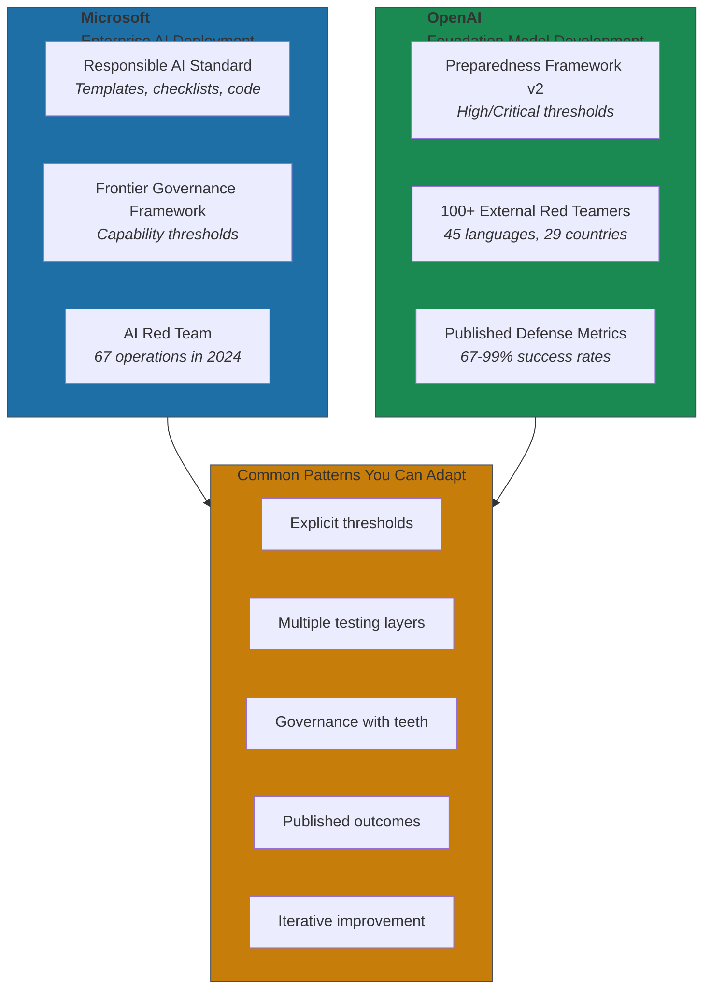
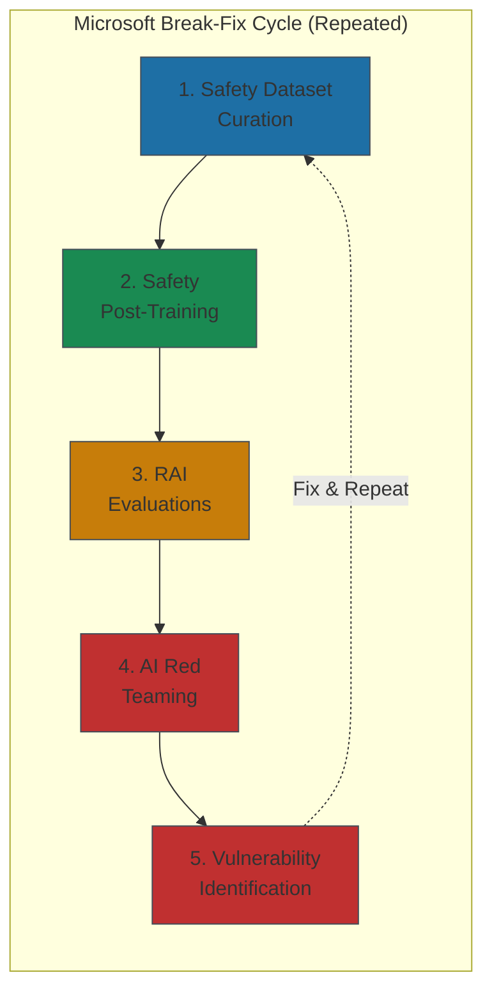

# Appendix: Microsoft and OpenAI — Ethics in Practice

> This appendix provides detailed case studies supporting [Chapter 11: Ethics, Governance, and Risk](../../part-4-sustaining/11-ethics-governance-and-risk/README.md). For the core frameworks and concepts, see the main chapter.

Two organizations at the frontier of AI show how to operationalize the principles discussed in Chapter 11.

Microsoft and OpenAI represent different contexts—enterprise AI deployment versus foundation model development—but both face the same fundamental challenge: turning abstract safety principles into concrete engineering practices. Their approaches offer patterns you can adapt regardless of your organization's size.

## Microsoft: Principles Into Practice

Microsoft's Responsible AI Standard evolved from a set of six principles (fairness, reliability, privacy, inclusiveness, transparency, accountability) into a systematic operational framework. The key word is operational. Templates, checklists, code libraries—not just policy documents.

### The Responsible AI Standard in Action

The standard requires teams to document specific stakeholders affected by AI decisions—both people using system outputs and people subject to AI-driven decisions. Each system must define Responsible Release Criteria with quantifiable thresholds: target minimum performance levels for all demographic groups, maximum acceptable performance differences between groups[^ms-standard].

The standard mandates checkpoints at design, training, and deployment phases. For fairness testing, teams define metrics for each system component, specify evaluation datasets, and document maximum acceptable differences in resource allocation rates. Human oversight requirements specify five documented capabilities: intended uses, interaction execution, behavior interpretation, override procedures, and awareness of over-reliance risks[^ms-standard].

I've seen governance documents that look impressive on paper but never change how engineers actually work. Microsoft's approach is different—the templates and checklists exist at the code review level, not just the policy level. This isn't checkbox compliance. It's engineering discipline applied to safety.

### Frontier Governance: When Models Cross Thresholds

Microsoft's 2024 Frontier Governance Framework monitors their most capable models for leading indicators of high-risk capabilities—CBRN threats, cyber capabilities, autonomous replication. Models receive pre-mitigation scores of low, medium, high, or critical for each tracked capability[^ms-frontier].

The framework triggers proportional responses. Models scoring "high-risk" must implement security measures protective against most cybercrime groups and insider threats. Models scoring "critical" require Executive Officer approval through documented cases demonstrating adequate mitigation, marginal benefits outweighing residual risks, and secure deployment capability[^ms-frontier].

### Red Teaming at Scale

Microsoft's AI Red Team conducted 67 operations in 2024 across Phi series models and Copilot tools, testing for security vulnerabilities, responsible AI risks, dangerous capabilities, and psychosocial harms. The team has red-teamed over 100 generative AI products since forming in 2018[^ms-redteam].

The red teaming output feeds directly into product changes. For Phi-4, the team used a "break-fix" cycle consisting of five stages: Safety Dataset Curation, Safety Post-Training, Quantitative and Qualitative RAI Evaluations, AI Red Teaming, and Vulnerability Identification. They repeated this cycle multiple times, with each iteration addressing vulnerabilities discovered in the previous round[^ms-phi].

Phi-4 achieved a 65.7% pass rate in security evaluations—not perfect, but measurably improved from earlier iterations and documented transparently[^ms-phi].

### Measurable Outcomes

According to IDC's Microsoft Responsible AI Survey, over 75% of respondents using responsible AI tools reported improvements in data privacy, customer experience, business decision confidence, brand reputation, and trust[^ms-outcomes].

One documented financial services case showed Microsoft's fairness tools identifying lending algorithm bias, resulting in a 15% increase in loan approvals for previously underserved communities while maintaining risk assessment accuracy. A healthcare provider implementing Explainable AI features achieved a 10% reduction in diagnostic errors compared to previous AI-only deployments[^ms-outcomes].

## OpenAI: Safety at the Frontier

OpenAI operates in a different context—building frontier models that push capability boundaries. Their safety practices must address risks that don't yet have regulatory precedent.

### The Preparedness Framework: Explicit Thresholds

OpenAI's Preparedness Framework, updated in April 2025, uses a two-tier capability threshold system. "High" capability thresholds indicate capabilities that significantly increase existing risk vectors for severe harm. "Critical" thresholds mean meaningful risk of qualitatively new threat vectors with no ready precedent[^openai-prep].

The framework tracks three primary categories: Biological and Chemical, Cybersecurity, and AI Self-improvement. For biological risks, High threshold is reached when the model provides "meaningful counterfactual assistance" enabling novices to create known biological threats. Critical capability means enabling experts to develop threats comparable to novel CDC Class A biological agents[^openai-prep].

When a system reaches High capability, it must have safeguards that sufficiently minimize severe harm risk before deployment. For Critical capabilities, OpenAI commits to "halt further development" until safeguards meeting Critical standards are specified[^openai-prep].

### Red Teaming: 100+ External Experts

For GPT-4o, OpenAI worked with over 100 external red teamers speaking 45 languages from 29 countries. The ChatGPT Agent deployment involved vetted external red teamers across twenty countries fluent in two dozen languages[^openai-redteam].

Red teaming findings directly inform safety improvements. For GPT-4o, red teaming uncovered instances where the model would unintentionally generate output emulating the user's voice, leading to robust mitigations. For DALL-E 3, open-ended red teaming uncovered gaps in misinformation-prone images, jailbreaks enabling explicit content, and self-harm imagery—leading to automated evaluations using GPT-4 to classify problematic prompts[^openai-whitepaper].

### Measured Defense Rates

The ChatGPT Agent System Card (July 2025) provides concrete defense metrics:

**Prompt Injection Defense:**
- Irrelevant instructions (synthetic): 99.5% success rate
- Irrelevant instructions (visual browser): 95% defense rate
- In-context data exfiltration: 78% defense rate
- Active data exfiltration: 67% defense rate

**Safety Refusals:**
- Privacy invasion tasks: 98.5% refusal rate
- Disallowed financial activities: 97.0% refusal rate
- High stakes financial activities: 89.0% refusal rate[^openai-agent]

The 67% defense rate against active data exfiltration is the realistic benchmark—one in three attacks still succeeds. These numbers represent significant improvement from earlier models, but they're honest about remaining gaps[^openai-agent].

### The Honest Limitations

What makes OpenAI's approach credible: they publish their failures, not just their successes.

Research from December 2025 revealed catastrophic failure rates for multi-turn attacks. While AI models block 87% of single-turn attacks, defense rates collapse to just 8% when attackers persist with multi-turn strategies. Crescendo attacks achieved 92.69% success rates[^attack-research].

The UK AI Safety Institute ran 1.8 million attacks across 22 models. Every model broke. The US CAISI discovered vulnerabilities in ChatGPT Agent combining traditional software exploits with AI agent hijacking, achieving approximately 50% success rates. OpenAI fixed these vulnerabilities within one business day[^uk-aisi].

Publishing these results builds credibility. It demonstrates that safety is a continuous process, not a solved problem.

## The Common Patterns

Despite different contexts, Microsoft and OpenAI share operational patterns you can adapt:

**Explicit thresholds, not vague principles.** Both organizations define specific, measurable criteria for what triggers review, escalation, or halt.

**Multiple testing layers.** Internal testing, external red teaming, automated evaluations, third-party assessments. No single layer catches everything.

**Governance with teeth.** Review boards that can halt deployment, not just issue recommendations. Executive approval requirements for high-risk decisions.

**Published outcomes.** Both organizations publish transparency reports with specific metrics—defense rates, improvement percentages, incident counts.

**Iterative improvement.** The "break-fix" cycle, continuous monitoring, post-incident reviews. Safety isn't achieved once and forgotten.

## References

[^ms-standard]: Microsoft. [Responsible AI Standard General Requirements](https://cdn-dynmedia-1.microsoft.com/is/content/microsoftcorp/microsoft/final/en-us/microsoft-brand/documents/Microsoft-Responsible-AI-Standard-General-Requirements.pdf)

[^ms-frontier]: Microsoft. [Frontier Governance Framework](https://cdn-dynmedia-1.microsoft.com/is/content/microsoftcorp/microsoft/final/en-us/microsoft-brand/documents/Microsoft-Frontier-Governance-Framework.pdf) (2024)

[^ms-redteam]: Microsoft Security Blog. [3 Takeaways from Red Teaming 100 Generative AI Products](https://www.microsoft.com/en-us/security/blog/2025/01/13/3-takeaways-from-red-teaming-100-generative-ai-products/) (January 2025)

[^ms-phi]: Microsoft. [Responsible AI Transparency Report](https://www.microsoft.com/en-us/corporate-responsibility/responsible-ai-transparency-report/) (2025)

[^ms-outcomes]: Industry Intel. [Microsoft Releases Second Annual Responsible AI Transparency Report](https://www.industryintel.com/news/microsoft-releases-second-annual-responsible-ai-transparency-report-company-reports-75-of-users-see-improved-data-privacy-and-customer-experience-with-ai-tools-171404962344) (2025)

[^openai-prep]: OpenAI. [Preparedness Framework v2](https://cdn.openai.com/pdf/18a02b5d-6b67-4cec-ab64-68cdfbddebcd/preparedness-framework-v2.pdf) (April 2025)

[^openai-redteam]: OpenAI. [GPT-4o System Card](https://openai.com/index/gpt-4o-system-card/) (2024)

[^openai-whitepaper]: OpenAI. [OpenAI's Approach to External Red Teaming for AI Models and Systems](https://cdn.openai.com/papers/openais-approach-to-external-red-teaming.pdf) (2025)

[^openai-agent]: OpenAI. [ChatGPT Agent System Card](https://cdn.openai.com/pdf/839e66fc-602c-48bf-81d3-b21eacc3459d/chatgpt_agent_system_card.pdf) (July 2025)

[^attack-research]: VentureBeat. [AI Models Block 87% of Single Attacks, But Just 8% When Attackers Persist](https://venturebeat.com/security/ai-models-block-87-of-single-attacks-but-just-8-when-attackers-persist) (December 2025)

[^uk-aisi]: OpenAI. [US CAISI and UK AISI AI Update](https://openai.com/index/us-caisi-uk-aisi-ai-update/) (2025)

---

[← Previous: HubSpot and Gong: Platform and Flywheel Examples](./02-hubspot-gong-gtm.md) | [Chapter Overview](./README.md)
