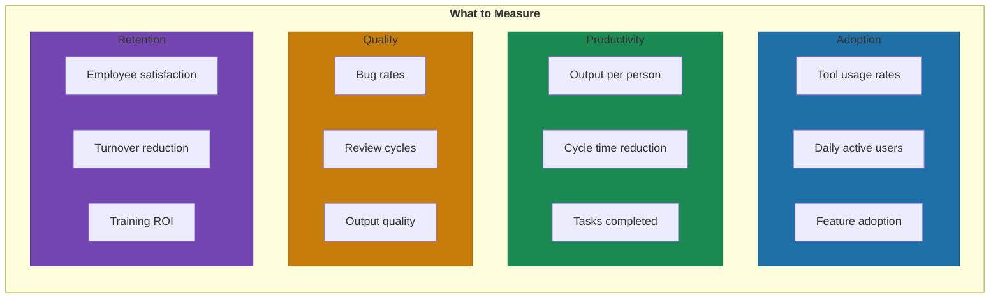

# The 90-Day AI Fluency Program: Complete Framework

> **Note:** This is the detailed implementation guide. See Chapter 8, Section 4 for the summary.

Most upskilling programs treat AI fluency like a training checkbox. Attend the workshop, get the certificate, back to your old ways by week two.

The companies seeing real transformation understand something different. AI fluency isn't a destination. It's a process that requires scaffolding—progression from observation to application to mastery. And it takes about 90 days of structured practice before new behaviors become habit.

This isn't theory. Microsoft's internal programs achieved 85% training completion rates (versus 60% before AI-driven approaches) and 25% better knowledge retention[^microsoft-internal]. BCG deployed their proprietary AI tool to consultants and reduced interview processing from two weeks to 2-3 days[^bcg-gene]. But both found that success required structure, not just access.

## Days 1-30: Foundation

The first month is about reducing friction to zero.

### Set Up the Tools

Get everyone into the same environment. ChatGPT or Claude for general tasks. Microsoft Copilot for productivity suite integration. Your internal AI platform if you have one. The goal isn't to overwhelm—it's to ensure nobody can say "I couldn't find the login."

BCG's approach: 1,200 "ground troops" employees providing day-to-day training and adoption support[^bcg-ground]. You don't need 1,200. You need enough people that questions get answered within hours, not days.

### Low-Stakes First Projects

Start with tasks where failure costs nothing. Email drafting and summarization. Meeting notes transcription. Document summarization. Basic research and information gathering. Brainstorming and ideation[^low-stakes].

These aren't impressive use cases. That's the point. You're building muscle memory without performance pressure. When someone successfully summarizes their first long document in 30 seconds instead of 15 minutes, something clicks. They start seeing possibilities.

### Weekly Office Hours

Dedicated time where people can ask "dumb questions" without judgment. The psychological safety matters more than the content. BCG found that 23% performance drops occurred when AI was applied beyond its capabilities[^bcg-limits]—meaning people need space to learn what doesn't work without consequences.

### Understanding Limitations

This is where most programs fail. They teach what AI can do. They skip what AI can't do.

Make limitations explicit. AI hallucinates. AI can't access information you haven't provided. AI doesn't understand your specific business context without training. Better to learn these boundaries in week two than discover them during a client presentation in month six.

## Days 31-60: Integration

The second month is about embedding AI into daily workflows—not as a separate activity, but as part of how work gets done.

### Domain-Specific Use Cases

Now you get specific to what each team actually does. Finance: data analysis and forecasting. Customer service: chatbot simulations. Marketing: content creation and brand messaging. Operations: process optimization[^domain-cases].

CMA CGM, the global shipping company, structured their training around "creating possible use cases as part of learning"[^cmacgm]. Employees didn't learn AI in abstract—they learned it by building solutions to their actual problems.

### Building Personal Prompt Libraries

The real productivity gains come from reusable prompts. Encourage people to save what works. Share across teams. When someone figures out a prompt that generates quality first drafts of status reports, that knowledge should spread in days, not months.

Accenture trained all 700,000 employees in agentic AI, with their marketing department seeing 25% external brand value improvement and nearly one-third reduction in manual tasks[^accenture]. That doesn't happen from generic training. It happens when people build tools specific to their work.

### Peer Learning Formats

Show-and-tell sessions where people demo what they've built. AI hackathons where teams solve problems together. Communities of Practice for ongoing knowledge sharing[^peer-learning].

BCG's "digital badges and recognition systems" gamified progress[^gamification]. The University of New Mexico found that aligning with Microsoft's "11 by 11 tipping point"—11 minutes of time savings over 11 weeks—creates lasting adoption habits[^unm]. Small wins compound.

## Days 61-90: Mastery

The third month is about complexity, autonomy, and multiplication.

### Complex Multi-Step Tasks

Now people tackle workflows that require judgment. Multi-step analysis. Building agent pipelines. Work that requires understanding when to apply AI and when to override it.

GitHub's research confirms the productivity gains covered in our hiring discussion[^github]. But the speed gain only matters if quality holds—and that requires human judgment at key decision points. This phase develops that judgment.

### Agent Building and Automation

For technical teams, this is where agent construction begins. For non-technical teams, this is where they learn to specify requirements clearly enough that technical teams can build what they need.

One company achieved a 40% increase in task fulfillment time and 75% boost in employee engagement using AI-tracked personalized training[^training-results]. The engagement spike matters—mastery creates motivation.

### Teaching Others

The final test of fluency: can you teach it? People who've completed the program become the next cohort's ground troops.

The University of New Mexico structured their final phase to include "teaching others"[^unm-teaching]. This isn't just knowledge transfer. It's how you scale without proportionally scaling training investment.

## Measuring What Matters

The trap: measuring completion rates instead of outcomes.

### Adoption Metrics

Tool usage rates before and after. Feature adoption timelines. Daily active users at 3-month, 6-month, and 12-month intervals[^adoption-metrics]. Among AI ROI Leaders, weekly AI usage increased to 82% in 2025, up 10 percentage points year-over-year[^deloitte].

One case study showed AI project submissions increased 50% after implementing an internal AI ambassador program[^ambassador]. That's the kind of leading indicator that predicts business impact.

### Productivity Metrics

Output per person: tickets closed, features shipped, documents produced. Time savings: cycle time reduction, review time improvement.

Developers using GitHub Copilot complete tasks 55% faster with a completion rate of 78% versus 70% for non-users[^github-metrics]. AWS research found AI skills boost productivity by at least 39% across organizations surveyed[^aws-productivity].

Counter to expectation: a METR study of early-2025 AI tools found that when developers used AI assistance, they took 19% longer to complete issues—contradicting developer beliefs about speed gains[^metr]. The lesson: measure actual outcomes, not perceived benefits.

### Quality Metrics

Bug rates before and after. Review cycle improvements. Code quality or output quality measures.

Teams using AI-powered code review alongside coding tools saw quality improvements in 81% of cases when reporting considerable productivity gains, versus only 55% for fast-moving teams without AI review[^qodo]. Speed without quality isn't speed—it's technical debt acceleration.

### Retention and Satisfaction

AI-trained employees are up to 25% more likely to stay, reducing costly turnover[^retention]. That's not just a nice outcome. It's ROI.

## The Break-Even Timeline

Most organizations see initial productivity gains within 3-6 months of AI implementation, with full ROI typically realized within 12-18 months[^breakeven].

Specific scenarios vary:
- **3-5 months:** Focused deployments reducing training and support load
- **6-9 months:** Multi-team rollouts across HR, finance, or operations
- **9-12 months:** Highly customized environments with heavy IT dependency[^timeline]

Conservative scenarios deliver 300%+ ROI over three years. Realistic implementations achieve 500%+ returns[^roi-projections]. Teams using digital adoption platforms commonly report 3.4x ROI in the first year, with break-even around 7 months[^dap-roi].

## The Warning Signs

Training investment decreased 8 percentage points in 2025 despite 130% increase in AI spending[^warning]. Leaders' confidence that training leads to AI fluency fell 14 percentage points[^confidence-drop].

That's the human capital contradiction: organizations recognize AI depends on people but invest less in training. Don't be that organization.

The companies that win treat upskilling as a marathon, not a sprint. 90 days gets you to fluency. Maintaining fluency requires ongoing investment, ongoing practice, ongoing measurement.

Everything else is just a workshop.

---

## References

[^microsoft-internal]: SuperAGI. Case Studies: How Major Corporations Are Using AI to Transform Training Programs — [superagi.com](https://superagi.com/case-studies-how-major-corporations-are-using-ai-to-transform-their-training-programs-in-2025/)

[^bcg-gene]: Forbes. How BCG Is Revolutionizing Consulting with AI — [forbes.com](https://www.forbes.com/sites/bernardmarr/2024/07/10/how-bcg-is-revolutionizing-consulting-with-ai-a-case-study/)

[^bcg-ground]: Plus AI. How Consulting Firms Use AI — [plusai.com](https://plusai.com/blog/how-consulting-firms-use-ai)

[^low-stakes]: SuperAGI. AI Training Case Studies — [superagi.com](https://superagi.com/case-studies-how-major-corporations-are-using-ai-to-transform-their-training-programs-in-2025/)

[^bcg-limits]: Forbes. How BCG Is Revolutionizing Consulting with AI — [forbes.com](https://www.forbes.com/sites/bernardmarr/2024/07/10/how-bcg-is-revolutionizing-consulting-with-ai-a-case-study/)

[^domain-cases]: SuperAGI. AI Training Case Studies — [superagi.com](https://superagi.com/case-studies-how-major-corporations-are-using-ai-to-transform-their-training-programs-in-2025/)

[^cmacgm]: America on Tech. Summer 2025 Tech360 — [americaontech.org](https://www.americaontech.org/news/summer-2025-tech360-empowering-the-next-generation-of-ai-leaders)

[^accenture]: HR Dive. AI Talent Upskilling at Accenture — [hrdive.com](https://www.hrdive.com/news/AI-talent-upskilling-accenture/742821/)

[^peer-learning]: LibFocus. AI and Workforce Webinar — [libfocus.com](https://www.libfocus.com/2024/11/webinar-review-ai-and-workforce.html)

[^gamification]: America on Tech. Summer 2025 Tech360 — [americaontech.org](https://www.americaontech.org/news/summer-2025-tech360-empowering-the-next-generation-of-ai-leaders)

[^unm]: LibFocus. AI and Workforce Webinar — [libfocus.com](https://www.libfocus.com/2024/11/webinar-review-ai-and-workforce.html)

[^github]: GitHub Blog. Research: Quantifying GitHub Copilot's Impact — [github.blog](https://github.blog/news-insights/research/research-quantifying-github-copilots-impact-on-developer-productivity-and-happiness/)

[^training-results]: eLearning Industry. Case Studies: Successful AI Adoption in Corporate Training — [elearningindustry.com](https://elearningindustry.com/case-studies-successful-ai-adoption-in-corporate-training)

[^unm-teaching]: LibFocus. AI and Workforce Webinar — [libfocus.com](https://www.libfocus.com/2024/11/webinar-review-ai-and-workforce.html)

[^adoption-metrics]: Auzmor. Measure the ROI of AI Training Programs — [auzmor.com](https://auzmor.com/blog/measure-the-roi-of-ai-training-programs/)

[^deloitte]: Deloitte. AI ROI: The Paradox of Rising Investment — [deloitte.com](https://www.deloitte.com/nl/en/issues/generative-ai/ai-roi-obm-rai.html)

[^ambassador]: Amatum. AI Upskilling Case Studies — [amatum.com](https://amatum.com/ai-upskilling-case-studies/)

[^github-metrics]: Worklytics. The ROI of GitHub Copilot — [worklytics.co](https://www.worklytics.co/blog/the-roi-of-github-copilot-for-your-organization-a-metrics-driven-analysis)

[^aws-productivity]: AWS Blog. Make Digital and AI Upskilling Your Competitive Advantage — [aws.amazon.com](https://aws.amazon.com/blogs/apn/make-digital-and-ai-upskilling-your-competitive-advantage/)

[^metr]: METR. Early 2025 AI Experienced OS Dev Study — [metr.org](https://metr.org/blog/2025-07-10-early-2025-ai-experienced-os-dev-study/)

[^qodo]: Qodo. State of AI Code Quality Report — [qodo.ai](https://www.qodo.ai/reports/state-of-ai-code-quality/)

[^retention]: Thrive Sparrow. AI Upskilling in Retaining Employees — [thrivesparrow.com](https://www.thrivesparrow.com/blog/ai-upskilling-in-retaining-employees)

[^breakeven]: Worklytics. Calculating ROI for Employee AI Adoption — [worklytics.co](https://www.worklytics.co/resources/calculating-roi-employee-ai-adoption-initiatives-interactive-model-2025)

[^timeline]: Apty. Digital Adoption Platform ROI — [apty.ai](https://apty.ai/blog/digital-adoption-platform-roi-calculate-your-break-even-point/)

[^roi-projections]: Worklytics. Calculating ROI for Employee AI Adoption — [worklytics.co](https://www.worklytics.co/resources/calculating-roi-employee-ai-adoption-initiatives-interactive-model-2025)

[^dap-roi]: Apty. Digital Adoption Platform ROI — [apty.ai](https://apty.ai/blog/digital-adoption-platform-roi-calculate-your-break-even-point/)

[^warning]: Wharton. How AI Finally Delivers ROI — [leadwithai.co](https://www.leadwithai.co/article/wharton-how-ai-finally-delivers-roi)

[^confidence-drop]: Wharton. How AI Finally Delivers ROI — [leadwithai.co](https://www.leadwithai.co/article/wharton-how-ai-finally-delivers-roi)

---

[Chapter Overview](./README.md) | [Next: Polyglot Persistence: Database Evolution Stages →](./02-polyglot-persistence-stages.md)
