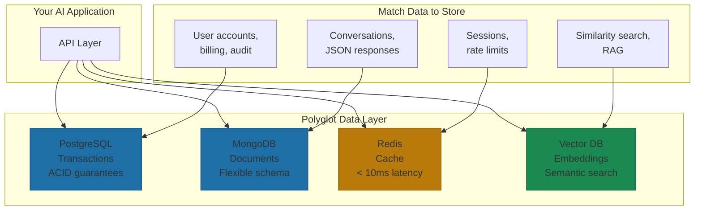
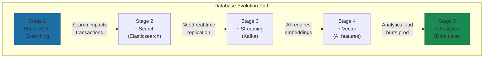

# Polyglot Persistence: Database Evolution Stages

> **Note:** This is the detailed implementation guide. See Chapter 9, Section 5 for the summary.

The Yirifi engineering team runs three database types: transactions in relational, content in documents, speed-critical in cache. But here's what makes the difference: they didn't start there. They started with PostgreSQL. They added complexity when they had measured problems, not imagined ones.

This is polyglot persistence in practice. Not architecture diagrams from a whiteboard session. Real decisions made under real constraints.

## The One-Database Trap

The common misconception about database architecture: the goal is to pick the "best" database. It isn't. The goal is to match storage characteristics to data characteristics. Different data has different access patterns, consistency requirements, and performance profiles.

The temptation is to over-engineer early. I've watched teams spin up Kafka, Redis, MongoDB, and a vector database before they have paying customers. Six months later, they're spending more time maintaining infrastructure than building product.

The pattern in AI-first companies that actually ship: start with one database. Add the second when you can measure the problem the second database solves. Add the third only when the second creates a new bottleneck.

## What Goes Where: The Matching Principle

The database decision matrix isn't mysterious. It's straightforward once you understand what each type does well.

**Relational databases (PostgreSQL, MySQL)** handle transactional data requiring ACID guarantees. User accounts. Billing records. Audit logs. Anything where "eventual consistency" means "eventually wrong."

OpenAI runs PostgreSQL on Azure as the backbone for ChatGPT. When they needed to handle read-heavy workloads at scale, they didn't rip out Postgres. They optimized it: read replicas for queries, PgBouncer for connection pooling (reducing latency from 50ms to under 5ms), priority-based request routing[^openai-postgres]. I've seen teams reach for NoSQL because "Postgres won't scale" when what they actually needed was proper indexing and connection pooling. The lesson: a well-tuned relational database handles more than you think.

**Document databases (MongoDB, DynamoDB)** excel at semi-structured content with flexible schemas. Agent conversation histories. JSON-heavy API responses. Anything where the schema changes faster than your deployment cycle.

The trap here is using document stores for everything because "flexibility" sounds good. Flexibility without structure becomes chaos. Use document stores when schema evolution is a genuine requirement, not when you haven't thought through your data model.

**Cache layers (Redis, Memcached)** serve speed-critical data: session state, rate limiting, frequently accessed keys. Discord's engineering team used in-memory storage to handle over 1 million concurrent users in the MidJourney server[^discord-midjourney]. The data was ephemeral but the latency requirements were unforgiving.

**Vector databases (Pinecone, Weaviate, Qdrant)** are the newest addition to the polyglot stack. They store embeddings for semantic search and similarity matching. Vector database usage grew 377% in 2024 across enterprises[^databricks-adoption]. Notion uses Pinecone to power semantic search across billions of embeddings, achieving sub-10ms latency[^vector-compare]. But here's where the architecture decisions get interesting: Perplexity AI, serving 400 million queries monthly, uses Vespa to combine vector search, lexical search, and BM25 in a single system[^perplexity-nvidia]. Sometimes polyglot means multiple databases. Sometimes it means one database that speaks multiple query languages.

Here's the decision framework in practice:

| Question | If Yes |
|----------|--------|
| Does this data require ACID transactions? | Relational |
| Does the schema change frequently? | Document store |
| Is read latency critical (< 10ms)? | Cache layer |
| Do you need semantic/similarity search? | Vector database |
| Is this analytics, not operations? | Data warehouse |

## The Evolution Path

Notion's database evolution illustrates the pattern. They didn't design a polyglot architecture. They discovered one through measured problems.

**Stage 1: PostgreSQL everything.** They sharded to 480 logical shards across 96 physical instances to manage 200 billion block entities[^notion-sharding]. That's not a typo. Two hundred billion. They made Postgres work until Postgres couldn't work.

**Stage 2: Add search.** When search queries started impacting transactional performance, they added Elasticsearch. Separate concern, separate system.

**Stage 3: Add streaming.** Apache Kafka for CDC (change data capture) streaming. Real-time data replication without polling the transactional database.

**Stage 4: Add vector.** When AI features required embeddings, they added a vector database. The AI use case couldn't retrofit onto the existing stack.

**Stage 5: Add analytics.** Their update-heavy workload (90% updates vs. inserts) made traditional data warehouses expensive[^notion-datalake]. They built a data lake with Kafka CDC to Hudi to S3, achieving "over a million dollars" in annual savings while reducing ingestion time from days to minutes.

Each addition solved a measured problem. Each addition happened after the simpler approach hit a wall.

## The Usage Analytics Flywheel

Here's where polyglot persistence connects to data strategy: the real flywheel isn't in your transactional database. It's in your usage analytics.

The Yirifi anchor captures this: "The real flywheel is usage analytics. Every agent interaction becomes training data for better agent interactions."

GitHub Copilot demonstrates what this looks like in practice. They collect real-time code editing sessions, capturing intermediate edits developers make between commits. Not just final PR diffs, but the temporal sequence of editing behavior[^github-nes]. That usage data feeds model training.

The November 2025 release showed measurable flywheel results: 24.5% reduction in unnecessary suggestions, 26.5% increase in acceptance rate, 25.6% reduction in hide rate[^github-nes]. Each metric improved because usage data made the model better, and the better model generated better usage data.

This requires a specific data architecture:

- **Collection layer:** Capture interactions at the right granularity
- **Storage layer:** Time-series or streaming for temporal data
- **Processing layer:** Transform raw events into training signals
- **Feedback layer:** Connect model outputs back to user behavior

GitHub trains dozens of model candidates per month, evaluating each through offline testing, internal dogfooding, and A/B experiments. They can deploy improvements in less than a day for their code completion models[^github-nes]. Duolingo's Session Generator shows the same pattern: when they rewrote their core system from 750 milliseconds to 14 milliseconds per request, they enabled real-time personalization across 15 billion weekly exercises[^duolingo-engineering]. That velocity comes from infrastructure designed for the feedback loop, not retrofitted onto it.

## Common Anti-Patterns

The mistakes are predictable:

**Resume-driven architecture.** Choosing technologies because they're interesting to learn, not because they solve your problem. If you can't explain who uses each database and why, you have resume-driven architecture.

**Premature optimization.** Adding caching before measuring latency. Adding a data warehouse before outgrowing your analytics queries. Focus on what's actually slow today, not hypothetical scale problems.

**One database per microservice.** The microservice pattern doesn't require database-per-service. Shared infrastructure is fine when the trade-offs favor simplicity over isolation.

**Avoiding all duplication.** Strategic denormalization is fine. The cost of maintaining perfect consistency across heterogeneous databases often exceeds the cost of some redundancy.

## The Practical Starting Point

If you're building an AI-first company today, here's the sequence that works:

**Month 1-6:** PostgreSQL for everything. Seriously. Everything. Resist the urge to add complexity.

**When latency becomes measurable:** Add Redis for session state and frequently-read data. Not before.

**When schema flexibility blocks iteration:** Add a document store for the specific data type that needs flexibility. Not for everything.

**When AI features require embeddings:** Add a vector database. This is usually the first genuinely new capability, not a performance optimization.

**When analytics queries impact production:** Add a data warehouse or data lake. Separate the analytical workload from the operational workload.

The goal isn't elegance. The goal is a data architecture that accelerates your flywheel without creating operational overhead that slows everything else down.

## References

[^openai-postgres]: Microsoft Tech Community. [Scaling PostgreSQL at OpenAI](https://techcommunity.microsoft.com/blog/adforpostgresql/scaling-postgresql-at-openai-lessons-in-reliability-efficiency-and-innovation/4281228)

[^discord-midjourney]: InfoQ. [Discord MidJourney Performance](https://www.infoq.com/news/2024/01/discord-midjourney-performance/)

[^databricks-adoption]: Databricks. [State of AI Enterprise Adoption](https://www.databricks.com/blog/state-ai-enterprise-adoption-growth-trends)

[^vector-compare]: Xenoss. [Vector Database Comparison](https://xenoss.io/blog/vector-database-comparison-pinecone-qdrant-weaviate)

[^notion-sharding]: Notion Blog. [Sharding Postgres at Notion](https://www.notion.com/blog/sharding-postgres-at-notion)

[^notion-datalake]: Notion Blog. [Building and Scaling Notion's Data Lake](https://www.notion.com/blog/building-and-scaling-notions-data-lake)

[^github-nes]: GitHub Blog. [Evolving GitHub Copilot's Next Edit Suggestions](https://github.blog/ai-and-ml/github-copilot/evolving-github-copilots-next-edit-suggestions-through-custom-model-training/)

[^perplexity-nvidia]: NVIDIA Developer Blog. [Perplexity AI Serves 400 Million Search Queries a Month](https://developer.nvidia.com/blog/spotlight-perplexity-ai-serves-400-million-search-queries-a-month-using-nvidia-inference-stack/)

[^duolingo-engineering]: Duolingo Blog. [Unique Engineering Problems at Duolingo](https://blog.duolingo.com/unique-engineering-problems/)

---

[← Previous: The 90-Day AI Fluency Program: Complete Framework](./01-90-day-ai-fluency-program.md) | [Chapter Overview](./README.md)
