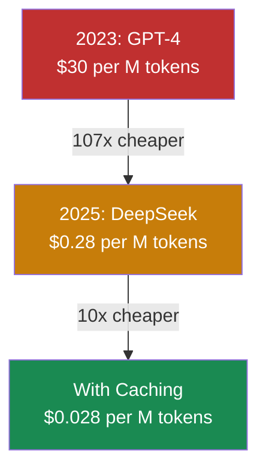
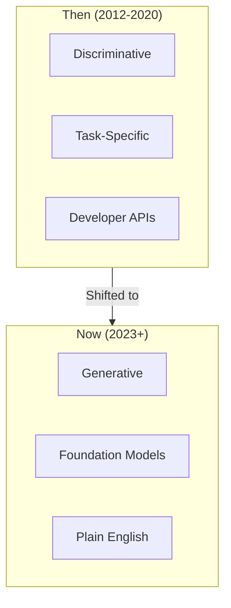

# The AI Inflection Point

In March 2025, a solo developer named Pieter Levels shipped a browser-based flight simulator. Nothing unusual about that. What caught attention: he went from idea to $1 million in annual recurring revenue in 17 days. One person. No team. AI wrote 80–95% of the code[^levels-fly].

Seventeen days.

Most companies haven't caught up to what that means.

## The Cost Collapse

The difference this time: the cost of intelligence is approaching zero.

In 2023, processing a million tokens through GPT-4 cost roughly $30. By late 2025, DeepSeek offers comparable capability at $0.28 per million tokens. With caching, that drops to $0.028[^deepseek-pricing]. That's a 107x cost reduction in two years.

The implications compound. When AI processing costs pennies, the barrier isn't compute. It's imagination.

Y Combinator startups now ship MVPs in 6 weeks instead of 6 months[^yc-speed]. GitHub found developers complete tasks 55% faster with Copilot[^github-study]. McKinsey measured 40-50% time savings on code documentation and writing new code[^mckinsey-study]. These aren't lab results. They're production numbers.

But the productivity gains compound.

## Why This Wave Is Different

If you've been in tech long enough, you've heard "AI is going to change everything" before. You heard it during the 2012-2016 deep learning wave. Maybe you heard it during the expert systems boom of the 1980s. Both ended in disappointment for most companies.

I've lived through three of these cycles. Each time, smart people invested heavily in what turned out to be premature bets. What makes me pay attention now isn't the hype—it's the productivity data from actual production use.

So why should you believe this time is different?

The most obvious shift is from classification to creation. The deep learning wave gave us prediction: "This image contains a cat" (99% confidence). Useful for specific applications, but limited. The current wave creates. Write code. Draft documents. Generate images. The output isn't a label—it's something that didn't exist before[^generative-vs-deep].

But the deeper change is architectural. In 2015, if you wanted an AI that understood legal documents, you built a legal-specific model. Customer service? Different model. Translation? Different model. Each required specialized ML teams, massive labeled datasets, and months of training. Now, a single foundation model handles all these via prompting[^foundation-models]. These models—trained on massive datasets—require no ML expertise. No custom training data. Just natural language.

Most importantly, the skill barrier evaporated. Deep learning required software engineers to integrate APIs, structure data, build interfaces. LLMs accept plain language. A non-programmer can upload documents and prompt for analysis[^interface-collapse]. The barrier fell from "hire a data science team" to "write clear instructions."

## The Small Team Advantage

John Rush runs 16 startups simultaneously with mostly one-person teams, generating over $2M in annual revenue[^john-rush]. His prediction: "50% of all great software will be run by 1-3 person teams."

The data supports him. Cursor, an AI coding tool built by a small team, reached $100M ARR in roughly one year[^cursor-arr]. Harvey, a legal AI platform, hit the same milestone in three years with a lean operation[^harvey-arr]. These aren't exceptions. They're the new pattern.

Small teams with AI can match what large teams did without it. That's not hyperbole. GitHub's study showed a 55% speed improvement on routine tasks. McKinsey found developers were 25-30% more likely to complete complex tasks when using AI tools[^mckinsey-complex].

The Yirifi story I mentioned earlier—15 backoffice microsites, just 2 people, 3 months—worked because we leaned into this pattern. Each microsite runs its own Flask backend, HTMX frontend, and MCP-exposed APIs for AI agent access. DevOps, QA, Finance, Risk, Data, Marketing—same architecture, replicated across domains. Traditional staffing for this scope? 10-15 people minimum. The difference isn't working harder. It's thinking while AI types.

But these gains aren't universal.

## The Productivity Paradox

The METR study dropped a finding that should make every team pause: developers predicted a 24% speedup from AI tools but actually experienced a 19% slowdown on mature codebases[^metr-study]. That's a 43-point perception gap. People thought they were faster. They were measurably slower.

Why the disconnect? AI lacks tacit knowledge of your specific codebase. It doesn't know your architectural patterns, your style guidelines, your edge cases. On mature projects with millions of lines of code, developers spent more time reviewing AI outputs, crafting prompts, and waiting for responses than they saved[^metr-details].

This isn't a reason to avoid AI tools. It's a reason to deploy them strategically:

- **New projects, greenfield code:** AI accelerates dramatically
- **Routine tasks, boilerplate:** Clear wins
- **Unfamiliar frameworks:** AI as learning accelerator
- **Complex systems you already know:** Proceed with caution

The productivity gains are real. They're also situational. Knowing when AI helps and when it doesn't is the first skill of the AI-first company.

## The Window

Here's the reality most companies aren't facing: the advantage of starting now won't last.

The cost curve continues collapsing. AI capabilities keep expanding. Every month that passes, the baseline rises. What took a 10-person team in 2023 takes 3 people in 2025. What takes 3 people today might take 1 in 2027.

Companies building AI-first now are accumulating advantages. Better data flywheels. Deeper integration. More learning cycles. Meanwhile, companies waiting for the technology to "mature" are watching competitors pull ahead.

Harvey didn't wait for perfect conditions. They deliberately targeted the hardest customers—enterprise law firms—while competitors chased easier wins. They built for the future while others optimized for the present.

The question isn't whether AI will transform your industry. It's whether you'll be the one transforming it or the one being transformed.

## References

[^levels-fly]: LinkedIn, "How Pieter Levels Built a $1M ARR Business in 17 Days" — [linkedin.com](https://www.linkedin.com/pulse/future-ai-empire-building-how-pieter-levels-solo-builder-cormier-r5lxc)
[^deepseek-pricing]: Intuition Labs, LLM API Pricing Comparison 2025 — [intuitionlabs.ai](https://intuitionlabs.ai/articles/llm-api-pricing-comparison-2025)
[^yc-speed]: Advancio, "From 6 Months to 6 Weeks" — [advancio.com](https://www.advancio.com/from-6-months-to-6-weeks-how-ai-is-speeding-up-software-development/)
[^github-study]: GitHub Research, May 2024 — [github.blog](https://github.blog/news-insights/research/research-quantifying-github-copilots-impact-on-developer-productivity-and-happiness/)
[^mckinsey-study]: McKinsey & Company, June 2023 — [mckinsey.com](https://www.mckinsey.com/capabilities/tech-and-ai/our-insights/unleashing-developer-productivity-with-generative-ai)
[^generative-vs-deep]: eWeek, "Generative AI vs Deep Learning" — [eweek.com](https://www.eweek.com/artificial-intelligence/generative-ai-vs-deep-learning/)
[^foundation-models]: BrollyAI, "Deep Learning vs Generative AI" — [brollyai.com](https://brollyai.com/deep-learning-vs-generative-ai/)
[^interface-collapse]: Blumberg Capital, "Mapping the AI Toolchain" — [blumbergcapital.com](https://blumbergcapital.com/news-insights/mapping-the-ai-toolchain-2024-perspective/)
[^john-rush]: The Creators AI, "Indie Hacker Making $2M ARR with AI" — [thecreatorsai.com](https://thecreatorsai.com/p/indie-hacker-making-2marr-with-ai)
[^cursor-arr]: Data Designs, "Small AI Teams Are the Smart Money Move" — [datadesigns.io](https://www.datadesigns.io/blog/small-ai-teams-are-the-smart-money-move)
[^harvey-arr]: Harvey Year in Review 2024 — [harvey.ai](https://www.harvey.ai/downloadable/year-in-review/2024/Harvey-2024-year-in-review.pdf)
[^mckinsey-complex]: McKinsey & Company, June 2023 — [mckinsey.com](https://www.mckinsey.com/capabilities/tech-and-ai/our-insights/unleashing-developer-productivity-with-generative-ai)
[^metr-study]: Business Insider, July 2025 — [businessinsider.com](https://www.businessinsider.com/ai-coding-tools-may-decrease-productivity-experienced-software-engineers-study-2025-7)
[^metr-details]: METR Study, 2025 — [metr.org](https://metr.org/blog/2025-07-10-early-2025-ai-experienced-os-dev-study/)

---

[Chapter Overview](./README.md) | [Next: AI-First vs AI-Enabled →](./02-ai-first-vs-ai-enabled.md)
