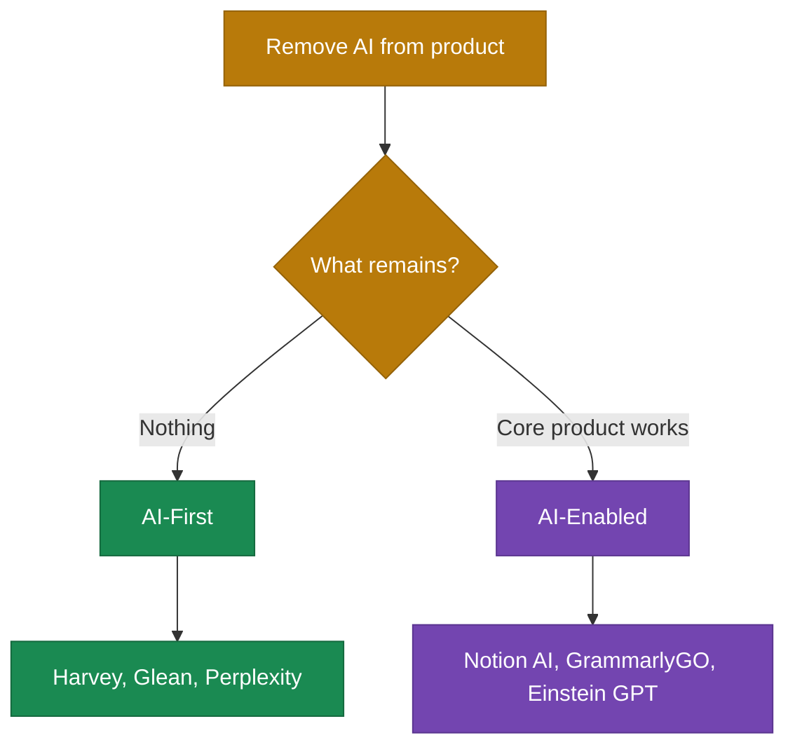

# AI-First vs AI-Enabled

Most companies get AI strategy wrong from the start. They focus on "adding AI" instead of asking whether AI is the foundation or just a feature.

This distinction determines everything downstream: architecture, pricing, team structure, even whether you can pivot fast enough when the next model breakthrough hits.

## The Kill Test

The simplest way to know which camp you're in: what happens if you remove the AI?

Harvey has a clear answer. PwC partners report their junior lawyers would "riot" if Harvey were taken away[^harvey-interview]. Remove the AI, and Harvey doesn't exist. There's no legacy product underneath.

Notion has a different story. They launched Notion AI in early 2023 as a $10/month add-on. Turn off Notion AI tomorrow, and you'd still have a functioning workspace for notes, docs, and wikis. The product existed since 2016. AI makes it better. AI doesn't make it *exist*.

Both companies are successful. Both use AI. But they're playing fundamentally different games.

## 5 Signs You're Looking at AI-First

### 1. The Company Didn't Exist Before Modern AI

Harvey was founded in 2022. Glean launched commercially in 2020. Perplexity started in 2022. Mistral launched in 2023 and reached a $6B valuation within 18 months[^mistral]. These companies exist *because* of LLMs and transformer architectures. No legacy product to protect, no existing architecture to work around.

Salesforce, by contrast, has built CRM since 1999. When they announced Einstein GPT in March 2023, four months after ChatGPT launched, they called it "the world's first generative AI CRM." The framing tells you everything: generative AI *for* CRM, not CRM *built on* AI.

### 2. Data Architecture Drives the Product

Glean's CEO Arvind Jain, formerly a Google Distinguished Engineer, puts it bluntly: "The biggest mistake everyone made was thinking enterprise search was a crawling and indexing problem. It's actually a knowledge graph and personalization problem."[^glean]

Glean's Enterprise Knowledge Graph takes 12-18 months to fully mature for large customers[^glean]. It learns organizational patterns, team structures, knowledge flows. The graph *is* the product. Without it, search doesn't work. This creates natural switching costs. Competitors would need to rebuild organizational understanding from scratch.

Compare that to Notion AI, which works on documents users already created. The data serves the existing note-taking product rather than driving new capabilities.

### 3. AI Expertise Is Distributed, Not Siloed

Midjourney launched in 2022 with just 11 employees and hit $200M in annual revenue by 2023[^midjourney-team]. There's no separate "AI team" because the entire company is the AI team. Everyone works on the core product. (We'll explore AI-first team structures in [Chapter 8](../../part-3-operating/08-teams-for-ai-first-companies/README.md).)

When AI is the foundation, domain experts and AI capabilities have to be integrated throughout the organization.

### 4. Pricing Reflects AI as Core Value

AI-first companies often use consumption-based or hybrid pricing. Glean charges $30/month per user and claims to save knowledge workers 2-4 hours per week[^glean]. At a $100K fully-loaded annual cost per worker, that's nearly 14x ROI.

AI-enabled companies often price AI as an add-on. Notion charges $10 extra per member per month for AI features. The pricing structure reveals the truth: is AI where the value lives, or is it a premium enhancement?

### 5. Marketing Says "Built On" Not "Now With"

Listen to how companies talk about themselves:

- **AI-First:** "AI-native search experience from the ground up" (Perplexity)
- **AI-Enabled:** "Now the world's number one generative AI CRM" (Salesforce)

The first claims origin. The second claims addition.

## When AI-Enabled Is the Right Choice

AI-first isn't always the answer.

Salesforce has massive existing customers who depend on their CRM daily. Rebuilding from scratch isn't an option. Partnering with OpenAI and layering AI onto existing products is faster and preserves revenue.

Beyond large incumbents, some contexts favor AI-enabled: highly regulated industries requiring interpretability, hardware-first companies where software is secondary, and services where human judgment is the product.

There's also a risk profile consideration. AI-first startups face existential risk if AI doesn't deliver promised value. AI-enabled companies hedge: if AI fails, core product remains.

## What Happens When You Pick Wrong

Retrofitting doesn't fail outright. It takes longer and costs more than anyone expects.

Over 35% of enterprises cited high upfront expenses as a barrier to AI implementation in 2024, and the skills gap meant 41% faced deployment delays[^retrofit-barriers]. Legacy systems weren't designed for AI workloads. Data sits fragmented across departments.

But here's what should give every AI-enabled company pause: I've struggled to find clear examples of companies successfully transitioning from AI-enabled to AI-first. The architectural decisions made early tend to lock companies into their approach. It's not impossible—but no one has publicly demonstrated it at scale.

Harvey's CEO Winston Weinberg understood this from day one: "We picked the hardest customers to win over and the highest degree of difficulty...by design. You have to start with enterprise trust, and everything else follows."[^harvey-interview]

Starting AI-first lets you move fast. Retrofitting forces you to move carefully around structures that no longer serve the new reality.

Both games can be won. But you can't play both at once. Build your company *on* AI or *with* AI—choose deliberately. Get that answer wrong, and you'll spend the next three years learning it the expensive way.

## References

[^harvey-review]: Harvey Year in Review 2024 — [harvey.ai](https://www.harvey.ai/downloadable/year-in-review/2024/Harvey-2024-year-in-review.pdf)
[^harvey-interview]: Observer.com, September 2025 — [observer.com](https://observer.com/2025/09/interview-winston-weinberg-harvey-ai-legal-professional-services/)
[^midjourney-team]: Contrary Research — [Midjourney Business Breakdown](https://research.contrary.com/company/midjourney)
[^mistral]: CNBC, June 2024 — [cnbc.com](https://www.cnbc.com/2024/06/12/mistral-ai-raises-645-million-at-a-6-billion-valuation.html)
[^glean]: Contrary Research — [Glean Company Profile](https://research.contrary.com/company/glean)
[^retrofit-barriers]: Congruence Market Insights, 2024 — [AI in Predictive Maintenance](https://www.congruencemarketinsights.com/report/ai-in-predictive-maintenance-market)

---

[← Previous: The AI Inflection Point](./01-the-ai-inflection-point.md) | [Chapter Overview](./README.md) | [Next: First-Mover Advantages →](./03-first-mover-advantages.md)
