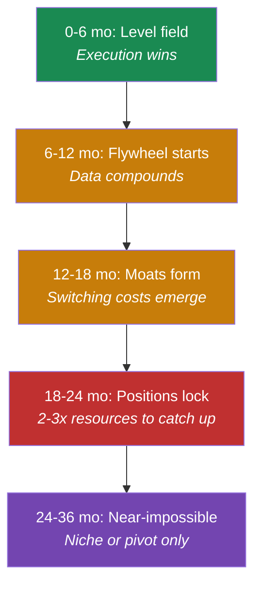

# First-Mover Advantages

Whether you're already committed to AI-first or still evaluating, the timing question matters. The timing matters more than most people realize. But not for the reasons you might think.

First-mover advantage in AI isn't about getting there first. It's about what compounds while everyone else is still deciding whether to move.

## The Jasper Warning

Jasper launched in January 2021 as one of the first GPT-3-powered marketing content platforms. By late 2022, they'd built a real business: $80M ARR, 120,000 customers, a proprietary dataset of marketing-specific patterns[^jasper-wiki]. They had an 18-month head start on everyone else in the space.

Then ChatGPT launched in November 2022. Within months, Jasper revised their 2023 revenue forecast down by 30%. They cut their internal valuation by 20%. Customer count dropped from 120,000 to 100,000[^jasper-wiki].

What most people miss: Jasper's product worked. Their data moat was real. But they'd built for a world where GPT-3's limitations would persist. When OpenAI made general-purpose AI accessible to everyone, the moat around "marketing-specific AI" became a sandcastle at high tide.

First-mover advantage isn't absolute. It depends on *what* you're building the moat around.

## When Moats Actually Work

Contrast Jasper with Glean, the enterprise search company.

Glean's Knowledge Graph learns how your specific organization works. That 12-18 month maturation timeline isn't a bug. It's the moat.

When a competitor shows up 18 months later with a faster search tool, they're not competing with Glean's technology. They're competing with 18 months of accumulated organizational understanding. By then, Glean is another 18 months ahead.

The difference? Jasper built on a capability (AI writing) that got commoditized. Glean built on data (organizational knowledge) that can't be commoditized. Every company's Knowledge Graph is unique.

## The Timeline Framework

Here's the pattern I keep seeing across AI companies. The competitive dynamics shift in predictable phases:

**Months 0-6: The level playing field.** First movers have minimal advantage. Claude launched four months after ChatGPT and captured significant market share—but by differentiating on developer experience and long-context tasks, not by copying[^claude-vs-chatgpt].

**Months 6-12: The data flywheel starts spinning.** Better data creates better outputs. Better outputs drive more adoption. More adoption generates more data. Fast followers need differentiation or lose mindshare.

**Months 12-18: Moats begin forming.** Customer workflows get redesigned around AI capabilities. Switching costs emerge. Glean's Knowledge Graph matures. Harvey's legal workflows become embedded.

**Months 18-24: Defensible positions lock in.** Companies that waited now need 2-3x the resources to close the gap. The 15-20% premium on AI talent that late movers pay[^talent-premium] is just the beginning.

**Months 24-36: Near-impossible to catch up head-on.** Category leaders have locked in distribution and brand. Fast followers either find a niche or pivot entirely.

## Scale AI: The 9-Year Advantage

For the most dramatic example of compounding first-mover advantage, look at Scale AI. They started in 2016, before the current wave began. While everyone built AI applications, Scale built the infrastructure that trains them: data labeling. Nine years later, they're worth $20 billion[^scale], serving OpenAI, Meta, and major autonomous vehicle companies.

A competitor starting today isn't just 9 years behind on technology. They're 9 years behind on understanding which data labeling problems matter and which quality checks catch real errors. That's time crystallized into competitive advantage.

## What Actually Compounds

Not all advantages compound equally:

- **Data moats compound fastest.** Every user interaction improves the model. But data moats that depend on proprietary formats can get flooded when foundation models improve—Jasper's lesson.
- **Customer lock-in compounds through habit.** When AI tools become part of how people work, switching costs become behavioral, not just technical. That takes 18-36 months to build but creates durable retention.
- **Team expertise compounds slowest but deepest.** Organizations that adopted AI in 2021-2022 have three-plus years of learning what works. That institutional knowledge doesn't transfer through a hiring spree.

## The Counter-Argument

There's survivorship bias here. We've discussed Glean and Cursor because they succeeded. Most AI-first startups don't. For every success story, there are dozens of AI startups in the same vertical that failed. The advantage of AI-first isn't immunity from failure—it's speed of learning.

First-mover advantage also doesn't matter when you have superior distribution. Apple didn't make the first smartphone, mp3 player, or smartwatch. They made the one that won. Claude succeeded through differentiation, not by being a better ChatGPT.

## The Real Risk of Waiting

The common mistake: companies worry about starting too early, when the technology isn't ready. The actual risk is starting too late, when the moats have already formed.

Only 5% of companies globally achieve AI value at scale (per BCG's most stringent measure of "at scale")[^bcg-ai]. Meanwhile, data flywheels at companies like Glean and Harvey spin faster every quarter. The gap isn't closing. It's widening.

Every month you spend evaluating, competitors accumulate the advantages that take 12-18 months to build. The window closes whether you're ready or not.

---

## References

[^jasper-wiki]: Wikipedia — [Jasper AI](https://en.wikipedia.org/wiki/Jasper_(software))
[^glean]: Contrary Research — [Glean Company Profile](https://research.contrary.com/company/glean)
[^claude-vs-chatgpt]: Neontri — [ChatGPT vs Claude](https://neontri.com/blog/chatgpt-vs-claude/)
[^talent-premium]: HeroHunt.ai — [AI Compensation Strategy](https://www.herohunt.ai/blog/ai-compensation-strategy-salary-and-benefits-in-the-ai-talent-bubble)
[^scale]: Web Pro News — [Scale AI's Rise to $20B](https://www.webpronews.com/scale-ais-rise-to-20b-revolutionizing-ai-data-labeling/)
[^bcg-ai]: BCG, October 2024 — [AI Adoption: 74% of Companies Struggle](https://www.bcg.com/press/24october2024-ai-adoption-in-2024-74-of-companies-struggle-to-achieve-and-scale-value)

---

[← Previous: AI-First vs AI-Enabled](./02-ai-first-vs-ai-enabled.md) | [Chapter Overview](./README.md) | [Next: The Cost of Retrofitting →](./04-the-cost-of-retrofitting.md)
