# The Cost of Retrofitting

For companies that can't rebuild from scratch, the question is: what does retrofitting actually cost?

The reality: more than anyone budgets for.

Here's the number that should alarm every executive: 95% of generative AI pilots fail to reach production[^mit-failures]. Not "underperform expectations." Fail.

That MIT finding from 2025 isn't an outlier. S&P Global found 42% of companies abandoned most of their AI initiatives in 2025, up from 17% the year before[^sp-global]. BCG reports only 26% of companies achieve meaningful AI value (using a broader measure than "at scale")[^bcg-scale]. Gartner estimates AI project failure rates run twice that of traditional IT projects[^gartner-failure].

The pattern is consistent across sources: something about bolting AI onto existing systems breaks in ways traditional software doesn't. The culprit is usually data. AI projects surface data quality problems that traditional IT projects never encounter—fragmented sources, inconsistent formats, missing context that humans filled in implicitly.

## The Salesforce Warning

Want to see what enterprise retrofitting looks like? Look at Salesforce Einstein GPT.

General availability took 18 months[^salesforce-ga]. For customers, implementing Einstein GPT costs $50,000-$200,000 for mid-market deployments, and frequently exceeds $500,000 for enterprise[^einstein-costs]. That's before you count the 2-3 full-time administrators most organizations need for ongoing maintenance[^einstein-admin].

But the number that matters most: 67% of users face adoption challenges[^einstein-adoption]. Two-thirds of the people who actually get the tool don't successfully use it.

The challenge runs deeper than implementation. Legacy systems weren't designed for AI workloads. Data sits fragmented across departments. The architecture that made sense in 2015 actively fights against what AI needs to function. When Salesforce partnered with OpenAI rather than building their own AI, they were making a pragmatic choice. But it also meant their integration would always be exactly that: an integration, not a foundation.

## When Speed Wins: The Notion Paradox

Not every retrofit fails. Some move remarkably fast.

Notion launched their AI alpha on November 16, 2022. That was two weeks *before* ChatGPT exploded onto the scene[^notion-timing]. They expected 200,000 waitlist signups. They got 1 million in five weeks[^notion-waitlist]. General availability came three months later.

By retrofitting standards, Notion moved impossibly fast. They beat Coda to market by four months. They were generating real user feedback while competitors were still planning their announcements. CMO Rachel Hepworth described their philosophy: "Go to market ASAP, get Notion AI into the hands of our most eager early adopters, and fuel our engineers with feedback from a much larger user pool than traditional research would allow"[^notion-lessons].

So Notion proves retrofitting can work, right?

Not quite. The speed came with hidden costs.

## The Hidden Costs

Notion's AI started with 2-second response times. Users experienced it as sluggish, bolted-on. They had to partner with Fireworks AI to fine-tune smaller models, eventually getting latency down to 350 milliseconds[^fireworks]. That technical debt took over a year to resolve.

Their initial pricing model was a "3-tier system where AI was cheap to add but came with only a small amount of usage... like a cell phone plan"[^notion-pricing]. Users hated it. They overhauled pricing just weeks before GA launch after customer feedback made clear that per-query pricing killed exploration.

And the pricing evolution tells the real story. Notion AI launched as a $10/month add-on. By May 2025, new users wanting full AI access need the Business plan at $20/month minimum[^notion-pricing-2025]. AI remains a premium feature, not a foundation.

The architectural constraint matters too. Notion AI operates in what analysts call a "walled garden"[^notion-limits]. It understands data inside Notion. It cannot connect to live external systems. This reflects the fundamental reality: AI was added to an existing closed ecosystem rather than rebuilt as an open integration layer.

Three years after launch, Notion remains a productivity workspace that *has* AI features. Not an AI-powered workspace. The retrofit worked. It also locked in limitations that an AI-first architecture wouldn't have.

## The Pattern Behind the Numbers

Across every company I've studied, retrofitting creates predictable costs:

**Time multiplies.** Basic AI functionality takes 6-12 months. Comprehensive deployment takes 12-24 months[^timeline]. Full legacy modernization with AI at Fortune 500 scale can run 3-7 years. I've seen retrofit projects that looked like 6-month sprints turn into 3-year marathons. Meanwhile, AI-first startups ship in weeks.

**Budgets explode.** Total cost of ownership exceeds initial estimates by 150-300% when you factor in multi-year implementation cycles[^budget-overrun]. Organizations spend $1.9 million on average on GenAI initiatives, but less than 30% of AI leaders report CEO satisfaction with results[^ceo-satisfaction].

**Data quality haunts everything.** 57% of companies admit their data isn't AI-ready[^data-quality]. Organizations with clean data reduce timelines by 40%. Most organizations don't have clean data.

**Teams resist.** HubSpot found their AI adoption slowed past 60% as they hit "skeptics and higher levels of change aversion"[^hubspot-adoption]. They eventually made AI fluency a baseline hiring expectation, adding it to job descriptions. That's not an AI feature decision. That's an organizational transformation.

## What This Means For You

If you're already in production with a non-AI architecture, you have three paths:

**Path 1: Retrofit carefully.** Accept 18-24 months of implementation, budget for 2-3x your initial estimate, and start with data quality. The companies that succeed (HubSpot reached 90% adoption) made sustained organizational commitments over years, not quarters.

**Path 2: Build new.** Launch new products AI-first while maintaining legacy systems. Eventually the new architecture becomes primary. This is expensive but avoids the integration tax.

**Path 3: Acquire.** Buy companies that already solved the AI-first problem. This is what we saw with the Salesforce-OpenAI partnership, just formalized through M&A.

```mermaid
flowchart TB
    Start["Legacy Company<br/>Needs AI"] --> Q{"Choose Path"}

    Q --> R["🟠 Path 1: Retrofit"]
    R --> R1["18-24 months timeline"]
    R --> R2["Budget 2-3x estimate"]
    R --> R3["Start with data quality"]

    Q --> B["🟢 Path 2: Build New"]
    B --> B1["AI-first products parallel"]
    B --> B2["Expensive but clean"]
    B --> B3["Avoids integration tax"]

    Q --> A["🔵 Path 3: Acquire"]
    A --> A1["Buy solved problem"]
    A --> A2["Fastest capability"]
    A --> A3["Highest capital cost"]

    style R fill:#c77d0a,color:#fff
    style B fill:#1a8a52,color:#fff
    style A fill:#1e6fa5,color:#fff
```

None of these paths is cheap. But pretending retrofitting is simple is more expensive still.

Every pre-AI decision becomes technical debt. Debt always comes due.

---

## References

[^mit-failures]: MIT Sloan, "The GenAI Divide: State of AI in Business 2025" — [fortune.com](https://fortune.com/2025/08/18/mit-report-95-percent-generative-ai-pilots-at-companies-failing-cfo/)
[^sp-global]: S&P Global, Voice of the Enterprise: AI & Machine Learning, Use Cases 2025 — [spglobal.com](https://www.spglobal.com/market-intelligence/en/news-insights/research/ai-experiences-rapid-adoption-but-with-mixed-outcomes-highlights-from-vote-ai-machine-learning)
[^gartner-failure]: Informatica — [informatica.com](https://www.informatica.com/blogs/the-surprising-reason-most-ai-projects-fail-and-how-to-avoid-it-at-your-enterprise.html)
[^bcg-scale]: BCG, October 2024 — [bcg.com](https://www.bcg.com/press/24october2024-ai-adoption-in-2024-74-of-companies-struggle-to-achieve-and-scale-value)
[^salesforce-ga]: Salesforce News, September 2024 — [salesforce.com](https://www.salesforce.com/news/stories/sales-gpt-service-gpt-ga/)
[^einstein-costs]: Oliv AI, Einstein Pricing Analysis — [oliv.ai](https://www.oliv.ai/blog/salesforce-einstein-pricing-tiers-explained)
[^einstein-admin]: Oliv AI, Einstein Features — [oliv.ai](https://www.oliv.ai/blog/salesforce-einstein-features)
[^einstein-adoption]: Oliv AI, Einstein Features — [oliv.ai](https://www.oliv.ai/blog/salesforce-einstein-features)
[^notion-timing]: CNBC, September 2025 — [cnbc.com](https://www.cnbc.com/2025/09/18/notion-launches-ai-agent-as-it-crosses-500-million-in-annual-revenue.html)
[^notion-waitlist]: Notion Blog, Launch Lessons — [notion.com](https://www.notion.com/blog/lessons-we-learned-from-launching-notion-ai)
[^notion-lessons]: Notion Blog, Launch Lessons — [notion.com](https://www.notion.com/blog/lessons-we-learned-from-launching-notion-ai)
[^fireworks]: Fireworks AI, Notion Story — [fireworks.ai](https://fireworks.ai/blog/Story-Notion)
[^notion-pricing]: Notion Blog, Launch Lessons — [notion.com](https://www.notion.com/blog/lessons-we-learned-from-launching-notion-ai)
[^notion-pricing-2025]: Kipwise — [kipwise.com](https://kipwise.com/blog/notion-ai-pricing)
[^notion-limits]: Eesel AI — [eesel.ai](https://www.eesel.ai/blog/notion-ai-limitations-best-practices)
[^timeline]: Promethium AI — [promethium.ai](https://promethium.ai/guides/enterprise-ai-implementation-roadmap-timeline/)
[^budget-overrun]: Oliv AI — [oliv.ai](https://www.oliv.ai/blog/salesforce-einstein-pricing-tiers-explained)
[^ceo-satisfaction]: Apiro Data — [apirodata.io](https://www.apirodata.io/post/the-hidden-cost-crisis-of-diy-ai-implementation)
[^data-quality]: Gartner AI Hype Cycle — [pragmaticcoders.com](https://www.pragmaticcoders.com/blog/gartner-ai-hype-cycle)
[^hubspot-adoption]: HubSpot Product Blog — [product.hubspot.com](https://product.hubspot.com/blog/context-is-key-how-hubspot-scaled-ai-adoption)

---

[← Previous: First-Mover Advantages](./03-first-mover-advantages.md) | [Chapter Overview](./README.md) | [Next: The Economics of AI-First →](./05-the-economics-of-ai-first.md)
