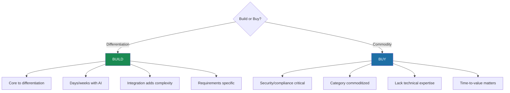

# The Economics of AI-First

The economics now favor building from scratch—even for established companies. The calculus has flipped, and most companies haven't caught up to what that means.

## The Build vs Buy Paradox

The data shows a striking shift: 76% of enterprises now purchase AI solutions rather than building them internally[^menlo-shift]. In 2024, that split was nearly even. The move toward buying happened fast.

But there's a paradox. While companies buy more *AI solutions*, AI has made building *custom tools* radically faster. Replit Agent can produce three production apps in under 200 minutes for less than $25[^replit-speed]. Vercel's v0 generates functional MVPs in 15 minutes from simple prompts[^vercel-v0].

Consider Condor, a Brazilian logistics company. They needed an internal IT support assistant—the kind of tool that would typically require months of vendor evaluation, procurement, and integration. Instead, they built a complete generative AI assistant in weeks[^condor]. It handles employee queries, troubleshoots common issues, and escalates complex problems. The speed wasn't because they had a massive AI team. It was because AI tools made building faster than buying.

At the enterprise end of the spectrum, TELUS demonstrates what's possible at scale: 500,000+ staff hours saved through workflow automation, 47 enterprise-grade apps delivered, $90M+ in measurable business benefit, and 30% improvement in code delivery velocity[^telus-case]. They process 100 billion tokens per month. This isn't a pilot—it's production AI running at telecommunications scale.

Both things can be true. Buying AI solutions makes sense for commoditized capabilities. Building custom tools is now faster than integrating another SaaS product. Build or buy matters less than knowing which game you're playing.

## The Integration Tax

Here's the number that should make every CTO pause: the average company now runs 106-112 SaaS applications[^saas-sprawl]. Large enterprises with 5,000+ employees use 158[^saas-large]. Companies spend $5,607 per employee annually on SaaS[^saas-spend], and 49% of those licenses go unused[^unused-licenses]. Enterprise SaaS maintenance costs $25,000 to $60,000+ per month for platforms with extensive integrations[^maintenance-costs].

When you have 106 apps, you don't have a system. You have 106 systems pretending to be one. This is where AI-first development changes the calculus. If building a custom tool takes days instead of months, the integration tax of adding another SaaS app might exceed the cost of building exactly what you need.

## The Figma Trade-Off

What happens when an established leader takes a measured approach to AI? Figma offers a case study in both the costs and the logic of caution.

Figma pioneered collaborative design in the browser. When the $20 billion Adobe acquisition fell through, they emerged stronger. With that much at stake, they had reasons to move carefully on AI.

Figma launched their AI features at Config 2024 in June—9 months after Adobe Firefly went commercially available and 8 months after Canva launched Magic Studio[^figma-timeline]. For a company that defined cloud-native collaboration, they found themselves playing catch-up.

Then it got worse. Days after the Config announcement, Andy Allen, CEO of Not Boring Software, discovered that Figma's flagship Make Designs feature was producing near-replicas of Apple's iOS Weather app[^figma-scandal]. Not inspired by. Near-replicas.

Dylan Field's response revealed the underlying problem. He admitted the issue stemmed from "his push for the team to meet deadlines and the use of off-the-shelf AI models alongside a bespoke design system"[^field-response]. Figma had bolted third-party models onto their existing product without proper quality control. They couldn't even verify whether Apple's designs were in the training data.

The feature got pulled. Field's view is that "we're in the MS-DOS era of AI right now"[^field-msdos]—building too aggressively on primitive tools might mean rebuilding when better ones arrive. For a company with Figma's brand and scale, that's a reasonable concern.

But there's a counter-argument: while Figma waited for AI to mature, competitors accumulated 9 months of user feedback and product iteration. That learning compounds. The early era of any technology is exactly when moats get built.

## The New Framework

When do you build versus buy? The old framework was simple: build if it's core to your business, buy if it's not. AI changed the equation.

**Build when** the capability differentiates you, development time with AI tools is days not months, integration would add complexity to an already bloated stack, or requirements are too specific for existing solutions.

**Buy when** security, compliance, or legal liability is paramount; the category is commoditized; you lack technical expertise even with AI assistance; or time-to-value matters more than customization.

The shift isn't from buying to building. It's from "buy unless strategic" toward "build for differentiation, buy for commodity."

## The Real Question

We started this chapter with Pieter Levels building a flight simulator to $1M ARR in 17 days. One person. AI wrote most of the code. That's not the future. That's now.

The question this book will answer isn't whether AI will transform how companies operate. It already is. The question is whether you'll build the company that leads that transformation or the one that gets transformed by it.

The economics favor the bold. The moats favor the early. What does it actually take to build an AI-first company? That's what the next eleven chapters are about.

## References

[^menlo-shift]: Menlo Ventures, "2025 State of Generative AI in the Enterprise" — [menlovc.com](https://menlovc.com/perspective/2025-the-state-of-generative-ai-in-the-enterprise/)
[^replit-speed]: YouTube, Replit Agent demonstration — [youtube.com](https://www.youtube.com/watch?v=0WafPn7kvno)
[^vercel-v0]: YouTube, "Building 3 MVPs in 15 Minutes" — [youtube.com](https://www.youtube.com/watch?v=w9otXVDCCUs)
[^condor]: IoT Analytics, "Top Enterprise Generative AI Applications" — [iot-analytics.com](https://iot-analytics.com/top-enterprise-generative-ai-applications/)
[^saas-sprawl]: Hostinger, "SaaS Statistics" — [hostinger.com](https://www.hostinger.com/uk/tutorials/saas-statistics)
[^saas-large]: Backlinko, "SaaS Statistics" — [backlinko.com](https://backlinko.com/saas-statistics)
[^saas-spend]: CloudZero, "SaaS Statistics" — [cloudzero.com](https://www.cloudzero.com/blog/saas-statistics/)
[^unused-licenses]: CloudZero, "SaaS Statistics" — [cloudzero.com](https://www.cloudzero.com/blog/saas-statistics/)
[^maintenance-costs]: Techsila, "SaaS Product Maintenance Cost" — [techsila.io](https://techsila.io/saas-product-maintenance-cost-techsila/)
[^figma-timeline]: Wikipedia, "Adobe Firefly" and TechCrunch, "Canva AI Core Growth" — [en.wikipedia.org](https://en.wikipedia.org/wiki/Adobe_Firefly), [techcrunch.com](https://techcrunch.com/2023/12/28/canva-ai-core-growth/)
[^figma-scandal]: DesignWhine, "Figma AI Controversy" — [designwhine.com](https://www.designwhine.com/figma-ai/)
[^field-response]: DesignWhine, "Figma AI Controversy" — [designwhine.com](https://www.designwhine.com/figma-ai/)
[^field-msdos]: LinkedIn, Rob Rogowski post on Dylan Field — [linkedin.com](https://www.linkedin.com/posts/robrogowski_dylan-field-scaling-figma-and-the-future-activity-7367265131921080320-FYRO)
[^telus-case]: Anthropic. [TELUS Customer Story](https://claude.com/customers)

---

[← Previous: The Cost of Retrofitting](./04-the-cost-of-retrofitting.md) | [Chapter Overview](./README.md)
