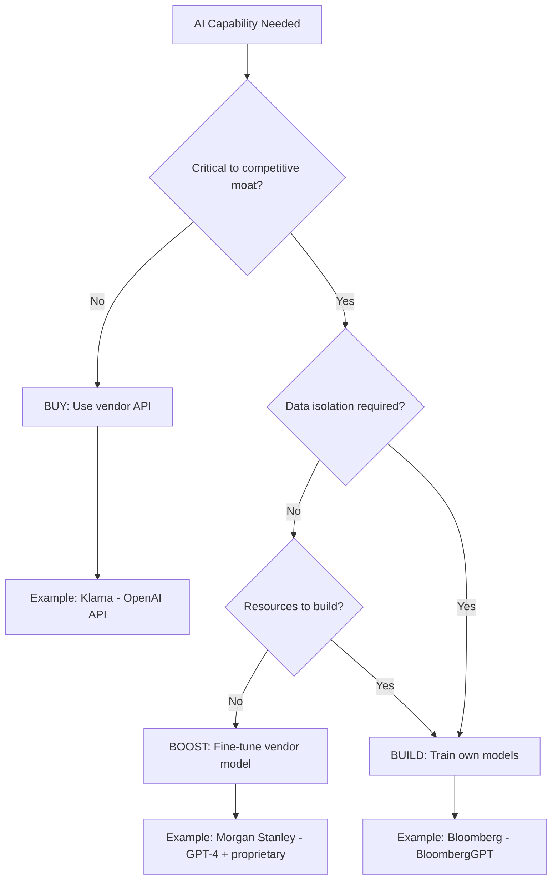
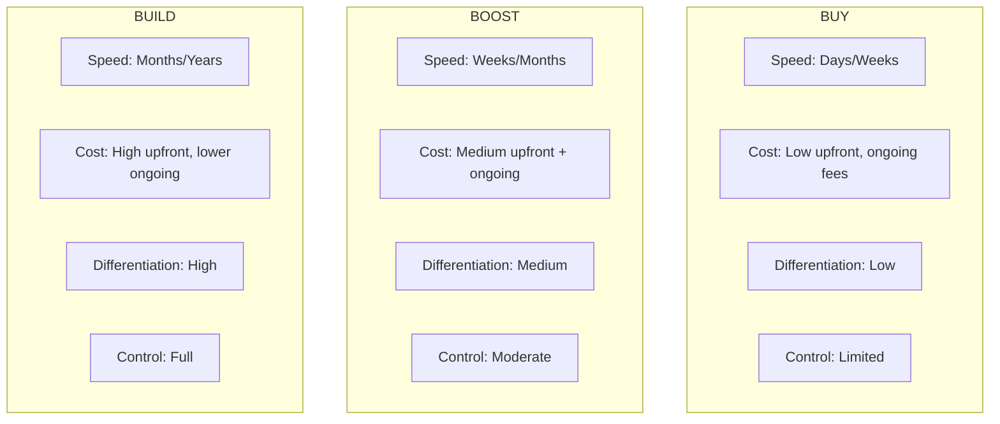
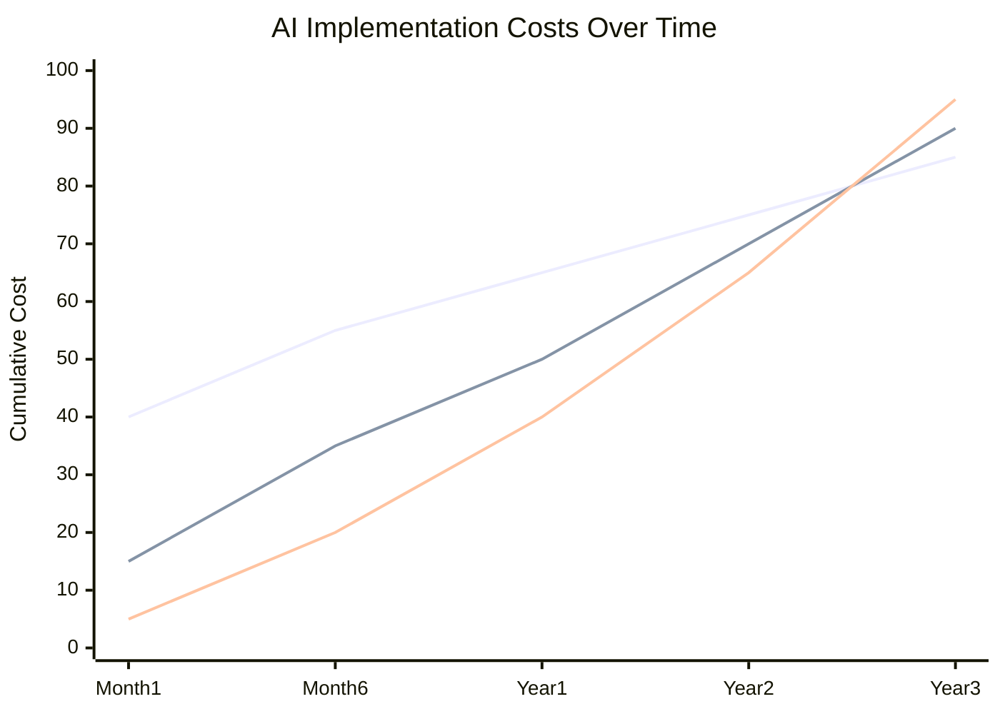

# The Build vs Buy Calculus

65% of total software costs occur after the original deployment[^mit-costs]. That number should reshape how you think about AI investments. The decision to build or buy isn't a one-time calculation. It's a commitment to a cost curve that extends years into the future.

Most build vs buy frameworks treat this as a binary choice. Build custom or purchase off-the-shelf. In AI, that framing misses the most important option.

## Three Paths, Not Two

MIT Sloan researchers identified a more useful framework: Buy, Boost, or Build[^mit-framework].

Buying means renting someone else's intelligence—vendor AI solutions as-is, fast deployment, proven capabilities, limited differentiation.

Boosting takes that rented intelligence and customizes it—enhancing vendor models with your proprietary data through fine-tuning, RAG pipelines, and custom integrations. You get speed from the base model plus differentiation from your data.

Building starts from scratch. Training your own models gives maximum control, maximum cost, maximum complexity.

The path you choose depends on three questions: How critical is this capability to your competitive advantage? How sensitive is the data involved? How fast do you need to move?

The following decision tree shows how these questions lead to different paths:

Let's see how real companies answered these questions.

---

## The Buy Path: Klarna's $40 Million Bet

Klarna didn't build their AI customer service system. They bought OpenAI's models and deployed them directly.

The results in the first month: 2.3 million conversations handled—66% of all customer service chats. Resolution time dropped from 11 minutes to 2 minutes, an 81% reduction. The system performed the equivalent work of 700 full-time agents[^klarna-results].

Projected profit improvement: $40 million in 2024.

Why did buy make sense? Customer service wasn't Klarna's competitive moat. Their advantage comes from their buy-now-pay-later product, merchant relationships, and risk models. The AI capability they needed was "answer customer questions quickly and accurately." That's exactly what foundation models excel at out of the box.

Klarna didn't need custom models. They needed fast deployment of proven capability.

When AI isn't your moat, buy speed instead of building differentiation.

---

## The Build Path: Bloomberg's Strategic Bet

Bloomberg spent $3.5–8 million training BloombergGPT, a 50-billion parameter model[^bloomberg-cost]. Why build when you could buy?

David Rosenberg, Bloomberg's ML team lead: "Using an API like OpenAI's is not suitable for us: we have data we don't want to send out"[^bloomberg-quote]. Their competitive advantage *is* their proprietary financial data. Sending it to external APIs would share the core of their business with a vendor.

The build process required a 9-person team and restarts due to bugs. But the model now serves clients paying $25,000+ annually for Bloomberg Terminal access. When your differentiation depends on data you can't share, building makes sense. When it doesn't, building is usually a mistake.

---

## The Boost Path: Morgan Stanley's Middle Ground

Morgan Stanley found the middle path. They took GPT-4 and trained it on 70,000+ proprietary research reports, analyst notes, and internal knowledge[^morgan-approach].

The result: 98% of advisor teams actively use the tool. A Morgan Stanley executive described the outcome: "This technology makes you as smart as the smartest person in the organization"[^morgan-quote].

This is the boost strategy in action. Morgan Stanley didn't have the resources or timeline to build from scratch like Bloomberg. They also couldn't use generic AI—their advisors need access to proprietary research that no vendor model contains.

The boost approach gave them differentiation (only Morgan Stanley has their specific research corpus) without the cost and complexity of training from scratch.

This is the path most companies should seriously consider. It offers the best of both worlds: vendor-grade model quality plus your unique data advantage. The catch is you still depend on a vendor for the base model—if they change pricing or capabilities, you're exposed.

---

## The Decision Framework

Think of it like housing: **Buy** when you need a place to stay quickly (speed over differentiation). **Boost** when you want to renovate—vendor foundation plus your custom touches. **Build** when you're constructing something unique that defines your identity.

Each path involves distinct tradeoffs across speed, cost, differentiation, and control:

The market is already shifting. Menlo Ventures found that 76% of AI use cases are now purchased versus 47% in 2024[^menlo-data]. As foundation models improve, the bar for when building makes sense keeps rising. Stop asking "can we build this?" Start asking "should we?"

---

## The Inversion

In AI, the traditional build vs buy calculus sometimes inverts.

Old logic: building takes 18 months and $2M; buying takes 3 months and $200K.

New logic: with foundation models, you can prototype in days what would take months to procure, integrate, and customize from a vendor. Notion rebuilt their entire agent system architecture to leverage reasoning models, achieving 100%+ improvement on multi-step structured tasks[^notion-quote]. The inversion works when prompt engineering plus a thin integration layer can accomplish what once required months of ML engineering.

---

## The Hidden Cost

Remember: 65% of total software costs occur after deployment. But those costs look very different depending on your path.

The following chart illustrates how costs accumulate over time for each approach:

**Buy costs** scale with vendor pricing power. You're locked into their roadmap, their pricing changes, their deprecation decisions. When OpenAI increased GPT-4 Turbo prices, every company that had built on top absorbed the hit or scrambled to migrate. That's not failure—it's the trade-off you accept for speed.

**Boost costs** split between vendor fees and your maintenance burden. You own the fine-tuning pipeline, the RAG infrastructure, the prompt engineering. Morgan Stanley doesn't just pay OpenAI—they pay for the 70,000+ document processing system, the indexing, the retrieval optimization, the ongoing curation. The benefit is differentiation. The cost is complexity you can't outsource.

**Build costs** front-load dramatically but give you full ownership. Bloomberg's $3.5-8 million training investment bought them freedom from vendor lock-in and the ability to improve their model on their timeline. Annual maintenance for enterprise AI systems runs $5,000-$20,000 monthly, plus compliance costs of $10,000-$100,000 annually[^maintenance-costs]. High? Yes. But predictable and under your control.

By 2026, Gartner projects that 80% of independent software vendors will embed AI into their applications[^gartner-embed]. AI will be everywhere. The only variable: will you own yours or rent it?

DeepSeek's emergence reinforced the key insight: AI success is about strategic application, not building the biggest model[^deepseek-insight]. Choose the path that fits your strategy, not the one that sounds impressive.

---

## The Path Forward

I've watched teams build when they should buy—chasing differentiation that doesn't matter to customers. Or buy when their entire value proposition depends on AI capabilities they don't control.

Three questions: Is this capability core to your moat? Does the data require isolation? Do you have the resources to execute?

This decision isn't permanent. Many companies start with buy, graduate to boost as they accumulate proprietary data, and occasionally build capabilities that become truly differentiating. Start where you can move fastest. Evolve as your data assets grow.

## References

[^mit-costs]: MIT Sloan Management Review, Build, Buy, or Boost — [sloanreview.mit.edu](https://sloanreview.mit.edu/article/successful-ai-implementation-build-buy-or-boost/)

[^mit-framework]: MIT Sloan Management Review, Build, Buy, or Boost Framework — [sloanreview.mit.edu](https://sloanreview.mit.edu/article/successful-ai-implementation-build-buy-or-boost/)

[^klarna-results]: Klarna AI Assistant Press Release 2024 — [klarna.com](https://www.klarna.com/international/press/klarna-ai-assistant-handles-two-thirds-of-customer-service-chats-in-its-first-month/)

[^bloomberg-cost]: Bloomberg Engineering, BloombergGPT Development — [bloomberg.com](https://www.bloomberg.com/company/press/bloomberggpt-50-billion-parameter-llm-tuned-finance/)

[^bloomberg-quote]: Bloomberg ML Team, David Rosenberg — [bloomberg.com](https://www.bloomberg.com/company/stories/bloomberg-ai-machine-learning/)

[^morgan-approach]: Morgan Stanley AI Implementation — [morganstanley.com](https://www.morganstanley.com/articles/morgan-stanley-ai-assistant)

[^morgan-quote]: Morgan Stanley Executive on AI — [cnbc.com](https://www.cnbc.com/2024/03/01/morgan-stanley-using-openai-gpt4-for-research.html)

[^menlo-data]: Menlo Ventures AI Survey 2025 — [menlovc.com](https://menlovc.com/2025-the-state-of-generative-ai-in-the-enterprise/)

[^notion-quote]: Notion AI Architecture Updates — [notion.so](https://www.notion.so/blog/notion-ai)

[^deepseek-insight]: DeepSeek Technical Report — [deepseek.com](https://www.deepseek.com/)

[^maintenance-costs]: Build vs Buy AI Cost Analysis 2025 — [netguru.com](https://www.netguru.com/blog/build-vs-buy-ai)

[^gartner-embed]: Gartner AI Survey 2024 — [gartner.com](https://www.gartner.com/en/articles/deploying-ai)

---

[← Previous: The 7 Mental Models of AI-First Thinking](./02-the-7-mental-models.md) | [Chapter Overview](./README.md) | [Next: Data as Product →](./04-data-as-product.md)
