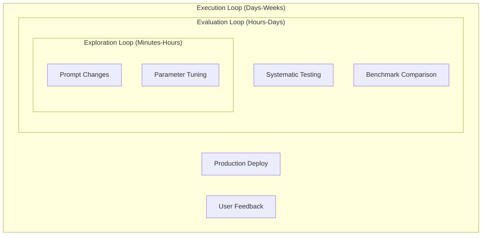

# Iteration Speed and Learning Loops

Counter-Intuitive Truth: The speed of iteration matters more than the quality of iteration[^ooda-quote].

This runs against every instinct trained product teams have developed. Measure twice, cut once. Ship when it's ready. In AI, that logic inverts. The faster you iterate, the greater your chances of success—not because you'll be luckier, but because you'll learn faster. In a domain where answers emerge through experimentation rather than specification, learning speed is the competitive variable that matters.

---

## Why Speed Compounds in AI

The data flywheel from [Section 4](./04-data-as-product.md) only spins if you're iterating. Data accumulation without model improvement is just storage costs. The flywheel turns when usage generates signal, signal improves the model, and improved models drive more usage—but that middle step requires iteration.

AI-first companies build systems that minimize the time between observation and improvement. Not quarterly retraining cycles. Continuous iteration, sometimes measured in hours.

Meta's engineering teams identified a specific metric: Time to First Batch (TTFB)—how long it takes to get initial training results after making a change[^meta-ttfb]. By attacking slow build times, they reduced overhead by double-digit percentages. Meta now measures AI engineering productivity in iterations per day, not lines of code.

The math is brutal. A team that iterates twice daily learns 60 times a month. A team that iterates weekly learns 4 times. Over a year: 720 learning cycles versus 52. Same talent, same resources, 14x more learning.

---

## The Three Loops Framework

Braintrust crystallized iteration into three interconnected loops[^braintrust-loops]:

**Exploration** is the tightest loop—changing prompts, adjusting parameters, testing hypotheses. **Evaluation** applies test inputs systematically across your problem space. Slow evaluation kills exploration; if you wait days to learn whether your experiment worked, you'll stop experimenting. **Execution** deploys to production where real users generate real signal.

The insight: these loops constrain each other. Fast exploration is worthless if evaluation takes weeks. The slowest loop sets your learning pace.

---

## Vercel's Daily Iteration Machine

Vercel's v0 iterates on prompts "almost daily" using systematic evaluations[^vercel-evals]. They use code-based grading for specification compliance, human grading for subjective quality, and LLM-based grading for scale.

The counterintuitive part: they intentionally keep some evaluations failing. Not because they ship broken products—safety evaluations maintain 100% pass rates. But they add new failing prompts specifically to drive improvement. A perfectly passing test suite means you've stopped learning.

---

## The 20x Acceleration

Autobound achieved a 20x acceleration in their LLM iteration cycle—what previously took weeks now takes hours[^autobound-speed]. The key was testing prompts on real-world scenarios using live customer data, not synthetic tests. When foundation models collapse the exploration loop, the bottleneck shifts to how fast you can evaluate on real scenarios.

---

## The Data-Centric Shift

The AI research community has reached a quiet consensus: "any reasonable choice of architecture and parameterization is likely to do a good job learning the data"[^data-centric].

Marginal returns from model tweaking are diminishing. Marginal returns from data improvement are not.

This changes what you iterate on. Fast-moving teams focus on data quality, curation, and collection strategies. Stripe iterates rapidly on training data for fraud detection, processing billions of transactions and feeding learnings back in days rather than months[^stripe-data]. Can you add new training examples in hours instead of weeks? The teams that answer "yes" are compounding fastest.

---

## The Speed Advantage

The failure mode: speed without direction is chaos. Fast iteration without evaluation loops is just thrashing. The discipline is pairing speed with feedback—Meta measured what faster training produced, Vercel maintains rigorous evaluation pipelines. The goal isn't iteration for its own sake. It's iteration that generates learning.

Stripe demonstrates the payoff. Their fraud detection models improved from 59% to 97% detection rates—improvements they describe as happening "overnight" after deploying new model architectures[^stripe-overnight]. The infrastructure that enables overnight model swaps is itself a competitive advantage. Most companies take months to deploy model updates. Stripe measures in hours.

What's your iteration speed? Not how fast you can ship—how fast you can learn. If the answer is "weeks" at any step, you've identified your constraint.

## References

[^ooda-quote]: OODA Loop Applied to Machine Learning — [medium.com](https://medium.com/@kozyrkov/the-most-useful-advice-for-machine-learning-36d3b95e9e37)

[^meta-ttfb]: Meta Engineering on ML Iteration Speed — [engineering.fb.com](https://engineering.fb.com/ml-applications/)

[^braintrust-loops]: Braintrust AI Development Framework — [braintrustdata.com](https://www.braintrustdata.com/blog/evaluation-driven-development)

[^vercel-evals]: Vercel v0 Evaluation Strategy — [vercel.com](https://vercel.com/blog/how-we-develop-v0)

[^autobound-speed]: Autobound LLM Development — [autobound.ai](https://www.autobound.ai/)

[^data-centric]: Data-Centric AI Movement — [datacentricai.org](https://datacentricai.org/)

[^stripe-data]: Stripe ML Infrastructure — [stripe.com](https://stripe.com/blog/machine-learning-infrastructure)

[^stripe-overnight]: Stripe Payments Foundation Model — [stripe.com](https://stripe.com/blog/using-ai-optimize-payments-performance-payments-intelligence-suite)

---

[← Previous: Data as Product](./04-data-as-product.md) | [Chapter Overview](./README.md) | [Next: Human-AI Collaboration →](./06-human-ai-collaboration.md)
