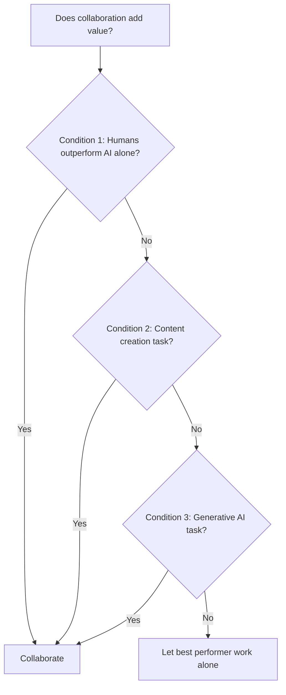
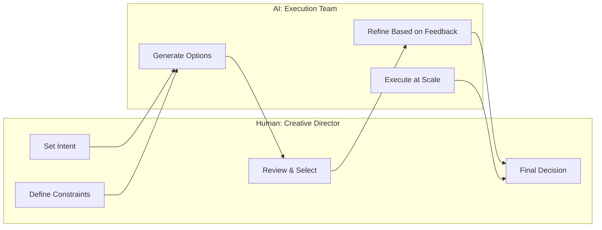

# Human-AI Collaboration

Human-AI collaboration often doesn't work.

MIT's Center for Collective Intelligence reviewed over 100 studies on human-AI teaming and found that, on average, human-AI combinations do not outperform the best human-only or AI-only systems[^mit-review]. That's not a typo. The research, published in *Nature Human Behaviour*, challenges the assumption that throwing humans and AI together automatically produces something better than either alone.

This should make you pause before assuming "AI + human" is always the answer. But it should also make you curious: when does collaboration actually work?

---

## When Collaboration Actually Wins

The MIT research identifies three conditions where human-AI collaboration succeeds[^mit-review]:

**First, tasks where humans outperform AI alone.** If AI already does the job better, adding human oversight introduces friction without improving outcomes. Watch how many companies add human review steps purely for liability theater.

**Second, tasks involving content creation.** Generative tasks—writing, design, ideation—benefit from collaboration because they require judgment, taste, and context that AI struggles to replicate.

**Third, creation tasks specifically involving generative AI.** AI generates options rapidly; humans select and refine based on criteria the AI can't fully model.

Notice what's absent: routine classification, data processing, pattern recognition at scale. For those tasks, collaboration often adds cost without adding value.

---

## Partner Under Direction, Not Teammate

Most teams stumble because they treat AI like another team member.

Carnegie Mellon's COHUMAIN framework offers a crucial correction: see AI as a partner that works under human direction—capable of strengthening existing capabilities but not of replacing human judgment about what matters[^cohumain]. Teammates negotiate priorities. Partners under direction execute within boundaries you set.

---

## The Efficiency Trap

Figma surveyed 2,500 product builders across seven countries and found that 84% of designers now collaborate with developers at least weekly[^figma-survey]. AI has compressed the gap between concept and prototype.

But here's the uncomfortable finding: fewer than half felt AI makes them *better* at their jobs. More efficient, yes. But not more effective[^figma-survey].

AI makes you faster at producing output, not better at producing outcomes. Speed without judgment compounds mistakes.

---

## The Creative Director Model

Think of a film director working with a visual effects team. The director doesn't render each frame—they set creative intent, review options, and make decisions. The VFX team executes at scale. That's the emerging model for human-AI collaboration.

Adobe describes designers becoming "creative directors for an incredibly fast, versatile, but literal-minded AI assistant"[^adobe-firefly]. The literal-minded part matters. AI takes instructions precisely. It doesn't infer intent or push back on bad briefs. Humans must specify clearly or get precisely what they asked for, which may not be what they wanted.

---

## Designing for Complementarity

Two sources of complementarity make collaboration work[^mit-review]:

**Information asymmetry.** Humans know context, history, relationships, unwritten rules. AI knows patterns across data humans couldn't process. When both matter, collaboration adds value.

**Capability asymmetry.** AI processes vast data quickly and maintains consistency. Humans exercise judgment in novel situations and take accountability.

GitHub Copilot illustrates this. It labels outputs as "suggestions," not answers[^copilot-patterns]. Acceptance rates vary: grammar corrections get high acceptance, tone suggestions require consideration. The interface makes uncertainty visible.

The numbers show what happens when complementarity works: Copilot achieves a 78% task completion rate (versus 70% without), with developers completing tasks 55% faster[^copilot-speed]. But notice what's happening—the AI doesn't replace developer judgment about whether a suggestion fits. It accelerates where AI excels while leaving architectural decisions to humans. That's complementarity by design.

---

## The Augmentation Mindset

You're not building AI to replace people. You're building AI to make people capable of things they couldn't do alone—not faster at what they already did, but newly capable of what was previously impossible.

Consider Shopify. In April 2025, CEO Tobi Lutke issued a mandatory AI policy: before requesting additional headcount, employees must demonstrate why AI cannot handle the task[^shopify-policy]. That sounds like replacement thinking. But look at the framing: "Using AI well is a skill that can be developed. Start by using it for everything." The goal wasn't fewer people—it was augmented people who accomplish more per capita.

Research shows organizations best able to adopt AI are innovative, experimental, learning-oriented, supportive, and collaborative[^org-culture]. That's not coincidence. Collaboration requires psychological safety—the confidence that using AI won't threaten job security. Without that foundation, humans won't contribute their half of the complementarity equation. [Chapter 8](../../part-3-operating/08-teams-for-ai-first-companies/README.md) explores how to build teams for this kind of collaboration.

Replacement thinking asks "will AI replace us?" Augmentation thinking asks: "How do we design collaboration so both human and AI contribute what they're best at?"

Get that design right, and you build something neither could build alone.

## References

[^mit-review]: MIT Center for Collective Intelligence, Human-AI Collaboration Review — Published in *Nature Human Behaviour*, 2024 — [nature.com](https://www.nature.com/articles/s41562-024-02024-1)

[^cohumain]: Carnegie Mellon COHUMAIN Framework — [cmu.edu](https://www.cmu.edu/research/)

[^figma-survey]: Figma AI & Design Survey 2025 — [figma.com](https://www.figma.com/)

[^adobe-firefly]: Adobe Firefly Integration Research — [adobe.com](https://www.adobe.com/products/firefly.html)

[^copilot-patterns]: GitHub Copilot Research — [github.blog](https://github.blog/engineering/)

[^copilot-speed]: GitHub Copilot Impact Study — [github.blog](https://github.blog/ai-and-ml/github-copilot/research-quantifying-github-copilots-impact-on-code-quality/)

[^shopify-policy]: Shopify AI-First Policy Memo, April 2025 — [theverge.com](https://www.theverge.com/2025/4/7/24424184/shopify-ai-first-hiring-policy)

[^org-culture]: MIT/Carnegie Mellon Research on AI Adoption Prerequisites — [cmu.edu](https://www.cmu.edu/research/)

---

[← Previous: Iteration Speed and Learning Loops](./05-iteration-speed-and-learning-loops.md) | [Chapter Overview](./README.md)
