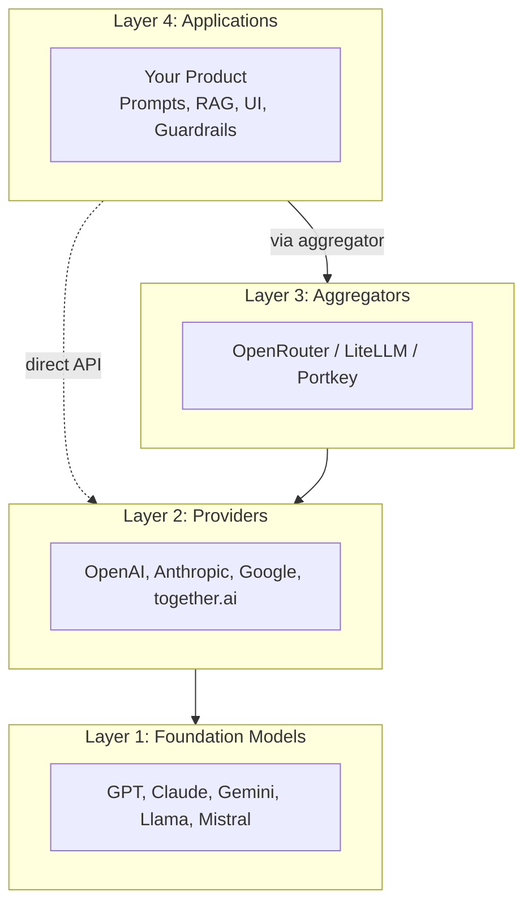
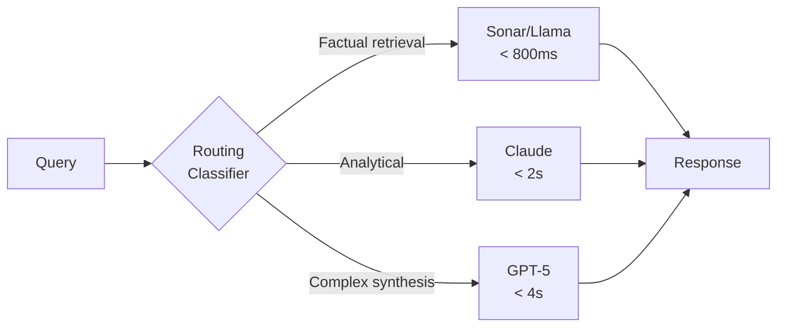

# The 4-Layer AI Stack

Building AI products today means choosing where to enter a stack that gets more crowded every month. You're not just picking a model—you're positioning yourself in an ecosystem.

When Perplexity launched in 2022, they had a handful of model options. Now they route queries across dozens of models from multiple providers, achieving 91.3% optimal model selection accuracy using reinforcement learning[^kashish]. That evolution from "pick a model" to "coordinate a model ensemble" captures what most AI-first companies eventually face.

Before you can make smart decisions about providers, aggregators, or when to fine-tune, you need a mental model for the landscape itself. Think of it like a building with four floors. You can enter on any floor, but you need to understand what's above and below you.

---

## Layer 1: Foundation Models

This is the basement where raw AI capabilities live. GPT-4, Claude, Gemini, Llama, Mistral, DeepSeek—these are the engines that actually do the thinking.

Foundation models vary wildly in:
- **Capability** - reasoning depth, coding ability, creative generation
- **Context windows** - from 128K to 10 million tokens
- **Modality** - text-only versus multimodal (images, audio, video)
- **Openness** - proprietary APIs versus downloadable weights

The model landscape changes faster than any other part of the stack. What's frontier-class today is commodity tomorrow. Llama went from "impressive open-source attempt" to "production-ready for most use cases" in 18 months. Plan accordingly.

---

## Layer 2: Providers

Providers sit between you and the models. They handle the infrastructure, billing, rate limits, and enterprise features.

Some providers are first-party—OpenAI serving GPT, Anthropic serving Claude, Google serving Gemini. Others are third-party hosts like together.ai, Fireworks, or Replicate that serve open-source models with different cost and performance trade-offs.

What this layer adds:
- API access and authentication
- Rate limiting and quota management
- Enterprise features (SLAs, compliance certifications, dedicated support)
- Sometimes, fine-tuning capabilities

The common misconception: providers are interchangeable pipes to the same models. They're not. A healthcare company chose Claude's direct API over an aggregator specifically for guaranteed throughput under contract SLAs and compliance assurances through direct vendor engagement[^gynger]. The provider relationship mattered more than marginal cost savings.

---

## Layer 3: Aggregators

Aggregators give you a single API that routes to multiple providers. OpenRouter, LiteLLM, Portkey—they promise vendor flexibility and automatic failover.

What this layer adds:
- **One API, many models** - switch from Claude to GPT by changing a parameter
- **Automatic failover** - if one provider goes down, traffic routes elsewhere
- **Cost optimization** - route different query types to different price points
- **Observability** - unified logging and monitoring across providers

The trade-off is real. OpenRouter adds roughly 25-40ms per request due to the routing layer—modest for most applications, but noticeable for real-time interactions[^gynger]. That latency overhead might not matter for a document summarizer. It matters for an interactive coding assistant where users notice every delay.

An edtech startup called AI-Tutor used OpenRouter during 300% growth to dynamically route based on query complexity—cheaper open-source models for basic queries, Claude for complex tutoring sessions[^gynger]. The flexibility let them offer different pricing tiers without maintaining multiple codebases.

Both approaches work. The question is which constraints you're solving for.

---

## Layer 4: Applications

This is your floor. Where AI capabilities become your product.

The application layer includes:
- Your business logic and product features
- Prompt management and optimization
- Context management (RAG, conversation history)
- User interface and experience
- Safety guardrails and output validation

Most of your differentiation should live in this layer, not in model selection. Perplexity's real moat isn't access to GPT-5 or Claude—it's their Vespa-powered ranking stack, their fine-tuned Sonar models, and orchestration logic that turns multiple commodity models into a coherent product[^bytebytego].

---

## Choosing Your Entry Point

Where should you enter this stack? It depends on your constraints.

**Start at the provider level if:**
- You have specific compliance or security requirements
- You need guaranteed SLAs for enterprise customers
- Your use case demands the latest capabilities from a single model family
- You have engineering capacity to manage multiple integrations

**Start at the aggregator level if:**
- You're still figuring out which models work best for your use case
- Cost optimization across query types matters
- You want protection against provider outages
- Speed to market trumps marginal performance gains

**The hybrid approach:** Use aggregators for exploratory or low-priority workloads while reserving direct APIs for core features requiring highest reliability[^gynger]. This is increasingly common—abstract where flexibility helps, go direct where performance or compliance demands it.

Your requirements will change. The startup that's fine with aggregator latency today might have enterprise customers demanding direct provider relationships tomorrow. The company that committed to a single provider might watch their vendor raise prices 40% or deprecate their model.

The winning move isn't picking the "right" layer. It's architecting so you can move between layers without rewriting your product.

---

## The Perplexity Lesson

Perplexity's architecture embodies this flexibility. A 38-person engineering team competes with Google by being strategic about where they build versus buy[^bytebytego]. They outsourced distributed search to Vespa (a "solved problem"), then focused engineering on differentiation: their ROSE inference engine hits 23,000 tokens/second on Llama 3-70B, and their routing classifier achieves 91.3% optimal model selection.

They use what they call the "smallest viable model" approach--routing queries to the cheapest model that will deliver the required quality. Their 200 billion URL index and 400+ petabytes of hot storage feed into routing decisions that consider query complexity, user tier, and latency requirements[^bytebytego].

Their routing classifier assigns latency budgets to different model tiers:
- Sonar (their fine-tuned Llama 70B): factual retrieval in under 800ms
- Claude: analytical reasoning in under 2 seconds
- GPT-5: complex creative synthesis in under 4 seconds[^kashish]

Free users get Mistral Large and Gemini Flash. Pro users unlock Claude and GPT-5. The same infrastructure serves both—just different routing logic.

This isn't just about cost. It's about aligning capability to need. Why burn tokens on GPT-5 for a simple factual lookup when a fine-tuned Llama handles it faster and cheaper?

> **What This Means For You:** Perplexity's smallest-viable-model routing started as cost optimization. It became a competitive moat. The infrastructure you build for flexibility compounds.

---

## What's Next

With the four layers mapped, we'll spend the rest of this chapter going deeper:
- Section 2 covers the foundation model landscape—who the players are and how to think about capability differences
- Section 3 examines providers and when direct relationships matter
- Section 4 explores aggregators and routing strategies in detail
- Section 5 gives you the six questions to ask before any stack decision

The stack keeps evolving. The framework for thinking about it doesn't have to.

## References

[^kashish]: LinkedIn. [- Kashish Vaid, Technical Architecture of Perplexity](https://www.linkedin.com/pulse/technical-architecture-operational-mechanics-perplexitys-kashish-vaid-bjgkc)

[^gynger]: Gynger. [Blog, Building Your AI Engineering Tech Stack](https://www.gynger.io/resources/blog/building-your-ai-engineering-tech-stack-a-cost-effective-approach)

[^bytebytego]: ByteByteGo,. [How Perplexity Built an AI Google](https://blog.bytebytego.com/p/how-perplexity-built-an-ai-google)

---

[Chapter Overview](./README.md) | [Next: Foundation Models Landscape →](./02-foundation-models-landscape.md)
