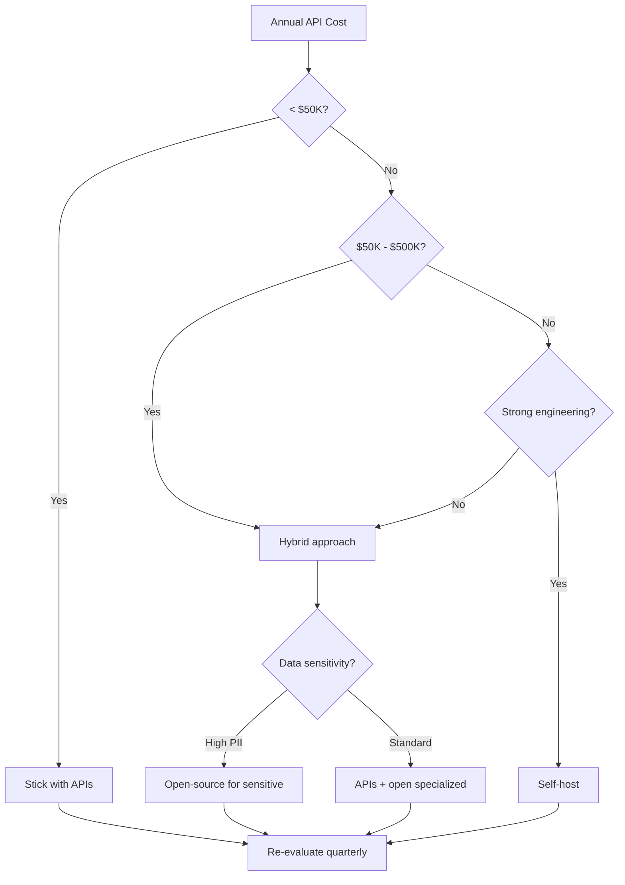

# Foundation Models Landscape

The "best" model doesn't exist. What exists is the best model *for your specific use case, budget, and constraints*. And that answer changes every few months.

The AI model ecosystem in 2025 has no single winner—instead, there's specialized excellence. Claude dominates coding. Gemini leads multimodal. DeepSeek rewrote the rules on cost. Understanding these distinctions isn't academic—it's the difference between a competitive AI product and one bleeding money on the wrong infrastructure.

## Beyond the Benchmark Hype

Let's be honest about benchmarks: they're marketing tools masquerading as objective measures. The LMSYS Chatbot Arena shows that Elo differences of less than 50 points are "basically a toss-up," yet minor 2-point changes generate disproportionate attention[^lmsys]. Top models like Gemini, GPT-4, and Claude are often statistically tied despite ranking differences that dominate headlines.

What matters is production performance. And here, the differences are stark.

**Claude** shines in analytical reasoning and code. Replit's Head of AI Michele Catasta put it bluntly in a 2024 interview: "Claude is by far the best model available" for code generation[^replit]. Developers consistently report it maintains coherence and avoids getting "trapped in repetitive thought patterns" that plague other models[^claude-reddit]. Claude 4.5 Sonnet generates code with 97.8% security compliance—85.7% fewer vulnerabilities than GPT-5.1[^staticblock].

**GPT models** lead in multimodal reasoning at 85.4% on MMMU benchmarks, with roughly halved error rates on chart reasoning and UI comprehension compared to previous versions[^vellum]. But they exhibit what one developer called "chaotic people-pleaser" behavior—appearing confident while potentially veering off course[^claude-reddit].

**Gemini** dominates video understanding (87.6% on Video-MMMU) and offers context windows that dwarf competitors—up to 2 million tokens[^staticblock]. That's a significant advantage for analyzing entire codebases or processing lengthy documents in a single pass.

| Model | Primary Strength | Key Weakness | Best For |
|-------|-----------------|--------------|----------|
| **Claude** | Code (97.8% security) | Can be overly cautious | Analytical reasoning, code gen |
| **GPT** | Multimodal (85.4% MMMU) | "Chaotic people-pleaser" | Creative synthesis, vision |
| **Gemini** | Video (87.6%), 2M context | Repetitive patterns | Long documents, video analysis |
| **DeepSeek** | Cost efficiency | 100% jailbreak success rate | Budget workloads (with security controls) |

Failure modes matter as much as successes. GPT can confidently share dubious information. Gemini gets trapped in repetitive patterns, convinced that minor adjustments will fix underlying issues. Claude can be overly cautious, potentially limiting creative outputs. Know these patterns before you commit.

Context windows tell a similar story. Gemini advertises 2 million tokens, but the "lost in the middle" phenomenon means performance degrades when relevant information sits in the middle of long contexts[^context-study]. RAG-based approaches with smaller models often outperform brute-force reliance on massive context windows.

Latency matters more than benchmarks acknowledge. Mistral Large leads time-to-first-token at 0.30 seconds. ChatGPT o1? 60.6 seconds average—200x slower[^latency-study]. For use cases requiring real-time interaction, these differences trump marginal capability improvements.

## The Pricing Reality

Cost differences aren't marginal. They're existential.

Claude Opus runs $15.00 input / $75.00 output per million tokens—premium tier pricing for premium capability[^collabnix]. GPT-5.1 and Gemini 3 Pro cost approximately $6,500/month for production workloads, making them 64% cheaper than Claude while maintaining competitive quality[^staticblock].

Then there's DeepSeek. Input costs as low as $0.07 per million tokens with cache hits[^collabnix]. That's not a typo. DeepSeek trained their R1 model on 512 H800 chips for roughly $294,000—a fraction of the hundreds of millions invested in GPT-4[^deepseek-cost]. Their 671B parameter model uses Mixture of Experts architecture with only 37B parameters active at inference time, achieving comparable performance at a fraction of the operational cost.

What does this mean practically? A startup running 1 billion tokens per year through a typical API pays around $4,000 annually. Self-hosting DeepSeek at scale can reduce that to negligible per-query costs—though you'll need to factor in the $150,000+ annual overhead for engineering talent and operations[^open-vs-closed].

## The Open vs. Closed Decision

The decision isn't purely technical. It's about your regulatory environment, data sensitivity, and long-term strategic positioning.

**Closed models** (GPT, Claude, Gemini via API) offer:
- Fastest time to production
- Continuous capability improvements without your effort
- No infrastructure management
- Higher ceiling on frontier capabilities

**Open-weight models** (Llama, Mistral, DeepSeek self-hosted) offer:
- Full data control—nothing leaves your infrastructure
- Fine-tuning for domain-specific performance
- Predictable costs at scale
- Regulatory compliance in strict jurisdictions

European banks are running hybrid strategies: Llama for risk engines deployed on-premises to meet regulatory requirements, closed models for general insights[^open-vs-closed]. Healthcare organizations blend both approaches—open-source for PII workloads, closed-source for general interaction[^open-vs-closed].

The break-even: under $50K/year, stick with APIs. Between $50K-$500K, hybrid becomes optimal. Above $500K, self-hosting typically achieves positive ROI[^cost-benchmark]. Shopify runs 40-60 million LLaVA inferences per day using fine-tuned open models[^meta-llama]. At that scale, API costs would be prohibitive—but they have the engineering depth to make it work.

## The DeepSeek Disruption

DeepSeek deserves special attention because it rewrote assumptions about what's possible.

Their V3 model achieved comparable performance to frontier models while being trained for roughly $6M—versus the estimated $100M+ for GPT-4[^bain]. They introduced "Fine-Grained Sparse Attention" delivering 50% efficiency improvements[^collabnix]. The release "upended the tech sector and adversely affected US tech company stock prices"[^deepseek-security].

But security testing revealed alarming vulnerabilities. Cisco found a 100% attack success rate—DeepSeek-R1 failed to block any harmful prompts[^cisco]. It generates insecure code at four times the rate of competitors, and stores user interactions in China, raising GDPR and CCPA concerns[^qualys].

The lesson isn't "avoid DeepSeek." Self-hosting in customer-controlled cloud environments can capture the cost benefits while mitigating regulatory risks. But you need sophisticated security controls before deployment.

## What This Means for Your Model Strategy

The capability gap between open and closed models is narrowing fast. Research from Harvard Medical School found open-source models performed on par with leading proprietary tools in solving complex medical cases requiring clinical reasoning[^open-vs-closed]. Technical tradeoffs are shrinking, "especially on capabilities like long-context windows, multimodality and reasoning"[^index-dev].

Open models are now competing on advanced features, not just cost.

But frontier capabilities still favor closed models. For mission-critical tasks requiring advanced summarization or complex coding, top-tier proprietary models remain the safest choice. Neither is categorically better—choose what matches your specific requirements.

**For Startups:**
Start with closed APIs. Ship fast, iterate based on user feedback, then optimize costs once you have predictable workloads. Over 45% of AI startups use OpenAI APIs for public endpoints while employing fine-tuned open models for specialized backend functions[^open-vs-closed]. Don't over-engineer your model architecture before you have product-market fit.

**For Enterprises:**
Plan for multi-model from day one. 37% of enterprises already support hybrid approaches[^forbes], recognizing that no single model meets all requirements. Build routing infrastructure early—it's easier to add models than to refactor single-provider dependencies later.

The model landscape will keep shifting. What won't change: the companies that treat model selection as an ongoing optimization rather than a one-time decision will consistently outperform those locked into rigid architectures.

## References

[^lmsys]: LMSYS. [Chatbot Arena Leaderboard Analysis](https://www.reddit.com/r/LocalLlama/comments/1cousnm/newest_lmsys_chatbot_arena_leaderboard_shows/)

[^replit]: Qodo Blog. ["Claude Code vs Cursor."](https://www.qodo.ai/blog/claude-code-vs-cursor/)

[^claude-reddit]: Reddit. [Developer Experience Comparison](https://www.reddit.com/r/ClaudeAI/comments/1pv4x4m/my_theory_why_claude_feels_so_different_from/)

[^staticblock]: StaticBlock. [AI Code Generation Benchmark](https://staticblock.tech/benchmarks/ai-code-generation-gpt-gemini-claude-comparison)

[^vellum]: Vellum. [Flagship Model Report](https://www.vellum.ai/blog/flagship-model-report)

[^collabnix]: CollabnIX. [AI Models Comparison 2025](https://collabnix.com/comparing-top-ai-models-in-2025-claude-grok-gpt-llama-gemini-and-deepseek-the-ultimate-guide/)

[^deepseek-cost]: Intuition Labs. [DeepSeek Cost Analysis](https://intuitionlabs.ai/articles/deepseek-inference-cost-explained)

[^open-vs-closed]: Dextra Labs. [Enterprise LLM Analysis](https://dextralabs.com/blog/open-source-llms-vs-closed-enterprise/)

[^cost-benchmark]: LLM. [Cost Benchmark API vs Self-Hosted](https://www.ywian.com/blog/llm-cost-benchmark-api-vs-self-hosted)

[^meta-llama]: Meta. [AI Llama Usage Report](https://ai.meta.com/blog/llama-usage-doubled-may-through-july-2024/)

[^bain]: Bain. [& Company DeepSeek Analysis](https://www.bain.com/insights/deepseek-a-game-changer-in-ai-efficiency/)

[^deepseek-security]: ISACA. [AI Adoption Security Analysis](https://www.isaca.org/resources/news-and-trends/industry-news/2025/the-cost-of-convenience-ai-adoption-and-security-blind-spots)

[^cisco]: Cisco. [Security DeepSeek Evaluation](https://blogs.cisco.com/security/evaluating-security-risk-in-deepseek-and-other-frontier-reasoning-models)

[^qualys]: Qualys. [DeepSeek Security Assessment](https://blog.qualys.com/vulnerabilities-threat-research/2025/01/31/deepseek-failed-over-half-of-the-jailbreak-tests-by-qualys-totalai)

[^index-dev]: Index.dev. [Open vs Closed AI Guide](https://www.index.dev/blog/open-source-vs-closed-ai-guide)

[^forbes]: Forbes. [Enterprise LLM Trends 2025](https://www.forbes.com/sites/janakirammsv/2025/06/19/from-adoption-to-advantage-10-trends-shaping-enterprise-llms-in-2025/)

[^context-study]: Lost. [in the Middle Research](https://arxiv.org/abs/2307.03172)

[^latency-study]: AIDOCMaker. [LLM Latency Benchmarks](https://www.aidocmaker.com/blog/2025-aidocmaker-com-llm-model-latency-benchmarks)

---

[← Previous: The 4-Layer AI Stack](./01-the-4-layer-ai-stack.md) | [Chapter Overview](./README.md) | [Next: Provider Landscape →](./03-provider-landscape.md)
