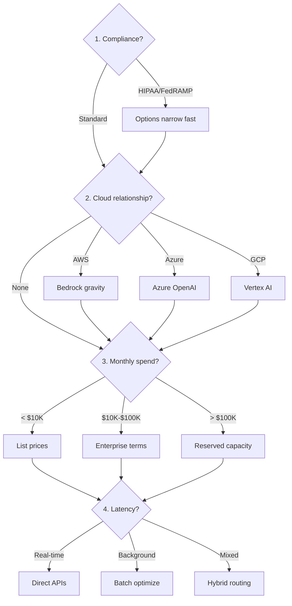

# Provider Landscape

What matters isn't the pricing table—it's what happens at 3 AM when your production system goes down, how fast you can scale when your product goes viral, and whether your enterprise clients will actually approve the vendor.

## The Big Three: What Actually Differentiates Them

The top models are converging in raw capability—that 11.9% to 5.4% gap collapse we noted in the chapter overview[^stanford-ai-index]. The top two models are now separated by 0.7%. So if raw performance no longer differentiates, what does?

**OpenAI** remains the ecosystem leader with the deepest third-party library support and ChatGPT's brand recognition. Their enterprise tier offers SOC 2 compliance, HIPAA with signed BAAs, and zero data retention[^ttms-comparison]. The downside? Roughly 99.3% uptime means about five hours of downtime per month[^runtime-uptime]—June 2024 saw a 15-hour outage from a routine GPU update; December 2024 brought a six-hour global CDN failure[^openai-status].

**Anthropic** has carved out a different position: safety-focused AI with the longest context windows and aggressive cost optimization features. Claude handles 200K token contexts as standard—useful for entire codebases or lengthy documents. Their prompt caching delivers a 90% discount on cache hits, dramatically better than OpenAI's 50% automatic caching[^cloudzero-pricing]. But reliability has been a challenge here too. Rate limit changes in mid-2025 sparked developer backlash when 5% of users suddenly found themselves throttled[^venturebeat-anthropic].

**Google Vertex AI** offers the most mature enterprise SLA structure—99.9% for training and batch prediction, with financial credits when they miss targets (10% credit for falling to 99%, 50% for dropping below 95%)[^gcp-sla]. They're the only major provider publishing hard SLA commitments. The trade-off is a steeper learning curve if you're not already in Google Cloud.

## The Hidden Costs Nobody Talks About

Pricing pages show token costs. They don't show the costs that actually matter at scale.

**Rate limits** vary wildly. OpenAI and Anthropic use tiered structures at organization and project level, but these broad buckets lack granular enterprise control[^linkedin-ratelimits]. Google's limits are more predictable. Plan for scaling before you need it—getting limits increased requires enterprise agreements that take days or weeks.

**Caching economics** are tricky. Anthropic's 90% cache hit discount sounds magical, but cache writes cost 25% *more* than base tokens. With a five-minute TTL, you need to reuse cached content at least twice just to break even[^anthropic-caching]. Any change to images, tool choices, or cached content invalidates everything.

**Batch processing** isn't free. OpenAI's Batch API offers a 50% discount on both input and output tokens[^openai-batch], but factor in the 24-hour maximum completion window and engineering time to build JSONL file creation, upload management, status polling, and error handling pipelines.

## Cloud Wrappers: When They Make Sense

You can access OpenAI through Azure OpenAI Service, Anthropic through AWS Bedrock or Google Vertex AI. Why add a middleman?

**Choose cloud wrappers when:** your enterprise has committed cloud spend and negotiated discounts, you need data residency guarantees, private networking makes direct APIs a non-starter, or procurement has pre-approved Azure/AWS but not direct providers.

**Stick with direct APIs when:** you want the newest models immediately (wrappers lag by weeks or months), you need aggressive rate limits (wrappers add their own caps), or variable usage makes committed cloud spend impractical.

GitHub Copilot's 2025 transition from GPT-4o to GPT-4.1 illustrates how even established tools actively migrate between models[^github-copilot]. The migration happened transparently to users—because their architecture supported model swaps without rewrites.

## The Real Decision Framework

Forget the feature matrices. What actually drives provider selection in production:

**1. Your compliance requirements eliminate options.** If you need HIPAA with signed BAAs, your shortlist just got shorter. If you need FedRAMP, shorter still. Start here.

**2. Your existing cloud relationships create gravity.** A company spending millions on AWS has procurement paths, negotiated discounts, and integration patterns that make Bedrock the path of least resistance.

**3. Your volume determines your negotiating power.** At $10K/month in API spend, you're using list prices. At $100K/month, you're negotiating custom enterprise terms with dedicated support. At $1M/month, you're discussing reserved capacity with 30-60% discounts[^sparkco-optimization].

**4. Your latency requirements shape your architecture.** Real-time interactions need sub-second responses; background processing can tolerate hours. Most systems need both.

## The Multi-Provider Reality

What most teams discover after six months in production: you're going to use multiple providers anyway.

Cursor supports Claude, GPT, and Gemini because no single model excels at all coding tasks[^cursor-comparison]. Perplexity routes queries to different engines based on task type. Harvey auto-routes legal queries to optimal models per subtask[^harvey-routing]. IDC predicts that by 2028, 70% of top AI-driven enterprises will use multi-model architectures to dynamically route across dozens of models[^idc-routing].

The pattern is clear: single-provider commitments are giving way to intelligent routing. The companies building durable AI products aren't asking "which provider?" They're asking "how do we build an abstraction layer for the right model per task?" You still need a primary provider for procurement and billing—but design your system so swapping providers doesn't require a rewrite.

## References

[^stanford-ai-index]: Stanford. [HAI AI Index Report 2025](https://hai.stanford.edu/ai-index/2025-ai-index-report)

[^ttms-comparison]: TTMS. [Enterprise AI Comparison](https://ttms.com/claude-vs-gemini-vs-gpt-which-ai-model-should-enterprises-choose-and-when/)

[^runtime-uptime]: Runtime News:. [AI Uptime Problems](https://www.runtime.news/as-ai-adoption-surges-ai-uptime-remains-a-big-problem/)

[^openai-status]: Blog. [OpenAI Status Monitoring](https://blog.laozhang.ai/api-guides/openai-status-page-monitoring/)

[^github-copilot]: GitHub Blog. ["OpenAI GPT-4.1 Now Available in GitHub Copilot."](https://github.blog/changelog/2025-04-14-openai-gpt-4-1-now-available-in-public-preview-for-github-copilot-and-github-models/)

[^cloudzero-pricing]: CloudZero. [Claude Pricing Guide](https://www.cloudzero.com/blog/claude-pricing/)

[^venturebeat-anthropic]: VentureBeat:. [Anthropic Rate Limits](https://venturebeat.com/ai/anthropic-throttles-claude-rate-limits-devs-call-foul)

[^gcp-sla]: Google. [Cloud Vertex AI SLA](https://cloud.google.com/vertex-ai/sla)

[^linkedin-ratelimits]: LinkedIn. [Discussion on Rate Limits](https://www.linkedin.com/posts/ceposta_mcp-llm-aigateway-activity-7396296727042977792-Z3VH)

[^anthropic-caching]: OkoOne:. [Anthropic Prompt Caching](https://www.okoone.com/spark/technology-innovation/anthropic-introduces-cost-saving-prompt-caching-for-claude/)

[^openai-batch]: EESel:. [OpenAI Batch API Guide](https://www.eesel.ai/blog/openai-batch-api)

[^idc-routing]: IDC — [The Future of AI is Model Routing](https://www.idc.com/resource-center/blog/the-future-of-ai-is-model-routing/)

[^harvey-routing]: Harvey — [Expanding Harvey's Model Offerings](https://www.harvey.ai/blog/expanding-harveys-model-offerings)

[^sparkco-optimization]: Sparkco. [AI Cost Optimization](https://sparkco.ai/blog/llm-cost-optimization-gpt-51)

[^cursor-comparison]: Qodo:. [Claude Code vs Cursor](https://www.qodo.ai/blog/claude-code-vs-cursor/)

---

[← Previous: Foundation Models Landscape](./02-foundation-models-landscape.md) | [Chapter Overview](./README.md) | [Next: The Aggregator Layer →](./04-the-aggregator-layer.md)
