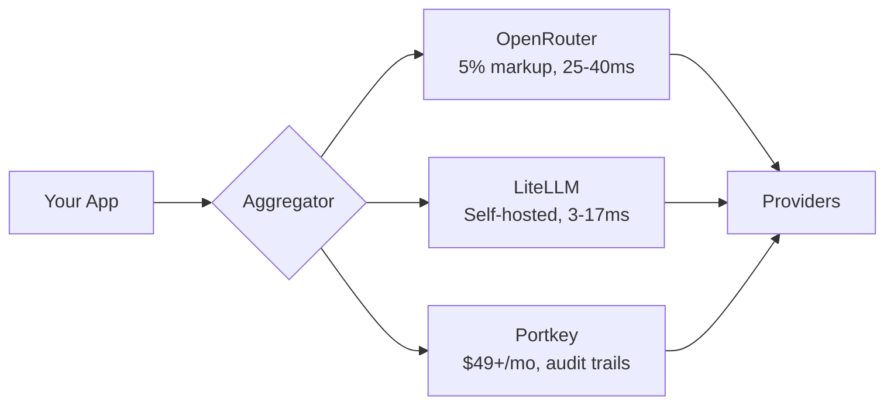

# The Aggregator Layer

You've picked your models. You've chosen your providers. Now comes the question that separates weekend projects from production systems: do you need a layer between your application and those providers?

The aggregator layer is the traffic controller of your AI infrastructure. Think of it like a load balancer, but smarter. Instead of just distributing requests across servers, an LLM gateway routes queries to different models based on cost, latency, capability, or availability. It handles failover when OpenAI goes down. It unifies six different API formats into one interface your developers actually want to use.

Most teams either adopt aggregators too early or discover they need them too late. Let's establish when they actually make sense.

## What Aggregators Actually Do

An LLM gateway sits between your application and model providers, solving three problems:

**Unified API.** Instead of writing custom code for OpenAI, Claude, Gemini, Mistral, and whatever model ships next month, you write to one interface. When Anthropic changes their API (they will), you update the gateway, not fifty microservices.

**Failover and reliability.** During OpenAI's December 2024 outage lasting hours, applications with multi-provider failover continued operating while single-provider systems went dark[^routellm]. Your gateway detects the 503, routes to Claude, and your users never notice.

**Cost optimization.** Smart routing sends simple queries to cheap models and complex queries to expensive ones. Research on RouteLLM shows this approach can achieve 85% cost reduction while maintaining 90-95% of GPT-4 quality[^routellm]. If half your queries are "summarize this paragraph," you don't need a $15/million-token model for all of them.

## The Three Architectures

Your choice depends on who you trust with your data and how much infrastructure you want to manage.

**OpenRouter: The Marketplace Model.** Single API endpoint, access to 100+ models, 5% markup on all requests[^helicone]. The routing features are clever. Use `:nitro` for fastest throughput. Use `:floor` for lowest price. The system automatically selects providers based on availability. Best for teams wanting multi-model access without managing infrastructure. Watch out for that 5% compounding at scale.

**LiteLLM: The Self-Hosted Option.** Open-source, pip-install or container deployment, your data never leaves your infrastructure[^helicone]. Latency overhead is minimal: about 3ms at P50, 17ms at P90[^litellm]. You get budget management per project or team, detailed monitoring, and the satisfaction of owning your gateway logic. Best for teams with DevOps capacity, strict data sovereignty requirements, or high volume where per-request fees compound (10,000+ requests/day). Watch out for managing another service—LiteLLM has high memory consumption during initialization.

**Portkey: The Enterprise Play.** Starting at $49/month, positioning itself as the observability leader[^helicone]. The "single pane of glass" for costs, latency, and error rates across 250+ LLMs. Virtual Keys let you create scoped API keys for different teams or environments. The semantic cache cuts costs on repeated queries. Best for enterprises with multiple teams building AI applications or when you need to show auditors exactly what happened on every request.

| Aggregator | Best For | Trade-off |
|------------|----------|-----------|
| **OpenRouter** | Fast iteration, prototyping | 5% markup at scale |
| **LiteLLM** | Data sovereignty, high volume | Self-management overhead |
| **Portkey** | Enterprise compliance, audit | Monthly subscription |

## When the Overhead Matters

Adding a gateway adds latency. OpenRouter adds roughly 25-40ms. LiteLLM adds 3-17ms depending on load[^xenoss]. For real-time chat with sub-100ms targets or voice applications, those milliseconds matter. For batch processing or document analysis where the model takes 5-30 seconds anyway, they're noise.

Notion adopted a multi-model approach from launch, integrating GPT-4 and Claude to let users leverage whichever model excels at their specific task—creative writing versus logical reasoning[^notion]. Glean followed a similar path, building their enterprise AI platform with 100+ connectors specifically designed for RAG across multiple model backends[^glean]. When routing is done right, the overhead becomes invisible.

## The Decision Framework

**Add an aggregator when:**
- Processing 1,000+ requests per day where cost optimization yields real savings
- Monthly API costs exceed $500-1,000[^routellm]
- You need five or more LLMs simultaneously (90% of production AI teams run 5+ models)[^getmaxim]
- You need 99.9%+ uptime with provider failover
- Small team (2-5 engineers) lacking dedicated DevOps but needing centralized observability

**Skip it when:**
- Building an MVP with single model, less than 100 requests per day
- Every millisecond counts (real-time voice, sub-50ms response initiation)
- You're deep in one provider's ecosystem with fine-tuned models or provider-specific features

## The Anti-Patterns

**Premature optimization.** Building sophisticated routing before you have enough queries to measure what "sophisticated" even means. Start with one provider. Add routing when you have data on what to route where.

**Over-engineering the routing logic.** Your classifier doesn't need to be an LLM. LiteLLM routes with 3ms overhead using simple rules. RouteLLM's matrix factorization router runs in microseconds[^routellm].

**Ignoring provider-specific features.** Aggregators lag behind providers. If OpenAI's latest function calling improvements or Anthropic's extended thinking are core to your product, direct integration might be cleaner than waiting for gateway support.

The aggregator layer is plumbing. Good plumbing is invisible until it breaks. But premature plumbing? That's building enterprise infrastructure for a prototype. Make sure you need the infrastructure before you build it.

Next, we'll look at how to actually choose between all these options with a practical decision framework.

## References

[^routellm]: RouteLLM Research. [OpenReview](https://openreview.net/forum?id=DWf4vroKWJ)

[^helicone]: Top 5 LLM Gateways 2025. [Helicone](https://www.helicone.ai/blog/top-llm-gateways-comparison-2025)

[^litellm]: LiteLLM Benchmarks. [LiteLLM Documentation](https://docs.litellm.ai/docs/benchmarks)

[^xenoss]: OpenRouter vs LiteLLM Comparison. [Xenoss](https://xenoss.io/blog/openrouter-vs-litellm)

[^perplexity]: Technical Architecture Analysis. [LinkedIn/Kashish Vaid](https://www.linkedin.com/pulse/technical-architecture-operational-mechanics-perplexitys-kashish-vaid-bjgkc)

[^getmaxim]: Top 5 LLM Gateways in 2025. [Maxim AI](https://www.getmaxim.ai/articles/top-5-llm-gateways-in-2025-the-definitive-guide-for-production-ai-applications/)

[^notion]: Skywork AI. ["Notion in 2025: The Ultimate Guide to Your AI-Powered Workspace."](https://skywork.ai/skypage/en/Notion-in-2025-The-Ultimate-Guide-to-Your-AI-Powered-Workspace/1974361685151641600)

[^glean]: Glean Blog. ["Create AI Strategy 2024."](https://www.glean.com/blog/create-ai-strategy-2024)

---

[← Previous: Provider Landscape](./03-provider-landscape.md) | [Chapter Overview](./README.md) | [Next: The 6 Questions Before Choosing Any Model →](./05-the-6-questions-before-choosing.md)
