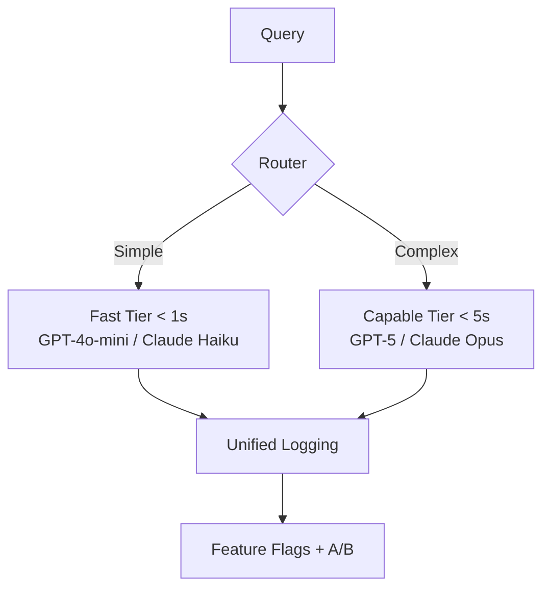

# Future-Proofing Your Stack

The model you're betting on today will be obsolete in 18 months. Maybe 12. That fine-tuned version you spent three months perfecting? A new base model will likely outperform it by next quarter.

You can't stop the landscape from shifting, but you can build for change. The companies that thrive aren't the ones that pick the "right" model today. They're the ones that architect systems where model choice becomes a configuration decision rather than a migration project.

---

## The Abstraction Trap

The first instinct is to abstract everything. Wrap every model call in a unified interface. Make providers interchangeable. In theory, you'll swap GPT for Claude with a single environment variable.

LangChain's early versions tried exactly this, and developers revolted. "Five layers of abstraction just to change a minute detail," as one frustrated engineer put it[^langchain-hn]. The framework became so generalized that debugging required understanding the entire abstraction stack before your actual problem.

The lesson: the right level of abstraction matters enormously.

**Too little abstraction:** Provider-specific code everywhere. Switching from OpenAI to Anthropic means touching hundreds of files.

**Too much abstraction:** A generic "LLM interface" that handles every possible case. Simple changes require navigating abstraction layers, and performance overhead compounds across millions of requests.

**The sweet spot:** A thin wrapper that normalizes the 80% case—request/response format, error handling, retry logic—while preserving escape hatches for provider-specific features. LangGraph emerged from LangChain specifically because developers needed "low-level abstractions using simple Python functions" that they could use with or without the framework[^langchain-hn]. Both extremes create lock-in: too little means vendor lock-in, too much means framework lock-in.

---

## The Patterns That Survive

Four patterns emerge in production systems that handle model changes gracefully:

### 1. Prompt Versioning as Code

Treat prompts with the same discipline as application code: version control, code review, rollback capability. Tools like PromptLayer and Maxim enable this, but the mindset matters more than tooling[^prompt-versioning].

When GPT-4 shipped, teams with prompt versioning A/B tested existing prompts against the new model in days. Teams without it were manually copying prompts between systems and hoping nothing broke.

### 2. Evaluation Infrastructure

You can't know if a new model is better without measuring. Notion maintains hundreds of evaluation datasets that grow weekly, using narrowly-scoped tests with LLM-as-judge scoring—achieving 10x faster issue resolution[^notion-eval]. Glean built their AI Evaluator to assess retrieval and generation separately, measuring context relevance and recall rates[^glean-eval]. Harvey's BigLaw Bench revealed that different models excel at different legal subtasks[^harvey-eval]. You can't optimize what you can't measure.

Without this infrastructure, you're making model decisions based on vibes and marketing materials.

### 3. Circuit Breakers and Fallback Chains

When your primary model fails—and it will, whether from API timeouts, rate limits, or outages—what happens? Production systems need fallback chains: primary fails, switch to backup, degrade gracefully, notify users when quality might be reduced[^fallback].

The [Perplexity architecture we examined in Section 1](./01-the-4-layer-ai-stack.md) shows this in action: failover between capability tiers without users noticing[^perplexity-bytebytego].

### 4. Cost-Aware Routing

Not every query needs your most expensive model. Their "smallest viable model" principle applies even without sophisticated ML routing.

The principle applies without sophisticated ML: can you identify query types that perform equally well on cheaper models? Most teams can route 60-80% of traffic to lighter models without quality degradation.

---

## The Multi-Model Future

The mistake: treating model selection as a one-time choice. Pick OpenAI or Anthropic, build your system, move on.

The companies actually winning treat model selection as a continuous optimization problem. Cursor evolved from a simple code editor to a multi-model AI IDE, now supporting GPT-5, Claude Opus, and Gemini—letting developers switch models based on task complexity[^cursor-models]. Replit followed similar paths, swapping underlying models transparently because their architectures treated model choice as configuration rather than hardcoded dependency.

Different models genuinely excel at different things. A multi-model architecture lets you route document analysis to Claude, code generation to GPT-4.1, and multimodal tasks to Gemini—each optimized for its domain.

A minimum viable multi-model setup needs:

- Two tiers: a fast model for simple queries (under 1 second) and a capable model for complex reasoning (under 5 seconds)
- Simple routing logic (start rule-based, migrate to ML when misrouting costs justify it)
- Unified logging to compare performance across models
- Feature flags for gradual rollout of routing changes

Start with two tiers and rule-based routing. Add ML-based classification when you have enough query data to justify the complexity.

---

## The Chapter Close

The AI landscape will keep shifting. Foundation models will improve quarterly. New providers will emerge. Today's leader might be tomorrow's laggard.

What you can control is how much your architecture depends on any single choice. Routing isn't just a technical pattern—it's a strategic posture. One provider is a bet. Multiple providers with intelligent routing is a hedge. The companies that win won't be the ones that guessed right about which model would dominate. They'll be the ones that built systems where guessing right wasn't required.

In Part II, we move from understanding the landscape to building on it. The foundations are set. Time to build.

## References

[^langchain-hn]: Hacker. [News Discussion on LangChain Abstractions](https://news.ycombinator.com/item?id=40739982)

[^prompt-versioning]: Maxim. [- Prompt Versioning Best Practices for AI Engineering Teams](https://www.getmaxim.ai/articles/prompt-versioning-best-practices-for-ai-engineering-teams/)

[^notion-eval]: ZenML — [Notion: Building a Scalable AI Feature Evaluation System](https://www.zenml.io/llmops-database/building-a-scalable-ai-feature-evaluation-system)

[^glean-eval]: Glean — [Using AI Evaluator to ensure Glean Assistant meets modern enterprise needs](https://www.glean.com/blog/glean-ai-evaluator)

[^harvey-eval]: Harvey — [Expanding Harvey's Model Offerings](https://www.harvey.ai/blog/expanding-harveys-model-offerings)

[^cursor-models]: Frontend Masters — [Choosing the Right Model in Cursor](https://frontendmasters.com/blog/choosing-the-right-model-in-cursor/)

[^fallback]: Mark. [AI Code - Implement Graceful Degradation in LLM Frameworks](https://markaicode.com/implement-graceful-degradation-llm-frameworks/)

[^perplexity-bytebytego]: ByteByteGo. [- How Perplexity Built an AI Google Competitor](https://blog.bytebytego.com/p/how-perplexity-built-an-ai-google)

---

[← Previous: When to Fine-Tune](./06-when-to-fine-tune.md) | [Chapter Overview](./README.md)
