# The Infrastructure Stack

What you need, what you don't (yet).

---

> "Our infrastructure choices are exciting to us precisely because they're battle-tested. While other startups chase the latest vector database or orchestration framework, we chose Postgres, open source, managed services—proven over impressive, every time."

**The structural insight:** At Yirifi, infrastructure decisions optimize for sophistication that delivers value—not sophistication for its own sake. The minimum viable stack—authentication, database, AI provider access, and basic observability—gets you to production. Everything else is premature optimization until you have evidence you need it.

Here's the thing about infrastructure: the companies that move fastest start with boring technology.

Not the most sophisticated. Not the most scalable. The most proven.

There's genuine excitement in choosing a stack that just works. At Yirifi, we follow a simple rule: pick the most battle-tested option that meets requirements. Battle-tested means well-documented, widely understood, predictable under pressure. This isn't conservative—it's strategic. We preserve engineering bandwidth for problems that actually differentiate the business. Proven over impressive. Every time.

Our stack: Flask 3.0 for backends, HTMX for frontends, PostgreSQL 16 for transactional data, Redis 7 for sessions and caching. No React. No fancy frontend framework. No Kubernetes. Every microsite follows the same three-layer pattern—API layer with Flask-Somerset, service layer for business logic, repository layer for data access. One pattern, fifteen applications. When someone new joins, they understand the entire codebase in a day. Nothing exotic to learn.

Linear launched with exactly three integrations: GitHub, Figma, and Slack[^linear-seed]. That's it. They raised $4.2M while still in private beta, serving hundreds of companies with infrastructure any competent developer could set up in a weekend. Notion hit one million users on just a seed round[^notion-figma]. Figma waited three years to generate revenue, running minimal infrastructure while perfecting the product[^figma-pre-revenue].

What these companies understood—and what most AI-first startups get wrong—is that infrastructure sophistication should lag revenue, not lead it.

### The Day 1 Stack

What does minimal viable AI infrastructure actually look like?

In 2024-2025, successful AI startups converged on a pattern: Vercel (or similar serverless platform) plus Supabase plus OpenAI API[^perplexity]. Total cost: under $500/month. Time to deploy: less than 24 hours.

The core components you cannot skip:

**Authentication that handles humans AND agents.** Your auth system needs to support both from day one. Supabase bundles this—one fewer system to manage. Skip it, and you'll spend weeks retrofitting agent identity into a system designed only for humans.

**One database.** Postgres with pgvector enabled for when you need embeddings later. Supabase has spun up over one million databases serving 1.7 million developers[^perplexity]. The Vercel integration auto-injects credentials and unifies billing. One click, entire backend provisioned.

**Direct AI provider access.** API calls to OpenAI, Anthropic, or your provider of choice. No gateway layer yet. No multi-provider orchestration. Just calls. You'll know when you need more complexity. That day is not day one.

**Basic observability.** Structured logging. Cost tracking. This is where most startups cut corners—and it's a mistake. AI costs grow faster than usage. Without early tracking, you'll face surprise bills at scale and miss optimization opportunities that compound over time.

For AI startups with moderate usage—say, 50,000 queries per month—expect monthly infrastructure costs between $1,500 and $6,000[^ptolemay]. Most of that is API costs.

```mermaid
flowchart TB
    subgraph DAY1["Day 1 Stack — What You Need"]
        direction TB
        AUTH["🔐 Auth<br/>(Humans + Agents)<br/>Supabase Auth"]
        DB["🗄️ Database<br/>(PostgreSQL + pgvector)<br/>Supabase"]
        AI["🤖 AI Provider<br/>(Direct API)<br/>OpenAI / Anthropic"]
        OBS["📊 Observability<br/>(Structured logs + Cost tracking)"]
    end

    subgraph NOT["What You Don't Need (Yet)"]
        direction TB
        X1["❌ AI Gateway Layer"]
        X2["❌ Dedicated Vector DB"]
        X3["❌ Multi-provider Orchestration"]
        X4["❌ Custom ML Infrastructure"]
        X5["❌ Multi-region Deployment"]
    end

    COST["💰 Total: <$500/month<br/>⏱️ Deploy: <24 hours"]

    style DAY1 fill:#1a8a52,stroke:#14693e
    style NOT fill:#c03030,stroke:#9a2020
    style COST fill:#1e6fa5,stroke:#155a85
```

*Figure: The Day 1 stack. Four non-negotiables on the left; everything else is premature optimization.*

### When to Add What

The hardest infrastructure decision isn't what to add. It's when.

The reality is sobering: 42% of companies abandoned AI initiatives in 2025[^helicone-guide]. Many died chasing model perfection—optimizing F1-scores while integration sat in backlog, chasing new models while data infrastructure crumbled. But plenty also died from premature complexity, drowning in systems they built for scale they never reached.

**Foundation (Day 1 to 6 months).** Speed above all else. Serverless plus managed database plus third-party APIs. Infrastructure spend under $5K/month. You're 2-4 founders proving a use case. Not building a platform.

**Validation (6 to 18 months).** Now you're identifying future bottlenecks. Add basic monitoring, error tracking, CI/CD. Typical funding: $2M-$4M seed. Team size: 5-15. Infrastructure spend: $10K-$30K/month[^perplexity]. This is when you add observability tools like Helicone or Langfuse. Helicone's built-in caching can cut costs 20-30%, with a trade-off of 50-80ms additional latency[^helicone-guide]. For most applications, worth it.

**Scaling (18 to 36 months).** Strategic infrastructure investments. Typical funding: $10M-$20M Series A. Team size: 20-50. Infrastructure spend: $30K-$100K/month[^perplexity]. Now—and only now—you consider a dedicated vector database. When you actually have RAG requirements and semantic search use cases. When latency becomes a real problem, not a theoretical one.

**Maturity (36+ months).** Infrastructure as competitive advantage. Custom ML infrastructure, multi-region deployment, dedicated platform team. By this point, you know exactly what you need. You've felt the pain of not having it.

*Figure: Infrastructure investment should lag revenue, not lead it. Triggers matter more than timelines.*

### The Triggers That Matter

Infrastructure becomes existential when specific things break. Performance degradation affects conversion. Response times cross thresholds that hurt business. Customer-facing incidents multiply. Your change-failure rate destroys user trust. Team velocity slows—deployment frequency drops, lead time stretches from hours to days. Cloud bills grow faster than revenue.

These are the triggers. Not "we might need this someday." Not "this would be cool." Actual pain costing you customers or engineering velocity.

The LLM observability market is projected to grow from $1.4 billion in 2023 to $10.7 billion by 2033[^helicone-guide]. Companies are spending for a reason. When your monthly API costs hit $10K, you'll wish you'd been tracking which features, which users, which queries were eating your budget.

### The Counterintuitive Pattern

Here's what most people get wrong: the most successful startups initially under-invested in technology relative to their technical founders' instincts. Then they dramatically increased investments at a specific inflection point—often raising dedicated capital specifically for infrastructure improvements[^perplexity].

Resist your instinct to build for scale on day one. Your infrastructure should be slightly uncomfortable. If you're never hitting limits, you've over-built.

The most important technology decision isn't which stack to choose. It's when to make significant investments in infrastructure.

Build for the stage you're in. Not the stage you hope to reach.

---

## References

[^linear-seed]: TechCrunch — [Linear lines up $4.2M led by Sequoia](https://techcrunch.com/2019/11/21/linear-lines-up-4-2m-led-by-sequoia-to-build-a-better-platform-for-software-developer-collaboration/)

[^notion-figma]: Figma Blog — [Design on a deadline: How Notion pulled itself back from the brink of failure](https://www.figma.com/blog/design-on-a-deadline-how-notion-pulled-itself-back-from-the-brink-of-failure/)

[^figma-pre-revenue]: LinkedIn — [Figma raised $3.8M seed + $14M Series A all pre-revenue](https://www.linkedin.com/posts/themichaelho_figma-raised-a-38m-seed-a-14m-series-activity-7290378456159174656-MaOX)

[^perplexity]: Perplexity Research — [Minimal Viable AI Infrastructure Stack](https://www.perplexity.ai/search/research-the-minimal-viable-in-bZ5wiQFqTyOe0ek8Ud2DZQ)

[^ptolemay]: Ptolemay — [How much does ChatGPT integration cost](https://www.ptolemay.com/post/how-much-does-chatgpt-integration-cost-and-pay-off)

[^helicone-guide]: Helicone — [The Complete Guide to LLM Observability Platforms](https://www.helicone.ai/blog/the-complete-guide-to-LLM-observability-platforms)

---

[Chapter Overview](./README.md) | [Next: Polyglot Persistence →](./02-polyglot-persistence.md)
