# Polyglot Persistence

Right storage for right data—relational, document, cache, vector.

---

> "One database until you can't. Two databases when you must. Three databases means you better know exactly why."

**The structural insight:** At Yirifi, we resisted adding specialized storage until the pain was undeniable. Our relational database handled everything—until RAG requirements made vector search essential, and high-frequency reads demanded caching. Each addition solved a specific, measurable problem. The rule: justify each database with a use case that can't be served by what you have.

That mantra isn't philosophical—it's operational. Every AI infrastructure blog will tell you about the wonders of polyglot persistence—PostgreSQL for transactions, MongoDB for documents, Redis for caching, Pinecone for vectors. What they won't tell you is that each additional system multiplies your operational surface area. Different monitoring. Different failure modes. Different expertise requirements. Different consistency guarantees that don't play nicely together.

So before we talk about when to add specialized storage, let's talk about how long you can avoid it.

### The Postgres-First Reality

Most AI applications can run on PostgreSQL alone far longer than you'd expect. With pgvector for embeddings, JSONB for flexible documents, and proper indexing for performance—one database handles an enormous range of workloads.

The numbers back this up. Recent benchmarks show PostgreSQL with pgvectorscale achieving 471 queries per second at 99% recall on 50 million vectors—11.4x better than dedicated vector database Qdrant on the same benchmark[^pgvector-bench]. That's not a typo. The extension outperformed the purpose-built solution.

Instacart pushed pgvector to 1 billion embeddings before needing to reconsider their architecture. When they migrated their search infrastructure from FAISS to pgvector, they found it delivered better recall despite being marginally slower for their largest retailers[^instacart-search]. The business result: a 6% drop in zero-result searches, translating to substantial incremental revenue.

The lesson: extract maximum value from your primary database before fragmenting your data layer.

At Yirifi, we followed this path exactly. PostgreSQL 16 handled everything for the first three months—users, roles, permissions, operation logs, all 15 microsites. Redis 7 came next when session management and RBAC permission caching created clear bottlenecks—same data was being read dozens of times per request, and Redis cut that to single-digit milliseconds. MongoDB arrived only when the Registration service needed flexible document storage that JSONB couldn't efficiently handle. SQLite runs the ontology knowledge graph. Four database types, each justified by measurable pain. We didn't start with four databases. We started with one.

### The Scale Thresholds That Actually Matter

Performance degradation follows a predictable curve. One developer's pgvector journey mirrors what I've seen repeatedly[^pgvector-scale]:

**At 10,000 vectors:** Everything works beautifully. Queries are fast, index builds take seconds.

**At 500,000 vectors:** Queries slow but remain acceptable. Index builds take minutes. Memory usage climbs noticeably.

**At 5 million vectors:** Query latency becomes inconsistent—sometimes 50ms, sometimes 5 seconds. Index builds take hours and occasionally crash the database. Production alerts start firing.

The 5 million vector threshold appears consistently across case studies. That's where pgvector stops being a reliable workhorse and starts being a source of on-call pages. If your product roadmap projects beyond that scale within 18 months, plan your migration path now.

```mermaid
flowchart TD
    START["How many vectors?"] --> Q1{"< 10K vectors?"}

    Q1 -->|Yes| A1["✅ pgvector is perfect<br/>Fast queries, easy maintenance"]
    Q1 -->|No| Q2{"< 500K vectors?"}

    Q2 -->|Yes| A2["✅ pgvector works well<br/>Monitor index build times"]
    Q2 -->|No| Q3{"< 5M vectors?"}

    Q3 -->|Yes| A3["⚠️ Evaluate carefully<br/>Watch P99 latency<br/>Plan migration path"]
    Q3 -->|No| Q4{"P99 > 30ms at<br/>95% recall?"}

    Q4 -->|No| A4["⚠️ Push pgvector limits<br/>Optimize before migrating"]
    Q4 -->|Yes| Q5{"> 80M queries/month?"}

    Q5 -->|No| A5["🔄 Migrate to managed<br/>Pinecone, Weaviate, etc."]
    Q5 -->|Yes| A6["🔧 Self-host consideration<br/>Qdrant, Milvus, etc."]

    style START fill:#1e6fa5,stroke:#155a85
    style A1 fill:#1a8a52,stroke:#14693e
    style A2 fill:#1a8a52,stroke:#14693e
    style A3 fill:#c77d0a,stroke:#a06508
    style A4 fill:#c77d0a,stroke:#a06508
    style A5 fill:#c77d0a,stroke:#a06508
    style A6 fill:#c77d0a,stroke:#a06508
```

*Figure: Vector database decision tree. Stay with pgvector as long as possible—complexity costs more than most teams expect.*

### The 4 Triggers for Adding Storage

Don't add databases because blog posts suggest you should. Add them when you hit specific, measurable pain points.

**1. Vector Database Triggers**

Move from pgvector to a dedicated vector database when:
- P99 latency exceeds 30ms at 95% recall after you've exhausted optimization options
- Latency increases linearly with dataset growth (a healthy system should see less than 2x latency increase for 10x data growth)
- Pre-filtering on multiple metadata fields causes 40% or greater latency spikes
- Index builds routinely exceed 4 hours or risk database stability

The cost threshold matters too. Self-hosting becomes cheaper than managed services like Pinecone only around 60-80 million queries per month or 100+ million vectors with high query volume[^self-host-costs]. Below that, managed services win despite higher per-unit pricing.

**2. Cache Layer Triggers**

Add Redis or Valkey when:
- Same data is read more than 10x per write
- Latency requirements drop below 10ms
- Computed results are expensive but stable for minutes or hours
- Your database query optimizer shows the same expensive query pattern repeatedly

But here's what most people get wrong: they add caching to mask architectural problems rather than solve data access patterns. If your cache hit ratio drops below 50% with high eviction rates, you have a sizing problem that adding more cache won't fix[^redis-threshold].

**3. Document Store Triggers**

Move to MongoDB or similar when:
- Schema varies significantly across records in ways JSONB can't efficiently handle
- Deep nesting is natural to your data model and you're constantly fighting relational patterns
- Read patterns are document-centric (you always fetch whole documents, never join across them)

Avoid document stores when you're solving "it's hard to update our schema" problems. That's a process issue wearing a technology costume.

**4. Graph Database Triggers**

Add Neo4j or similar when:
- Relationship traversal is your core workload (social graphs, recommendation systems, knowledge graphs)
- Traditional JOINs become performance bottlenecks across multiple relationship hops
- Your queries naturally express as "find all nodes connected to X through Y" rather than "find rows matching conditions"

*Figure: Storage addition priority quadrant. Cache layer first when pain is high—low complexity, immediate payoff. Vector DB requires careful planning. Graph databases only when traversal is core.*

### The Synchronization Problem

What the architecture diagrams hide: every time data exists in multiple stores, you've created a consistency problem. The order that writes to SQL might not yet reflect in your Redis cache. The embedding update in PostgreSQL might not have propagated to your vector store. The user sees stale data, makes decisions on outdated information, and your support tickets multiply.

Netflix uses PostgreSQL for orders, MongoDB for catalogs, and Redis for sessions. Each serves a specific purpose. But they also invest heavily in event streaming and eventually-consistent synchronization—infrastructure that doesn't show up in the blog posts about their architecture[^netflix-polyglot].

Write-through synchronization (updating all stores on every write) gives you strong consistency but higher latency. Write-behind (async sync) gives you lower latency but eventual consistency. Change data capture gives you decoupled systems but requires significant infrastructure investment. Dual-write—where your application writes to multiple stores directly—is a consistency bug waiting to happen. Ban it.

### Right-Sizing for Your Stage

For startups: Start with PostgreSQL plus pgvector. Add Redis only when your query patterns show clear caching opportunities. Plan for vector database migration at the 2-3 million embedding mark, but don't execute until you hit actual pain. Each database you add is a system your on-call rotation must understand.

For established organizations: You likely have more databases than you need, accumulated over years of different teams solving immediate problems. Before adding AI-specific stores, audit what you have. I've seen organizations with three document stores and two caching layers, none of which anyone fully understood. Consolidate before adding.

The vector database market reached $2.2 billion in 2024 and is growing fast[^vector-market]. Vendors will tell you their purpose-built solution is essential. The reality is that most AI applications need sophisticated data management, but not necessarily sophisticated data infrastructure. Start simple. Measure everything. Add complexity only when the metrics demand it.

The technology that gets you to market isn't always the technology that gets you to scale. But the technology you understand deeply will outperform the technology you adopted because it seemed cutting-edge.

---

## References

[^pgvector-bench]: Tigerdata Benchmarks — [pgvector vs Qdrant](https://www.tigerdata.com/blog/pgvector-vs-qdrant)
[^instacart-search]: Instacart Tech Blog — [How Instacart Built Modern Search Infrastructure on Postgres](https://www.instacart.com/company/tech-innovation/how-instacart-built-a-modern-search-infrastructure-on-postgres)
[^pgvector-scale]: Amitav Roy — [Beyond pgvector: Choosing the Right Vector Database for Production](https://www.amitavroy.com/articles/beyond-pgvector-choosing-the-right-vector-database-for-productions)
[^self-host-costs]: OpenMetal — [When Self-Hosting Vector Databases Becomes Cheaper Than SaaS](https://openmetal.io/resources/blog/when-self-hosting-vector-databases-becomes-cheaper-than-saas/)
[^redis-threshold]: Redis Documentation — [Observability and Performance Tuning](https://redis.io/docs/latest/embeds/rs-observability/)
[^netflix-polyglot]: Polyglot Persistence Research Paper — [arxiv.org](https://www.arxiv.org/pdf/2509.08014.pdf)
[^vector-market]: Global Market Insights — [Vector Database Market](https://www.gminsights.com/industry-analysis/vector-database-market)

---

[← Previous: The Infrastructure Stack](./01-the-infrastructure-stack.md) | [Chapter Overview](./README.md) | [Next: The AI Tool Gateway Pattern →](./03-the-ai-tool-gateway-pattern.md)
