# Unified Auth for Humans AND Agents

Same permission model, different contexts.

> "An agent should never have more permissions than the human who triggered it. But it also shouldn't have fewer—or it can't do its job."

**The structural insight:** Yirifi's Auth Client Pattern treats agents as delegates, not independent actors. When a user triggers an agent, that agent inherits the user's permissions—scoped to the task at hand. This creates clear accountability (every agent action traces to a human), prevents permission creep (agents can't accumulate powers beyond their principals), and simplifies security audits (same model for humans and machines).

Non-human identities already outnumber humans 50:1 in the average enterprise environment[^csa-framework]. That ratio is projected to hit 80:1 within two years. The uncomfortable reality: most of those "identities" are service accounts with static credentials, shared across teams, with permissions that accumulated over years of "just add it to the existing account."

Now introduce AI agents that autonomously make decisions, chain together, and act on behalf of users. You're either going to extend your existing identity model to cover agents properly, or you're going to end up in Gartner's prediction that 25% of enterprise breaches will trace back to AI agent abuse by 2028[^gartner-prediction].

### The Fundamental Shift: Agents as First-Class Identities

The common mistake: treating agents as fancy scripts. Give them an API key, hardcode some permissions, call it done. But agents differ from service accounts in ways that matter. As the Cloud Security Alliance puts it: "AI agents raise new governance, authentication, and authorization challenges—IAM architectures must embrace AI agents as a new and unique identity type"[^csa-framework].

Agents differ from service accounts in three ways: *autonomy* (agents make independent decisions about which tools to call), *ephemerality* (agents may exist briefly for a single task then disappear), and *delegation patterns* (agents inherit permissions from the human who triggered them—traceably and revocably).

Microsoft recognized this with Entra Agent ID, launched in late 2024[^entra-agent-id]. It creates dedicated identity types for agents that authenticate without storing credentials—only access tokens issued to their hosting platform. Same conditional access policies, same identity protection signals, same lifecycle management as human users. One model, two contexts.

### The "Act on Behalf Of" Problem

When a user asks an agent to "find available meeting times with the engineering team and schedule something next week," that agent needs access to calendars, contact lists, and scheduling systems. The temptation is to give the agent broad calendar access and call it done.

But that violates the core principle: an agent should never have more permissions than the human who triggered it.

OAuth 2.1's Token Exchange (RFC 8693) solves this with delegation chains. The token includes an `act` (actor) claim that records exactly who authorized what: "Agent B acting for Agent A acting for Alice."[^rfc8693] Every link in that chain is cryptographically provable.

What does this look like in practice? When Alice triggers the scheduling agent:

1. Alice's authenticated session generates a delegation token scoped to calendar read/write
2. The scheduling agent receives that token—not Alice's full permissions, just what this task requires
3. When the agent calls a sub-agent to check room availability, it passes an attenuated token (same or fewer permissions, never more)
4. Every action logs the full chain: Alice → Scheduling Agent → Room Availability Agent → Conference Room Calendar
5. When the task completes, all tokens expire

The key insight: permissions can only *decrease* as delegation depth increases. An agent can never grant more access to a sub-agent than it has itself.

```mermaid
flowchart LR
    subgraph ALICE["👤 Alice (Human)"]
        A_PERMS["Full permissions:<br/>• Calendar read/write<br/>• Contacts read<br/>• Email send<br/>• File access"]
    end

    subgraph SCHED["🤖 Scheduling Agent"]
        S_PERMS["Delegated permissions:<br/>• Calendar read/write<br/>• Contacts read<br/>~~• Email send~~<br/>~~• File access~~"]
    end

    subgraph ROOM["🤖 Room Agent"]
        R_PERMS["Further attenuated:<br/>• Calendar read only<br/>~~• Contacts read~~<br/>~~• Email send~~<br/>~~• File access~~"]
    end

    subgraph CAL["📅 Calendar API"]
        C_ACTION["Action: Read room<br/>availability only"]
    end

    ALICE -->|"Delegation token<br/>scoped to task"| SCHED
    SCHED -->|"Attenuated token<br/>(fewer permissions)"| ROOM
    ROOM -->|"Minimal access<br/>for specific action"| CAL

    AUDIT["📋 Audit Log:<br/>Alice → Scheduling Agent → Room Agent → Calendar"]

    style ALICE fill:#1e6fa5,stroke:#155a85
    style SCHED fill:#b87a0a,stroke:#946208
    style ROOM fill:#b87a0a,stroke:#946208
    style CAL fill:#1a8a52,stroke:#14693e
```

*Figure: Permission delegation chain showing attenuation. Each hop reduces permissions—never increases. The audit trail traces every action back to Alice.*

### Proof of Possession: Why Bearer Tokens Aren't Enough

Traditional bearer tokens have a critical vulnerability: anyone who intercepts them gets immediate access. DPoP (Demonstration of Proof-of-Possession) changes the model[^dpop-spec]. The agent must cryptographically prove it holds the private key that corresponds to the token. Stolen tokens become useless without the key that never leaves the agent's secure enclave.

The emerging Agentic JWT (A-JWT) specification takes this further[^a-jwt]. Beyond standard access tokens, an intent token binds to a single agent + intent + workflow step. It includes the delegation chain, a cryptographic hash of the agent's configuration, and execution context. If someone modifies the agent's system prompt—a common prompt injection attack—the hash changes, validation fails, and the action blocks.

### Real-Time Revocation

Static permission systems fail agents because agent behavior is dynamic. Teams build beautiful auth systems and then watch helplessly as a compromised agent makes 10,000 API calls while the security team investigates.

Real-time revocation means behavioral anomalies trigger credential suspension immediately—not "block and investigate" but "suspend and alert." Task-based revocation atomically removes all downstream access when a parent task dies abnormally. If your revocation latency is measured in minutes, it's incident response, not security.

### The 4 Principles of Unified Auth

These principles consistently separate systems that work from those that create security liabilities:

**1. One Model, Different Authentication Methods**

Humans authenticate interactively (SSO, MFA). Agents authenticate via client credentials or delegated tokens. But both flow through the same permission model, the same policy engine, the same audit system.

**2. Permissions Flow Down, Never Up**

Every delegation hop attenuates permissions. A sub-agent can never have more access than its parent. If your architecture allows agents to accumulate permissions across interactions, you're building a privilege escalation vulnerability.

**3. Every Action Traces to a Human**

No orphan agents. Every agent action must trace back to either a human principal or an explicitly scoped system account. When something goes wrong, you need to answer "who let this agent do that?" in seconds, not days.

**4. Tokens Die With Tasks**

When a task completes, its tokens expire. No persistent agent identity accumulating permissions across sessions. This feels inefficient but it's the only way to prevent stale permissions from becoming security risks.

### Making It Real

For established organizations, extend existing IAM systems rather than building parallel ones. Microsoft Entra, Okta (through Auth0 for AI Agents), and others now support agent-specific flows[^auth0-agents]. For startups, design for unified auth from day one—the temptation to hardcode agent permissions creates technical debt that becomes a security liability.

The honest truth: proper agent auth adds meaningful time upfront. Getting it wrong adds months of remediation when something breaks—and given Gartner's 25% prediction, "something breaking" is a matter of when, not if.

## References

[^csa-framework]: Cloud Security Alliance — [Agentic AI Identity and Access Management](https://cloudsecurityalliance.org/artifacts/agentic-ai-identity-and-access-management-a-new-approach)

[^gartner-prediction]: Strata Identity — [New Identity Playbook for AI Agents](https://www.strata.io/blog/agentic-identity/new-identity-playbook-ai-agents-not-nhi-8b/)

[^entra-agent-id]: AdminDroid — [Microsoft Entra Agent ID](https://blog.admindroid.com/new-microsoft-entra-agent-id-to-secure-and-manage-ai-agents/)

[^rfc8693]: OAuth Token Exchange — [RFC 8693](https://self-issued.info/docs/draft-ietf-oauth-token-exchange-10.html)

[^dpop-spec]: Curity — [DPoP Overview](https://curity.io/resources/learn/dpop-overview/)

[^a-jwt]: Aembit — [AI Agent Architectures Identity Security](https://aembit.io/blog/ai-agent-architectures-identity-security/)

[^auth0-agents]: Auth0 — [Auth0 for AI Agents Generally Available](https://auth0.com/blog/auth0-for-ai-agents-generally-available/)

---

---

[← Previous: The AI Tool Gateway Pattern](./03-the-ai-tool-gateway-pattern.md) | [Chapter Overview](./README.md) | [Next: The 5 Infrastructure Mistakes That Kill AI Initiatives →](./05-the-5-infrastructure-mistakes.md)
