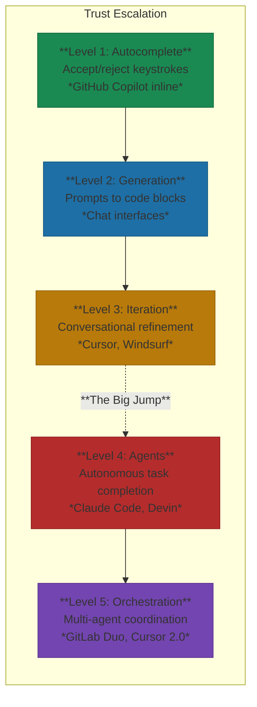

# The 5 Levels of AI-Assisted Development

From autocomplete to orchestration—understanding the spectrum.

> "We didn't jump straight to agents. We spent six months at Level 2-3, building trust. Now most work happens at Level 4, but the team earned that by learning when to trust AI and when to override it."

**The structural insight:** At Yirifi, the progression through levels wasn't about tool adoption—it was about trust calibration. Each level requires different mental models: autocomplete requires pattern recognition, generation requires prompt clarity, iteration requires feedback skills, agents require architectural thinking.

Most developers think they're using AI coding tools effectively. Most are stuck at Levels 2-3, missing massive productivity gains available higher up[^transition-research]. The gap isn't about tool access—it's about understanding what each level demands.

## The 5 Levels

*Figure: Each level requires progressively higher trust in AI decision-making.*

**Level 1: Autocomplete.** The AI suggests completions as you type. GitHub Copilot's inline suggestions. Low trust—every suggestion is obvious and rejectable. Most developers accept about 30% of suggestions, and 88% of those accepted characters make it into final code[^copilot-stats]. This is the trust-building phase.

**Level 2: Generation.** The AI creates entire code blocks from prompts. You describe what you want, it produces code to integrate. Accenture put 50,000 developers through this transition and measured an 8.69% increase in pull requests and 84% more successful builds[^accenture-study]. But teams that jumped here without training saw 60% lower productivity gains[^training-gap].

**Level 3: Iteration.** The AI refines code based on feedback. Instead of one-shot generation, you're conversing: "Make this more efficient." "Handle the null case." Builder.io's engineering team uses what they call a "Plan, Test, Code, Review" cycle with human checkpoints every 10-15 minutes[^builder-io]. Your job is guiding AI toward the right solution.

**Level 4: Agents.** The AI completes entire tasks autonomously. Goldman Sachs, Santander, and Nubank use Devin at this level, saving 5-10% of developer time on security fixes with 20x efficiency: 30 minutes of human work compressed to 90 seconds[^devin-enterprise]. Claude Code exemplifies Level 4's architecture: plan mode (explore first, get approval, then implement), subagents for parallel task execution, and hooks that enforce review checkpoints automatically[^claude-code-level4]. The autonomy comes with guardrails. But the jump from Level 3 to Level 4 is where most teams stall.

**Level 5: Orchestration.** Multiple agents coordinate on complex tasks. GitLab's Duo Agent Platform went generally available in January 2026, and Cursor 2.0 supports 8 simultaneous agents[^orchestration-tools]. But 95% of enterprise multi-agent pilots fail to meet their stated objectives[^pilot-failures]. This level is largely theoretical for most teams.

## The Big Jump: Level 3 to Level 4

The productivity gains at Level 4 are significant—35% task correctness improvement, 50% effort reduction compared to copilots, 60% task completion rate versus 25% with copilots alone[^agent-gains]. But there's a hidden cost: 55% of developers report worse understanding of agent-generated code[^understanding-gap].

This isn't a tool problem. It's a workflow problem.

At Levels 1-3, you're in the loop for every decision. At Level 4, the path from problem to solution becomes a black box. The skill shift isn't "use a better tool"—it's "become an architect and reviewer instead of an implementer."

Teams that make this transition successfully share three characteristics: strong review practices before adopting agents, starting with bounded tasks (security fixes, test coverage, documentation), and investing 6-12 weeks accepting slower initial output to build review skills[^transition-time].

## Warning Signs

You've progressed too fast if you're spending more time fixing AI output than writing it yourself, code reviews reveal systemic architectural problems, or team members can't explain the AI's choices. The fix: retreat, build the missing skills, progress deliberately.

The pattern I see consistently: teams that progress one level every 2-4 weeks build durable capability. Teams that jump two levels in a week regress within a month.

## References

[^copilot-stats]: GitHub Research, Developer Productivity Study 2024 — [github.blog](https://github.blog/news-insights/research/research-quantifying-github-copilots-impact-on-developer-productivity-and-happiness/)
[^accenture-study]: Accenture Developer Productivity Report 2025 — [accenture.com](https://www.accenture.com/us-en/insights/technology/developer-productivity-ai)
[^training-gap]: McKinsey & Company, AI Coding Tools Adoption Study — [mckinsey.com](https://www.mckinsey.com/capabilities/tech-and-ai/our-insights/unleashing-developer-productivity-with-generative-ai)
[^builder-io]: Builder.io Engineering Blog, "AI-Assisted Development Workflows" — [builder.io](https://www.builder.io/blog/ai-coding-workflows)
[^devin-enterprise]: Cognition Labs, Enterprise Deployment Case Studies 2025 — [cognition.ai](https://www.cognition.ai/blog/enterprise-results)
[^orchestration-tools]: GitLab Duo Agent Platform GA Announcement, January 2026 — [about.gitlab.com](https://about.gitlab.com/releases/)
[^pilot-failures]: Deloitte AI Institute, "State of Agentic AI" Report 2025 — [deloitte.com](https://www2.deloitte.com/us/en/insights/focus/tech-trends.html)
[^agent-gains]: Contrary Research, AI Coding Tools Analysis 2025 — [research.contrary.com](https://research.contrary.com/reports/ai-coding)
[^understanding-gap]: METR, AI Coding Tool Productivity Study 2025 — [metr.org](https://metr.org/research/)
[^transition-time]: GitHub Enterprise, "Scaling AI Adoption" Guide — [github.com](https://github.com/enterprise)
[^transition-research]: Stack Overflow Developer Survey 2025 — [stackoverflow.com](https://survey.stackoverflow.co/2025/)
[^claude-code-level4]: Anthropic. [Claude Code Documentation](https://code.claude.com/docs/en/overview)

---

[Chapter Overview](./README.md) | [Next: Tool Decision Framework →](./02-tool-decision-framework.md)
