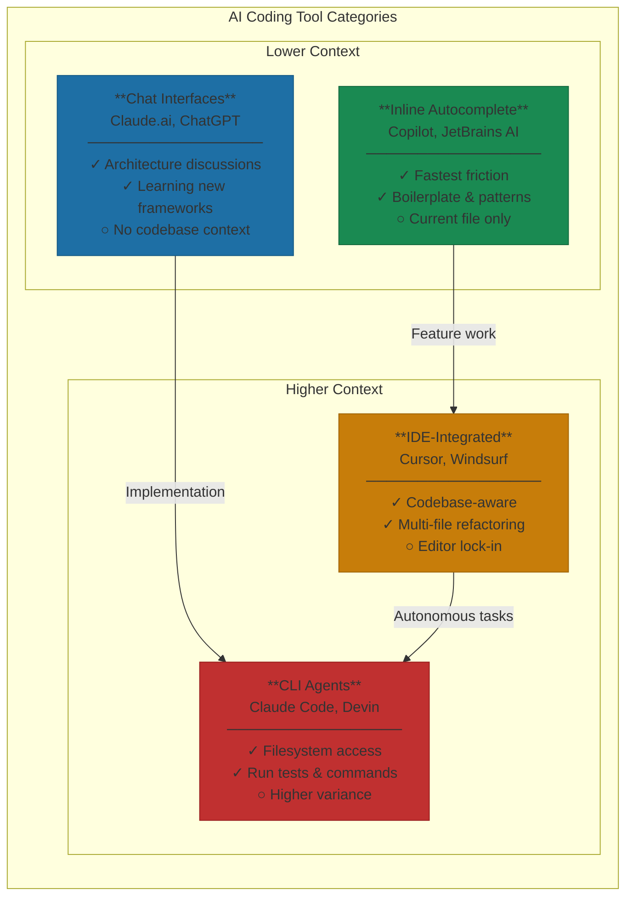

# Tool Decision Framework

Choosing the right AI coding tool for your workflow.

---

> "We use three different AI coding tools, and that's intentional. Quick edits in the IDE with autocomplete. Feature work with an agentic CLI. Architecture discussions in chat. The tool should match the task, not the other way around."

Here's the common mistake with AI coding tools: picking one and forcing every workflow through it.

The data suggests they shouldn't. 49% of organizations now use multiple AI coding tools, and 26% specifically pair Copilot with Claude for different use cases[^multi-tool]. This isn't tool sprawl—it's pattern recognition. Different tasks have different requirements. Matching the tool to the task is the skill.

## The Four Categories

*Figure: The four AI coding tool categories. Match the tool to the task—different workflows have different requirements.*

**Inline autocomplete** is your fastest option. GitHub Copilot at $10/month, Cursor's built-in suggestions, JetBrains AI Assistant—they all do roughly the same thing. You type, they suggest, you tab to accept. The context window is tiny: usually just the current function or file. But that limitation is a feature, not a bug. These tools excel at boilerplate, standard patterns, code you could write but don't want to. Copilot shows 55% reduction in PR lead time, with 88% of accepted suggestions surviving into production code[^copilot-data]. Low risk, minimal friction, consistent gains.

**Chat interfaces** work differently. Claude.ai, ChatGPT, Gemini—no codebase context, no file system access. That sounds like a weakness until you realize it's sometimes what you want. Architecture discussions benefit from not being anchored to existing code. Copy-paste is overhead, but it's also a forcing function: you control exactly what context the AI sees.

**IDE-integrated tools** combine chat with codebase awareness. Cursor ($20/month Pro, $40/user Business) is the market leader here, with satisfaction scores of 89% versus Copilot's 72%[^cursor-satisfaction]. The strength is context: Cursor indexes your codebase and learns your conventions. The multi-file Composer handles refactoring across dozens of files. The weakness is lock-in. After Microsoft blocked Cursor's VS Code extension in 2025, the dependency became clear[^vscode-block]. You're betting on a fork of an editor controlled by a competitor.

**CLI agents** are the newest category. Claude Code, Codex CLI, Devin's command-line mode—terminal-native tools that can navigate your file system, run tests, execute commands. The learning curve is steeper; terminal comfort is a prerequisite. But the productivity ceiling is higher. One ThoughtWorks team reported "97% of work saved" on certain tasks—though they also noted it "failed utterly" on others[^thoughtworks]. The variance is wider at this level. When it works, you're looking at 45-minute tasks compressed to 5 minutes. When it doesn't, you're debugging AI-generated code that touched files you didn't know existed.

## The Decision Matrix

Match the tool to the task:

**For typing acceleration**, use autocomplete. Zero friction. Always available. Low risk.

**For architecture exploration**, use chat interfaces. The lack of codebase context is a feature—you want broader thinking, not anchoring.

**For feature iteration within a project**, use IDE-integrated tools. The codebase awareness makes iteration fast. The inline editing capabilities cut feedback loops to seconds.

**For complete feature development with defined scope**, use CLI agents. They can navigate multiple files, run verification, handle the full implementation loop.

**For cross-repository changes**, use CLI agents with filesystem access. IDE tools typically can't see outside the current project.

Avoid using an IDE tool for architecture conversations (you'll be biased by current implementation) or using chat for feature work (too much copy-paste overhead). Match the tool to the task.

## The Organizational Question

The 49% of organizations using multiple tools suggests a pattern: workflow-based standardization[^multi-tool]. Don't mandate a single tool. Don't let everyone choose freely. Standardize by workflow type—one tool for autocomplete, one for iteration, one for agents. At Yirifi, we don't mandate which specific tool someone uses for iteration, but we do standardize that iteration as a workflow needs an IDE-integrated tool. The pattern is consistent even if product choices vary.

## Cost and ROI

GitHub Copilot runs $10/month for Pro, $39/user for Enterprise. Cursor charges $20/month Pro, $40/user Business. Enterprise seats add up—but the ROI math is compelling. An 80-person team with 2.4-hour/week savings per developer generates roughly $77,000/month in recaptured productivity at $50/hour loaded cost[^roi-calc]. The tools pay for themselves at 24x.

The harder question: productivity for whom? Research shows 26-55% gains, but developer sentiment has dropped from 70%+ positive to closer to 60%[^sentiment-drop]. "LLM-generated code ends up pushing review burden onto others"[^review-burden]. Senior developers benefit more—up to 4.4 hours saved per week—because they catch architectural mistakes juniors miss[^senior-gains]. The ROI equation isn't uniform.

Match the tool to the task, not the other way around. That's the framework that lasts even as specific tools evolve. The productivity gap between Level 1 and Level 4 is too large to leave on the table—but CLI agents require trust and review practices that take 3-6 months to develop. Start where your team can succeed, then climb deliberately.

---

## References

[^multi-tool]: Gartner Developer Productivity Survey 2025 — [gartner.com](https://www.gartner.com/en/documents/developer-productivity-ai-tools-2025)
[^copilot-data]: GitHub Research, Copilot Productivity Study 2024 — [github.blog](https://github.blog/news-insights/research/research-quantifying-github-copilots-impact-on-developer-productivity-and-happiness/)
[^cursor-satisfaction]: Contrary Research, AI Coding Tools Analysis 2025 — [research.contrary.com](https://research.contrary.com/reports/ai-coding)
[^vscode-block]: DevClass, "VS Code extension marketplace wars: Cursor users hit roadblocks," April 2025 — [devclass.com](https://devclass.com/2025/04/08/vs-code-extension-marketplace-wars-cursor-users-hit-roadblocks/)
[^thoughtworks]: ThoughtWorks Technology Radar Vol. 32 — [thoughtworks.com](https://www.thoughtworks.com/radar)
[^roi-calc]: Internal analysis based on industry salary data and documented time savings
[^sentiment-drop]: Stack Overflow Developer Survey 2025 — [stackoverflow.com](https://survey.stackoverflow.co/2025/)
[^review-burden]: Hacker News AI Coding Tools Discussion Thread, 2025 — [news.ycombinator.com](https://news.ycombinator.com)
[^senior-gains]: GitHub Enterprise, AI Productivity by Experience Level Study — [github.com](https://github.com/enterprise)

---

[← Previous: The 5 Levels of AI-Assisted Development](./01-the-5-levels-of-ai-assisted-development.md) | [Chapter Overview](./README.md) | [Next: Skills, Commands, Agents, SDK — The Vocabulary →](./03-skills-commands-agents-sdk.md)
