# The Human-AI Development Loop

The collaboration structure behind "think while AI types."

> "We don't 'use AI to code.' We collaborate with AI to build. The loop is the collaboration pattern: human decides, AI drafts, human reviews, AI refines. Each party does what they're best at."

**The structural insight:** At Yirifi, the 5x productivity gain came from recognizing what humans are good at versus what AI is good at—and designing the workflow to maximize both. Humans excel at: understanding requirements, making architectural decisions, spotting subtle bugs, ensuring business logic correctness. AI excels at: typing fast, remembering syntax, applying patterns, generating boilerplate. The loop plays to both strengths.

Most teams get this backward. They think of AI as a faster pair of hands—type your intent, get code back, ship. That's how you end up 19% slower while feeling 20% faster—the perception gap from [Section 4](./04-the-8-patterns-for-effective-ai-coding.md).

Better prompting isn't the fix. Structure is. Developers who genuinely accelerate aren't using AI differently—they're collaborating through a deliberate loop. Human decides, AI drafts, human reviews, AI refines, human finalizes. Five steps that sound obvious until you watch someone skip them.

```mermaid
graph LR
    subgraph loop["The Human-AI Development Loop"]
        direction LR
        D["**1. DECIDE**<br/>🧠 Human<br/>Define task & requirements"]
        DR["**2. DRAFT**<br/>🤖 AI<br/>Generate code"]
        R["**3. REVIEW**<br/>🧠 Human<br/>Check against requirements"]
        RF["**4. REFINE**<br/>🤖 AI<br/>Iterate on feedback"]
        F["**5. FINALIZE**<br/>🧠 Human<br/>Commit what passes"]
    end

    D --> DR
    DR --> R
    R --> RF
    RF --> R
    R -->|"Approved"| F
    F -.->|"Next task"| D

    subgraph human["Human Owns"]
        H1["Understanding problems"]
        H2["Designing solutions"]
        H3["Judgment calls"]
        H4["Responsibility"]
    end

    subgraph ai["AI Owns"]
        A1["Typing speed"]
        A2["Syntax recall"]
        A3["Pattern application"]
        A4["Consistent execution"]
    end

    style D fill:#1e6fa5,stroke:#155a85
    style DR fill:#c77d0a,stroke:#a06508
    style R fill:#1e6fa5,stroke:#155a85
    style RF fill:#c77d0a,stroke:#a06508
    style F fill:#1a8a52,stroke:#14693e
```

*Figure: The Human-AI Development Loop. Each party does what they're best at—humans make decisions, AI handles execution.*

## What the Loop Actually Looks Like

Skywork AI documented their experience with intensive AI assistance. They completed six months of planned development in three weeks[^cursor-case]. That's not 20% faster. That's a different category of output. But buried in that success story was a failure: on day one, they spun up four AI agents simultaneously and got "polite chaos, fast output, wobbly coherence."

The breakthrough came when they imposed structure. One task at a time. Human defines the task precisely. AI generates a draft. Human reviews against requirements. AI iterates on feedback. Human commits only what passes muster.

The numbers tell the story. A new CRUD module that took 8-10 hours dropped to 2-3 hours. Cross-file refactors went from 4-6 hours to 45-90 minutes. Regression bugs fell 85% after implementing agent-authored test suites[^cursor-case]. The loop isn't overhead. It's the mechanism that unlocks the speed.

## The Division of Labor

AI-assisted development inverts the traditional workflow. Many developers spend more time typing than thinking. The loop flips that ratio. You spend more time thinking—defining tasks, reviewing output, making judgment calls—and AI handles the typing.

Addy Osmani, who writes extensively about AI-assisted development, describes the ideal relationship as "human as director, AI as executor"[^osmani]. The common mistake reverses this. Developers abdicate direction to the AI, then wonder why the output doesn't fit their system.

Here's the key insight: you're not delegating coding. You're delegating typing and syntax recall. The thinking remains yours.

## Loop Variations by Complexity

Not every task needs the same loop intensity. Quick loops handle simple changes in two minutes: decide in 30 seconds, AI drafts in a minute, review in 30 seconds, done. Add validation to a form field. Rename a variable across a file. Simple.

Standard loops run 15-30 minutes for feature components. You explain the feature, show examples, let AI generate a component, identify gaps in review, let AI address feedback, verify and commit. This is the bread-and-butter of daily development.

Extended loops span hours for complex features. Architecture discussions upfront. AI generates across multiple files. Thorough code review catches integration issues. Multiple refinement cycles. Integration testing before the commit.

The mistake I see repeatedly: treating every task like a quick loop. Complex work compressed into rapid iterations produces the "jumbled mess" that Osmani describes from large monolithic requests[^osmani]. When output goes wrong, the fix isn't more prompting—it's stopping, backing up, and splitting the problem into smaller pieces that fit the appropriate loop intensity.

## The Friction Tax

The friction is real: prompting overhead, reviewing "almost right" code, adapting output to existing codebases. The loop doesn't eliminate friction—it manages it. Short loops minimize context switching. Clear task definitions reduce review time. Checkpoint commits protect against integration failures.

ZoomInfo, with 400-plus developers, processes 6,500 AI suggestions daily—roughly 16 per developer[^zoominfo]. Their acceptance rate is 33%. Two-thirds get rejected. But the accepted suggestions account for 20% of lines written, and 90% of developers report faster task completion[^zoominfo]. The loop explains those numbers: treat AI suggestions as drafts to evaluate, not answers to accept.

## Where the Loop Breaks Down

The loop fails predictably in a few scenarios. Domain-specific logic defeats AI suggestions—it doesn't know your business rules. Innovative solutions that require creative leaps get stuck in pattern-matching. Context that spans multiple projects exceeds what any AI can hold in working memory.

When you find yourself on the fifth refinement cycle for the same task, the loop is telling you something. Either the task is too large, the context is insufficient, or the problem genuinely requires human creativity the AI can't provide. Knowing when to exit the loop and take over manually is as important as knowing how to run it.

## Making the Loop Habitual

For established organizations, the loop is teachable. Make it explicit in developer onboarding. Measure loop effectiveness as a team metric—completion rate, iterations per feature, time allocation across steps. The pattern works regardless of which AI tool you use. The collaboration model is what matters.

For startups, build the loop into your culture from day one. Everyone should know the pattern: decide, draft, review, refine, finalize. This creates consistency across the team even as you grow. The loop is how small teams punch above their weight.

The gap between perceived and actual productivity closes when the loop becomes automatic. You stop thinking about whether to follow the pattern and start thinking about the code itself. That's when the 5x productivity actually arrives.

## References

[^cursor-case]: Case Study: How a Startup Built 10× Faster with Cursor 2.0. [Skywork AI](https://skywork.ai/blog/vibecoding/cursor-2-0-case-study-startup/)

[^osmani]: Addy. [Osmani on AI-assisted development patterns](https://addyosmani.com/blog/ai-coding/)

[^zoominfo]: Experience with GitHub Copilot for Developer Productivity at ZoomInfo. [arXiv, January 2025](https://arxiv.org/html/2501.13282v1)

---

[← Previous: The 8 Patterns for Effective AI Coding Sessions](./04-the-8-patterns-for-effective-ai-coding.md) | [Chapter Overview](./README.md) | [Next: When AI Coding Fails →](./06-when-ai-coding-fails.md)
