# When AI Coding Fails

Recognition, recovery, and course correction.

> "AI coding fails predictably. Once you recognize the failure patterns, you can either prevent them or recover fast. The goal isn't perfect AI—it's knowing when to take the wheel back."

**The structural insight:** At Yirifi, we track AI coding failures systematically. Every failure teaches us something: either how to prompt better, when to take over manually, or where our codebase needs better documentation. Failures aren't setbacks—they're calibration data.

AI coding failures aren't random. After watching enough developers work with AI tools, patterns emerge. The same failure modes show up across teams, tools, and codebases. One in five developers estimates that one in five AI suggestions contains errors[^stack-survey]. That's probability at work in a domain that demands precision.

The dangerous part isn't that AI fails. It's how it fails. A compiler error is obvious. A missing semicolon screams for attention. But AI produces confident errors—code that looks right, compiles fine, and breaks only when rare conditions trigger it. Crashes are visible. Silent failures hide until production. One developer described the experience bluntly: "This kind of silent failure is far worse than a crash"[^perplexity-failures].

## The Six Failure Patterns

```mermaid
graph TB
    subgraph failures["The Six AI Coding Failure Patterns"]
        direction TB

        subgraph row1[" "]
            F1["⚠️ **1. Hallucinated APIs**<br/>Invents functions that don't exist<br/>*Check: Imports you don't recognize*"]
            F2["⚠️ **2. Incorrect Assumptions**<br/>Works but does the wrong thing<br/>*Check: Output misses the point*"]
            F3["⚠️ **3. Style Drift**<br/>Doesn't match conventions<br/>*Check: Code looks 'foreign'*"]
        end

        subgraph row2[" "]
            F4["⚠️ **4. Over-Engineering**<br/>More abstraction than needed<br/>*Check: Solution longer than expected*"]
            F5["⚠️ **5. Security Blindness**<br/>Misses obvious vulnerabilities<br/>*Check: Missing security patterns*"]
            F6["⚠️ **6. Context Loss**<br/>Forgets earlier decisions<br/>*Check: Repeated mistakes, drift*"]
        end
    end

    style F1 fill:#c03030,stroke:#9a2020
    style F2 fill:#c77d0a,stroke:#a06508
    style F3 fill:#c77d0a,stroke:#a06508
    style F4 fill:#1e6fa5,stroke:#155a85
    style F5 fill:#c03030,stroke:#9a2020
    style F6 fill:#7345b0,stroke:#5b3590
```

*Figure: The six failure patterns. Learn to recognize these—they appear consistently across tools and codebases.*

AI coding fails in predictable ways. Once you can name them, you can catch them.

**Pattern 1: Hallucinated APIs.** AI invents functions that don't exist. Not occasionally—nearly 20% of AI package recommendations reference libraries that were never built[^hallucination-study]. In 2.23 million code references analyzed, researchers found 440,445 hallucinated dependencies. Worse, 43% appeared repeatedly—which means attackers can predict what AI will invent and register malicious packages under those names. This vulnerability, called "slopsquatting," has already been exploited to compromise networks at Apple, Microsoft, and Tesla[^hallucination-study]. The warning sign: imports you don't recognize. The fix: verify every dependency against actual package registries before running.

**Pattern 2: Incorrect Assumptions.** AI interprets requirements differently than you intended, producing functional code that does the wrong thing. The biggest frustration for 66% of developers? "AI solutions that are almost right, but not quite"[^dev-frustration]. Almost-right is expensive. It passes initial review, survives superficial testing, and only reveals itself when users hit edge cases. The warning sign: output that technically works but misses the point. The fix: provide concrete examples of expected behavior, not abstract requirements.

**Pattern 3: Style Drift.** AI doesn't match your codebase conventions. Different naming patterns. Inconsistent file structure. Foreign idioms that look clean in isolation but clash with everything around them. The code works, but maintaining it becomes archaeology. The warning sign: code that looks "foreign." The fix: point AI at existing examples before generating new code.

**Pattern 4: Over-Engineering.** AI loves abstractions. Give it a simple task, and it returns classes, interfaces, error handling, and future-proofing nobody asked for. More code than the problem warrants. The warning sign: the solution is longer than expected. The fix: explicitly request "the simplest solution" or constrain scope upfront.

**Pattern 5: Security Blindness.** AI misses vulnerabilities obvious to security-conscious developers. Around 45% of generated code snippets contain security flaws[^security-stat]. No input validation. SQL injection risks. Hardcoded credentials. The warning sign: absence of security patterns you'd expect. The fix: include security requirements explicitly in every task description. Never assume AI is thinking about attack vectors.

**Pattern 6: Context Loss.** In long sessions, AI "forgets" earlier decisions. It contradicts itself. It reverts to patterns you already corrected. Developers report that 65% of refactoring tasks fail because AI misses critical context established earlier in the conversation[^context-loss]. The warning sign: repeated mistakes, inconsistent naming, style changes mid-session. The fix: keep sessions shorter, checkpoint frequently, restart when drift appears.

Context drift is real. At 70% context capacity, quality degrades. The mitigation tools exist: `/compact Focus on the API changes` preserves what matters while freeing space. `/clear` between tasks—hard resets preserve quality. Subagents explore in separate context, keeping your main conversation clean for implementation[^context-management]. Treat context as a scarce resource, not an infinite buffer.

## The Recovery Decision Tree

```mermaid
flowchart TD
    START["🚨 AI Task Failed"] --> S1

    subgraph strike1["Strike 1"]
        S1["Provide more context"]
        S1 --> T1["Try again"]
        T1 --> C1{Success?}
    end

    C1 -->|"Yes ✓"| CONTINUE["Continue development"]
    C1 -->|"No"| S2

    subgraph strike2["Strike 2"]
        S2["Different approach<br/>Harder constraints"]
        S2 --> T2["Try again"]
        T2 --> C2{Success?}
    end

    C2 -->|"Yes ✓"| CONTINUE
    C2 -->|"No"| S3

    subgraph strike3["Strike 3"]
        S3["⛔ Manual Takeover"]
        S3 --> MANUAL["AI is stuck in a loop<br/>Write it yourself"]
    end

    MANUAL --> DOCUMENT["Document what didn't work<br/>for future reference"]

    style START fill:#c03030,stroke:#9a2020
    style CONTINUE fill:#1a8a52,stroke:#14693e
    style S3 fill:#c77d0a,stroke:#a06508
    style MANUAL fill:#1e6fa5,stroke:#155a85
```

*Figure: The three-strike rule. Know when to provide more context, when to change approach, and when to take over manually.*

When AI fails, most developers react by prompting harder. More context. More examples. More words. Sometimes that works. Often it digs the hole deeper.

I watched this happen at Yirifi last month. A developer spent two hours trying to get an agent to correctly implement a complex date-range calculation for our analytics dashboard. Every iteration got closer but introduced new edge cases. The breakthrough came when she stopped, wrote the function manually in 15 minutes, then used AI only for the surrounding scaffolding. The lesson: recognize when AI is stuck on the core logic and take that piece back.

A better approach: the three-strike rule. First failure on a task? Provide more context, try again. Second failure on the same issue? Try a different approach with harder constraints. Third failure? Manual takeover. AI is stuck, and continuing to iterate is sunk cost.

## When to Abandon AI for a Task

Some tasks genuinely don't suit AI assistance. The signs: knowledge AI lacks (your proprietary business logic, your specific architecture patterns), highly novel solutions that require creative leaps, or context that spans multiple projects and exceeds working memory. When repeated failures occur despite good prompts, the problem isn't your prompting. The task may simply be wrong for AI.

Here's the test: if time spent wrestling with AI already exceeds the time manual implementation would take, you've hit sunk cost territory. Cut your losses. Write it yourself. Document what didn't work for future reference.

Trust in AI code is actually declining. In 2024, 40% of developers expressed confidence in AI-generated outputs. By 2025, that dropped to 29%[^trust-decline]. Only 3% say they "highly trust" AI code[^trust-decline]. (Survey methodologies vary—some show 29%, others 33%—but the downward trend is consistent.) That erosion reflects experience—developers who've been burned by confident wrong answers now verify more carefully.

But here's the flip side: that verification is the point. The developers who thrive with AI tools aren't the ones who trust blindly or distrust completely. They're the ones who recognize failure patterns, recover quickly, and know when to take over. Failures aren't evidence that AI doesn't work. They're calibration data for making it work better.

The goal isn't perfect AI. It's knowing when to take the wheel back.

## References

[^stack-survey]: Stack. [Overflow Developer Survey 2025 — AI suggestion accuracy data](https://survey.stackoverflow.co/2025/ai)

[^hallucination-study]: Socket. [Security Package Hallucination Study, 2025](https://socket.dev/blog/ai-package-hallucinations)

[^perplexity-failures]: Stack. [Overflow 2025 — developers describe silent failures as "far worse than a crash."](https://survey.stackoverflow.co/2025/ai)

[^dev-frustration]: Stack. [Overflow Developer Survey 2025 — 66% report "almost right" as biggest frustration](https://survey.stackoverflow.co/2025/ai)

[^security-stat]: Veracode. [2025 GenAI Code Security Report — 45% of AI-generated code contains vulnerabilities](https://www.veracode.com/resources/analyst-reports/2025-genai-code-security-report/)

[^context-loss]: Qodo. [State of AI Code Quality 2025 — 65% cite context gaps during refactoring](https://www.qodo.ai/reports/state-of-ai-code-quality/)

[^trust-decline]: Stack. [Overflow Developer Survey 2025 — Trust fell from 40% to 29%](https://survey.stackoverflow.co/2025/ai)

[^context-management]: MCPcat. [Managing Claude Code Context](https://mcpcat.io/guides/managing-claude-code-context/)

---

[← Previous: The Human-AI Development Loop](./05-the-human-ai-development-loop.md) | [Chapter Overview](./README.md) | [Next: Technical Debt in AI-Generated Code →](./07-technical-debt-in-ai-generated-code.md)
