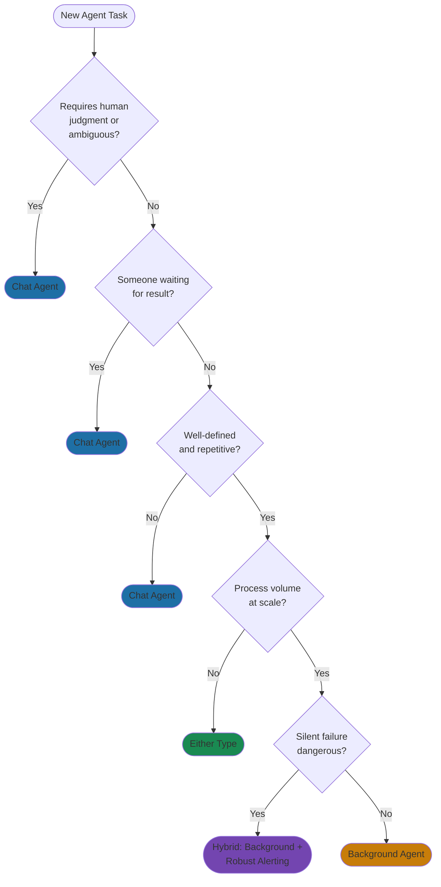
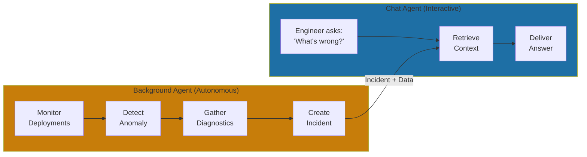

# The 2 Agent Types You Need

Chat agents vs background agents—when to use each.

> "We tried to build one agent framework for everything. It failed. Chat agents need to be fast and helpful. Background agents need to be thorough and reliable. Different requirements, different architectures."

**The structural insight:** At Yirifi, the distinction emerged from failure. Our first "universal agent" was too slow for chat (users abandoned) and too unsupervised for background work (errors accumulated). When we split into two types—chat agents optimized for interaction and background agents optimized for autonomy—both improved dramatically. The DevOps, QA, and Finance microsites each have both types: chat agents for questions, background agents for automation.

At Yirifi, our first "universal agent" was supposed to handle it all—answering employee questions, processing documents overnight, generating reports on demand. One codebase, one deployment, one team. The logic made sense on a whiteboard. The reality: when employees asked simple questions, the agent was too slow. It was built for thoroughness, not speed, and users abandoned conversations before getting answers. When that same agent ran overnight batch jobs, it made mistakes that accumulated for hours unnoticed—built for interaction, not autonomous operation.

The breakthrough came when we stopped fighting the constraints. Agents that talk to humans have fundamentally different requirements than agents that work while humans sleep. We split into two types—chat agents optimized for speed and helpfulness, background agents optimized for reliability and scale—and both immediately improved.

This isn't unique to Yirifi. The distinction is baked into how the market is evolving. The conversational AI market is growing at 23% annually while the autonomous AI agent market is expanding at 45% CAGR—both figures from BoldDesk's 2025 analysis[^bolddesk-agents]. These aren't competing categories. They're complementary capabilities that any mature AI operation needs in combination.

### Chat Agents: The Human Interface

Chat agents enable humans to accomplish tasks through conversation. A human is waiting. Speed matters. The agent must respond in seconds.

The design requirements follow from that constraint. Chat agents operate with humans in the loop—the user guides, the agent assists. They need clarification capability because ambiguity is normal in conversation. They need graceful handoffs because sometimes they'll get stuck. Success is measured by user satisfaction and resolution rate, not processing volume.

Klarna proved what this looks like at scale. Their AI assistant, launched in February 2024, handled 2.3 million customer conversations in its first month—two-thirds of all customer service chats[^klarna-press]. Response times dropped from 11 minutes with human agents to under 2 minutes. The assistant matched human satisfaction scores while doing the equivalent work of 700 full-time employees. That translated to a projected $40 million profit improvement for 2024[^klarna-press].

Notice the design: Klarna's agent is fundamentally interactive. It handles refund inquiries, order tracking, product questions—all tasks where a customer is actively waiting and can escalate when needed.

At Yirifi, every microsite has a chat agent for this exact pattern. The DevOps agent answers "Why did the last deployment fail?" The QA agent handles "What tests are blocking this release?" The Marketing agent responds to "What's our current campaign performance?" Each is optimized for real-time answers, not overnight processing.

### Background Agents: The Autonomous Workers

Background agents execute well-defined tasks without human supervision. No one is watching. No one is waiting. They're triggered by schedules, events, or API calls—not human messages.

Design requirements differ in kind. Where chat agents prioritize seconds, background agents can take minutes or hours. Where chat agents ask for help when confused, background agents must succeed, retry intelligently, or fail safely with comprehensive logging. Chat agents maintain conversation context; background agents maintain task state and audit trails. Idempotency matters—running the same job twice shouldn't create duplicates or errors.

GitHub Copilot's coding agent illustrates this. Copilot Chat provides real-time coding assistance through conversation. The Copilot coding agent operates independently[^github-coding-agent]. Assign it a GitHub Issue, and it works autonomously—analyzing the problem, writing code across multiple files, committing changes, opening a draft PR. No human watches each step. When it's done, the PR is waiting for review.

At Yirifi, background agents handle what no one wants to do manually. The Risk microsite's agent scans for regulatory changes every night. The Data microsite's agent syncs analytics dashboards every hour. The Finance microsite's agent reconciles transactions daily. None of these need human interaction—they need reliability, auditability, and the ability to process volume.

### The Decision Framework

Five questions determine agent type.

**Does the task require human judgment or have ambiguous requirements?** Chat agent. Humans can clarify, redirect, and approve in real-time.

**Is someone waiting for the result?** Chat agent. Background agents introduce latency that frustrates users expecting immediate responses.

**Is the task well-defined and repetitive?** Background agent. If you can write clear success criteria and the task happens predictably, automation makes sense.

**Does it need to process volume at scale?** Background agent. Thousands of records overnight would overwhelm any interactive interface.

**Could failure go unnoticed with serious consequences?** This is the critical one. Background agents running at 3 AM can accumulate errors for hours. If silent failure is dangerous, keep a human in the loop through a chat agent—or design reliable alerting into your background agent.

### Hybrid Patterns: Both Working Together

The most sophisticated deployments use both types in coordination. At Yirifi, our DevOps microsite demonstrates the monitor-plus-resolve pattern: background agents monitor deployments and detect anomalies continuously. When something breaks, the background agent creates an incident, gathers diagnostics, notifies the team. When an engineer asks "What's wrong?", the chat agent delivers a contextual answer built from the background agent's analysis. Neither could do both jobs well.

Other patterns follow the same logic. Query-plus-report: a human requests information through chat, triggering background processing to compile results. Alert-plus-resolution: background agents detect issues, chat agents guide humans through fixes. Request-plus-fulfillment: chat agents accept requests, background agents process asynchronously.

Claude Code's subagent architecture embodies this hybrid pattern at a finer grain. The main agent handles interactive reasoning—understanding what you want, planning the approach—while spawning focused subagents for parallel background tasks: security scanning in one, test verification in another, documentation generation in a third[^claude-subagents]. Each subagent has isolated context, preventing one task from polluting another. The results flow back to the orchestrator, which maintains the coherent conversation with you.

### Where to Start

**For established organizations:** Start with background agents for well-documented, repetitive tasks. Lower change management overhead—users don't interact directly. High-volume data processing, report generation, compliance monitoring. Once you've proven AI reliability, introduce chat agents for high-stakes interactions where user acceptance matters.

**For startups:** You're building from scratch, so design for both from day one—but prioritize based on immediate pain. If user engagement drives your business, start with a chat agent that demonstrates AI value. If operational efficiency is the bottleneck, start with background agents that scale your operations. Either way, architect for both types from the beginning.

The mistake we made at Yirifi wasn't building a universal agent. It was assuming the requirements were universal too. The companies that recognize the chat/background distinction early—whether building new or retrofitting old—build agent systems that actually work.

## References

[^bolddesk-agents]: AI Agent vs Chatbot: Smarter Support Difference. [BoldDesk](https://www.bolddesk.com/blogs/ai-agent-vs-chatbot)

[^klarna-press]: Klarna AI assistant handles two-thirds of customer service chats in its first month. [Klarna Press Release, February 2024](https://www.klarna.com/international/press/klarna-ai-assistant-handles-two-thirds-of-customer-service-chats-in-its-first-month/)

[^github-coding-agent]: About coding agent. [GitHub Docs](https://docs.github.com/copilot/concepts/agents/coding-agent/about-coding-agent)

[^claude-subagents]: Anthropic. [Subagents in the SDK](https://platform.claude.com/docs/en/agent-sdk/subagents)

---

[Chapter Overview](./README.md) | [Next: The Agent Hub Pattern →](./02-the-agent-hub-pattern.md)
