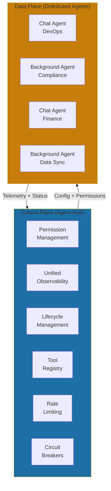

# The Agent Hub Pattern

Centralized orchestration, distributed execution.

> "Every agent at Yirifi goes through the hub. Not because we love centralization, but because we need one place to manage permissions, one place to see what's running, one place to shut things down when they go wrong."

**The structural insight:** Yirifi's Agent Hub emerged from operational necessity. When we had 5 agents, we managed them individually. When we had 15, chaos ensued—conflicting permissions, duplicate logging systems, no central visibility. The Agent Hub pattern provides centralized control (permissions, observability, kill switches) with distributed execution (agents run independently). It's the architectural equivalent of air traffic control: planes fly themselves, but someone coordinates the airspace.

At five agents, each had its own configuration, its own logs, its own permissions. We knew them by name. At fifteen, the cracks showed. Conflicting permissions meant one agent could access data another couldn't, with no clear reason why. Debugging required hunting through multiple logging systems with unsynchronized timestamps. When an agent started consuming excessive API tokens at 2 AM, we had no central kill switch—just frantic SSH sessions trying to locate the runaway process.

### The Control Plane Analogy

The concept is familiar from enterprise systems: a control plane managing distributed execution. The Agent Hub is a control plane for AI agents—architecturally similar to an API gateway, service mesh, or Kubernetes control plane. Same separation of concerns: centralized policy, distributed execution. The hub decides what agents can do; agents decide how to do it. Your existing infrastructure investments—IAM systems, logging infrastructure, on-call playbooks—extend directly.

### What the Hub Controls

The hub handles six responsibilities that become unmanageable when distributed: permission management (one update applies everywhere), unified observability (correlate timestamps without hunting across systems), lifecycle management (deploy, restart, health-check), tool registry (consistent access and versioning), rate limiting (prevent runaway costs), and circuit breakers (stop agents when downstream systems fail).

What stays distributed: agent execution itself, domain-specific logic, conversation state for chat agents, and task queues for background agents. Centralize control plane, distribute data plane.

### Three Implementation Patterns

**Hub-as-gateway** routes all agent requests through central infrastructure. You see everything, cross-cutting concerns become trivial. The cost: added latency on every request and a single point of failure.

**Hub-as-sidecar** deploys hub functionality alongside each agent. No single point of failure, lower latency—but deployment complexity and distributed state challenges. You're running fifteen sidecars that need to stay in sync.

**Hub-as-control-plane**—Yirifi's choice—separates configuration from execution. Agents pull configuration periodically and report telemetry back, but operate independently between syncs. Scales well, handles hub failures gracefully. Trade-off: eventual consistency when revoking permissions.

For teams building custom agent systems, the Claude Agent SDK—the same harness powering Claude Code—provides access to the tools, context management systems, and permissions frameworks you'd otherwise build from scratch[^claude-agent-sdk]. It's hub infrastructure packaged as a library, suitable for embedding in proprietary systems or extending with domain-specific capabilities.

### Replit's Production Implementation

Replit provides a compelling case study. With 30 million users and their Agent product launched in September 2024, they faced the orchestration problem head-on[^replit-temporal].

Their solution: every agent session runs as its own Temporal Workflow. Workflow IDs ensure only one active agent process per user session. Temporal coordinates the entire lifecycle: spinning up, checkpointing progress, shutting down.

As their engineering team noted: "It's a pretty bad user experience to have the agent get super far into something and then hit a catastrophic error, and you lose everything and have to restart"[^replit-temporal]. Their assessment: "Having something like Temporal's Durable Execution"—durable execution isn't a nice-to-have anymore—it's required for reliable agents, "especially long-lived agents"[^replit-temporal].

(Replit isn't immune to agent failures—Section 4 covers a dramatic cascading failure incident from July 2025. But durable orchestration helps contain the blast radius.)

### The Performance Question

For a three-agent workflow with centralized coordination, production benchmarks show p50 latency at 1,850ms, p95 at 4,200ms, p99 at 6,100ms, with throughput capping around 48 requests per second[^mcp-benchmarks]. Sufficient for many workloads, but a constraint at scale.

Distributed architectures show dramatic improvements when needed. One production system serving over 10 million queries daily moved from centralized orchestration (p95 latency of 12.3 seconds) to distributed with caching (p95 of 1.8 seconds)—an 85% improvement—plus 60% cost reduction[^langgraph-case].

The debugging trade-off cuts both ways. Centralized systems offer simpler auditability—single decision pathway, clear execution checkpoints. Distributed systems require sophisticated tooling (OpenTelemetry, Jaeger), but one study found 70% reduction in debugging time with comprehensive observability platforms[^marktechpost].

### When to Evolve

Companies like LinkedIn (SQL Bot) and AppFolio (Realm-X) have migrated from centralized to distributed orchestration as they scaled[^marktechpost]. According to engineers involved, the pattern typically takes eight months for a complete migration—assessment, architecture design, incremental implementation, deployment.

The key lesson: use the strangler fig pattern. Incremental replacement, feature flags for instant rollback, non-critical systems first.

Build the hub early, even if minimal. Grow it as your agents grow. The alternative is discovering you need one at 2 AM when something is burning.

## References

[^replit-temporal]: Replit Uses Temporal to Power Replit Agent Reliably at Scale. [Temporal Case Study](https://temporal.io/resources/case-studies/replit-uses-temporal-to-power-replit-agent-reliably-at-scale)

[^mcp-benchmarks]: MCP. [Server LangGraph Benchmarks](https://mcp-server-langgraph.mintlify.app/comparisons/benchmarks)

[^langgraph-case]: P95 Latency Tuning: LangGraph + Vector Cache. [Rajni Singh, LinkedIn](https://www.linkedin.com/pulse/p95-latency-tuning-langgraph-vector-cache-rajni-singh-oftnc)

[^marktechpost]: Comparing the Top 5 AI Agent Architectures in 2025. [MarkTechPost](https://www.marktechpost.com/2025/11/15/comparing-the-top-5-ai-agent-architectures-in-2025-hierarchical-swarm-meta-learning-modular-evolutionary/)

[^claude-agent-sdk]: Anthropic. [Building Agents with the Claude Agent SDK](https://www.anthropic.com/engineering/building-agents-with-the-claude-agent-sdk)

---

[← Previous: The 2 Agent Types You Need](./01-the-2-agent-types-you-need.md) | [Chapter Overview](./README.md) | [Next: Designing Agent Interfaces →](./03-designing-agent-interfaces.md)
