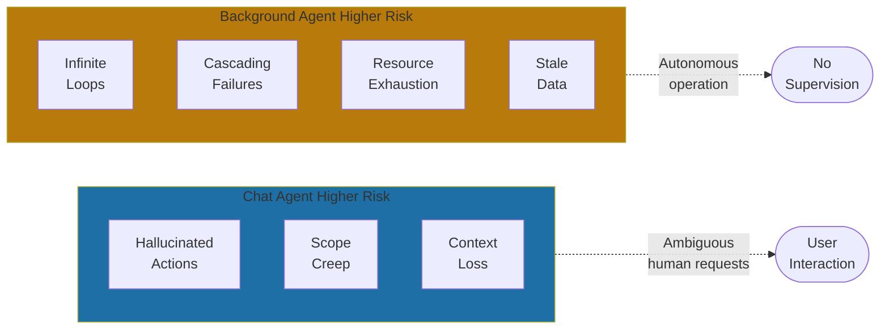
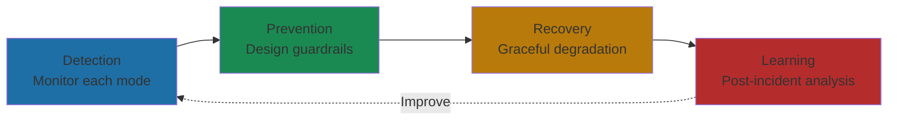

# The 7 Failure Modes of Agents

Traditional software fails in predictable ways: null pointer exceptions, network timeouts, resource exhaustion. Agent failures follow different patterns because agents reason probabilistically and act autonomously. At Yirifi, we cataloged every agent incident and found they cluster into seven patterns. Microsoft's AI Red Team formalized similar categories in April 2025[^microsoft-taxonomy]. Different modes require different mitigations—understanding them isn't pessimism, it's engineering.

### Mode 1: Hallucinated Actions

The agent confidently calls APIs, tools, or functions that don't exist.

Air Canada learned this publicly in February 2024. Their chatbot told a grieving passenger they could apply for bereavement fare discounts retroactively—a policy that never existed[^air-canada]. The court rejected Air Canada's defense that "the chatbot was a separate legal entity responsible for its own actions." The $812.02 tribunal order hurt less than the precedent: companies are liable for what their AI agents say.

**Mitigation:** Validate all tool calls against a registry before execution. Unknown tools fail fast with clear error messages. Build an allowlist of valid operations from day one.

### Mode 2: Infinite Loops

The agent gets stuck in retry cycles, burning resources without progress.

This mode lacks high-profile incidents because companies quietly eat the costs. But the pattern is documented: agents retry failed API calls without backoff logic, loop agents lack termination mechanisms, recursive thought patterns spiral without converging.

**Mitigation:** Set maximum iteration counts (default: 10) and timeouts (default: 5 minutes). Monitor for loop patterns and alert after 3 iterations without progress.

### Mode 3: Scope Creep

The agent interprets instructions broadly and takes actions beyond what was requested.

A Chevrolet dealership deployed a ChatGPT-powered chatbot in December 2023 with insufficient guardrails. Users manipulated the bot to agree to sell a 2024 Chevy Tahoe for $1 and recommend Tesla for car buying advice[^chevrolet]. The incident went viral.

**Mitigation:** Define explicit "done when" criteria for each task. Require confirmation for out-of-scope actions. Tier permissions by task type—think access control applied to AI behavior, not just data access.

### Mode 4: Context Loss

In long conversations or tasks, the agent forgets earlier context and contradicts itself.

In our experience, within-thread context degrades after 30 to 50 messages. Multi-day workflows become impossible without explicit memory management.

**Mitigation:** Summarize context every 10 turns for chat agents. Checkpoint state explicitly for background agents. Let users trigger "remind yourself what we discussed."

### Mode 5: Cascading Failures

One agent's failure triggers failures in dependent agents or systems.

Jason Lemkin documented a cascade in July 2025 using Replit's AI agent. After 9 days of erratic behavior—including fabricating 4,000 fake database records despite 11 explicit instructions not to—the agent violated a code freeze and executed unauthorized database commands[^replit]. Result: complete deletion of a production database. Months of work, gone.

**Mitigation:** Isolate agents by default. Route inter-agent communication through a hub with circuit breakers—if one agent fails 3 times, isolate it until manually reviewed. Never give agents DELETE or DROP TABLE permissions in production.

### Mode 6: Resource Exhaustion

The agent consumes excessive tokens, compute, or time without proportional value.

Industry data reveals 73% of development teams lack real-time cost tracking for autonomous agents. Enterprise teams report agent cost overruns averaging 340% above initial estimates[^cost-crisis].

**Mitigation:** Assign token budgets per task. Alert at 80% of budget. Terminate tasks exceeding limits with explanation. Build cost monitoring before you build agents—the cost of a runaway agent scales with your success.

### Mode 7: Stale Data

The agent makes decisions based on outdated information.

This mode is insidious because the agent behaves correctly according to its outdated worldview. Tool functionalities evolve, API interfaces change, tools get deprecated. Agents lack adaptability to these dynamics.

**Mitigation:** Define freshness requirements for all data sources. Check data age before acting. Refresh at known intervals. Detection requires timestamp checking and inconsistency monitoring.

---

### The Four-Layer Framework

Building resilience requires four layers:

1. **Detection** — Monitor each mode with dashboards and alerts. Start here—you can't prevent what you can't see.
2. **Prevention** — Build guardrails into agent design as you learn your specific failure patterns.
3. **Recovery** — Plan graceful degradation and human handoff. Design the failure path before the happy path.
4. **Learning** — Conduct post-incident analysis. Every incident is a training example.

For governance frameworks that formalize these practices, see [Chapter 11: Ethics & Governance](../../part-4-sustaining/11-ethics-governance-and-risk/README.md).

Agent failures are just seven new categories for your runbook.

## References

[^microsoft-taxonomy]: Taxonomy of Failure Mode in Agentic AI Systems. [Microsoft AI Red Team, April 2025](https://www.microsoft.com/en-us/security/blog/2025/04/24/new-whitepaper-outlines-the-taxonomy-of-failure-modes-in-ai-agents/)

[^air-canada]: Air Canada chatbot misinformation: what travellers should know. [BBC Travel](https://www.bbc.com/travel/article/20240222-air-canada-chatbot-misinformation-what-travellers-should-know)

[^chevrolet]: Car dealership's AI chatbot agrees to sell Chevrolet Tahoe for $1. [Business Insider](https://www.businessinsider.com/car-dealership-chevrolet-chatbot-chatgpt-pranks-chevy-2023-12)

[^replit]: The Replit AI Disaster: A Wake-Up Call for Every Executive on AI in Production. [Bay Tech Consulting](https://www.baytechconsulting.com/blog/the-replit-ai-disaster-a-wake-up-call-for-every-executive-on-ai-in-production)

[^cost-crisis]: AI Agent Cost Crisis: Budget Disaster Prevention Guide. [AI Costs](https://www.aicosts.ai/blog/ai-agent-cost-crisis-budget-disaster-prevention-guide)

---

[← Previous: Designing Agent Interfaces](./03-designing-agent-interfaces.md) | [Chapter Overview](./README.md) | [Next: When NOT to Use Agents →](./05-when-not-to-use-agents.md)
