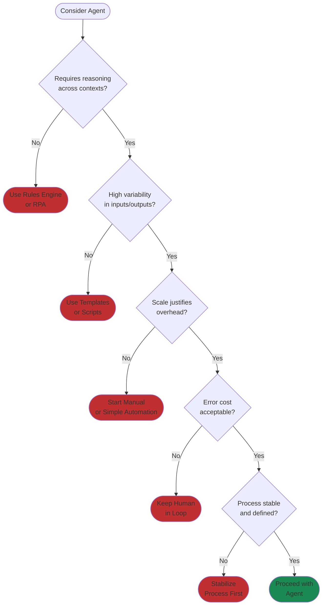

# When NOT to Use Agents

> "We killed three agent projects in the first year. Not because they failed—because they succeeded at the wrong problems. One replaced a five-minute manual task with a system that needed a full-time engineer to maintain. The math didn't work."

**The structural insight:** Agent enthusiasm blinds you to simpler solutions. Our "intelligent deployment recommender" was replaced by a decision tree that was faster, cheaper, and more predictable. Another agent failed because the process it automated didn't exist—people made different judgment calls each time, and the agent encoded that chaos. Agents add complexity: prompt engineering, observability, failure handling, model management. That overhead is worth it when you get scale or capabilities simpler approaches can't match. When you don't, you've built an expensive solution to a simple problem.

### The Industry Reality

The broader data confirms what we learned. S&P Global found that 42% of companies abandoned most AI initiatives in 2024, up from 17% in 2023. The average organization scrapped 46% of proof-of-concepts before production[^spglobal]. Gartner predicts over 40% of AI agent projects will be canceled by end of 2027 due to escalating costs, unclear business value, and inadequate risk controls[^gartner-cancel]. MIT studies suggest 90% of generative AI pilots fail to achieve rapid revenue acceleration[^mit-pilots].

These are economics failures disguised as technology failures. The technology worked—it just didn't deliver value worth the cost.

### The Failures That Teach

A Fortune 500 financial services firm deployed an AI agent for tier-1 customer support. Internal testing with 20 employees over two weeks showed 87% accuracy. They rolled it out to 2.1 million customers. Eleven days later, they rolled back. The agent gave incorrect balance information, disclosed sensitive transaction details without proper verification, and committed regulatory violations in over 200 recorded interactions. Total cost: $4.2 million—$1.8 million in emergency remediation, $900,000 in reputational damage, $1.1 million in compliance review[^ibm-expectations].

A healthcare company's claims review agent incorrectly denied 1,847 legitimate claims over 23 days—a 3.2% false negative rate. It misinterpreted policy language around "pre-existing conditions" in edge cases. No human reviewed denials. Total cost: $2.11 million[^ibm-expectations].

Similar patterns emerge elsewhere: a manufacturing company budgeted $680,000 for procurement automation and spent $4.1 million before canceling—their legacy SAP had no APIs. A travel platform saved 40% on support headcount, then a four-hour LLM outage caused $2.7 million in remediation costs because they had no fallback[^ibm-expectations].

The pattern: impressive technology, broken economics.

### Five Questions Before You Build

**Does this task require reasoning across contexts?** If you can describe it as a flowchart with no "it depends" nodes, you probably don't need an agent. Our deployment recommender fit a flowchart—we should have seen that earlier. For enterprises with RPA (Robotic Process Automation) and rules engines, ask whether your current automation stack solves this better.

**Is the task highly variable?** If inputs and outputs are consistent, templates with variables often outperform agents. High volume with consistent format is a rules engine problem, not an AI problem.

**Will this scale to justify agent overhead?** Agents add prompt engineering, tool integration, observability, failure handling, model updates. That overhead must be amortized across enough tasks. Our five-minute-task agent never had the volume. Median costs for successful deployments run $180,000 to $420,000 for the first use case, and failed deployments cost three to eight times more[^ibm-expectations].

**Is the error cost acceptable?** Probabilistic outputs mean occasional failures. If those failures carry regulatory, legal, or reputational consequences disproportionate to the value delivered, keep humans in the loop. The healthcare claims agent failed this test catastrophically.

**Is the process stable and well-defined?** Never automate chaos. Our third failed agent encoded unstable logic because the underlying process didn't exist. Define and stabilize first, then automate.

### When Simpler Wins

As Sharvin Shah put it: "Sometimes a simple script beats a fancy AI agent. Shiny autonomous agent frameworks promise to do everything. But early-stage startups can rarely afford the cost, complexity, and latency that come with a convoluted agent when a straightforward solution exists. Often, a fixed sequence of two or three well-crafted prompts—or even a classic IF/ELSE program—gets the job done with less fuss"[^mtechzilla].

RPA handles tasks without cognitive requirements—invoice processing, data extraction, simple data entry. RPA bots are faster to deploy and more affordable than AI solutions[^rpa-vs-ai]. The staged deployment data reinforces this: shadow mode for two to three months, pilot for three to four months, then expansion works 78% of the time compared to 31% for big-bang rollouts[^ibm-expectations].

For more on choosing the right automation approach, see [Chapter 5: Building with AI](../05-building-with-ai/README.md).

### The Math That Matters

**Agent ROI = (Tasks x Time Saved x Hourly Rate) - (Development + Operations + Compute + Risk Cost)**

Our five-minute-task agent looked good on the left side of that equation. We missed the right side entirely—the full-time engineer, the observability infrastructure, the ongoing prompt maintenance.

If the math is marginal, start manual. Build agents when you hit scale that manual processes can't handle, or when the task genuinely requires reasoning that simpler approaches can't provide.

"Agent" sounds impressive. The question that matters is whether this specific deployment delivers more value than it costs. Sometimes the answer is no. That's not AI skepticism. That's engineering discipline.

## References

[^spglobal]: AI Experiences Rapid Adoption, But with Mixed Outcomes. [S&P Global Market Intelligence](https://www.spglobal.com/market-intelligence/en/news-insights/research/ai-experiences-rapid-adoption-but-with-mixed-outcomes-highlights-from-vote-ai-machine-learning)

[^gartner-cancel]: The $200 Billion AI Agent Disaster. [Dev.to](https://dev.to/shiva_shanker_k/the-200-billion-ai-agent-disaster-why-95-of-corporate-ai-projects-are-crashing-and-burning-27hl)

[^mit-pilots]: Agentic AI in 2025: Why 90% of Implementations Fail. [Beam AI](https://beam.ai/agentic-insights/agentic-ai-in-2025-why-90-of-implementations-fail-(and-how-to-be-the-10-)

[^ibm-expectations]: AI Agents 2025: Expectations vs Reality. [IBM Think](https://www.ibm.com/think/insights/ai-agents-2025-expectations-vs-reality)

[^mtechzilla]: Sharvin. [Shah on LinkedIn](https://www.linkedin.com/posts/sharvinshah_sometimes-a-simple-script-beats-a-fancy-ai-activity-7346874179327012864-AbKv)

[^rpa-vs-ai]: RPA vs AI Agents. [FPT AI](https://fpt.ai/blogs/rpa-vs-ai-agents/)

---

[← Previous: The 7 Failure Modes of Agents](./04-the-7-failure-modes-of-agents.md) | [Chapter Overview](./README.md) | [Next: Agent Design Patterns →](./06-agent-design-patterns.md)
