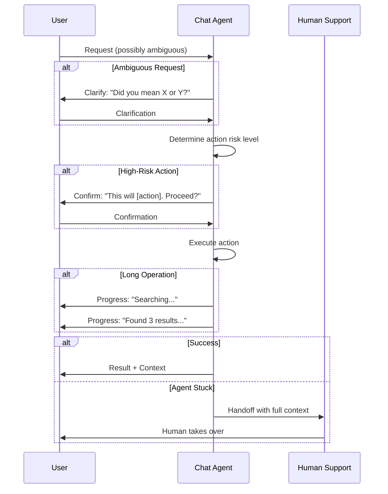
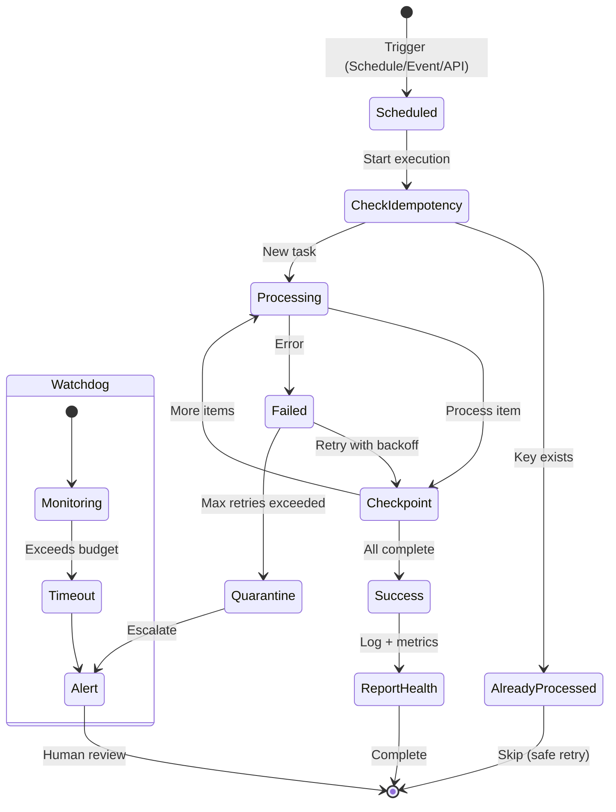

# Agent Design Patterns

Two agent types, two design philosophies.

---

> "Chat agents fail when they act before clarifying. Background agents fail when they can't explain what they did at 3 AM. Both need trust patterns—chat agents earn trust through confirmation, background agents through observability. We learned this the hard way with a DevOps agent that guessed which database to roll back."

**The structural insight:** At Yirifi, agent design evolved through failure. Chat agents follow "clarify, confirm, act"—slower, but users trust them. Background agents follow "assume failure"—explicit success reporting, mandatory timeouts, automatic escalation when outputs don't appear. Every Yirifi background agent has a dead man's switch: if it doesn't report healthy within expected time, we assume it's failed.

## Chat Agent Patterns

Five patterns distinguish chat agents users trust from those they avoid.

**Clarification loops** resolve ambiguity before action. When a request has multiple interpretations, the agent asks rather than guesses. "Did you mean X or Y?" beats guessing wrong.

**Graceful handoff** transfers to humans when the agent hits limits. The worst outcome isn't a wrong answer—it's an agent that can't help and can't escalate. Handoff must carry full context: what the user asked, what the agent tried, why it couldn't resolve.

**Context persistence** means users never repeat themselves. Within sessions, maintain conversation history. Across sessions, store preferences. Summarize context every 10 turns to avoid token limits while maintaining continuity.

**Action confirmation** matches risk to verification. Read-only needs no confirmation. Reversible actions use implicit confirmation: "I'll update the ticket—let me know if that's wrong." Irreversible actions need explicit confirmation. Critical actions need multi-factor.

**Progress visibility** shows what's happening during long operations. Under five seconds, no indicator. Up to thirty, show status. Beyond that, provide updates.

### Intercom's Journey: From 25% to 66%

Intercom's Fin provides the clearest case study at scale. At launch in March 2023, Fin achieved 25% resolution rate using GPT-4, constrained to answer only from help center content—a constraint that "radically increases its predictability and trustworthiness"[^intercom-launch].

By October 2024, Fin 2 reached 51% average resolution. The improvement came partly from switching to Anthropic's Claude. Intercom's Chief Strategy Officer noted: "With Claude, Fin answers more questions, more accurately, with more depth, and more speed"[^intercom-claude].

By late 2025, Fin 3 hit 66% average across 6,000 customers, with 20% achieving above 80%. Accuracy reached 99.9%[^intercom-fin3]. Beyond model upgrades, Intercom built custom retrieval trained on 400,000 real queries—their reranker outperformed commercial solutions while cutting costs 80%[^intercom-reranker].

**The handoff paradox:** Intercom found that "broad or generic guidance can cause a sharp increase in escalations." They recommend writing escalation guidance "for the narrowest possible situations where human support is truly required." Why? "Most customers accept escalation offers when presented, even if Fin could have resolved the issue"[^intercom-escalation]. Offer handoff too readily, users take it. Don't offer it readily enough, they leave frustrated.

---

## Background Agent Patterns

Six patterns separate trustworthy background agents from regrettable ones. If you're from enterprise batch processing, these look familiar—idempotency, checkpointing, alerting. The difference with AI agents is probabilistic output. A batch job runs or doesn't. An AI agent might produce plausible-looking garbage—output that silently corrupts downstream systems.

**Idempotency** ensures safety on multiple runs. Schedulers misfire, processes crash mid-execution. Record an idempotency key with "processing" status, execute logic, update to "completed" on success[^agent-design]. The first duplicate invoice costs more than the implementation.

**Checkpointing** enables resumption from interruption. Long-running tasks will fail mid-execution. Without checkpoints, restart from zero. Temporal or similar workflow engines handle this—don't reinvent it badly.

**Alerting** prevents silent failures—the dead man's switch. Four types: failure alerts on exceptions, timeout alerts when tasks exceed duration, anomaly alerts when outputs deviate from expected, and missing alerts when expected tasks don't run. That last one catches silent killers—schedulers that failed to trigger.

**Audit logging** answers: what did the agent do? Log actions, decisions, inputs, outputs. Make them immutable, timestamped, correlated by task ID. Not optional for regulated industries.

**Graceful degradation** prevents perfect from destroying good. Processing 10,000 records shouldn't abort because one failed. Skip and continue for independent items, quarantine failures for investigation.

**Resource budgeting** prevents runaway execution. As Section 4 covered, cost overruns are the rule—73% of teams lack real-time cost tracking. Implement time, token, cost budgets, and iteration limits. This isn't optional—it's the difference between a manageable mistake and a resignation letter.

### The Klarna Lesson

Klarna's AI assistant—the 2.3 million conversations monthly we covered in Section 1—became a cautionary tale. By May 2025, their CEO acknowledged they had "gone too far with AI automation" and announced hiring humans again after a year-long freeze. Customers had grown frustrated with chatbots delivering inconsistent advice and failing to resolve disputes[^klarna-pivot].

The recalibrated strategy assigns routine tasks to AI—transaction tracking, simple refunds—while humans handle disputes, emotional interactions, and nuanced advice. The lesson: automation at scale reveals edge cases you didn't anticipate. Build monitoring that surfaces anomalies before they become crises. Klarna had the automation. What they needed was observability.

---

## The Core Difference

Chat agents can ask for clarification. Background agents must figure it out themselves or fail gracefully. Chat agents succeed when users are satisfied. Background agents succeed when tasks complete correctly—and nobody notices because nothing went wrong.

Build observability infrastructure before you need it. These patterns aren't nice-to-haves. They're the difference between automation you can trust while you sleep and automation that keeps you up at night.

## References

[^intercom-launch]: Announcing Intercom's new AI chatbot. [Intercom Blog, March 2023](https://www.intercom.com/blog/announcing-intercoms-new-ai-chatbot/)

[^intercom-claude]: Preparing for the customer agent future. [Intercom Blog, October 2024](https://www.intercom.com/blog/preparing-for-the-customer-agent-future/)

[^intercom-fin3]: What's new with Fin 3. [Intercom Blog, Late 2025](https://www.intercom.com/blog/whats-new-with-fin-3/)

[^intercom-reranker]: How We Built a World-Class Reranker for Fin. [Intercom Engineering](https://www.intercom.com/blog/how-we-built-a-world-class-reranker-for-fin/)

[^intercom-escalation]: Manage Fin AI Agent's escalation guidance and rules. [Intercom Help Center](https://www.intercom.com/help/en/articles/12396892-manage-fin-ai-agent-s-escalation-guidance-and-rules)

[^agent-design]: Agent Design Patterns. [rlancemartin.github.io](https://rlancemartin.github.io/2026/01/09/agent_design/)

[^cost-crisis]: AI Agent Cost Crisis: Budget Disaster Prevention Guide. [AI Costs](https://www.aicosts.ai/blog/ai-agent-cost-crisis-budget-disaster-prevention-guide)

[^klarna-pivot]: Klarna's Strategic Turn from AI Overload to Human-Centric Growth. [AI Invest, May 2025](https://www.ainvest.com/news/klarna-strategic-turn-ai-overload-human-centric-growth-2505/)

---

[← Previous: When NOT to Use Agents](./05-when-not-to-use-agents.md) | [Chapter Overview](./README.md)
