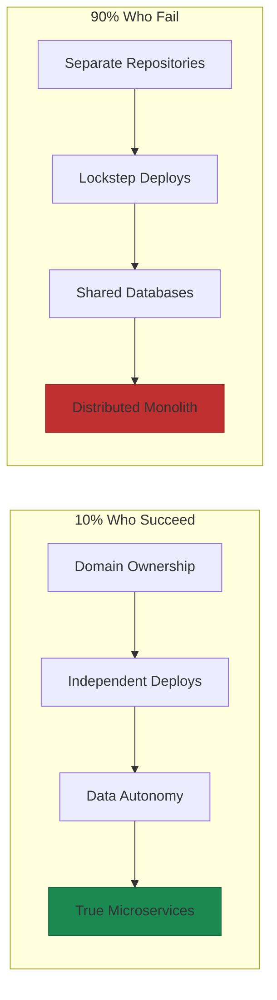

# The Microsite Advantage

Separate repositories, containerized deployments, service discovery infrastructure—and teams still batch deploy like they're running a monolith[^vfunction]. Different containers, same bottleneck.

The 10% who actually succeed do something different. They don't just split code into services. They split ownership. They split deployment cycles. They split the ability to make decisions. The architecture follows the organization, not the other way around.

This is where the microsite pattern begins—not with technology choices, but with structural clarity: unambiguous ownership and the ability to move independently.

## Why Most Microservices Fail

Uber learned this the hard way. By 2020, they had 2,200 microservices. Building a simple feature required navigating 50 services across twelve different teams. Engineers spent more time in meetings, design reviews, and code reviews than actually building. The services were independent in theory but coupled in practice[^uber-doma].

The symptoms are consistent across organizations that fall into this trap:

**Lockstep deployments.** Changes to one service require coordinated deployments of multiple services. The independence that microservices promised evaporates. Teams wait for other teams, and release trains form whether you wanted them or not.

**Networked monoliths.** Services that appear independent have to be deployed together. Teams build code within each other's services. Shared data models create hidden dependencies. You've distributed the complexity without distributing the ownership.

**Dependency chaos.** Calls between services go many layers deep. A latency spike in an nth-level dependency causes cascade failures upstream. No one can reason about the system without specialized tooling, and even then it's guesswork.

Amazon Prime Video demonstrated this failure dramatically. Their microservices implementation had two-hour deploy times before they migrated back to a monolith, reducing deployment to five minutes and saving 90% on costs. The orchestration layer cost more than the actual compute work[^prime-video].

The pattern is clear: teams underestimate the operational overhead that distributed systems introduce. Every network call becomes a potential failure point. Every service boundary creates integration complexity. Every deployment becomes a coordination exercise.

## What the Successful 10% Do Differently

The companies that capture microservices benefits share specific characteristics. They're not using different technology. They're using different organizational structures.

### They Align Organization with Architecture

Successful implementations follow Conway's Law deliberately, structuring teams to match desired service boundaries. Netflix operates over 1,000 independent microservices, each owned by autonomous teams that develop, test, and deploy features independently[^netflix]. Amazon deploys code every 11-12 seconds on average because every team exposes functionality through APIs with complete ownership of their slice[^deploy-frequency].

The critical insight: you can't have independent services without independent teams. Architecture is a reflection of organization, not a substitute for it.

### They Enforce True Autonomy

The 10% who succeed enforce strict boundaries[^microservices-autonomy]:

**Data autonomy.** Each service maintains its own database with complete control over its data. No shared databases, no tight coupling through data.

**Development autonomy.** Teams choose their technology stacks, development processes, and deployment strategies independently. The platform provides guardrails, not mandates.

**Operational autonomy.** Services operate and scale independently. Failures are contained and prevented from cascading system-wide.

**Strong ownership.** The team owning the service controls everything about it: programming paradigms, deployment practices, tooling choices.

### They Deploy Independently

Successful teams ensure each service can be deployed without affecting others. Netflix deploys services independently so engineers don't wait for other teams' code to be ready. They ship when their service is stable, not when everyone else is.

High performers deploy 208x more frequently than low performers and have 106x faster lead time[^dora-metrics]. But these results require fundamental shifts in team structure and deployment practices. The architecture alone isn't enough.

## The Microsite Pattern

At Yirifi, we use the term "microsite" rather than "microservice" to emphasize what actually matters: each domain owns a complete, self-contained surface. Not just an API, but the dashboard, the agents, the data layer, and the deployment configuration.

A microsite is a self-contained domain application that:

- Owns its API, dashboard, data layer, and deployment
- Follows shared architectural patterns and uses shared infrastructure
- Can be deployed, scaled, and updated independently
- Is owned end-to-end by one team (or even one person)

| Domain | What It Owns |
|--------|--------------|
| DevOps | Deployment status, system health, infrastructure metrics |
| QA | Test results, coverage metrics, quality gates |
| Data | Analytics dashboards, data quality, pipeline monitoring |
| Marketing | Campaign performance, content analytics, attribution |
| Sales | Pipeline visibility, customer interactions, forecasting |
| Finance | Billing, revenue metrics, financial reporting |

One person manages 15+ Yirifi microsites because the pattern is right. The same pattern scales to hundreds of engineers.

## The DOMA Transformation

Uber's solution to their 2,200-service chaos was Domain-Oriented Microservice Architecture (DOMA). They consolidated services into 70 well-defined domains, each with a single entry point[^uber-doma].

The results:

- Platform support costs dropped 10x
- Onboarding time reduced 25-50%
- Feature integration time dropped from three days to three hours
- Two major platform rewrites completed without requiring upstream migrations

The key insight from Uber: "A microservice architecture is really just one large distributed program and you can apply the same principles to its evolution that you would apply to any piece of software."

Domains, not services, are the unit of organizational design.

## When Not to Use Microsites

The microsite pattern isn't always the answer.

**Small teams.** If you have fewer than 10 engineers, a modular monolith likely serves you better. Shopify deliberately chose a modular monolith, recognizing that microservices would create operational overhead that wasn't worth the independence benefits at their team size[^shopify].

**Unclear domain boundaries.** When business domains aren't well-understood, premature decomposition creates distributed monoliths. You need to know where the seams are before you split.

**Insufficient operational maturity.** Without robust CI/CD, monitoring, and incident response capabilities, distributed systems become distributed problems.

**Early-stage products.** Startups iterating quickly on unclear requirements benefit from monolithic simplicity. Split later when you know what you're building.

The reliability math is unforgiving. A monolith with 99.9% uptime delivers 8.76 hours of downtime annually. Five microservices with the same individual reliability deliver 43.8 hours—five times less reliable despite equally robust components[^reliability].

## The Pattern Works at Any Scale

The microsite pattern isn't about company size. It's about domain clarity and ownership boundaries.

For startups, even before you have "teams," think in domains. The boundaries you draw now become the team boundaries later. Retrofitting this pattern later—debugging distributed systems, coordinating cross-service changes—costs significantly more than building it in from the start[^retrofit-cost].

For established organizations, domain teams already have expertise. Give them autonomy within guardrails—they'll move faster than a centralized team ever could.

The pattern works because it aligns three things that must be aligned: architecture, organization, and deployment. When these three move independently, you get the benefit of distributed systems without the coordination overhead of distributed teams.

## References

[^vfunction]: vFunction. [How to Avoid Microservices Anti-Patterns](https://vfunction.com/blog/how-to-avoid-microservices-anti-patterns/)

[^uber-doma]: Uber Engineering. [Introducing Domain-Oriented Microservice Architecture](https://www.uber.com/blog/microservice-architecture/)

[^prime-video]: XYZBytes. [Microservices to Monolith Migration](https://www.xyzbytes.com/blog/microservices-to-monolith-migration-2025)

[^netflix]: Clustox. [Netflix Case Study](https://www.clustox.com/blog/netflix-case-study/)

[^deploy-frequency]: Product School. [Deployment Frequency](https://productschool.com/blog/analytics/deployment-frequency)

[^microservices-autonomy]: TestDriven.io. [Microservices Team Culture](https://testdriven.io/blog/microservices-team-culture/)

[^dora-metrics]: Devtron. [Microservices CI/CD Best Practices](https://devtron.ai/blog/microservices-ci-cd-best-practices/)

[^shopify]: Shopify Enterprise. [Monolithic to Microservices](https://www.shopify.com/sg/enterprise/blog/monolithic-to-microservices)

[^reliability]: Pyyne. [The Microservices Trap](https://www.pyyne.com/post/the-microservices-trap-why-your-next-project-shouldn-t-start-distributed)

[^retrofit-cost]: SoftwareSeni. [The Real Cost of Microservices: When Distributed Systems Multiply Your Expenses](https://www.softwareseni.com/the-real-cost-of-microservices-when-distributed-systems-multiply-your-expenses/)

---

[Chapter Overview](./README.md) | [Next: Anatomy of a Microsite →](./02-anatomy-of-a-domain-microsite.md)
