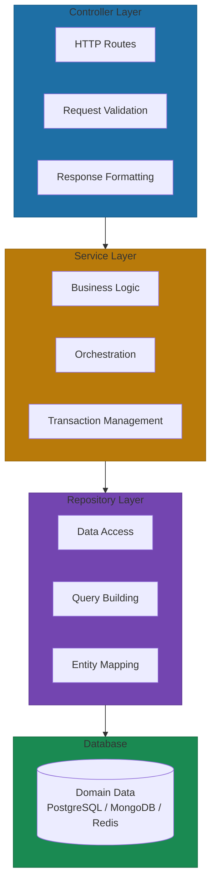

# Anatomy of a Microsite

The three-layer architecture pattern isn't new. Controllers, services, repositories—this is the structure that every web framework has been pushing for two decades. What's different in the microsite pattern is the enforcement. When consistency becomes mandatory rather than optional, something interesting happens: cognitive load drops, testing becomes predictable, and AI agents can interact with any service through the same interface.

> "Every microsite follows the same three-layer contract. Any engineer can understand any microsite immediately. Testing is straightforward. AI agents interact at the API layer without knowing internals."

## The Three-Layer Contract

Every microsite at Yirifi follows this architecture:



Each layer has distinct responsibilities that prevent confusion and coupling[^baeldung].

**The Controller Layer** handles the HTTP request/response lifecycle only. Request validation, parameter extraction, response formatting, HTTP status codes. It should be minimal code—no business logic. If you find yourself writing conditional logic here, you're putting it in the wrong place.

**The Service Layer** owns all business logic. Transaction management, cross-entity operations, data transformations, and application-specific rules. This is where you orchestrate multiple repository calls, implement validations beyond simple data checks, and handle application-level error handling. The majority of your test coverage belongs here[^shore].

**The Repository Layer** handles data access exclusively. CRUD operations, query construction, database connection management, and mapping between database records and domain entities. Repositories deal with raw data without significant transformation.

### The Common Confusion Point

The most common mistake: placing logic in the wrong layer when it touches both data and business rules.

The key distinction: if logic involves multiple entities or business rules, it belongs in the Service layer. If it's purely about how to fetch or store a single entity, it's Repository layer[^baeldung].

**Service layer example:** "Calculate order total by aggregating line items, applying discount rules, and checking inventory availability."

**Repository layer example:** "Fetch order by ID using optimistic locking" or "Execute a complex JOIN query for order details."

Data transformation for serialization happens in the Service layer. Entity-to-row mapping stays in Repository.

## Why Exactly Three Layers

**The two-layer problem.** Without a Service layer, business logic leaks into Controllers. This makes them untestable without HTTP infrastructure and creates tight coupling between API contracts and data models. You lose the ability to reuse business logic across different entry points—REST API, GraphQL, message queue consumers all need access to the same rules[^webasha].

**The four-plus-layer cost.** Additional layers add complexity with diminishing returns for most microsites[^vfunction-layers]:

- More interfaces and abstractions to maintain
- Increased cognitive load for developers navigating code
- Higher latency from additional method calls
- Risk of over-engineering when equally reliable components would serve better

Three layers hit the sweet spot: enough separation for testability and modularity, but simple enough that developers can hold the entire structure in their heads.

## The Template Structure

Every microsite starts from the same template:

```
domain-microsite/
├── api/                 # Domain-specific endpoints
│   ├── routes/          # API routes
│   ├── handlers/        # Request handlers
│   └── middleware/      # Domain middleware
├── dashboard/           # UI for humans
│   └── components/      # Domain UI components
├── agents/              # Domain-specific agents
│   ├── chat/            # Interactive agents
│   └── background/      # Automated agents
├── data/                # Data layer
│   ├── models/          # Domain models
│   └── migrations/      # Schema changes
└── deploy/              # Deployment config
```

This template encodes organizational knowledge. Health check endpoints are configured. Logging and tracing are wired in. Authentication integrates with the central service. Observability exports metrics in the expected format.

The result: when developers create a new microsite, they inherit a production-ready pattern without needing deep infrastructure knowledge.

## How Companies Enforce Consistency

The pattern only works if it's actually followed. Documentation without enforcement is just suggestions.

### Backstage Software Templates

Spotify pioneered the "golden path" approach with Backstage, now adopted by Netflix, Airbnb, and hundreds of other organizations[^backstage]. When developers create a new service through Backstage's Software Templates:

- Repository is automatically created with correct folder structure
- CI/CD pipeline is pre-configured with build, test, and deploy stages
- Observability is wired in with default dashboards
- Service is registered in the catalog for discovery
- Documentation template is generated

The template workflow includes parameters (service name, owner, repository), steps (scaffolder actions executed sequentially), and outputs (links to created resources). Teams literally click a few buttons and get a production-ready service skeleton[^backstage-templates].

### Template Contents That Matter

Modern service templates include comprehensive production defaults[^pulumi-golden]:

**Infrastructure definition.** Dockerfile, Kubernetes manifests, Helm charts with resource limits and health checks.

**CI/CD configuration.** GitHub Actions or GitLab CI with build, test, security scanning, and deploy stages.

**Observability out of the box.** OpenTelemetry instrumentation, Prometheus metrics endpoints, structured logging, liveness and readiness probes.

**Testing framework.** Unit test structure, integration test patterns, coverage reporting.

The best templates include pre-configured observability—developers inherit production-ready patterns without configuration. A service created from template is deployable within minutes, not days.

### Automated Enforcement

Teams prevent deviation through CI pipeline checks. "Cruft check" commands validate whether projects match the latest template version[^cruft]. Builds fail if services have drifted from standards, ensuring alignment before deployment.

Architectural fitness functions serve as unit tests for architecture[^archunit]. ArchUnit (Java) and similar tools verify:

- Classes are in correct packages
- Controllers never directly call repositories
- Service layer maintains proper boundaries
- Dependency rules are respected

Naming conventions become critical for automated enforcement. Suffixes like `*Controller`, `*Service`, `*Repository` enable code review tools to verify structural compliance automatically[^spring-folder].

## Template Evolution

Templates aren't static. When the template improves, existing services need to update.

Spotify's Cruft provides the gold standard for this[^cruft]:

- `cruft check` validates if a project uses the latest template version
- `cruft diff` shows exactly what changed between local projects and templates
- `cruft update` automatically merges template improvements into existing projects

Platform teams version templates semantically. Major versions signal breaking changes. Pilot deployments validate updates with a small team before broad rollout. Migration guides document the upgrade path. Automated PRs via Renovate propose template updates to all affected services.

## What's Locked Down vs. What Teams Customize

The boundary matters: too much standardization blocks innovation. Too little creates fragmentation.

**Locked down (required):**
- Security configurations and IAM roles
- Observability baselines (health checks, logging, tracing)
- Deployment pipelines and CI/CD workflows
- Infrastructure networking and load balancing

**Configurable with sensible defaults:**
- Instance types and resource sizing
- Replica counts and auto-scaling parameters
- Feature flags and environment variables
- Custom application logic

**Advanced escape hatches:**
- Network configuration overrides for complex setups
- Custom security policies for specialized requirements
- Full infrastructure code access for debugging

Spotify's principle: golden paths should be "optional but recommended." The abstractions should be transparent—developers can see underlying implementation and deviate when necessary. But staying on the path ensures platform team support[^golden-paths].

## Metrics That Prove It Works

Template adoption metrics worth tracking:

- Percentage of new projects using golden paths
- Time to first deployment (code to production)
- Number of services created via templates vs. manual setup
- Template drift violations detected in CI

The test is simple: can a new engineer deploy a production-ready service on their first day? If yes, your templates work. If not, you haven't finished the pattern.

## References

[^baeldung]: Baeldung. [Repository vs Service](https://www.baeldung.com/cs/repository-vs-service)

[^shore]: James Shore. [Architecture Review: Mock-Driven Three-Layer Architecture](http://www.jamesshore.com/v2/blog/2010/architecture-review-mock-driven-three-layer-architecture)

[^webasha]: WebAsha. [Two-Tier vs Three-Tier Architecture](https://www.webasha.com/blog/two-tier-vs-three-tier-architecture-understanding-the-differences-real-time-uses-and-comparative-analysis)

[^vfunction-layers]: vFunction. [Benefits of a Three-Layered Application Architecture](https://vfunction.com/blog/the-benefits-of-a-three-layered-application-architecture/)

[^backstage]: Red Hat Developers. [Build Your First Software Template in Backstage](https://developers.redhat.com/articles/2025/08/12/build-your-first-software-template-backstage)

[^backstage-templates]: Spotify Engineering. [How We Use Backstage at Spotify](https://engineering.atspotify.com/2020/04/how-we-use-backstage-at-spotify)

[^pulumi-golden]: Pulumi. [Golden Paths Infrastructure Components and Templates](https://www.pulumi.com/blog/golden-paths-infrastructure-components-and-templates/)

[^cruft]: Cruft. [Cruft GitHub Repository](https://github.com/cruft/cruft)

[^archunit]: InfoQ. [Fitness Functions and Architecture](https://www.infoq.com/articles/fitness-functions-architecture/)

[^spring-folder]: Symflower. [Spring Boot Folder Structure](https://symflower.com/en/company/blog/2024/spring-boot-folder-structure/)

[^golden-paths]: Talent500. [Golden Path in Software Engineering](https://talent500.com/blog/golden-path-in-software-engineering/)

---

[← Previous: The Microsite Advantage](./01-domain-microsites.md) | [Chapter Overview](./README.md) | [Next: Centralize vs Distribute →](./03-centralize-vs-distribute.md)
