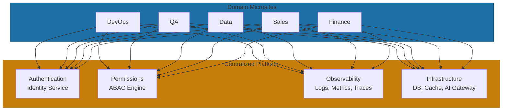
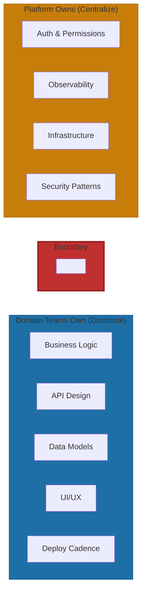

# Centralize vs Distribute

The microsite pattern lives or dies on this balance: centralize what's dangerous to scatter, distribute what benefits from autonomy. Get it backwards and you either rebuild the monolith with extra steps or create operational chaos.

## The 4 Centralized Concerns

At Yirifi, exactly four things live in shared infrastructure. Each earned its place because scattering it would create unacceptable risk.

| Centralized | Why Centralize | Business Impact |
|-------------|----------------|-----------------|
| **Authentication** | One identity system for humans and AI agents | Security gaps don't multiply; changing auth later is extremely expensive |
| **Permissions** | Unified access control with role hierarchy | Cross-domain access is auditable; permissions don't drift across teams |
| **Observability** | Shared logging, metrics, health monitoring | Cross-domain visibility enables debugging; backup automation is consistent |
| **Core Infrastructure** | Databases, caching, AI gateway | Economies of scale; operational expertise concentrated |

**Authentication.** Netflix moved authentication to the edge with their Passport pattern. Their Zuul gateway terminates external tokens and passes internal tokens downstream. Services behind the edge don't handle external tokens directly. When a vulnerability is discovered, you patch one service instead of coordinating across every microsite[^netflix-identity].

**Permissions.** Role-based access control breaks down around 50-100 roles. You start with `admin`, `user`, `viewer`—then need `second-floor-librarian` and `regional-sales-manager-west-coast`. Attribute-based access control (ABAC) prevents this explosion[^thoughtworks-abac]:

| RBAC Approach | ABAC Approach |
|---------------|---------------|
| Create `ReaderRole`, `LibrarianRole`, `SecondFloorLibrarianRole` | Evaluate: `user.department == "library" && user.floor == 2` |
| Each combination requires a new role | Attributes combine dynamically |

**Observability.** When a latency spike hits your Sales microsite, the root cause might be in Finance's database query. Without unified observability, you're debugging blindfolded. The current standard is OpenTelemetry with the LGTM stack (Loki, Grafana, Tempo, Mimir) or Datadog. Uber's Jaeger deploys trace agents as infrastructure—services don't need to know about tracing[^uber-tracing][^grafana-2025].

**Core Infrastructure.** Domain teams choose their database type; the platform team operates the infrastructure. The AI gateway follows the same pattern—centralizing model routing, rate limiting, and cost controls so new AI capabilities become available to all microsites simultaneously[^aws-database].

## The 5 Distributed Concerns

Five things belong entirely to domain teams. These aren't suggestions—they're ownership boundaries that prevent the platform from becoming a bottleneck.

| Distribute | What It Means | Why Autonomy Matters |
|-----------|---------------|----------------------|
| **Domain Logic** | Each microsite owns its business rules | Domain experts move fastest when they own decisions |
| **API Design** | Domain-specific endpoints (within shared contracts) | Teams understand their consumers best |
| **UI/UX** | Domain-specific dashboards and workflows | Different domains have different user needs |
| **Data Models** | Domain-specific schemas | Domains evolve at different rates |
| **Deployment Cadence** | Teams ship when ready | No cross-team release coordination overhead |

**Domain Logic.** When you centralize business logic, the platform team becomes a translator between requirements and implementation. Knowledge diffuses, approval bottlenecks form, solutions become one-size-fits-none. This is why Uber's DOMA transformation worked—each domain owns its business rules completely[^uber-doma].

**API Design and Data Models.** Amazon's two-pizza teams have single-threaded ownership over specific services with end-to-end accountability. They don't hand off to operations—they own the full customer experience. The guardrail: shared contracts (authentication headers, error formats, versioning conventions), not shared designs[^amazon-teams].

**Deployment Cadence.** The Finance team's compliance update shouldn't wait for Marketing's campaign feature. Release trains negate the primary benefit of distributed architecture. High performers in the DORA research deploy far more frequently than low performers—this requires independent deployment capability per domain[^dora].

## When You've Gone Wrong

**Over-centralized signs:** Domain teams waiting on platform for feature changes. Platform becoming reviewer for domain-specific decisions. "Central approval" required for team decisions. Platform team growing faster than domain teams.

**Over-distributed signs:** Tech stack fragmentation where three teams use Java, Python, and Scala—when something breaks, no one outside the team can help. Knowledge silos form when engineers can't move between teams. Operational chaos when every service requires custom CI and bespoke IAM setup[^spotify-autonomy].

Spotify discovered this despite their famous squad model. They have "surprisingly many" technical dependencies between squads. The lesson: autonomy works within guardrails.

## The Negotiable vs. Non-Negotiable Line

**Non-negotiable (platform provides):** Security and compliance patterns, observability requirements, API contract standards, approved technology radar for production.

**Negotiable (domain decides):** Release timing and deployment cadence, feature prioritization, risk/performance tradeoffs, implementation details within approved tech[^cto-insights].

The platforms that succeed are "boring, trusted, and widely adopted." Those that fail are "optional, fragmented, and under-owned"[^slavikdev].

---

## References

[^netflix-identity]: InfoQ. [Netflix User Identity](https://www.infoq.com/presentations/netflix-user-identity/)

[^thoughtworks-abac]: ThoughtWorks. [Using ABAC to Solve Role Explosion](https://www.thoughtworks.com/en-us/insights/blog/microservices/using-abac-solve-role-explosion)

[^uber-tracing]: Uber Engineering. [Distributed Tracing](https://www.uber.com/blog/distributed-tracing/)

[^grafana-2025]: Grafana Labs. [2025 Observability Predictions](https://grafana.com/blog/2025-observability-predictions-and-trends-from-grafana-labs/)

[^aws-database]: AWS Prescriptive Guidance. [Database Per Service Pattern](https://docs.aws.amazon.com/prescriptive-guidance/latest/modernization-data-persistence/database-per-service.html)

[^uber-doma]: Uber Engineering. [Introducing Domain-Oriented Microservice Architecture](https://www.uber.com/blog/microservice-architecture/)

[^amazon-teams]: AWS Executive Insights. [Amazon Two Pizza Team](https://aws.amazon.com/executive-insights/content/amazon-two-pizza-team/)

[^dora]: Devtron. [Microservices CI/CD Best Practices](https://devtron.ai/blog/microservices-ci-cd-best-practices/)

[^spotify-autonomy]: DX Newsletter. [Spotify Team Autonomy](https://newsletter.getdx.com/p/spotify-team-autonomy)

[^cto-insights]: CTO Executive Insights. [Platform Engineer Decision Authority at Scale](https://ctoexecutiveinsights.com/blog/platform-engineer-decision-authority-at-scale)

[^slavikdev]: Slavik.dev. [Platform Engineering Trends 2026](https://slavikdev.com/platform-engineering-trends-2026/)

---

[← Previous: Anatomy of a Microsite](./02-anatomy-of-a-domain-microsite.md) | [Chapter Overview](./README.md) | [Next: AI Agent Access →](./05-ai-agent-access.md)
