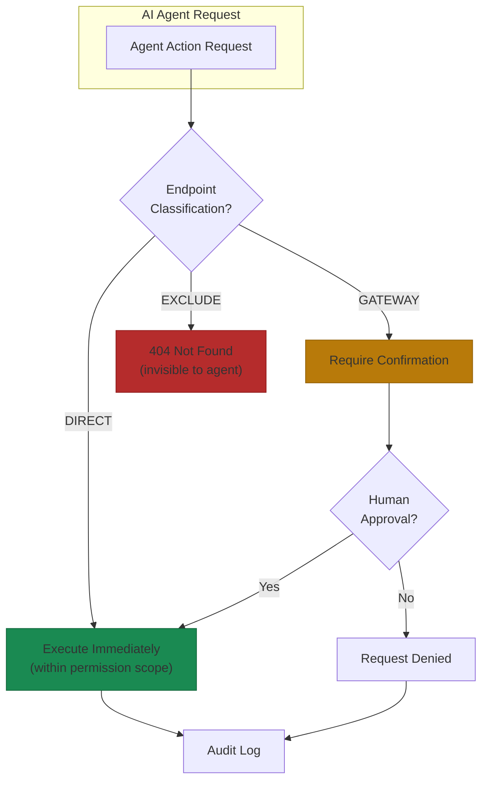
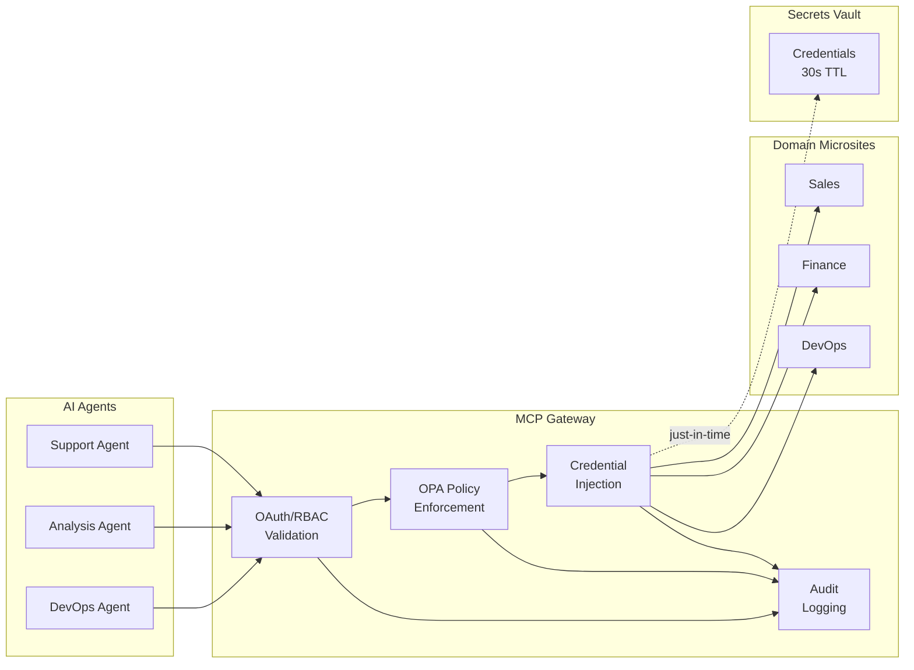

# AI Agent Access

AI agents operating at machine speed will eventually make mistakes humans would catch. Not because you hired bad engineers or chose the wrong model. Because agents make hundreds of decisions per second without the pause that makes humans think twice before clicking "delete all."

Most teams make the same mistake: they treat AI agents like particularly fast API consumers. Give them a service account, broad permissions, let them call whatever endpoints they need. I've seen this approach fail spectacularly—an agent at a fintech startup deleted 6 months of transaction records in 12 seconds while "cleaning up duplicates."

## The Service Account Trap

Traditional microservices give AI agents a shared service account with blanket permissions. A customer support agent needs access to order history, returns, shipping, and account details. So you grant all those permissions to one credential. The agent can now access every customer's data in your system.

This creates three compounding failures.

**Over-permissioning.** The service account accumulates permissions for every task the agent might perform. What starts as "read order status" grows to include returns, refunds, account modifications. You've created a massive attack surface from day one.

**No granularity.** When something goes wrong, your audit logs show "the agent did it." Not which user requested it, which workflow triggered it, or which session context applied. Incident response becomes detective work with no evidence.

**Static tokens.** JWTs encode permissions at issuance. When a user's role changes, the token doesn't know. When context shifts mid-workflow, the token can't adapt. Real-time authorization becomes impossible.

The solution isn't better service accounts. It's a fundamentally different model.

## The Model Context Protocol

Anthropic released the Model Context Protocol (MCP) in November 2024 to solve the N-by-M integration problem. Instead of building custom connectors between every AI model and every data source, MCP provides a universal interface[^anthropic-mcp].

By early 2025, over 1,000 open-source MCP connectors had emerged. Block, Apollo, Replit, Sourcegraph, HubSpot, Google, and Oracle adopted it[^opencv-mcp]. The protocol differs from REST APIs in ways that matter for your microsites.

**Context preservation.** MCP maintains state across multi-step workflows. An agent investigating a bug can query Kubernetes, then GitHub, then documentation, each request informed by the previous.

**Tool discovery.** Clients dynamically discover available tools without hardcoded routing. When you add a new microsite, agents find its capabilities automatically.

**Protocol-level security.** Permissions are built into the protocol with scope-based controls. Agents request `read:files` or `write:git` explicitly. Security happens at the protocol layer[^stytch-mcp].

## Three Tiers of Exposure

Not all endpoints deserve equal AI access. The pattern that works: classify every endpoint into one of three tiers.

**DIRECT.** Safe operations the agent can call freely within its permission scope. Read data, list items, get status. These are the discovery and retrieval operations that power most agent workflows.

**GATEWAY.** Dangerous operations requiring explicit confirmation. Deploy, delete, modify permissions. The request passes through additional validation—human approval for production changes, confirmation dialogs for destructive actions. The agent proposes, a human disposes.

**EXCLUDE.** Internal operations invisible to AI. Health checks, internal metrics, admin functions. Agents don't know these exist. There's no way to request access to something you can't discover.

The critical design choice: new endpoints default to EXCLUDE. Exposure is opt-in, not opt-out. When your team adds a new endpoint, they must explicitly decide whether AI agents should access it and at what tier. You cannot accidentally expose a sensitive endpoint because someone forgot to add a restriction.

## Identity Passthrough

Most implementations make the same mistake: they let the agent impersonate the user. The agent becomes the user, with all their permissions and none of the accountability.

The better pattern is identity passthrough. The agent carries the user's identity forward without absorbing it. Every action is cryptographically bound to verifiable user intent and the specific workflow step.

Modern approaches include an agent identity hash—a checksum derived from the agent's prompt, tools, and configuration[^ajwt]. Changing any element invalidates the hash. You can't replay tokens from a different agent configuration.

The audit trail captures what actually happened: "User X via Agent Y performed Action Z on Resource W at timestamp T." When regulators ask what your AI systems did, you have the complete answer. For compliance-heavy environments, this enables something powerful: you can demonstrate that AI agents never exceeded user permissions.

## The Gateway Pattern

An MCP gateway sits between agents and microsites, handling centralized authentication, policy enforcement, credential injection (agents never receive raw secrets—30-second memory TTL), and audit logging with correlation IDs linking multi-step operations.

Oracle's MCP integration reported 30% reduction in compute costs, 25% improvement in application reliability, and 40% faster deployment times through the gateway pattern[^oracle-mcp]. The centralization overhead is offset by elimination of duplicated security logic in every service.

For high availability, deploy gateways as active-active clusters. The gateway becomes critical infrastructure—health checks, horizontal scaling, and failover mechanisms aren't optional.

## References

[^anthropic-mcp]: Anthropic. [Model Context Protocol](https://www.anthropic.com/news/model-context-protocol)

[^opencv-mcp]: OpenCV. [Model Context Protocol](https://opencv.org/blog/model-context-protocol/)

[^stytch-mcp]: Stytch. [MCP Security](https://stytch.com/blog/mcp-security/)

[^ajwt]: Agentic. [JWT Protocol Research](https://arxiv.org/html/2509.13597v1)

[^oracle-mcp]: SuperAGI. [Top 5 MCP Server Implementations Transforming AI Development in 2025](https://superagi.com/top-5-mcp-server-implementations-transforming-ai-development-in-2025-a-comparative-analysis/)

---

[← Previous: Centralize vs Distribute](./03-centralize-vs-distribute.md) | [Chapter Overview](./README.md) | [Next: Microsite Orchestration →](./06-microsite-orchestration.md)
