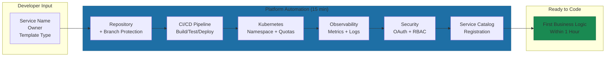
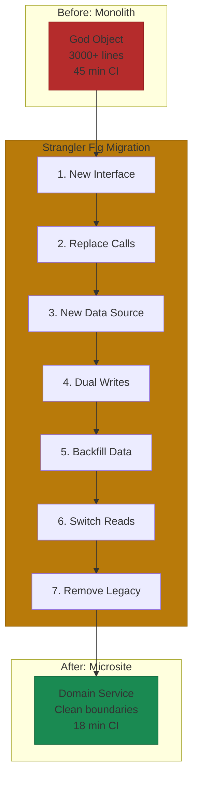

# Microsite Orchestration

Every microsite architecture faces two bottlenecks. First: how long until a new developer ships their first production feature? If the answer is weeks, your platform is failing. Second: how do you migrate existing systems without betting the company on a single deployment? If your answer involves a three-month code freeze, your strategy is failing.

The difference between organizations that struggle with microservices and those that thrive isn't talent or technology. It's platform investment.

## The 15-Minute New Microsite

Platform friction is measurable. 69% of developers report losing 8+ hours weekly to workflow inefficiencies[^idp-research]. That's one full day per developer spent on infrastructure configuration instead of writing code. The microsite pattern either solves this problem or makes it dramatically worse.

Without automation, every new domain means manual repository setup, CI/CD configuration, Kubernetes manifests, monitoring dashboards, and security integration. With proper platform investment, the same pattern accelerates everything.

When a developer creates a new microsite in an organization with mature automation: repository appears with branch protection configured, CI/CD pipeline wires itself up, observability exports metrics, Kubernetes namespace gets created with appropriate quotas, service registers in the catalog. All in 15 minutes.

This isn't aspirational. Snowflake went from 1.5 weeks to less than 1 day. Mercedes-Benz from weeks to minutes. At Spotify, Backstage templates reduce "time-to-Hello-World to just a few clicks"[^backstage].

**What gets automated:** Repository initialization with template-based scaffolding. Pre-configured build, test, and deploy stages with security scanning. Kubernetes manifests with resource limits and health checks. OpenTelemetry instrumentation and default Grafana dashboards. OAuth2/OIDC registration and RBAC policies.

The developer gets a production-ready service skeleton without understanding every component. They focus on business logic. The platform handles infrastructure.

## The Strangler Fig for Migration

Most companies aren't starting fresh. They have existing monoliths, legacy services, technical debt. "Big bang" rewrites regularly consume 18 months and still never ship. The question isn't how to build from scratch. It's how to migrate without breaking everything.

The Strangler Fig pattern provides the answer. Named after tropical vines that gradually envelop and replace their host trees, the pattern allows incremental migration with zero downtime.

Shopify documented their approach when refactoring a 3,000-line God Object[^shopify-strangler]. Their CI pipeline dropped from 45 minutes to 18 minutes after migration, a 60% improvement. The approach works in seven steps:

1. **Define the new interface.** Create a new class handling specific responsibilities while reading from the original.
2. **Replace old system calls.** Incrementally change code to use the new interface.
3. **Create new data source.** Build a new table separate from the monolithic table.
4. **Implement dual writes.** Write to both sources using transactions to prevent data loss.
5. **Backfill existing data.** Migrate historical data with background jobs.
6. **Switch reads to new source.** After verifying consistency, change readers to the new table.
7. **Remove legacy code.** Delete old writes, obsolete tests, and original columns.

Each step is independently deployable and reversible. Tests stay green throughout.

Uber's DOMA transformation revealed why this matters at scale: services have a half-life of about 1.5 years[^uber-doma]. Domain gateways became critical for avoiding "migration hell." Two of their largest platform rewrites occurred behind gateways without requiring hundreds of dependent services to change. The gateway absorbed the complexity while external contracts remained stable.

## Platform Team vs. Domain Team

The division matters. Too much on platform team creates bottlenecks. Too little creates inconsistency.

**Platform team owns:** Templates and golden paths, CI/CD infrastructure, shared observability stack, Kubernetes cluster management, secrets management infrastructure.

**Domain team owns:** Customizations within templates, build triggers, domain-specific alerts, resource limits, secret values.

The test: can a domain team ship a new microsite without waiting for platform team approval? If yes, you've got the balance right. If they're waiting in queues, platform team has taken on too much.

## Startup vs. Enterprise Approaches

**For startups:** You don't need Backstage on day one. Start with a repository template and a Makefile. Document the pattern. When you hit 5 developers, evaluate whether to invest in a real platform. The key is establishing the pattern early so it's consistent when you scale.

**For established organizations:** You're probably doing strangler fig whether you call it that or not. Make it explicit. Name the legacy systems. Define the target state. Track progress per domain.

The principle is the same: platform teams build the foundation once. Domain teams inherit the pattern forever.

## References

[^idp-research]: State. [of Developer Experience Report 2024](https://www.atlassian.com/developer-experience/internal-developer-platform)

[^backstage]: Backstage. [Setting Up Software Templates](https://backstage.spotify.com/learn/onboarding-software-to-backstage/setting-up-software-templates/7-create-component-backstage/)

[^shopify-strangler]: Shopify Engineering. [Refactoring Legacy Code with the Strangler Fig Pattern](https://shopify.engineering/refactoring-legacy-code-strangler-fig-pattern)

[^uber-doma]: Uber Engineering. [Introducing Domain-Oriented Microservice Architecture](https://www.uber.com/blog/microservice-architecture/)

---

[← Previous: AI Agent Access](./05-ai-agent-access.md) | [Chapter Overview](./README.md) | [Next: Inter-Microsite Communication →](./07-inter-microsite-communication.md)
