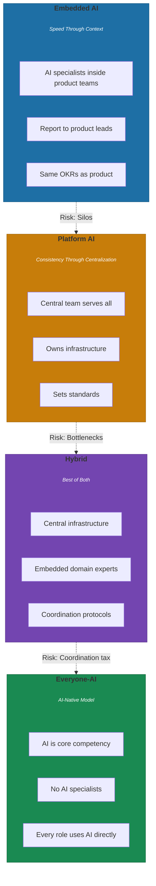
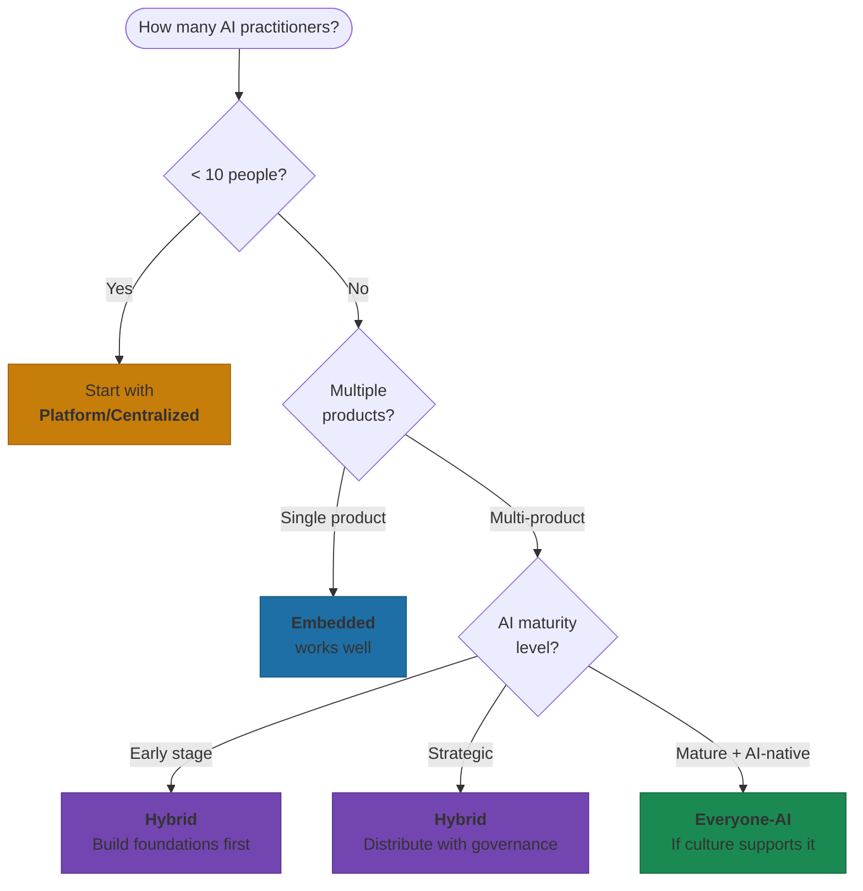

# The 4 Team Models for AI-First Operations

Most companies are choosing from a menu they don't fully understand. They pick "embedded" because a competitor did, or "platform" because a consultant recommended it. Then they wonder why AI projects stall, why engineers duplicate effort, why the promised speed never materializes.

The right structure isn't the one that sounds best in a leadership offsite. It's the one that matches where you actually are.

## The Four Models

What these look like in practice.

### 1. Embedded AI: Speed Through Context

In this model, AI specialists sit inside product teams. They report to product leads, attend sprint planning, share the same OKRs. No handoffs across organizational boundaries.

Booking.com exemplifies this approach. Data scientists don't belong to a central team—they're distributed across pricing, recommendations, and UX experimentation. Each one concentrates entirely on their product area's needs[^booking]. The advantage is obvious: when your AI engineer sits three desks away from the product manager, features ship faster. Context doesn't get lost in translation.

Airbnb embedded AI capabilities directly into product teams through 2024, and the results showed: a 12% boost in average order value from their redesign[^airbnb]. CEO Brian Chesky reported "massively ramping up development of product development pace" as the company pushed toward becoming AI-native across all functions[^airbnb-strategy].

Knowledge silos emerge fast. When every team builds their own approach, you get five different ways to handle model deployment, three different evaluation frameworks, and zero shared learning. The decentralized approach necessitates deliberate horizontal communication channels—otherwise you're paying for the same lessons multiple times.

**Best for:** Product-driven organizations where speed to feature launch matters more than infrastructure consistency. If you're shipping AI features to differentiate your core product, embedded makes sense.

### 2. Platform AI: Consistency Through Centralization

The opposite approach: one central team serves everyone. They own the infrastructure, set the standards, build the tools that product teams consume.

Uber's Michelangelo platform is the textbook example. The platform engineering team standardizes everything—data processing, experimentation, model deployment[^uber]. Before Michelangelo, individual teams at Uber spent months building their own deep learning toolkits. After? Eliminated. The platform provides shared trainers, hyperparameter tuning, and production deployment pipelines that work out of the box.

Siemens runs a centralized AI Lab functioning as a Center of Excellence. A small team of AI experts works with various business units—factory automation, energy, healthcare equipment—to pilot solutions and disseminate best practices[^siemens].

Bottlenecks emerge predictably. Uber's platform showed strain when the Maps ETA and Rider incentive teams had to wait while the platform caught up with emerging use cases[^uber]. When the central team can't move fast enough, product teams either wait or build workarounds—neither is great.

**Best for:** Multi-product portfolios where governance and consistency matter. If you're operating in regulated industries or need standardized AI quality across dozens of applications, platform makes sense.

### 3. Hybrid: The Best of Both (With Coordination Tax)

Most mature AI organizations land here eventually. Centralize infrastructure, embed domain expertise.

Meta runs the classic hub-and-spoke model. A centralized data engineering group standardizes tooling—data processing, experimentation, dashboards—while each business unit maintains embedded AI practitioners for day-to-day execution[^meta]. The hub ensures consistency in technology. The spokes maintain domain autonomy.

What gets centralized: infrastructure, governance, best practices. What stays embedded: domain-specific model development, product-specific features, the work that requires understanding the customer.

The coordination overhead is real. You need clear protocols for what decisions the center makes versus what teams decide locally. You need shared language. You need people who can translate between infrastructure-speak and product-speak.

**Best for:** Scaling organizations that have outgrown pure embedded or pure platform. If you're running 15+ AI practitioners across multiple products, hybrid is probably your destination.

### 4. Everyone-AI: The AI-Native Model

The most ambitious approach: AI isn't a specialty function. It's a core competency expected of everyone.

Perplexity embodies this with just 38 employees reaching massive scale. Their engineering-heavy team uses AI tools as "invisible coding partners"—Cursor and Copilot handle scaffolding and boilerplate while humans focus on architecture and review[^perplexity-team]. The expectation isn't that you'll hand work to an AI team—it's that you'll use AI directly in your role.

Anthropic takes this further with their flat "Member of Technical Staff" structure. Every technical employee shares the same title—from new hires to co-founders. The traditional research-engineering boundary doesn't exist. Engineers regularly appear as first authors on research papers. Researchers build production systems[^anthropic]. When safety team lead Ethan Perez needed research support during an offsite, "Ethan and most of his team just basically went upstairs to this building in the woods...and cranked out research for the next two weeks"[^anthropic-safety].

This model only works with specific cultural ingredients: high trust, low ego, and people comfortable with ambiguity. Anthropic explicitly hires for candidates who can defend "unusual beliefs...in uncomfortable situations"[^anthropic-culture].

**Best for:** AI-native companies building from scratch. If AI is your core product, not a feature you're adding to existing products, everyone-AI makes sense.

## How to Choose

The decision framework that actually works:

**Company size matters, but not how you'd expect.** Organizations with fewer than 10 AI practitioners usually start centralized—consolidate scarce expertise, establish standards. Beyond 15-20 people working on multiple projects, resource balancing becomes challenging. That's the signal to consider hybrid or embedded[^transition].

**Product portfolio complexity is the real driver.** Single-product companies benefit from embedded. Multi-product portfolios need platform or hybrid to prevent duplication—"otherwise every team builds their own tech stack"[^portfolio].

**AI maturity determines what you can handle.** Early-stage companies need centralization to build foundational capabilities. Strategic-stage companies can distribute execution while maintaining central governance. Mature organizations can push toward everyone-AI—but only after the cultural work is done[^maturity].

The real question isn't "which model is best?" It's "which model matches our current constraints?"

The uncomfortable truth: 95% of generative AI pilots at companies fail to influence profit and loss[^mit-failure]. The core issue isn't model quality—it's the "learning gap" for both tools and organizations. Generic tools excel for individuals because of flexibility, but they stall in enterprise use because they don't learn from or adapt to workflows[^mit-failure].

Your team structure either accelerates that learning or blocks it. Choose accordingly.

## References

[^booking]: Scrum.org. AI Team Scaling Models for Organizations — [scrum.org](https://www.scrum.org/resources/blog/ai-team-scaling-models-organizations)

[^airbnb]: Olobayo, D. How Airbnb's 2024 Redesign Drove 12% Boost in Average Order Value — [linkedin.com](https://www.linkedin.com/pulse/how-airbnbs-2024-redesign-drove-12-boost-average-order-daniel-olobayo-bbgmf)

[^airbnb-strategy]: Constellation Research. Airbnb: A Look at Its AI Strategy — [constellationr.com](https://www.constellationr.com/blog-news/insights/airbnb-look-its-ai-strategy)

[^uber]: Uber Engineering. From Predictive to Generative AI — [uber.com](https://www.uber.com/blog/from-predictive-to-generative-ai/)

[^siemens]: AgileWoW. AI Team Scaling Model — [agilewow.com](https://agilewow.com/blogs/ai_team_scaling_model.html)

[^meta]: Scrum.org. AI Team Scaling Models for Organizations — [scrum.org](https://www.scrum.org/resources/blog/ai-team-scaling-models-organizations)

[^perplexity-team]: Techolyze — [Enhancing Team Collaboration with AI Coding Tools: Perplexity Engineers' Approach](https://techolyze.com/open/blog/perplexity-ai-engineers-productivity/)

[^anthropic]: Pathvira. Anthropic Jobs — [pathvira.com](https://pathvira.com/anthropic-jobs/)

[^anthropic-safety]: 80,000 Hours. Nick Joseph on Anthropic's Safety Approach — [80000hours.org](https://80000hours.org/podcast/episodes/nick-joseph-anthropic-safety-approach-responsible-scaling/)

[^anthropic-culture]: Worktugal. Anthropic Jobs Europe — [worktugal.com](https://worktugal.com/anthropic-jobs-europe-relocation/)

[^transition]: Towards AI. Transitioning from AI Teams to AI Squads — [towardsai.net](https://towardsai.net/p/artificial-intelligence/transitioning-from-ai-teams-to-ai-squads)

[^portfolio]: DataNorth. Create an AI Team — [datanorth.ai](https://datanorth.ai/blog/create-an-ai-team)

[^maturity]: Troy Lendman. AI-First Company Culture 2025 — [troylendman.com](https://troylendman.com/ai-first-company-culture-2025-transformation-case-studies/)

[^mit-failure]: Fortune. MIT Report: 95% of Generative AI Pilots at Companies Failing — [fortune.com](https://fortune.com/2025/08/18/mit-report-95-percent-generative-ai-pilots-at-companies-failing-cfo/)

---

[Chapter Overview](./README.md) | [Next: Own Your Domain, Share Your Foundation →](./02-own-your-domain-share-your-foundation.md)
