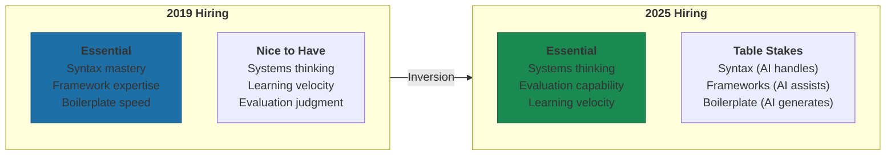

# Hiring for AI-First

Most companies are still hiring like it's 2019. They evaluate framework expertise when framework learning curves have collapsed. They ask candidates to write code from scratch when the actual job involves directing AI to write code.

The skills that mattered five years ago still matter. But the weighting has shifted dramatically, and companies that haven't updated their hiring signals are selecting for the wrong things.

## Skills That Matter More

The hierarchy has inverted. What used to be "nice to have" is now essential. What used to be essential is now table stakes that AI handles.

### Systems Thinking

The ability to see how pieces connect—how a change in one area cascades through others—has always mattered. Now it's non-negotiable.

AI excels at local optimization. It can write a perfect function. What it can't do is understand whether that function belongs in this system, how it affects upstream and downstream processes, or what second-order effects emerge when it interacts with other components.

Companies now test systems thinking through scenario-based assessments where candidates map interconnected elements. They're asked to demonstrate how automation upgrades impact workforce requirements, workflow, and supply chain dynamics—not just production rates[^systems-thinking]. The question isn't "can you code this?" It's "should you code this, and what happens when you do?"

### Evaluation Capability

One stat matters: effective developers keep only 88% of AI-generated code in their final submissions—they evaluate and reject or modify 12%[^codepanion]. That 12% is where the value lives.

The ability to quickly assess AI suggestions rather than blindly accept them has become essential. This isn't about being skeptical of AI. It's about having the judgment to know when AI got it right and when it got it close-but-wrong in ways that will break things downstream.

Interview processes now include live coding sessions where candidates use AI tools and demonstrate their decision-making process for accepting, modifying, or rejecting AI-generated code[^codepanion]. The signal isn't whether they can code. It's whether they can evaluate.

### Learning Velocity

The tools change faster than anyone can keep up through traditional learning. The half-life of specific tool knowledge is measured in months now, not years.

What matters is how quickly someone can become productive with unfamiliar frameworks or tools using AI assistance. HackerRank's 2025 research reveals that AI has enabled "highly contextual, personalized tutoring" that allows developers to create custom learning paths[^hackerrank]. Companies test learning velocity through take-home projects requiring candidates to work with unfamiliar tools, measuring how rapidly they get productive using AI assistance[^hackerrank].

The focus has shifted from what candidates already know to how rapidly they can acquire new skills. 40% of developers now plan to leave companies that don't provide clear learning opportunities[^fullscale]—they understand that stagnant learning means career risk.

## Skills That Matter Less

This is uncomfortable for people who built careers on these capabilities. But the shift is real.

### Syntax Memorization

"Most interviews still test candidates like it's the pre-AI era—expecting perfect syntax recall"[^joshi]. That's changing fast.

One developer with over a decade in leadership built a complete e-commerce store using AI, highlighting that "the world is clearly shifting from syntax memorization to smart problem-solving"[^joshi]. Interview best practices now explicitly state that "it's perfectly acceptable to not recall every piece of syntax during interviews"—candidates succeed using pseudocode where they can't remember exact syntax.

### Boilerplate Coding

AI-first startups specifically look for engineers who "use Copilot or Cursor as a first reviewer and iterate faster" rather than writing boilerplate from scratch[^dover]. The emphasis is on "portfolio over title"—checking side projects on platforms like Hugging Face rather than evaluating ability to write standard code patterns.

The data backs this up: developers using GitHub Copilot complete tasks 55% faster (1 hour 11 minutes vs. 2 hours 41 minutes) and complete 126% more projects per week than manual coders[^dover]. If you're selecting for people who insist on writing everything from scratch, you're selecting for slowness.

### Framework Expertise

Proficiency in AI prompting for "project related framework or code generation to boost your productivity should be the key pointers in today's age of AI"[^joshi]. Framework-specific knowledge is less critical because "AI is going to provide you with the accurate syntax in any programming language if your prompts are that precise."

This makes framework expertise more transferable. The learning curve for new frameworks has collapsed with AI assistance. What took months now takes days for someone who knows how to learn with AI.

## How Interviews Are Changing

The companies that get it are redesigning their process.

Meta launched an AI-enabled coding round in October 2025 that replaces one traditional LeetCode interview. Candidates spend 60 minutes in CoderPad with an AI chat panel featuring GPT-4o mini, Claude 3.5 Haiku, or Llama 4 Maverick[^meta-interview]. The interview includes three scenario types: building features from scratch, extending unfamiliar multi-file codebases, and debugging broken code under time pressure.

Caddi, led by CEO Alejandro Castellano, actively encourages candidates to use AI coding assistants like Cursor or Claude Code during technical exercises. His reasoning: "We want to see how they work in real conditions...We care as much about how they solve a problem as we do about the end result"[^fortune].

What interviewers look for: "We're not just looking for people who know the tools...We're looking for those who are curious, adaptable, and thoughtful about how they use AI. That mindset makes the biggest difference"[^fortune].

The shift from LeetCode to practical scenarios reflects what matters on the job. Companies now present complex projects with failing unit tests and challenge candidates to fix typical real-world bugs—array index errors, memory issues—using whatever tools they'd use at work[^reddit-interview].

## The Uncomfortable Paradox

Hiring for AI-first is genuinely hard: you need to detect real skill while candidates can fake it more easily than ever.

In-person interview rounds surged from 24% in 2022 to 38% in 2025, driven by AI-enabled fraud concerns. At recruitment firms, in-person requests jumped from 5% in 2024 to 30% in 2025—a 500% increase[^inperson]. 81% of Big Tech interviewers have suspected candidates of using AI tools inappropriately during remote interviews[^codepanion-cheating].

The tension is real: 72% of recruiting leaders conduct in-person interviews to combat fraud, while progressive companies simultaneously encourage legitimate AI usage during interviews[^interview-fraud]. You're trying to verify authenticity while testing the exact skill—AI fluency—that matters for on-the-job performance.

The winning model is human+AI collaboration in assessment: AI excels at structured signal extraction and consistency audits, but underperforms at system design, live debugging, and leadership evaluation where human judgment remains irreplaceable[^intervue].

## The Salary Reality

AI skills command premium compensation. AI engineers see a 5-20% premium in base salary compared to traditional software engineers, with an additional 10-20% premium in equity[^riseworks]. According to Glassdoor, AI-related roles earn 67% higher salaries on average[^riseworks].

Microsoft's Work Trend Index found that 71% of business leaders would give preference to a candidate with less experience if they had AI skills. 66% of executives indicated they would not consider hiring individuals without AI capabilities[^forbes].

The market is telling you something. Listen.

---

## References

[^systems-thinking]: Interview Prep. Systems Thinking Interview Questions — [interviewprep.org](https://interviewprep.org/systems-thinking-interview-questions/)

[^codepanion]: Codepanion. Find Developers Using Claude Code AI Agents 2025 — [codepanion.dev](https://www.codepanion.dev/blog/find-developers-using-claude-code-ai-agents-2025)

[^hackerrank]: HackerRank. 2025 Developer Skills Report — [hackerrank.com](https://pages.hackerrank.com/hubfs/PDFs/HackerRank%202025%20Developer%20Skills%20Report.pdf)

[^fullscale]: Full Scale. Strategic AI Developer Hiring — [fullscale.io](https://fullscale.io/blog/strategic-ai-developer-hiring/)

[^joshi]: Joshi, P. Hiring in the AI Era — [linkedin.com](https://www.linkedin.com/posts/prasad-joshi-85aa17a1_over-the-last-few-months-i-went-through-activity-7380590952387612672-T3KM)

[^dover]: Dover. Hiring Strategies for AI Startups 2025 — [dover.com](https://www.dover.com/blog/hiring-strategies-ai-startups-2025)

[^meta-interview]: Hello Interview. Meta AI-Enabled Coding Interview — [hellointerview.com](https://www.hellointerview.com/blog/meta-ai-enabled-coding)

[^fortune]: Fortune. AI Hiring Process Employee Skills — [fortune.com](https://fortune.com/2025/06/11/ai-hiring-process-employee-skills-candidate/)

[^reddit-interview]: Reddit. Breaking Interviews at FAANG — [reddit.com](https://www.reddit.com/r/leetcode/comments/1mce28b/breaking_interviews_at_faang_will_no_longer_focus/)

[^inperson]: The Interview Guys. 72% of Companies Are Fighting AI Fraud — [theinterviewguys.com](https://blog.theinterviewguys.com/72-of-companies-are-fighting-ai-fraud/)

[^codepanion-cheating]: Codepanion. Why 83% of Candidates Would Cheat with AI — [codepanion.dev](https://www.codepanion.dev/blog/why-83-percent-candidates-would-cheat-with-ai-how-companies-fight-back)

[^interview-fraud]: The Interview Guys. 72% of Companies Are Fighting AI Fraud — [theinterviewguys.com](https://blog.theinterviewguys.com/72-of-companies-are-fighting-ai-fraud/)

[^intervue]: Intervue. AI in Interviews: What Works, What Doesn't — [intervue.io](https://www.intervue.io/blog/ai-in-interviews-what-works-what-doesnt-2025-highlights)

[^riseworks]: Riseworks. AI Talent Salary Report 2025 — [riseworks.io](https://www.riseworks.io/blog/ai-talent-salary-report-2025)

[^forbes]: Forbes. 71% of Employers Prefer AI Skills Above Experience — [forbes.com](https://www.forbes.com/sites/rachelwells/2024/11/05/71-of-employers-prefer-ai-skills-above-experience-in-2024/)

---

[← Previous: Own Your Domain, Share Your Foundation](./02-own-your-domain-share-your-foundation.md) | [Chapter Overview](./README.md) | [Next: The 90-Day AI Fluency Program →](./04-the-90-day-ai-fluency-program.md)
