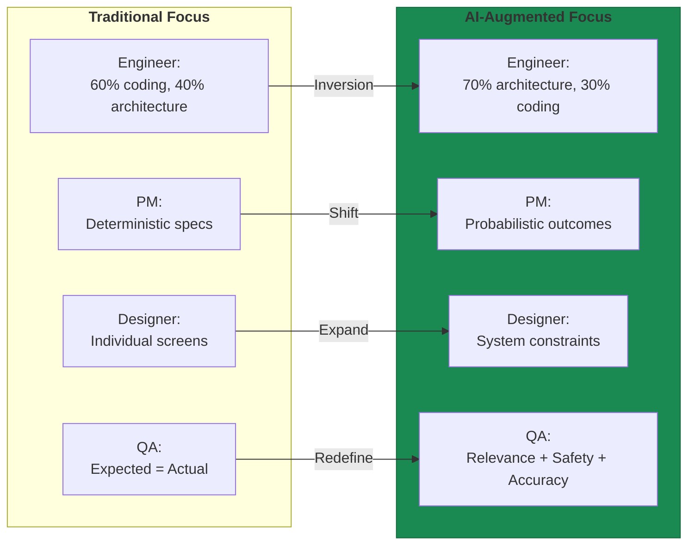
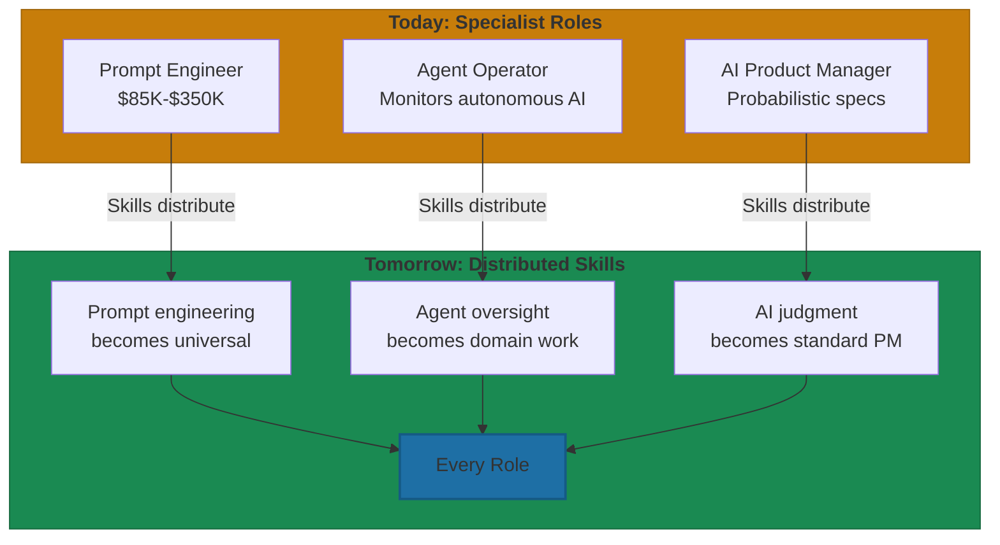

# How Roles Are Changing

The transformation described in the chapter opening—Scale AI growing from $250 million to $2 billion—wasn't just revenue growth. It was workforce evolution. By 2024, 12% of Scale's contributors held PhDs and over 40% had advanced degrees[^scale-workforce]. The data labelers who became RLHF specialists didn't just change titles. They developed genuinely new expertise.

That pattern—not replacement, but evolution—defines what's happening across every function in AI-first organizations.

## Three Emerging Roles

When Anthropic posted a job listing for "Prompt Engineer and Librarian" with compensation up to $335,000, it signaled something profound: AI-first companies were creating roles that didn't exist three years ago[^anthropic-salary]. Three positions have emerged as distinctive—and all three are simultaneously essential and temporary.

**Prompt engineers** evolved from "person who writes good ChatGPT prompts" to a systematic discipline in about 18 months. At production-critical companies, they don't just write prompts—they build infrastructure: versioned prompt libraries, A/B testing frameworks, safety measures against prompt injection. The salary range reflects this technical depth: entry-level earns $85,000-$140,000, with senior roles commanding $220,000-$350,000[^salary-ranges]. Richard Socher, former Salesforce Chief Scientist, argues that prompt engineering should be viewed "in terms of delegation"—a skill that "the most productive people and best performers should have"[^socher-quote].

**Agent operators** emerged when AI systems started doing multi-step work without human intervention. Someone needs to watch what happens when you tell an AI to "book the cheapest flight to Tokyo" and it starts navigating websites, filling forms, and making autonomous decisions. OpenAI's launch of Operator in January 2025 validated this role's importance—CEO Sam Altman called autonomous agents "the next giant breakthrough beyond incremental model improvements"[^operator-launch]. The work combines system administration skills with domain judgment—knowing when an agent's "smart" solution is actually the kind of dangerous idea a talented junior engineer might propose.

**AI product managers** bridge technical capabilities with business value in fundamentally different ways than traditional PMs. The shift: from scoping features to scoping capabilities, from deterministic outcomes to probabilistic ones. Traditional PRD: "Add export functionality with CSV and PDF options." AI-era PRD: "Build LLM-based export that adapts format based on user context, with 85% accuracy threshold and fallback to manual selection." Compensation reflects this complexity—AI PMs at leading companies earn $192,000 to $456,000[^pm-compensation].

## Four Transforming Roles

While new roles emerge, existing roles transform. Engineers, product managers, designers, QA—none disappear. All change profoundly.

**Software engineers** now spend 70% of time on architecture, system design, and validating AI outputs—only 30% on direct coding[^engineer-shift]. Code review focuses on different failure modes than human code: hallucination detection, architectural coherence, security vulnerabilities where AI still makes mistakes. According to Qodo's 2025 research, 81% of teams using AI for code review reported quality improvements—but only 3.8% report high confidence shipping AI code without human review[^qodo-stats]. That last statistic matters. AI amplifies engineering judgment, not replaces it.

But the gains aren't straightforward. A METR study found experienced developers took 19% *longer* on mature open-source projects when using AI tools—despite feeling 20% faster[^metr-study]. The illusion of speed is real, particularly for senior engineers working on complex, established codebases.

**Product managers** now write specifications for probabilistic systems. Two years ago: 15-page PRDs taking weeks. Now: AI generates initial requirements from user feedback analysis in hours, PMs focus on strategic decisions and tradeoff analysis. Communicating uncertainty becomes a core skill—defining confidence thresholds, graceful degradation, and success metrics beyond binary pass/fail. By year-end 2025, over 60% of enterprise software teams shipped at least one LLM-powered feature[^enterprise-llm]. Every PM working on those teams learned to manage probabilistic outcomes—or failed.

**Designers** spend less time creating individual assets and more time defining systems that accommodate AI-generated variations. The shift: from pixel-perfect screens to component behaviors and relationships. Figma AI plugins generate components matching existing design systems and convert designs directly into functional code[^figma-ai]. Designers define the constraints; AI fills in the variations.

**QA engineers** face the deepest transformation. Traditional testing relies on assertions: expected equals actual. LLM outputs vary with each interaction, breaking that fundamental model. QA now assesses responses on multiple criteria—relevance, safety, accuracy, brand alignment—all against thresholds rather than exact matches. By 2025, 75% of organizations identified AI-driven testing as pivotal, though only 16% had actually adopted it[^qa-adoption]. The gap creates competitive advantage.

## The Meta-Pattern: Specialist Today, Universal Tomorrow

Job postings requiring prompt engineering skills increased 434% from 2023 to 2024[^job-growth]. But that same data shows the skills spreading beyond specialists. Non-technical professionals across finance, marketing, legal, and operations now develop "AI fluency" as a core competency[^ai-fluency]. No-code AI tools achieved 72% adoption among startups in 2024, reducing coding time by 45%[^nocode-adoption].

Elena Verna, Head of Growth at Loveable, observed the cultural shift: "AI-native employees simply default to solving everything with AI. It's embedded in every part of their workday"[^verna-quote]. When AI operation becomes reflexive rather than specialized, the dedicated operator role converges back into domain roles.

**The pattern:** Every "emerging role" teaches the organization what everyone eventually needs to learn. Prompt engineering becomes a universal skill. Agent operation becomes part of domain expertise. AI product judgment becomes standard product work.

Scale AI improved labeling accuracy by 35% over competitors through technology investments *and* workforce development[^scale-accuracy]. The lesson: transformation isn't just about tools. It's about people learning to use them.

What matters isn't whether to hire these specialists—it's how long before these skills distribute across your entire organization, and what you do to accelerate that convergence rather than delay it.

---

## References

[^scale-workforce]: Scale. [AI Contributor Demographics](https://scale.com/rlhf)

[^anthropic-salary]: Anthropic. [Prompt Engineer job posting, 2024](https://www.pstechglobal.com/blog/prompt-engineering-salary-guide-2025-101)

[^salary-ranges]: Prompt Engineering. [Salary Guide 2025](https://www.coursera.org/articles/prompt-engineering-salary)

[^socher-quote]: Richard. [Socher on prompt engineering as delegation](https://thelettertwo.com/2025/08/05/prompt-engineering-job-vs-skill/)

[^operator-launch]: Techcrunch. [OpenAI Launches Operator](https://techcrunch.com/2025/01/23/openai-launches-operator-an-ai-agent-that-performs-tasks-autonomously/)

[^pm-compensation]: AI. [Product Manager Salary Data](https://wellfound.com/hiring-data/r/product_manager/i/artificial-intelligence)

[^engineer-shift]: Software Engineering. [Role Evolution 2025](https://www.sundeepteki.org/advice/impact-of-ai-on-the-2025-software-engineering-job-market)

[^qodo-stats]: Qodo. [State of AI Code Quality 2025](https://www.qodo.ai/reports/state-of-ai-code-quality/)

[^metr-study]: METR. [Developer Productivity Study](https://skywork.ai/blog/vibecoding/cursor-2-0-vs-github-copilot/)

[^enterprise-llm]: Enterprise. [LLM Feature Adoption](https://www.linkedin.com/pulse/2025-ai-testing-roadmap-5-moves-every-qa-engineer-should-make-pjeuf)

[^figma-ai]: Figma. [AI Plugin Features](https://www.uxpin.com/studio/blog/ai-tools-for-designers/)

[^qa-adoption]: AI. [Testing Adoption Statistics](https://www.qable.io/blog/is-ai-really-helping-to-improve-the-testing)

[^job-growth]: AI. [Job Posting Growth Statistics](https://www.pwc.com/hu/hu/sajtoszoba/assets/ai_jobs_barometer_2024.pdf)

[^ai-fluency]: AI. [Skills Across Non-Tech Roles](https://www.masonalexander.ie/beyond-the-code-how-ai-is-transforming-non-tech-roles)

[^nocode-adoption]: No-Code. [AI Platform Adoption](https://www.secondtalent.com/resources/top-no-code-ai-tools-for-startups/)

[^verna-quote]: Elena. [Verna on AI-native employees](https://partnerstack.com/articles/saas-jobs-declining-with-ai)

[^scale-accuracy]: Scale. [AI Quality Improvement](https://momen.app/blogs/scale-ai-from-data-labeling-to-foundation-models-rise/)

---

[← Previous: The 90-Day AI Fluency Program](./04-the-90-day-ai-fluency-program.md) | [Chapter Overview](./README.md) | [Next: Building AI Culture →](./06-building-ai-culture.md)
