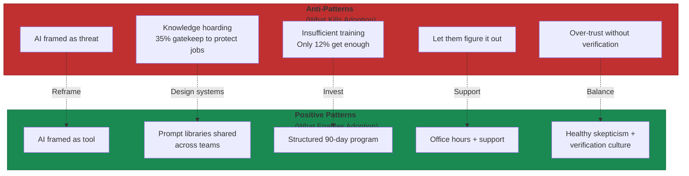

# Building AI Culture

One CEO laid off nearly 80% of his workforce after they resisted AI adoption. He had invested 20% of payroll into training initiatives[^layoff-case]. The response? Employees said "Yeah, I'm not going to do this"[^layoff-case]. The technical staff raised the most objections—voicing concerns about what AI couldn't do rather than exploring possibilities. (As the Deloitte case later shows, some of those concerns proved legitimate.)

This is the cultural failure mode that destroys AI transformations. McKinsey's research found that 70% of failed AI initiatives could be attributed to cultural factors rather than technical limitations[^mckinsey-culture]. The tools work. The people problems don't solve themselves.

## What AI-Positive Culture Actually Looks Like

At companies where AI integration succeeds, specific behaviors become visible. Engineers describe Claude as "the first stop for questions"—one noted that "80-90% of questions go to Claude, with colleagues handling the remaining 20% of complex, strategic, or context-heavy issues"[^claude-first-stop]. AI becomes reflexive, not exceptional.

**The productivity metrics tell the story.** At one AI-native company, employees reported using AI in 28% of work with +20% productivity twelve months prior, versus 59% usage with +50% productivity gains currently—more than doubling on both metrics[^productivity-metrics]. Pull requests per engineer per day increased 67% after adopting AI coding tools[^pr-increase].

**The interesting finding:** output volume matters more than time savings. Across all task categories, teams reported slight decreases in time spent but larger increases in output volume[^output-volume]. AI enables productivity primarily through greater capability, not saved hours.

### The Sharing Practices That Work

Sourcegraph's Prompt Library lets teams save, share, and promote frequently used prompts across engineering organizations. Leaders promote specific prompts to team libraries—documentation prompts encourage better codebase documentation, onboarding prompts become part of new hire workflows[^sourcegraph]. PromptHub adds Git-like version control with branching, merging, and performance tracking[^prompthub]. AI hackathons—one to two-day events building prototypes around real business problems—serve skill building, idea generation, and cultural normalization simultaneously[^hackathons].

### The 27% That Wouldn't Have Happened

The number that matters most: 27% of AI-assisted work "wouldn't have been done otherwise"[^new-work]. Engineers running multiple Claude sessions simultaneously, exploring different approaches. Fixing "papercuts" that previously damaged quality of life. Refactoring badly-structured code that no one had time to touch.

AI doesn't just accelerate existing work. It enables work that was never cost-effective before.

## The Anti-Patterns That Kill AI Adoption

A 2025 Fortune/Harris Poll survey found that one in three workers (33%) have actively sabotaged their company's AI rollout, with that number jumping to 41% among millennials and Gen Z employees[^sabotage-stats]. Sabotage takes forms: refusing tools, generating intentionally low-quality outputs, avoiding training sessions.

**The fear is real and measurable.** 62% of managers believe their employees fear AI will cost them their jobs. 48% of managers themselves worry about AI-driven wage declines. 53% of employees who use AI admitted to hiding their usage, fearing it would make them look replaceable[^fear-stats].

### AI as Threat vs. Tool

The framing determines the outcome. Organizations where AI is well-integrated see 48% of workers reporting increased motivation and energy, compared to just 19% in limited-adoption environments[^motivation-gap]. Same technology, opposite cultural experience.

**Knowledge hoarding emerges from fear.** A 2025 Adaptavist study found that 35% of workers actively gatekeep knowledge to protect job security, while 38% are reluctant to train others in areas they consider personal strengths[^hoarding-stats].

### The Training Gap That Guarantees Failure

Despite widespread AI adoption, only 12% of employees receive sufficient AI training to unlock full productivity benefits[^training-gap]. Slack's global survey revealed that 61% of workers had spent less than five hours learning about AI[^slack-training]. Companies miss up to 40% of AI productivity gains simply because they don't train people properly[^productivity-gap].

S&P Global data shows 42% of AI initiatives were scrapped in 2025, up sharply from 17% the previous year[^scrapped-initiatives]. The companies succeeding take training seriously: JPMorgan mandated GenAI training for every new employee starting in 2024. Citi began upskilling most of its workforce in prompt writing in September 2025[^training-examples]. Organizations with executive buy-in on training achieve 2.5x higher ROI[^training-roi].

## The Deloitte Lesson: What Happens Without Cultural Guardrails

Deloitte faced reputational damage when its AI-generated government report contained errors, requiring a partial refund of a AU$442,000 contract[^deloitte-case]. The incident stemmed from over-reliance on automated outputs without human review—a control failure, not AI malfunction. The Air Canada chatbot case followed the same pattern: legal liability after its chatbot provided misleading information on bereavement fares[^air-canada].

MIT research on "cognitive offloading" found that users who lean heavily on generative models produce less original work and retain less information—even when believing the tool helps them[^cognitive-offload]. Over-trusting AI creates skill erosion and declining creative problem-solving.

### Building Healthy Skepticism

Trust progression works like adopting GPS. Start with low-stakes tasks where you'd normally seek help. Build confidence through verification. Expand scope gradually[^trust-progression]. Some engineers deliberately practice without AI to maintain foundational skills[^deliberate-practice].

**The cultural permission to express doubt matters.** At AI-native companies, engineers openly discuss concerns: "It kind of feels like I'm coming to work every day to put myself out of a job." Another: "It's the end of an era for me—I've been programming for 25 years, and feeling competent in that skill set is a core part of my professional satisfaction"[^expressing-doubts].

Both things can be true: AI transforms work profoundly, and that transformation creates genuine loss alongside genuine gain. Organizations that acknowledge both build stronger cultures than those demanding uncritical enthusiasm.

## Building Culture Deliberately

The transformation follows a predictable pattern[^timeline]: leadership alignment and governance (months 1-3), flagship pilots with company-wide training (months 4-9), scaling successful pilots with role-specific co-pilots (months 10-18), then full integration with formalized AI roles and career tracks (months 18-24+).

**Starting in receptive cultural pockets works better than organization-wide mandates.** Organizations beginning AI implementation in receptive teams achieved 75% higher overall success rates compared to simultaneous organization-wide changes[^cultural-pockets].

Internal AI Playbooks document use cases by function, prompt templates, and lessons learned[^playbooks]. Companies share metrics at all-hands meetings: percentage of employees using AI weekly, workflows migrated, productivity improvements attributed to AI. The visibility demonstrates that transformation is "real, working, and benefiting everyone"[^visibility].

Structure shapes culture. When JPMorgan mandated GenAI training for every new hire, they made fluency an organizational expectation rather than individual choice—and adoption followed.

---

## References

[^layoff-case]: CEO. [Layoff Case Study 2025](https://fortune.com/article/ceo-laid-off-80-percent-workforce-sabotage-what-are-ai-skills/)

[^mckinsey-culture]: McKinsey. [Cultural Factors in AI Failure](https://www.linkedin.com/pulse/5-cultural-red-flags-could-sink-your-ai-santosh-kanekar-0czjc)

[^claude-first-stop]: Anthropic. [Internal Survey 2025](https://www.anthropic.com/research/how-ai-is-transforming-work-at-anthropic)

[^productivity-metrics]: AI. [Productivity Measurement 2025](https://www.worklytics.co/blog/what-it-means-to-be-ai-first-organization-in-2025)

[^pr-increase]: Claude. [Code Productivity Impact](https://www.anthropic.com/research/how-ai-is-transforming-work-at-anthropic)

[^output-volume]: AI. [Output Volume vs Time Savings](https://www.worklytics.co/blog/what-it-means-to-be-ai-first-organization-in-2025)

[^sourcegraph]: Sourcegraph. [Sourcegraph Prompt Library](https://sourcegraph.com/blog/announcing-prompt-library)

[^prompthub]: PromptHub. [Version Control Features](https://www.getmaxim.ai/articles/top-5-prompt-management-platforms-in-2025-a-comprehensive-guide-for-ai-teams/)

[^hackathons]: Riseuplabs. [AI Hackathon Practices](https://riseuplabs.com/ai-first-company-culture/)

[^new-work]: AI-Enabled. [New Work Statistics](https://www.anthropic.com/research/how-ai-is-transforming-work-at-anthropic)

[^sabotage-stats]: AI. [Sabotage Statistics 2025](https://fortune.com/article/ceo-laid-off-80-percent-workforce-sabotage-what-are-ai-skills/)

[^fear-stats]: AI. [Job Fear Survey](https://www.beautiful.ai/blog/2024-ai-workplace-impact-report)

[^motivation-gap]: AI. [Integration and Motivation](https://www.digitalapplied.com/blog/enterprise-ai-adoption-strategy-2025)

[^hoarding-stats]: Knowledge. [Hoarding Study 2025](https://www.theadaptavistgroup.com/company/press/ai-anxiety-drives-workers-to-hoard-skills-and-knowledge-to-protect-jobs-adaptavist-report-reveals)

[^training-gap]: AI. [Training Sufficiency Gap](https://www.ey.com/en_gl/newsroom/2025/11/ey-survey-reveals-companies-are-missing-out-on-up-to-40-percent-of-ai-productivity-gains-due-to-gaps-in-talent-strategy)

[^slack-training]: Slack. [AI Training Survey](https://hbr.org/2025/11/overcoming-the-organizational-barriers-to-ai-adoption)

[^productivity-gap]: Ey. [Missing Productivity Gains](https://www.ey.com/en_gl/newsroom/2025/11/ey-survey-reveals-companies-are-missing-out-on-up-to-40-percent-of-ai-productivity-gains-due-to-gaps-in-talent-strategy)

[^scrapped-initiatives]: AI. [Initiative Failure Rate 2025](https://www.digitalapplied.com/blog/enterprise-ai-adoption-strategy-2025)

[^training-examples]: Corporate. [AI Training Programs](https://fortune.com/article/ai-strategy-marriott-ikea-pwc-sp-global/)

[^training-roi]: AI. [Training ROI Statistics](https://www.digitalapplied.com/blog/enterprise-ai-adoption-strategy-2025)

[^deloitte-case]: Deloitte. [AI Report Failure](https://www.piranirisk.com/blog/the-deloitte-ai-failure-a-wake-up-call-for-operational-risk)

[^air-canada]: Air. [Canada Chatbot Case](https://timspark.com/blog/why-ai-projects-fail-artificial-intelligence-failures/)

[^cognitive-offload]: MIT. [Cognitive Offloading Research](https://www.vikingcloud.com/blog/disadvantages-of-ai-in-cybersecurity)

[^trust-progression]: Anthropic. [Trust Progression Pattern](https://www.anthropic.com/research/how-ai-is-transforming-work-at-anthropic)

[^deliberate-practice]: Deliberate. [Practice Without AI](https://www.anthropic.com/research/how-ai-is-transforming-work-at-anthropic)

[^expressing-doubts]: Cultural. [Permission for AI Concerns](https://www.anthropic.com/research/how-ai-is-transforming-work-at-anthropic)

[^timeline]: Riseuplabs. [AI Transformation Timeline](https://riseuplabs.com/ai-first-company-culture/)

[^cultural-pockets]: Cultural. [Pocket Success Rates](https://www.linkedin.com/pulse/5-cultural-red-flags-could-sink-your-ai-santosh-kanekar-0czjc)

[^playbooks]: Internal. [AI Playbook Practices](https://riseuplabs.com/ai-first-company-culture/)

[^visibility]: AI. [Metrics Visibility Practices](https://riseuplabs.com/ai-first-company-culture/)

---

[← Previous: How Roles Are Changing](./05-how-roles-are-changing.md) | [Chapter Overview](./README.md)
