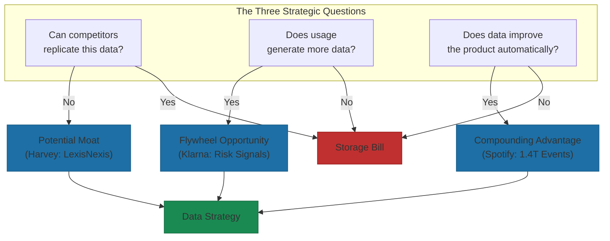

# Data Strategy Fundamentals

The common assumption about AI data is wrong: more is better.

It's not. Foundation models trained on internet-scale datasets have commoditized volume. You can't out-collect OpenAI. You can't out-scrape Google. The chapter opening made the pattern clear: Harvey succeeded without proprietary data, IBM failed despite having it. The difference was architecture, not accumulation.

So what does "data that improves as you use it" actually look like in practice? Three strategic questions separate real data strategy from expensive storage.

## The Three Strategic Questions

Every AI-first data strategy must answer three questions. Get them wrong, and you're building on quicksand.

**Question 1: What data, if you had it, would be impossible to replicate?**

This defines your potential moat. Harvey, the legal AI company, answered this by partnering with LexisNexis to access primary law databases and Shepard's Citations, content that competitors simply cannot obtain through public sources[^harvey-moat]. That data took decades to compile and carries legal weight that synthetic alternatives can't match. The result: the valuation and ARR growth we opened this chapter with[^harvey-scale].

**Question 2: What data generates more data through usage?**

This identifies flywheel opportunities. Every transaction on Klarna generates risk signals that improve underwriting models, which enables better conversion rates, which generates more transactions. The loop feeds itself. Between 2022-2024, Klarna achieved 48% revenue growth while reducing non-transactional operating expenses by 20%. AI improvements contributed $40 million in profitability gains in 2024 alone[^klarna-data].

**Question 3: What data improves your product automatically?**

This reveals compounding advantage. When Spotify processes 1.4 trillion events daily from 678 million users, each listening session, each skip, each save teaches the recommendation engine something new[^spotify-events]. The product gets smarter without engineers touching it.

If your data doesn't answer at least one of these questions affirmatively, you don't have a data strategy. You have a storage bill.

## The Four Types of Data Advantage

Not all data advantages are created equal. Four categories emerge:

| Type | Description | Durability |
|------|-------------|------------|
| **Volume** | More data than competitors | Low: Can be purchased or accumulated quickly |
| **Variety** | Different data types combined | Medium: Requires integration effort |
| **Velocity** | Faster collection and processing | Medium: Infrastructure can be copied |
| **Uniqueness** | Data no one else can access | High: When tied to product usage |

Volume alone is no longer sufficient. The translation industry collapse shows what happens when static datasets meet foundation models—SDL and Lionbridge watched their moats evaporate not because they collected poorly, but because they collected the wrong kind of data, datasets that anyone with enough compute could replicate[^translation].

The shift is clear: from datasets you own to systems that generate data through usage.

## Quality Over Quantity: The New Imperative

What kills AI initiatives more often than bad algorithms: 93% of CDOs say data strategy matters for generative AI, yet 57% haven't made necessary changes to support it[^cdo-gap]. Companies with clean, governed data report up to 3x higher AI ROI than those drowning in data swamps[^data-quality]. The difference isn't budget. It's discipline.

Data quality operates on four dimensions:

1. **Accuracy**: What percentage of your data is actually correct? One fraud detection system failed eight months into production because it couldn't distinguish legitimate customer behavior from fraud patterns. The data was plentiful. It just wasn't right[^fraud-failure].

2. **Completeness**: Are all required fields present? Missing context is missing value.

3. **Consistency**: Does the same thing mean the same thing across systems? "Customer" in your CRM shouldn't mean something different than "Customer" in your analytics platform.

4. **Timeliness**: How fresh is your data? Stale training data produces stale predictions.

Most AI failures aren't model failures. They're data failures. The model is only as smart as the data feeding it.

IBM's Watson Health failure, contrasted with Harvey's success at this chapter's opening, illustrates what happens when data strategy ignores operational integration. Watson failed to deliver usable insights because the data didn't translate to clinical value, healthcare institutions paid $200-$1,000 per patient for a system that provided questionable recommendations, and the data sat in silos without operational integration[^watson-failure]. More data wasn't the problem. Wrong data was.

## The Startup vs. Enterprise Divergence

The path forward depends on where you're starting from.

**For startups**: You don't have legacy data, which is actually an advantage. Your data strategy and your product strategy are the same thing. Design products that generate unique data from day one. The architecture matters more than the accumulation.

Cursor, the AI code editor, doesn't need years of proprietary training data. It uses foundation models while building workflow integration that captures implicit feedback: which suggestions developers accept, which they reject, how they modify generated code. The competitive moat comes from the integration depth, not the dataset[^cursor].

**For established organizations**: You likely have years of historical data across multiple systems. The strategic question isn't "how do we get more data?" but "which existing data, if connected and activated, creates compounding advantage?"

AT&T partnered with NVIDIA to implement fine-tuned models for customer service, achieving 94% accuracy versus 78% for generic GPT-4. The advantage came from activating data they already had, not collecting new data[^att].

Audit what you have before building new collection systems.

## What Success Looks Like

The metrics that matter for AI-first data strategy aren't about volume:

| Metric | Target | Why It Matters |
|--------|--------|----------------|
| Data Quality Score | Composite across accuracy, completeness, consistency, timeliness | Ensures reliable model inputs |
| Schema Compliance | 100% for critical assets | Prevents downstream pipeline failures |
| Time to Detect Issues | Real-time or near real-time | Catches problems before they impact models |
| Production Model Coverage | 90%+ with automated drift monitoring | Demonstrates operational maturity |

The companies winning in 2025 optimize data collection strategy over algorithm optimization. The proprietary flywheel—not the model—determines who compounds.

Next: the mechanics of flywheels that actually spin.

---

## References

[^harvey-moat]: Harvey's defensible compliance moat analysis. [Legal Technology](https://legaltechnology.com/2025/06/19/comment-harveys-defensible-compliance-moat-strategic-advantage-or-market-dependency/)

[^harvey-scale]: Harvey Year in Review 2024. [Harvey](https://www.harvey.ai/year-in-review/2024)

[^klarna-data]: Klarna's AI playbook and data strategy. [ScholarAI](https://scholarai.io/blog/klarnas-ai-playbook)

[^cdo-gap]: 2024 agenda for data executives. [MIT Sloan](https://mitsloan.mit.edu/ideas-made-to-matter/2024-agenda-data-executives-includes-governance-generative-ai)

[^watson-failure]: IBM Watson Health failure analysis. [Slate](https://slate.com/technology/2022/01/ibm-watson-health-failure-artificial-intelligence.html)

[^spotify-events]: Spotify's trillion-event data platform architecture. [Bytes Sized Design](https://bytesizeddesign.substack.com/p/the-trillion-event-platform-how-spotify)

[^translation]: Data moats in the foundation model era. [V7 Labs](https://www.v7labs.com/blog/data-moats-a-guide)

[^data-quality]: Data readiness programs and AI ROI. [CIO](https://www.cio.com/article/4098017/get-data-and-the-data-culture-ready-for-ai.html)

[^fraud-failure]: Data strategy for AI products. [LinkedIn](https://www.linkedin.com/pulse/beyond-algorithm-why-strong-data-strategy-defines-ai-product-shinto-pc5wf)

[^cursor]: AI coding assistant competitive dynamics. [Replit vs Cursor comparison](https://replit.com/discover/replit-vs-cursor)

[^att]: AT&T's NVIDIA NeMo implementation for AI agents. [NVIDIA Customer Stories](https://www.nvidia.com/en-us/customer-stories/att-drives-ai-agents-with-nemo/)

---

[Chapter Overview](./README.md) | [Next: Building Data Flywheels →](./02-building-data-flywheels.md)
