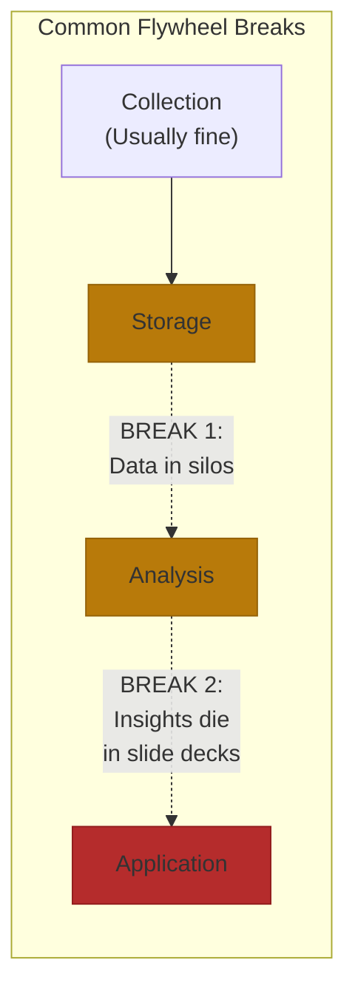

# Building Data Flywheels

The difference between a feedback loop and a flywheel is simple: feedback loops require human intervention at each cycle. Flywheels are self-reinforcing. Each improvement automatically creates conditions for the next.

Most companies have feedback loops. Very few have flywheels.

Eighty percent of enterprise AI projects fail. Not because the models are bad, but because they can't escape the cold start paradox: you need quality data to build an accurate model, but you need an accurate model to attract users who generate quality data[^cold-start]. The companies that break through solve this with architecture, not algorithms.

## The 5 Components

A high-velocity flywheel operates through five stages. Weakness in any one creates drag that slows the entire system.

| Component | What It Does | What Breaks Without It |
|-----------|-------------|------------------------|
| **Collection** | Captures signals from production systems and user interactions | You train on static data that doesn't reflect real usage. Tesla's 2M+ vehicles capture "Autopilot Snapshot" clips of edge cases automatically[^tesla-collection]. |
| **Storage** | Keeps data accessible across teams with organization for rapid retrieval | Siloed data means different teams train on different snapshots, creating model drift. |
| **Analysis** | Transforms raw data into actionable insights | Data accumulates but you don't learn from it. Spotify runs 520 experiments on mobile home screen alone each year[^spotify-experiments]. |
| **Application** | Translates insights into product improvements | Insights die in slide decks. Netflix handles 4,000+ daily deployments with automated canary rollouts[^netflix-canary]. |
| **Feedback** | Connects application back to collection | You ship improvements but don't know if they worked. Does better output generate more data? |

**The velocity gap is stark.** Netflix deploys in under 15 minutes[^netflix-deploy]. Traditional enterprises take 8 to 90 days. Some Fortune 100 banks average nine months from proof-of-concept to production[^enterprise-slow]. Duolingo rewrote their Session Generator to reduce processing from 750 milliseconds to 14 milliseconds[^duolingo-latency]—the difference between real-time personalization and waiting for the next session.

The bottleneck is rarely collection. Most organizations have mature data collection. The break usually happens between storage and analysis, or between analysis and application.

## The Network Learning Effect

A true flywheel has network learning: each user's data improves the product for *all* users, not just themselves.

| Pattern | Definition | Moat Strength |
|---------|------------|---------------|
| **Individual Learning** | Your data improves your experience | Low: personalization is table stakes |
| **Network Learning** | Your data improves everyone's experience | High: creates compounding advantage |

The test: If you deleted one user's data, would other users notice?

For Duolingo, the answer is yes. Every mistake feeds into Birdbrain, their AI that estimates probability of correct answers. When multiple learners struggle with Spanish preterite versus imperfect, Birdbrain updates difficulty estimates in real-time for all current and future learners[^duolingo-birdbrain]. The result: 59% DAU growth (21M to 34M users), 80%+ organic acquisition, effectively zero customer acquisition costs[^duolingo-growth].

For a typical note-taking app, the answer is no. Your notes help you. That's a product, not a flywheel.

## What Compounds vs. What Plateaus

**Spotify: True Compounding.** 1.4 trillion events daily from 678 million users[^spotify-scale]. Multi-task training shows the model learns transferable structures—improvements in podcast recommendations enhance music discovery. Users engaging with AI recommendations show 40% higher retention and spend 140 minutes daily versus 99 minutes for non-AI users[^spotify-retention]. The flywheel accelerates because better recommendations lead to more listening, which leads to more data, which leads to better recommendations.

**Klarna: Initial Success, Then Plateau.** Their AI assistant handled 2.3 million conversations in month one, equivalent to 700 full-time agents. Resolution time dropped from 11 minutes to under 2 minutes[^klarna-initial]. By Q1 2025, AI handled 80%+ of routine inquiries, contributing $40 million in profit improvement[^klarna-profit]. But then Klarna began rebalancing toward human agents[^klarna-rebalance]. The AI excelled at routine queries but couldn't compound into complex emotional scenarios. Customer service complexity doesn't meaningfully increase beyond pattern recognition. They optimized, but they didn't compound.

## Cold Start Strategies That Work

Harvey started with zero proprietary legal data in mid-2022. Today they're one of the fastest-growing legal AI companies. How?

**Expert seeding over data hoarding.** Harvey's founders hired lawyers from major firms to define step-by-step workflows. The key insight: process data for complex legal work doesn't exist online. You can't just train on public data[^harvey-process].

**Target complexity, not volume.** Harvey pursued elite law firms first (Allen & Overy with 3,500 attorneys). Complex work generates more valuable training data—international mergers create edge cases that simple contract review never encounters[^harvey-complexity].

**Build the loop before you have data.** At Yirifi, we designed the flywheel architecture before we had meaningful data. Internal users provide continuous usage data without sales cycles. Ship Tuesday, measure Thursday, iterate Friday.

Anthropic reports their engineers use Claude in 59% of work, up from 28% twelve months prior. Most critically: 67% increase in merged pull requests per engineer per day after organization-wide Claude Code adoption[^anthropic-internal].

Perplexity demonstrates what happens when network effects hit critical mass: 312M queries in May 2024, 780M by May 2025, 1.4B by June 2025[^perplexity-growth]. DAU/MAU ratio of 53% far exceeds benchmarks. Each query improves answer accuracy for future queries. Each query compounds the loop[^perplexity-engagement].

## When Flywheels Spin Backward

Not all loops are virtuous.

**Model Collapse.** AI trained on AI-generated content degrades over time. Research in Nature shows models exhibit "narrower range of output over time" when trained recursively on their own outputs. Each generation drifts from reality, like making a copy of a copy[^model-collapse].

**Data Without Curation.** Tesla's FSD demonstrates a feedback loop that failed to become self-reinforcing. Despite massive fleet data collection, FSD "hasn't improved all year" based on 2025 data[^tesla-fsd]. Data collection without proper curation creates noise, not signal.

**Wrong Incentives.** When you optimize for the wrong metric, the flywheel spins in the wrong direction. Engagement at the cost of user value creates short-term gains and long-term churn.

Before you write a line of code, map the loop on paper. If you can't complete it on paper, you won't complete it in production.

## References

[^cold-start]: AI cold start problem analysis. [LinkedIn](https://www.linkedin.com/posts/alexandra-skidan_your-ai-model-is-stupid-and-users-wont-activity-7359210515979456512-kVKC)

[^tesla-collection]: Tesla FSD data collection and edge case detection. [Tesla Accessories Blog](https://www.teslaacessories.com/blogs/news/the-evolution-and-challenges-of-tesla's-full-self-driving-fsd-)

[^spotify-experiments]: Spotify A/B testing bandwidth and experimentation velocity. [Spotify Confidence](https://confidence.spotify.com/blog/ab-testing-bandwidth)

[^netflix-canary]: Netflix canary deployment and automated rollback systems. [LinkedIn Engineering](https://www.linkedin.com/posts/muhammad-mudassir-3661b5207_devops-engineeringexcellence-automation-activity-7369487748413558785-3mTN)

[^netflix-deploy]: Netflix deployment automation and velocity metrics. [Full Scale](https://fullscale.io/blog/deployment-automation-commit-to-production-guide/)

[^enterprise-slow]: ML model deployment timelines in traditional enterprises. [SmartDev](https://smartdev.com/ml-model-poc-to-production-8-week/)

[^duolingo-latency]: Duolingo Session Generator performance optimization. [Duolingo Engineering Blog](https://blog.duolingo.com/unique-engineering-problems/)

[^duolingo-birdbrain]: Birdbrain AI system and learning personalization. [HBR Podcast](https://hbr.org/podcast/2025/04/how-duolingo-aims-to-diversify-beyond-language-learning)

[^duolingo-growth]: Duolingo learning loop case study. [Duolingo Case Study Research](https://research.contrary.com/company/duolingo)

[^spotify-scale]: Spotify data platform scale and event processing. [Bytes Sized Design](https://bytesizeddesign.substack.com/p/the-trillion-event-platform-how-spotify)

[^spotify-retention]: Spotify user engagement and retention metrics. [The Product Space](https://theproductspace.substack.com/p/how-does-spotify-use-ai-case-study)

[^klarna-initial]: Klarna AI assistant first month performance. [Klarna Press](https://www.klarna.com/international/press/klarna-ai-assistant-handles-two-thirds-of-customer-service-chats-in-its-first-month/)

[^klarna-profit]: Klarna AI profit improvement and cost reduction. [UseFini](https://www.usefini.com/blog/klarna-automates-two-thirds-of-customer-service-with-ai-assistant)

[^klarna-rebalance]: Klarna's shift toward human-AI hybrid support. [Loris AI](https://loris.ai/blog/klarna-chatbot-strategy-shift-why-companies-are-rebalancing-human-and-ai-customer-service/)

[^harvey-process]: Harvey cold start strategy and expert seeding. [BCG Executive Perspectives](https://media-publications.bcg.com/BCG-Executive-Perspectives-AI-First-Companies-Win-the-Future-Issue1-10June2025.pdf)

[^harvey-complexity]: Harvey's elite law firm targeting strategy. [Sequoia Capital Podcast](https://sequoiacap.com/podcast/training-data-winston-weinberg/)

[^anthropic-internal]: Anthropic internal Claude usage metrics. [Anthropic Research](https://www.anthropic.com/research/how-ai-is-transforming-work-at-anthropic)

[^perplexity-growth]: Perplexity AI query growth and user metrics. [AppLabX](https://blog.applabx.com/the-state-of-perplexity-ai-in-2025/)

[^perplexity-engagement]: Perplexity DAU/MAU engagement analysis. [Product Growth Blog](https://www.productgrowth.blog/p/how-perplexity-hacked-its-growth)

[^model-collapse]: Model collapse in recursive AI training. [Nature](https://www.nature.com/articles/s41586-024-07566-y)

[^tesla-fsd]: Tesla FSD performance stagnation analysis. [Electrek](https://electrek.co/2025/06/12/tesla-full-self-driving-hasnt-improved-all-year-and-musk-points-to-more-wait/)

---

[← Previous: Data Strategy Fundamentals](./01-data-strategy-fundamentals.md) | [Chapter Overview](./README.md) | [Next: Data Moats: What's Defensible vs Replicable →](./03-data-moats.md)
