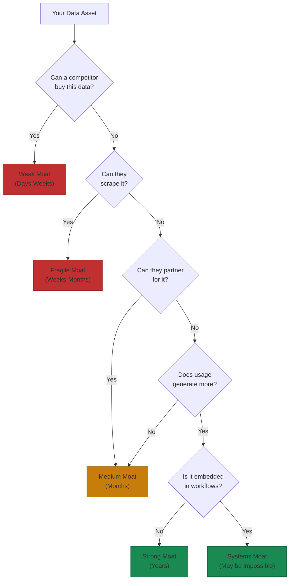

# Data Moats: What's Defensible vs Replicable

Most companies overestimate their data defenses.

As one VC put it, data moats have dried up "faster than venture capital in a bear market"[^moat-dead]. Foundation models have commoditized most proprietary datasets. Computer vision now costs $0.002 per image. Natural language processing is a basic function of any LLM. The translation industry's collapse—decades of linguistic databases approximated by foundation models—is now the pattern, not the exception[^translation-collapse].

The question isn't "do you have data?" It's "can a well-funded competitor get this data? And how long would it take?"

## The Moat Test

Every data asset you think creates competitive advantage should pass this test:

The shift is clear: from dataset moats to systems moats. Static datasets, no matter how large or unique, are increasingly fragile. The defensible position comes from data generated through product usage that competitors can't replicate because they don't have the product distribution.

## What's Actually Defensible

Data creates durable advantages when five conditions converge:

### 1. Continuous Refreshment

Data that updates through usage beats data that sits in a warehouse. Harvey's legal AI doesn't just have legal documents. It has workflow data from how elite law firms actually use those documents. Every contract review, litigation strategy, and compliance query improves the model's understanding of legal patterns[^harvey-refresh].

### 2. High-Quality Domain Specificity

Foundation models can approximate general tasks "well enough." They struggle with specialized edge cases that require deep domain understanding. Tesla automatically surfaces the 0.01% of edge cases from fleet data that actually train networks[^tesla-edge]. That's not just data volume. That's intelligent curation that compounds.

### 3. Data Governance That Creates Procurement Advantage

Harvey's architecture anticipates regulatory tightening: EU AI Act high-risk requirements, ABA 2024 supervision guidelines, UK SRA proportionality standards. The more AI is regulated, the more valuable compliance-native architecture becomes. Smaller competitors can't replicate this because procurement processes increasingly require governance capabilities[^harvey-governance].

### 4. Deep Workflow Integration

Glean became the knowledge layer across entire companies by integrating multiple data sources that individually may be replicable but collectively create overwhelming switching costs. Migration would mean rebuilding not just the AI layer but the entire interconnected infrastructure[^glean-integration].

### 5. Network Effects That Compound

Perplexity's DAU/MAU ratio of 53% far exceeds industry benchmarks because each query improves answer accuracy for future queries. This creates a "modern PageRank" where user behavior trains the system, and better systems attract more users[^perplexity-network].

## Common Moat Misconceptions

**Public datasets**: Anyone can acquire them. Foundation models already trained on the same data.

**Industry-standard data**: Your competitors have similar access. It's table stakes, not advantage.

**Purchased data**: Available to all buyers. Commoditized quickly.

**One-time scrapes**: Point-in-time snapshot without refresh mechanism. Becomes stale.

**Large but static datasets**: Size doesn't matter if the data doesn't improve with usage. IBM's Watson Health failure, detailed in this chapter's opening, exemplifies the pattern: massive acquisition, minimal operational integration, eventual liquidation at salvage value[^watson-failure].

## The New Moat Landscape

If data moats are weakening, what creates defensible advantages?

### Workflow Integration Moats

fileAI processes over 200 million files annually and has saved clients 320,000 hours and $6 million in processing costs since 2024[^fileai]. Switching would require re-engineering entire document processing pipelines, retraining models on new formats, and rebuilding integrations across Google Drive, Dropbox, and custom APIs. The moat isn't the AI. It's the embeddedness.

### Execution Velocity Moats

Cursor grew from $1 million revenue in 2023 to $100 million in 2024, with projections of $200 million in 2025[^cursor-growth]. They shipped a rebuilt Tab completion model that achieved 28% higher accept rates despite making 21% fewer suggestions. OpenAI's engineering teams adopted Cursor as their primary IDE and reduced deployment time by 30%. The moat is shipping speed. The team that cycles daily and learns fastest wins the right to worry about moats later.

### Systems of Intelligence Moats

Harvey ($8 billion valuation) and Glean ($7.2 billion valuation) achieved $100M+ ARR with one-quarter the headcount of comparable SaaS companies[^systems-intelligence]. They built moats by becoming the integration layer across organizations rather than point solutions. The more systems integrated, the harder replication becomes.

## The Honest Assessment

Evaluate your data moat realistically:

| Company | Assessment | Why |
|---------|------------|-----|
| **Tesla** | Strong moat | Proprietary fleet data + automatic edge case detection + over-the-air deployment. Earns $7K per vehicle that becomes a data collector vs. Waymo spending $150K per vehicle[^tesla-economics]. |
| **Harvey** | Strong moat | LexisNexis partnership for exclusive content + workflow integration + regulatory compliance architecture[^harvey-moat]. |
| **Glean** | Moderate moat | Enterprise knowledge graph + integration depth. But vulnerable to foundation models approximating search "well enough"[^glean-risk]. |
| **Notion** | Weak moat | User content doesn't create network effects. Distribution and switching costs, not data, are the defense[^notion-weak]. |

## The Strategic Implications

For startups: Don't compete on dataset size. Compete on data generation velocity through product design. A small but growing unique dataset beats a large static one.

For established organizations: Your existing customer relationships may be your strongest data moat, but only if you're capturing and activating that data. Ask: what data do we generate through customer interactions that competitors can't replicate?

Both things can be true: data moats are weaker than they were, and data still matters enormously. The distinction is between data you possess and data your system generates through usage. One is a commodity. The other is a compounding advantage.

The next sections address how to build the technical infrastructure that makes these moats possible, and how to do so without compromising user privacy.

---

## References

[^moat-dead]: Data moats in the age of foundation models. [Liat Benzur](https://liatbenzur.com/2025/07/20/data-moats-dead-new-competitive-advantages-ai/)

[^translation-collapse]: Translation industry disruption by foundation models. [V7 Labs](https://www.v7labs.com/blog/data-moats-a-guide)

[^harvey-refresh]: Harvey legal AI real-world results. [Harvey Blog](https://www.harvey.ai/blog/how-legal-teams-are-driving-real-results-with-ai)

[^tesla-edge]: Tesla fleet data collection and edge case detection. [LinkedIn](https://www.linkedin.com/posts/sen-lin-69932033_ashok-elluswamy-aelluswamy-on-x-activity-7388254451301707777-cHu_)

[^harvey-governance]: Harvey's compliance moat analysis. [Legal Technology](https://legaltechnology.com/2025/06/19/comment-harveys-defensible-compliance-moat-strategic-advantage-or-market-dependency/)

[^glean-integration]: Enterprise AI integration moats. [Guru Startups](https://www.gurustartups.com/reports/data-network-effects-in-ai-startups)

[^perplexity-network]: Perplexity AI growth and network effects. [Product Growth Blog](https://www.productgrowth.blog/p/how-perplexity-hacked-its-growth)

[^watson-failure]: IBM Watson Health failure analysis. [Slate](https://slate.com/technology/2022/01/ibm-watson-health-failure-artificial-intelligence.html)

[^fileai]: fileAI workflow automation metrics. [Insignia VC](https://review.insignia.vc/2025/04/15/moats-ai/)

[^cursor-growth]: Cursor AI growth trajectory. [Grow Fast](https://www.grow-fast.co.uk/blog/cursor-ai-development-teams-shipping-3x-faster-october-2025)

[^systems-intelligence]: Systems of intelligence as successor to SaaS. [LinkedIn](https://www.linkedin.com/posts/mikeschatzman_the-successor-to-saas-activity-7384251719448260610-Sljx)

[^tesla-economics]: Tesla FSD data flywheel economics. [LinkedIn](https://www.linkedin.com/posts/sen-lin-69932033_ashok-elluswamy-aelluswamy-on-x-activity-7388254451301707777-cHu_)

[^harvey-moat]: Harvey defensibility framework. [Guru Startups](https://www.gurustartups.com/reports/the-defensibility-framework-for-ai-startups)

[^glean-risk]: Enterprise search commoditization risk. [Liat Benzur](https://liatbenzur.com/2025/07/20/data-moats-dead-new-competitive-advantages-ai/)

[^notion-weak]: Productivity tool moat analysis. [V7 Labs](https://www.v7labs.com/blog/data-moats-a-guide)

---

[← Previous: Building Data Flywheels](./02-building-data-flywheels.md) | [Chapter Overview](./README.md) | [Next: Polyglot Persistence in Practice →](./04-polyglot-persistence-in-practice.md)
