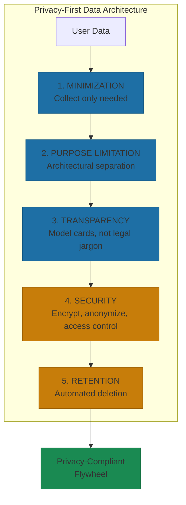
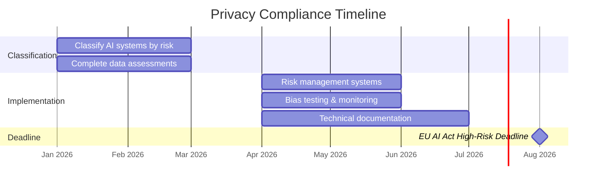

# Privacy by Design

In December 2024, Italian regulators fined OpenAI EUR 15 million for lacking a legal basis to process European users' data in ChatGPT training, inadequate transparency, and insufficient age verification[^gdpr-fines]. Three months earlier, Clearview AI got hit with EUR 30.5 million for scraping 30 billion images without consent[^gdpr-fines]. LinkedIn paid EUR 310 million for behavioral profiling without proper disclosure[^gdpr-fines].

These aren't edge cases. GDPR fines reached EUR 1.2 billion in 2024 alone, up 38% from the previous year[^dla-piper]. The regulatory environment isn't getting friendlier.

Privacy compliance isn't a constraint on your data flywheel. It's a prerequisite for building one that lasts. I've seen startups scramble to retrofit compliance after signing their first enterprise contract. The rearchitecting cost more than building it right the first time.

## The Compliance Landscape

Let's be practical about what you're actually facing.

**GDPR (Europe)** sets the baseline. Key requirements for AI systems: legitimate basis for data processing, data protection impact assessments before training, transparency about how data is used, and deletion rights that actually work. The penalties are serious: up to 4% of global revenue or EUR 20 million, whichever is higher.

The French CNIL issued guidance in 2025 clarifying that AI training on personal data from public sources can use legitimate interest as a legal basis, but requires comprehensive documentation prepared *before* training begins[^cnil-guidance]. Not after. Before.

**CCPA/CPRA (California)** expands "sharing" to include behavioral advertising and cross-site tracking. If your AI improves through user interaction data, that constitutes "sharing" for cross-context behavioral advertising purposes[^ccpa-requirements]. Penalties reach $7,988 per intentional violation. Companies deriving 50%+ revenue from selling or sharing data face heightened obligations—and if your AI flywheel depends on user data monetization, that threshold matters.

**Eight new U.S. state privacy laws** took effect in 2025: Delaware, Iowa, Nebraska, New Hampshire, New Jersey, Tennessee, Minnesota, and Maryland[^state-laws]. Each has slightly different requirements. All mandate transparency for automated decision-making and profiling.

**The EU AI Act** is the big one coming. August 2, 2026 deadline for high-risk systems compliance. If your AI operates in biometric identification, critical infrastructure, employment, education, or similar sensitive areas, you face mandatory risk management systems, data governance requirements, technical documentation, conformity assessments, and human oversight protocols[^ai-act]. Fines up to EUR 35 million or 7% of global revenue for prohibited practices.

The common mistake: treating this as a checklist to complete rather than an architecture to design. Compliance-as-retrofit is expensive and fragile. Compliance-as-architecture is sustainable.

## The Privacy-First Architecture

Privacy by design means embedding protections at every layer, not bolting them on afterward. Three companies demonstrate what this looks like in practice.

**Mistral AI** built privacy into their foundation. All services run exclusively within the EU, preventing third-country data access. They refuse to train on customer data without explicit consent. Enterprise customers can sign Data Processing Agreements for GDPR compliance. Open-source models enable complete data sovereignty for sensitive deployments[^mistral-privacy].

**Hugging Face** practices consent by design. HuggingChat conversations remain explicitly private and are never shared with model authors or used for training[^huggingface-consent]. They deliberately sacrifice potential model improvements to preserve absolute user privacy. That's not a limitation. That's a strategic choice.

**Apple** implements differential privacy at scale. For Apple Intelligence improvements, they only collect aggregated prompt trends with mathematically calibrated noise, making it impossible to link signals to any particular device. No device identifiers, no IP addresses, no Apple Account associations[^apple-differential]. The system is designed so Apple cannot reverse-engineer individual prompts from aggregated data.

The consistent approach: privacy-conscious companies treat privacy as a product feature, not a compliance burden.

## The 5 Principles in Practice

**Data minimization** sounds simple: collect only what you need. The hard part is determining "minimum necessary" when AI systems can potentially benefit from more data.

Apple's approach: for Genmoji improvements, they collect aggregated trends using differential privacy rather than individual prompts. They've proven this technique effective over nearly ten years for analyzing emoji popularity and QuickType suggestions without individual traceability[^apple-differential].

**Purpose limitation** requires technical enforcement, not just policy statements. Organizations implement architectural separation: different processing environments for different purposes with isolated data flows. Default privacy settings require explicit opt-in for less restrictive uses[^purpose-limitation].

**Transparency** means model cards, not legal jargon. Hugging Face pioneered standardized documentation covering training datasets, performance metrics, known biases, and intended uses[^model-cards]. Model cards serve as "boundary objects" accessible to developers, policymakers, ethicists, and impacted individuals.

**Security by default** includes anonymization techniques (k-anonymity, hashing, pseudonymization), encryption at rest and in transit, and access controls that default to deny.

**Retention limits** require deletion infrastructure from day one. GDPR's Storage Limitation Principle acts as the constraint: raw personal data faces automated deletion while audit trails use only irreversibly anonymized assets[^trustcloud].

## AI-Specific Privacy Technologies

The flywheel creates a specific privacy challenge: continuous learning from user data. Two technologies address this.

**Differential privacy** adds mathematically calibrated noise to training data while preserving aggregate utility. Apple uses local differential privacy, adding noise on-device before any transmission to servers[^apple-local-dp]. The privacy budget (epsilon) controls the noise level, balancing utility and privacy.

The trade-off is real: excessive noise reduces model accuracy. But Apple has demonstrated that differential privacy can support meaningful improvements at scale when architected properly.

**Federated learning** trains models without centralizing data. Duality Technologies implements this with embedded Privacy Enhancing Technologies: secure aggregation using Trusted Execution Environments, differential privacy layers preventing re-identification from aggregated outputs, and configurable privacy-accuracy balances per use case[^federated-learning].

NVIDIA's Data Flywheel Blueprint achieved inference cost reductions up to 98.6% while maintaining comparable accuracy for tool-calling use cases[^nvidia-flywheel]. Privacy measures don't have to compromise flywheel effectiveness when the architecture supports them.

## The Coming Deadlines

If you're not already preparing, you're behind.

**Q1 2026:** Classify all AI systems by risk level (EU AI Act) and data processing scope (GDPR, state laws). Complete data protection impact assessments for all large-scale AI training activities.

**Q2 2026 (critical for EU AI Act):** Implement risk management systems for high-risk AI systems. Establish bias testing, data quality monitoring, and representativeness validation. Begin technical documentation for conformity assessment.

**August 2, 2026:** EU AI Act high-risk system compliance deadline.

The German court case from 2025 is instructive: they pragmatically allowed Meta to process user data for AI training, explicitly rejecting the argument that "flywheel data" alone could produce equivalent results[^german-ruling]. The regulators understand that AI needs data. The question is whether you can demonstrate responsible stewardship.

## Privacy as Moat

The strategic reframe: when privacy is a first-class feature, you can collect *more* valuable data because users trust you with it.

Mistral won European enterprise contracts specifically because of their compliance-first positioning[^mistral-privacy]. DuckDuckGo carved a niche against dominant players through no-tracking search. Apple commands premium pricing partly on privacy positioning.

The companies that treat privacy as competitive advantage rather than compliance burden are building more sustainable flywheels. Users who trust you share more data and engage more deeply. That's not idealism. That's unit economics.

For deeper exploration of governance frameworks and ethical AI principles, see [Chapter 11: Ethics, Governance, and Risk](../../part-4-sustaining/11-ethics-governance-and-risk/README.md).

## References

[^gdpr-fines]: Fines for GDPR Violations in AI Systems. [Data Privacy Office EU](https://data-privacy-office.eu/fines-for-gdpr-violations-in-ai-systems-and-how-to-avoid-them/)

[^dla-piper]: DLA Piper GDPR Fines and Data Breach Survey January 2025. [DLA Piper](https://www.dlapiper.com/en/insights/publications/2025/01/dla-piper-gdpr-fines-and-data-breach-survey-january-2025)

[^cnil-guidance]: CNIL Clarifies GDPR Basis for AI Training. [Skadden](https://www.skadden.com/insights/publications/2025/06/cnil-clarifies-gdpr-basis-for-ai-training)

[^ccpa-requirements]: CCPA Privacy Policy Requirements 2025. [SecurePrivacy](https://secureprivacy.ai/blog/ccpa-privacy-policy-requirements-2025)

[^state-laws]: 2025 State Privacy Laws. [White & Case](https://www.whitecase.com/insight-alert/2025-state-privacy-laws-what-businesses-need-know-compliance)

[^ai-act]: EU AI Act High-Risk Requirements. [NAAIA](https://naaia.ai/ai-act-high-risk/)

[^mistral-privacy]: Mistral AI Privacy Approach. [WeVenture](https://weventure.de/en/blog/mistral)

[^huggingface-consent]: Consent by Design. [Hugging Face Blog](https://huggingface.co/blog/giadap/consent-by-design)

[^apple-differential]: Differential Privacy Aggregate Trends. [Apple Machine Learning Research](https://machinelearning.apple.com/research/differential-privacy-aggregate-trends)

[^purpose-limitation]: Safeguarding European AI Deployments. [Nebul](https://nebul.com/safeguarding-european-ai-deployments-part-3-the-intersection-of-eu-data-sovereignty-and-gdpr/)

[^model-cards]: Model Cards Documentation. [Hugging Face Hub](https://huggingface.co/docs/hub/en/model-cards)

[^trustcloud]: Balancing Innovation and Ethics. [TrustCloud AI](https://www.trustcloud.ai/ai/balancing-innovation-and-ethics-navigating-data-privacy-in-ai-development/)

[^apple-local-dp]: Differential Privacy Overview. [Apple](https://www.apple.com/privacy/docs/Differential_Privacy_Overview.pdf)

[^federated-learning]: Enhancing Privacy in Federated Learning. [Duality Technologies](https://dualitytech.com/blog/enhancing-privacy-and-security-in-federated-learning-and-analytics/)

[^nvidia-flywheel]: NVIDIA Data Flywheel Blueprint. [GitHub](https://github.com/NVIDIA-AI-Blueprints/data-flywheel)

[^german-ruling]: German Court Approach to GDPR and AI Training. [BDK Advokati](https://bdkadvokati.com/german-court-takes-pragmatic-approach-to-gdpr-allowing-meta-to-process-users-data-for-ai-training/)

---

---

[← Previous: Polyglot Persistence in Practice](./04-polyglot-persistence-in-practice.md) | [Chapter Overview](./README.md) | [Next: The 6 Data Strategy Mistakes That Stall Flywheels →](./06-the-6-data-strategy-mistakes.md)
