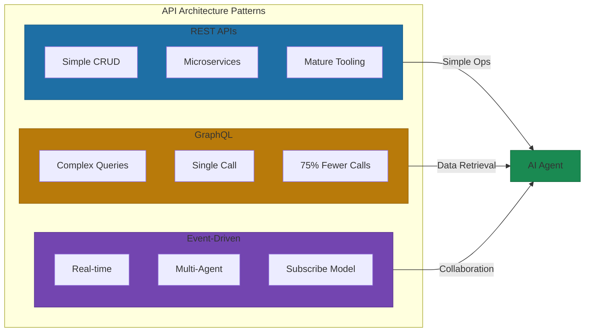
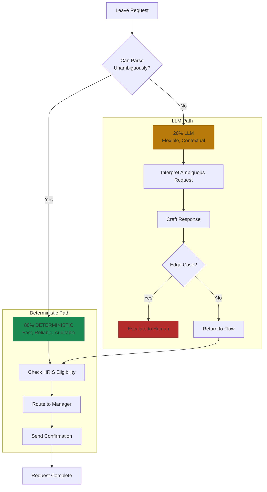

# Operations as APIs

Your AI agents are only as capable as the systems they can access. An agent with no API access to your HR system can't answer benefits questions. An agent that can't query your finance platform can't approve purchase orders. The pattern that unlocks AI across your entire organization isn't sophisticated machine learning. It's foundational API infrastructure.

82% of enterprises have now adopted API-first strategies, up 12% from 2024[^api-adoption]. Meanwhile, 78% of organizations use AI in at least one business function, up from 55% the year prior[^ai-adoption]. That convergence isn't coincidental. Organizations that expose internal operations as APIs aren't just enabling automation. They're creating the foundation for AI agents to operate across every business function.

## The Same-Source-of-Truth Principle

The design principle: every dashboard your operations team uses should expose an API. Every report they can run should be queryable programmatically. What humans access, agents access—through the same source of truth.

Salesforce's Agentforce platform demonstrates this at enterprise scale. Rather than bolting AI onto existing systems as an afterthought, agents are embedded natively into cloud ERP platforms. When Slack integrated with Agentforce, AI agents gained the ability to update records, pull information, and manage customer interactions directly within the communication platform. Salesforce reports that "most of the net-new apps being deployed to Slack are agents"[^salesforce-agents].

The insight here isn't that Salesforce built something clever. It's that they recognized the prerequisite: AI agents need programmatic access to the same systems humans use. No special snowflake data pipelines. No manual exports for AI consumption. Same source of truth, different interface.

## Architecture Patterns That Actually Work

When it comes to making internal systems AI-accessible, you have three main architectural options. Each trades off complexity against flexibility.

**REST APIs** remain the workhorse for enterprise operations. They excel at simple CRUD operations, work well with microservices architectures, and benefit from decades of mature tooling. For most internal operations, REST is the path of least resistance.

**GraphQL** is gaining traction for AI agent implementations specifically because it lets agents request exactly the data they need in a single call. Instead of making 12 API calls to gather context for a task, a well-designed GraphQL schema can reduce that to 3 calls. Organizations implementing this approach report 75% reduction in API calls, 68% faster response times, and 60% reduction in errors[^graphql-efficiency].

**Event-driven architecture** enables the most sophisticated AI collaboration patterns. Instead of agents polling for updates, they subscribe to event streams and react to changes in real-time. Ten sentiment analysis agents can process customer feedback simultaneously without explicit work distribution logic. New agents can join workflows by subscribing to relevant events without modifying existing systems.

Here's the pattern I keep seeing succeed: REST for simple operations, GraphQL for complex data retrieval, event-driven for real-time collaboration. Hybrid architectures that match the right pattern to the right use case outperform dogmatic commitment to any single approach.

## The 80/20 Design Principle

The most effective implementations use deterministic logic for 80% of intelligence and LLMs for the remaining 20% where flexibility is needed[^hybrid-approach]. This isn't a compromise. It's a design principle.

Think about an HR agent handling leave requests. 80% of requests follow predictable patterns: check eligibility in the HRIS, route approvals to managers, send confirmations. This should be deterministic code. Fast, reliable, auditable. The LLM handles the 20% that requires flexibility: understanding ambiguous requests, crafting personalized responses, escalating edge cases intelligently.

Deterministic logic handles the routine. LLMs provide judgment where it matters. You get speed and reliability for the predictable, flexibility for the edge cases.

## What Can Go Wrong

I've seen this fail when teams treat AI agent access like a quick integration project. They spin up an API key with admin access "just to get things working," embed it in a config file, and move on. Six months later, that key is in three different repositories, two Slack channels, and a contractor's laptop. Overprivileged API keys represent the most dangerous vulnerability in AI-accessible operations[^security-risks].

Identity-based attacks targeting AI agents represent the fastest-growing threat vector. The solution isn't to restrict AI access. It's to apply the same security principles you'd apply to any system integration: least-privilege access, token rotation, audit logging, and—this is critical—treating AI agents as principals that inherit user permissions rather than super-users with administrative access.

Without proper governance, AI agents introduce risks around sensitive data exposure, permission inheritance failures, and DLP policy violations. The agent that can answer benefits questions shouldn't also be able to export salary data. The agent that can check deployment status shouldn't be able to roll back production.

## The ROI Question

Organizations implementing AI-accessible internal APIs report meaningful productivity gains. Over 80% reduction in end-to-end processing time when integrating AI agents with intelligent document processing. 25% reduction in days-to-sales-qualified lead through AI prioritization. 40% increase in user satisfaction from AI-assisted task completion[^roi-metrics].

46% of organizations plan to increase API spending in the next year, compared to only 11% planning reductions[^api-investment]. This asymmetry tells you something important: companies that have invested in API infrastructure are seeing returns that justify continued investment. The stragglers are falling further behind.

## The Implementation Path

For Marcus running a startup, this is straightforward: every operational tool you adopt or build should expose an API. The cost of API-first design is minimal. The cost of retrofitting is substantial. Make the decision once, avoid the retrofit.

For Sarah leading enterprise transformation, the path is more complex. Your operational systems likely weren't built with AI access in mind. Start with read-only APIs that expose data without allowing AI to take actions. This reduces risk while proving value. Layer on write capabilities once you've established trust in the system.

The API gateway pattern lets you add AI accessibility without rebuilding core systems. A well-designed gateway provides schema documentation that agents can parse, rate limiting that prevents runaway automation, and audit trails that capture every interaction for compliance review.

Here's the key insight: the investment in operations-as-APIs pays dividends beyond AI. The same infrastructure enables automation, integration, and future flexibility. Every operational system you expose as an API becomes a building block for capabilities you haven't imagined yet.

The architecture that enables AI agents to check deployment status today enables them to manage marketing campaigns tomorrow.

## References

[^api-adoption]: Arcade API Tool User Growth Trends. [blog.arcade.dev](https://blog.arcade.dev/api-tool-user-growth-trends)

[^salesforce-agents]: XCube Labs: 10 Real-World Examples of AI Agents in 2025. [xcubelabs.com](https://www.xcubelabs.com/blog/10-real-world-examples-of-ai-agents-in-2025/)

[^graphql-efficiency]: Rethinking API Design for AI Agents. [dev.to](https://dev.to/akshaygupta1996/rethinking-api-design-for-ai-agents-from-data-plumbing-to-intelligent-interfaces-37jh)

[^hybrid-approach]: Rethinking API Design for AI Agents. [dev.to](https://dev.to/akshaygupta1996/rethinking-api-design-for-ai-agents-from-data-plumbing-to-intelligent-interfaces-37jh)

[^security-risks]: Obsidian Security: AI Agent Security Risks. [obsidiansecurity.com](https://www.obsidiansecurity.com/blog/ai-agent-security-risks)

[^roi-metrics]: High Peak Software: How to Build AI Adoption Strategies. [highpeaksw.com](https://highpeaksw.com/how-to-build-ai-adoption-strategies-to-measure-ai-roi-and-kpis/)

[^api-investment]: Arcade API Tool User Growth Trends. [blog.arcade.dev](https://blog.arcade.dev/api-tool-user-growth-trends)

[^ai-adoption]: McKinsey State of AI 2024. [mckinsey.com](https://www.mckinsey.com/capabilities/quantumblack/our-insights/the-state-of-ai)

---

[Chapter Overview](./README.md) | [Next: The 5 Operations Functions That Transform with AI →](./02-the-5-operations-functions-that-transform.md)
