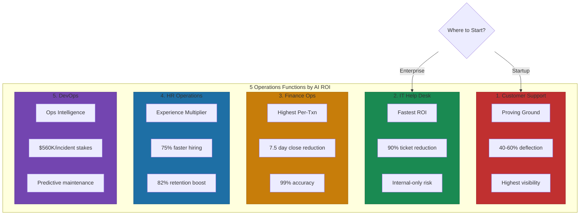
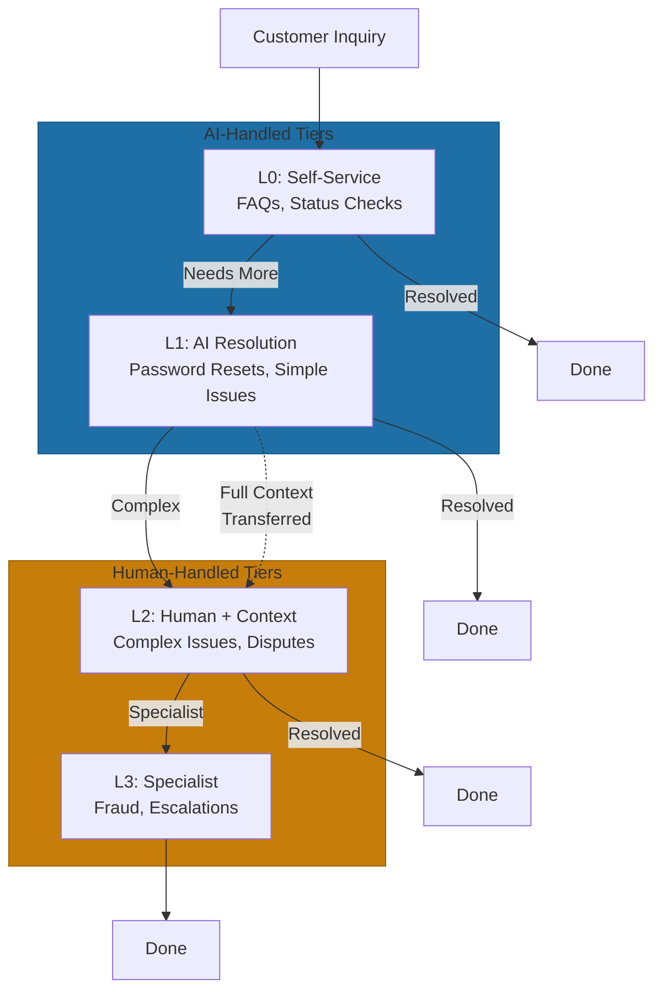

# The 5 Operations Functions That Transform with AI

Not every operations function benefits equally from AI. The highest-ROI functions share characteristics: high volume, clear procedures, and rich historical data. Here's which functions transform first—and what that looks like.

## 1. Customer Support: The Proving Ground

Customer support is where most companies start. The reasons: high volume, repetitive inquiries, clear success metrics.

Klarna's experience from our chapter opening tells the full story. Their AI handled millions of conversations efficiently, but customer satisfaction declined when the system couldn't handle fraud claims, payment disputes, or delivery errors—the critical 20% that determines loyalty[^klarna-reversal].

The lesson: the tiered model matters. Effective implementations use AI for L0 and L1, routing complex issues to humans with context. Hospitable achieved 60% resolution rate using Intercom's Fin AI agent, handling 90% of conversations but seamlessly escalating the remainder[^hospitable].

The key metric: deflection rate. But deflection without maintained satisfaction is a vanity metric that will catch up with you.

## 2. Internal IT/Help Desk: Fastest ROI

IT help desk delivers the fastest returns because stakes are lower. You're automating with your own employees, who are more forgiving and can escalate through back channels.

Password resets are the canonical quick win: 90% reduction in password tickets, 70% decrease in reset costs, 65% higher satisfaction because people solve problems immediately[^password-automation].

The broader opportunity: access provisioning, FAQ automation, ticket categorization. Organizations handling 500 tickets monthly at $20 each save $60,000 annually by automating half[^it-cost-savings]. McKinsey found AI can reduce IT operational costs by 40%[^mckinsey-it].

The 80% rule applies: automate L0/L1 (password resets, software installs, basic troubleshooting) while maintaining humans for L2/L3 (security incidents, access exceptions, unusual behaviors).

## 3. Finance Operations: Highest Per-Transaction Impact

Finance operations delivers the highest per-transaction ROI but takes longer—higher stakes, stricter compliance.

Invoice processing is the entry point: 60% cost reduction, dropping from $15-40 per invoice to under $10[^invoice-automation]. Accuracy exceeds 99% with AI-powered OCR. Exception handling becomes 80% automated.

The bigger prize: month-end close acceleration. MIT and Stanford found AI cuts close time by 7.5 days[^close-time]. Full automation: 63% reduction, from 8.7 days to 3.2 days[^close-improvement]. That's faster visibility into business performance.

BlackLine leads with cloud-based account reconciliation: 99% automated transaction matching, 85% faster reconciliation[^blackline]. Finance AI augments accountants, with firms reporting support for 55% more clients per accountant—demonstrating the productivity advantage at stake[^accountant-leverage].

## 4. HR Operations: Employee Experience Multiplier

HR operations transforms employee experience at scale by handling high-volume, repetitive interactions.

Recruiting automation delivers dramatic improvements: time-to-hire reduced 75%, from 45 to 15 days[^recruiting-time]. Cost-per-hire decreases 35% while candidate quality improves 28%[^recruiting-cost]. Resume screening eliminates 70% of manual review time.

Onboarding automation accelerates time-to-productivity: 53% faster processes, 73% fewer data collection errors[^onboarding]. Business impact: 82% increase in new hire retention, 25% reduction in turnover[^retention-rates]. Smooth onboarding means faster contribution and longer tenure.

HR chatbots handle ongoing employee experience. ServiceNow AI Agents achieve 40-70% deflection of Tier 1 tickets[^hr-deflection]. Organizations handling 1,000 tickets monthly save $7,500 at 50% deflection.

## 5. DevOps: Operational Intelligence

DevOps AI transforms how engineering teams monitor, detect, and respond to issues. Stakes: $560,000 per incident in downtime costs[^downtime-cost]. This function moves fastest because engineers are comfortable with automation and data is well-structured.

AIOps platforms—ServiceNow, IBM Watson AIOps, Splunk ITSI—provide ML-based correlation, anomaly detection, and knowledge recommendation. IBM's pattern: automated incident detection parses logs, intelligent grouping clusters events, NLP mines historical tickets for next-best-action recommendations[^ibm-aiops].

Key metrics: MTTD and MTTR. AI enables earlier detection through pattern recognition, predictive maintenance through failure prediction, and automated remediation through self-healing. Top-performing DevOps teams deploy multiple times daily; AI closes the gap between average and top-performing.

## Where to Start

Prioritization depends on context. Teams stumble when they start with customer support because it's "obvious." Customer-facing failures kill momentum. Internal wins build confidence.

For established organizations: start with IT Help Desk. Lowest risk, fastest ROI, internal-only impact. Success builds confidence for customer-facing functions.

For startups: Customer Support often gets AI first because it impacts customer experience and scales with growth. Small teams get immediate advantage. Finance can wait until volumes justify complexity.

The common thread across all five functions: AI transforms operations by handling the routine 80% while focusing human attention on the judgment-intensive 20%. The functions that transform first are the ones where that 80/20 split is clearest and the data to train AI already exists.

---

## References

[^klarna-initial]: Klarna AI Assistant Press Release. [klarna.com](https://www.klarna.com/international/press/klarna-ai-assistant-handles-two-thirds-of-customer-service-chats-in-its-first-month/)

[^klarna-reversal]: Klarna AI-First Experiment Case Study. [linkedin.com](https://www.linkedin.com/pulse/business-case-study-klarnas-ai-first-experiment-return-saffat-habib-8ltxc)

[^hospitable]: Zendesk AI Agents vs Intercom Fin Comparison. [swifteq.com](https://swifteq.com/post/zendesk-ai-agents-vs-intercom-fin)

[^password-automation]: Avatier Self-Service Password Reset. [avatier.com](https://www.avatier.com/blog/self-service-password-reset-avatier/)

[^it-cost-savings]: Cost Savings from Automating IT Tasks. [advanceit.sg](https://www.advanceit.sg/blog/cost-savings-from-automating-it-tasks-amp-best-practices-for-maximum-efficiency)

[^mckinsey-it]: ACI Learning: How AI and Chatbots Are Revolutionizing Help Desk. [acilearning.com](https://www.acilearning.com/blog/how-ai-and-chatbots-are-revolutionizing-the-help-desk-industry/)

[^invoice-automation]: AI Invoice Processing Cost Savings 2025. [fluxity.ai](https://www.fluxity.ai/blog/ai-invoice-processing-cost-savings-2025)

[^close-time]: CFO Dive: AI Cuts Monthly Financial Close Time. [cfodive.com](https://www.cfodive.com/news/ai-cuts-monthly-financial-close-time-75-days-mit-stanford-study-accounting-accountants/757610/)

[^close-improvement]: IJSAT Research Paper on Finance AI. [ijsat.org](https://www.ijsat.org/papers/2025/1/3008.pdf)

[^blackline]: Top AI Automation Tools for Fortune 500 Companies. [bitcot.com](https://www.bitcot.com/top-ai-automation-tools-for-fortune-500-companies/)

[^recruiting-time]: How AI Recruitment Automation Reduces Time to Hire. [impress.ai](https://impress.ai/blogs/how-ai-recruitment-automation-reduces-time-to-hire-by-75-in-2025/)

[^recruiting-cost]: AI Automation HR Hiring Guide. [legety.com](https://legety.com/articles/ai-automation-hr-hiring-3x-faster-2025-guide/)

[^onboarding]: AI Features Transforming Employee Onboarding. [superagi.com](https://superagi.com/from-automation-to-personalization-the-top-ai-features-transforming-employee-onboarding-in-2025/)

[^retention-rates]: AI Features Transforming Employee Onboarding. [superagi.com](https://superagi.com/from-automation-to-personalization-the-top-ai-features-transforming-employee-onboarding-in-2025/)

[^hr-deflection]: ServiceNow AI Agents Scenario-Based Questions. [servicenowspectaculars.com](https://servicenowspectaculars.com/servicenow-ai-agents-scenario-based-questions-2025/)

[^ibm-aiops]: IBM Cloud Pak for Watson AIOps ServiceNow Integration. [community.ibm.com](https://community.ibm.com/community/user/aiops/blogs/richard-varela1/2020/12/18/ibm-cloud-pak-for-watson-aiops-servicenow-integrat)

[^accountant-leverage]: Finance AI Productivity Metrics 2025. [highpeaksw.com](https://highpeaksw.com/how-to-build-ai-adoption-strategies-to-measure-ai-roi-and-kpis/)

[^downtime-cost]: IT Downtime Cost Analysis 2025. [splunk.com](https://www.splunk.com/en_us/blog/learn/it-downtime-costs.html)

---

[← Previous: Operations as APIs](./01-operations-as-apis.md) | [Chapter Overview](./README.md) | [Next: Automation vs Augmentation →](./03-automation-vs-augmentation.md)
