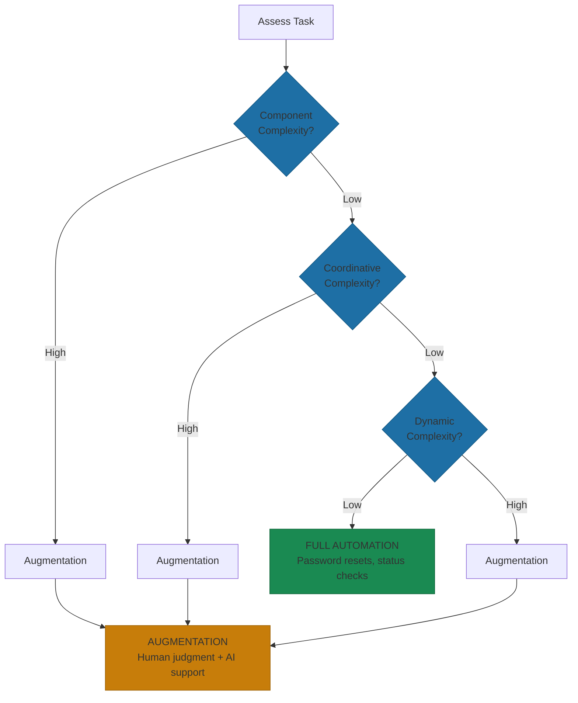
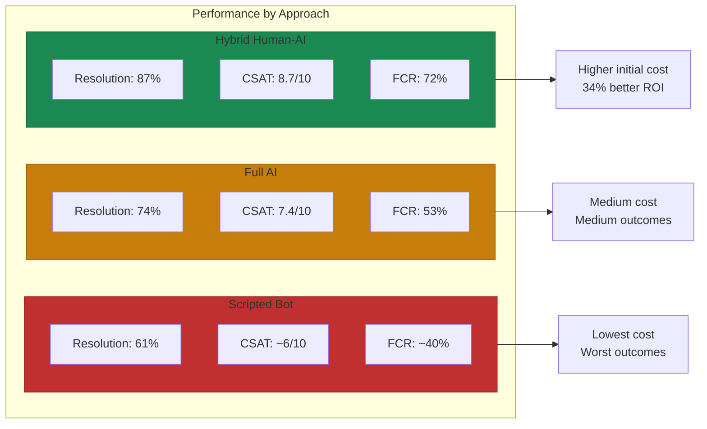
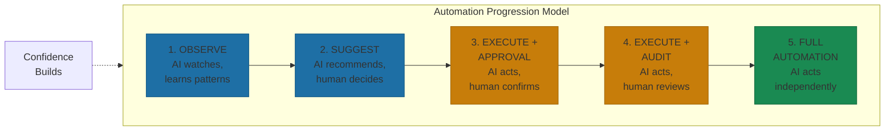

# Automation vs Augmentation

Most people frame AI in operations as a binary choice between full automation and human-only processes. The reality is more nuanced. The right question isn't "should we automate this?" but "where on the automation-augmentation spectrum does this task belong?"

Academic research calls this the Automation-Augmentation Paradox[^paradox]. Pure automation and pure human work both have failure modes. The leverage is in finding the right blend for each task.

## The Decision Framework

Three dimensions of task complexity determine where on the spectrum a task belongs[^complexity]:

**Component complexity** is the number of distinct pieces of information required. Password resets need few inputs. Customer fraud investigations need many.

**Coordinative complexity** is the number of steps involved. Status checks are single-step. Multi-department approval workflows have many steps that must happen in sequence.

**Dynamic complexity** is how much the information or steps change over time. Payroll processing follows stable patterns. Crisis response changes moment by moment.

High component, coordinative, or dynamic complexity pushes tasks toward augmentation. Low complexity across all three dimensions makes full automation viable.

## When Hybrid Beats Both Extremes

Real business data reveals a consistent pattern: hybrid human-AI systems outperform both fully automated and human-only alternatives across key metrics[^hybrid-performance].

Resolution rate: 87% for hybrid systems versus 74% for NLP-powered AI versus 61% for scripted chatbots. The hybrid approach resolves more issues because humans handle the cases AI gets wrong.

Customer satisfaction: 8.7 out of 10 for hybrid versus 7.4 for fully automated. Customers can tell when they're getting a real solution versus being processed by a bot that doesn't understand their problem.

First contact resolution: 72% for hybrid versus 53% for fully automated. When AI escalates intelligently, humans resolve issues without customers having to call back.

ROI: 34% better ROI over 12 months despite 15-20% higher initial implementation costs[^hybrid-roi]. The upfront investment in building proper escalation paths and human-AI handoffs pays dividends in customer retention and operational efficiency.

Healthcare provides a compelling example. Revenue cycle management teams using hybrid AI achieved 60% improvement in quality code capture and 40% reduction in charge entry lag[^healthcare-hybrid]. The AI handles pattern recognition. Humans handle judgment calls. Neither alone achieves those numbers.

The pattern: hybrid systems cost more to implement but deliver better outcomes. Chasing full automation because it's cheaper to build leads to worse business results.

## The Klarna Lesson

Klarna's journey from our chapter opening illustrates the danger. The AI excelled at routine inquiries but couldn't handle fraud claims, payment disputes, or delivery errors—the critical interactions that determine loyalty[^klarna-failure]. By mid-2025, they were rehiring human agents and shifting to a hybrid model.

The lesson: automating the easy majority while bungling the critical minority is worse than not automating at all.

A 2025 Qualtrics study found that AI-powered customer service fails at four times the rate of other AI tasks, with nearly one in five consumers seeing no benefits from AI customer service experiences[^qualtrics]. In the UK, 45% of customers say poor use of technology has made them avoid a business altogether[^uk-avoidance].

The efficiency illusion is dangerous: the gap between what dashboards say ("Tickets Deflected") and what customers feel (trapped in loops with no path to resolution). As we established in [Section 2](./02-the-5-operations-functions-that-transform.md), deflection without maintained satisfaction catches up with you.

## The Right Balance by Task Type

A practical framework for where tasks fall:

**Full automation works when:**
- Rule-based with predictable patterns
- Low information load, few data points
- Few sequential process steps
- Low variability, stable over time
- Mistakes are recoverable

Password resets, status checks, data validation, standard notifications.

**Augmentation wins when:**
- Requires judgment or contextual understanding
- High information load, synthesis across sources
- Interdependent, complex process steps
- High variability, context-dependent
- High stakes, severe error consequences

Complex problem-solving, relationship management, crisis response, nuanced negotiations.

**The messy middle** covers most real-world operations:
- Email responses: AI drafts, human reviews and sends
- Ticket categorization: AI suggests, human confirms
- Expense approval: AI flags anomalies, human decides
- Report generation: AI prepares, human interprets

For this middle ground, the progression model works best: observe, suggest, execute with approval, execute with audit, then full automation.

## Warning Signs of Over-Automation

The pattern breaks when teams celebrate deflection rates without tracking what happens to deflected customers. One company hit 85% deflection and declared victory. Six months later, NPS dropped 15 points and churn was up 8%. The deflected tickets weren't resolved—they were abandoned.

Three patterns signal over-automation:

**Customer experience degradation:** Customers trapped in automated reply loops with no path to resolution. Deflection rate looks great, but NPS is cratering.

**Quality problems:** Excessive automation causes false positives and negatives. When humans check AI outputs infrequently, they miss more mistakes[^quality-issues].

**Employee morale impacts:** Over-reliance on automation undermines agent morale. The reinforcing cycle: disengaged employees deliver worse service, making automation look more attractive, which disengages employees further.

## Building the Right System

The solution isn't avoiding automation—it's building systems that know their limits.

Every automated process needs a designed escalation path. The question: "what happens when automation can't handle it?" Seamless handoffs with full context. Clear triggers based on confidence scores, sentiment, or explicit requests. Smart routing to the right human on first escalation.

Organizations adopting gradual rollouts report 15-30% efficiency gains during initial phases. Success requires allocating 20-30% of budgets to training and change management[^implementation-budget]. Technology is the easy part. Human-AI collaboration is the hard part.

BCG estimates multi-agent AI systems could generate $53 billion in business revenue by 2030, with 75% of large enterprises adopting them by 2026[^bcg-estimate]. Deloitte's guidance: "technology should be utilized to augment agents' abilities, not to eliminate their essential role in creating positive experiences."

Both things are true. AI transforms operations and humans remain essential. The companies that thrive will get the balance right.

---

## References

[^paradox]: Raisch & Krakowski: The Automation-Augmentation Paradox. Academy of Management Review. [journals.aom.org](https://journals.aom.org/doi/10.5465/amr.2018.0072)

[^complexity]: ACM Digital Library: Task Complexity and Human-AI Collaboration. [dl.acm.org](https://dl.acm.org/doi/fullHtml/10.1145/3565472.3592959)

[^hybrid-performance]: HashMeta: Real Business Data Reveals Top-Performing AI Support Model. [hashmeta.ai](https://www.hashmeta.ai/blog/the-results-are-in-real-business-data-reveals-the-top-performing-ai-support-model)

[^hybrid-roi]: HashMeta: Real Business Data Reveals Top-Performing AI Support Model. [hashmeta.ai](https://www.hashmeta.ai/blog/the-results-are-in-real-business-data-reveals-the-top-performing-ai-support-model)

[^klarna-failure]: EGlobalis: Why 74% of Enterprise CX AI Programs Fail. [eglobalis.com](https://www.eglobalis.com/why-74-of-enterprise-cx-ai-programs-fail-and-how-to-make-them-work/)

[^qualtrics]: PR Newswire: AI-Powered Customer Service Fails at Four Times the Rate. [prnewswire.com](https://www.prnewswire.com/news-releases/ai-powered-customer-service-fails-at-four-times-the-rate-of-other-tasks-302576858.html)

[^uk-avoidance]: Abroad Works: AI Customer Service Trap. [abroadworks.com](https://www.abroadworks.com/blog/ai-customer-service-trap)

[^quality-issues]: PMC: Automation vs Augmentation Study. [pmc.ncbi.nlm.nih.gov](https://pmc.ncbi.nlm.nih.gov/articles/PMC11066064/)

[^implementation-budget]: Technical Leaders: Cost-Benefit Analysis for AI Strategy. [technical-leaders.com](https://www.technical-leaders.com/post/cost-benefit-analysis-for-ai-strategy-decisions)

[^bcg-estimate]: Deloitte: Where is the Value of AI in M&A. [deloitte.com](https://www.deloitte.com/cz-sk/en/services/consulting/blogs/where-is-the-value-of-AI-in-MA-why-multi-agent-systems-needs-modern-data-architecture.html)

[^healthcare-hybrid]: Healthcare Revenue Cycle AI Performance. [pmc.ncbi.nlm.nih.gov](https://pmc.ncbi.nlm.nih.gov/articles/PMC11066064/)

---

[← Previous: The 5 Operations Functions That Transform with AI](./02-the-5-operations-functions-that-transform.md) | [Chapter Overview](./README.md) | [Next: AI-Powered GTM →](./04-ai-powered-gtm.md)
